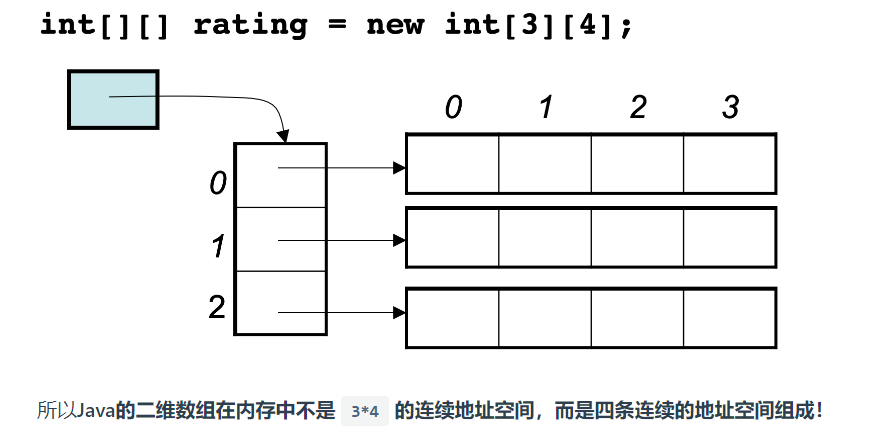
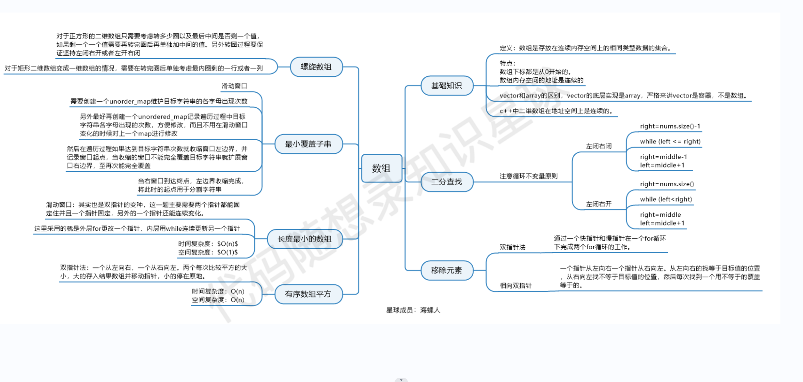
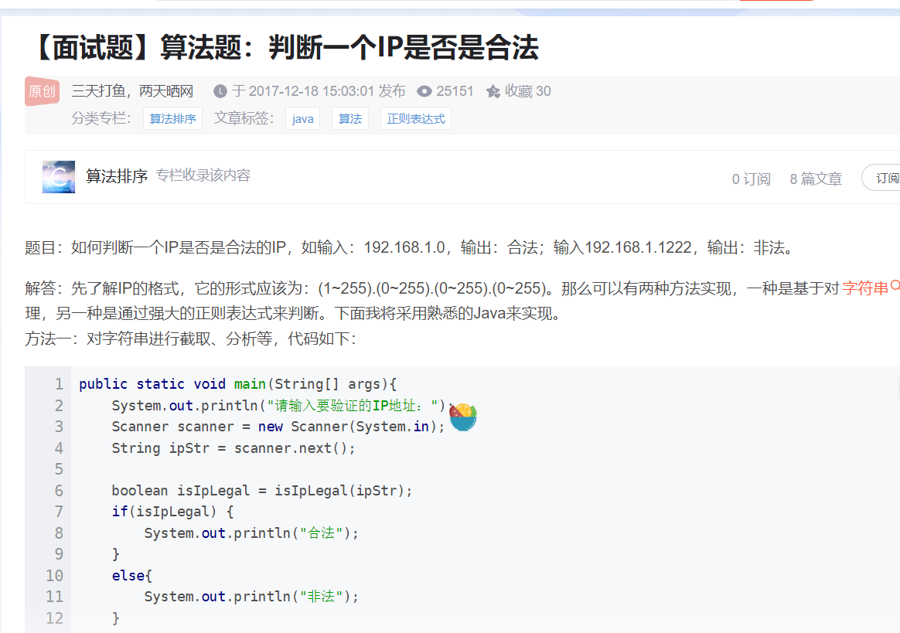

# 算法的时空复杂度

    时间复杂度：一个语句的频度是该语句在算法中被重复执行的次数。而所有语句的频度之和为 T(n).最深处循环内的语句频度法 f(n)和 T(n)数量级相同.时间复杂度 T(n)=O(f(n)).

    空间复杂度：是问题规模 n 的函数，是对一个算法在运行过程中临时占用存储空间大小的一个量度

# 线性表----顺序存储

## 数组

1. 数组下标连续且从 0 开始
2. 一维数组的地址空间连续,即逻辑上相邻的元素物理上也相邻
   > 因此在删除数组元素时候，元素只能被其他元素覆盖而不是是实际意义上的删除
3. 二维数组中的所有元素并不连续
   

### 二分法、

> leetCode_704

**循环不变量原则**

```java

 public static int getIndex(int[] nums, int target, int left, int right) {
            int middle = (left + right) / 2;
            while (left <= right) {
                middle = (left + right) / 2;
                if (target > nums[middle]) {
                    left = middle+1;
                }
                if (target < nums[middle]) {
                   right = middle-1;
                } else  if(nums[middle] == target){
                    return middle;
                }
            }
            return -1;
        }
```

### 双指针法

### 滑动窗口

> LeetCode_209
> 用右指针做边界判定，同时扩大窗口,条件不满足用左指针缩小窗口并，同时完成指针后移

滑动窗口的时间复杂度 O(n)

### 数组记录替代滑动窗口

> LeetCode_209
> 或者新开一个数组记录原数组中每个元素满足条件的情况
> 

数组长度固定，链表长度动态改变

# 链表

链表的考点 1.指针的修改 2.链表的拼接
链表出现环，因为没有节点指向其中一个节点，需要及时记录下一个节点的位置并进行连接。出现环，容易死循环


## 二叉树

### 遍历

- 非递归

* 前序遍历

#### 递归

递归遍历的返回值，
前序遍历从参数中获取父节点传递过来的数据 后序遍历可以获取参数数据 还可以获得**子树**通过函数返回值传递回来的数据
关键是 return 的信息是什么
