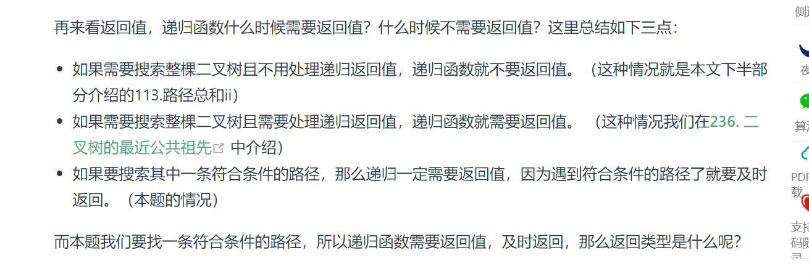
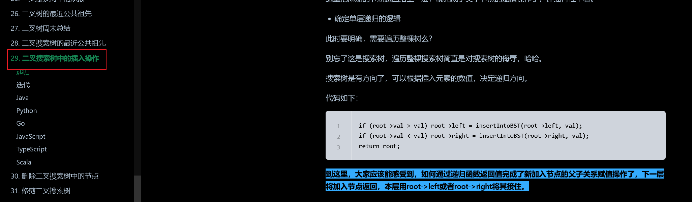
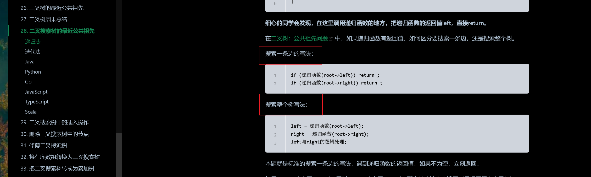
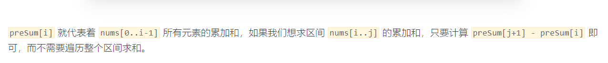

x---
title: LeetCode 总结
top: false
cover: false
toc: true
mathjax: true
date: 2022-09-18 10:05:42
password:
summary:
tags:
categories:

---

# 算法的时空复杂度

    时间复杂度：一个语句的频度是该语句在算法中被重复执行的次数。而所有语句的频度之和为 T(n).最深处循环内的语句频度法 f(n)和 T(n)数量级相同.时间复杂度 T(n)=O(f(n)).

    空间复杂度：是问题规模 n 的函数，是对一个算法在运行过程中临时占用存储空间大小的一个量度

  <!-- more -->

# 线性表----顺序存储

## 数组

1. 数组下标连续且从 0 开始
2. 一维数组的地址空间连续,即逻辑上相邻的元素物理上也相邻
   > 因此在删除数组元素时候，元素只能被其他元素覆盖而不是是实际意义上的删除
3. 二维数组中的所有元素并不连续
   

### 二分法、

> leetCode_704

**循环不变量原则**

```java

 public static int getIndex(int[] nums, int target, int left, int right) {
            int middle = (left + right) / 2;
            while (left <= right) {
                middle = (left + right) / 2;
                if (target > nums[middle]) {
                    left = middle+1;
                }
                if (target < nums[middle]) {
                   right = middle-1;
                } else  if(nums[middle] == target){
                    return middle;
                }
            }
            return -1;
        }
```

### 双指针法

### 滑动窗口

> LeetCode_209
> 用右指针做边界判定，同时扩大窗口,条件不满足用左指针缩小窗口并，同时完成指针后移

滑动窗口的时间复杂度 O(n)

### 数组记录替代滑动窗口

> LeetCode_209
> 或者新开一个数组记录原数组中每个元素满足条件的情况
> 

数组长度固定，链表长度动态改变

# 链表

链表的考点 1.指针的修改 2.链表的拼接
链表出现环，因为没有节点指向其中一个节点，需要及时记录下一个节点的位置并进行连接。出现环，容易死循环


## 二叉树

### 遍历

- 非递归

* 前序遍历

#### 递归


递归遍历的返回值，
前序遍历从参数中获取父节点传递过来的数据 后序遍历可以获取参数数据 还可以获得**子树**通过函数返回值传递回来的数据
关键是 return 的信息是什么



#### 构造二叉搜索树

## 回溯

回溯中的 for 循环相当于进入树孩子节点的层

回溯的排列组合和子集问题都可以有模板，总结起来就是几种变体

- 元素不可重复不能重复选择 即 nums 中的元素都是唯一的，每个元素最多只能被使用一次，这也是最基本的形式
- 元素可以重复不能重复选择 即 nums 中的元素可以存在重复，每个元素最多只能被使用一次
- 元素可以重复且可以重复选择 即 nums 中的元素都是唯一的，每个元素可以被使用若干次

同一个树枝内的元素不能重复 那么进入下一层树枝的开始元素要+1 ，不同树枝上的元素如果需要遍历到之前的元素 那么 for 循环的 i 就要从 0 开始并在循环内做判断是否重复，如果不同树枝从前向后依次遍历需要设置 index。
元素内有重复元素且需要在不同树枝上的去重，那么需要 visit 数组每个元素都需要判断是否和上一组元素重复

```java
LeetCode----47
 static class Solution {
        List<List<Integer>> lists = new ArrayList<>();
        List<Integer> list = new ArrayList<>();

        public List<List<Integer>> permuteUnique(int[] nums) {
            Arrays.sort(nums);
            boolean[] visit = new boolean[nums.length];
            back(nums, 0, visit);
            return lists;
        }

        private void back(int[] nums, int index, boolean[] visit) {
            if (list.size() == nums.length) {
                lists.add(new ArrayList<>(list));
            }
            for (int i = 0; i < nums.length; i++) {
//                不同树枝之间的去重
                if (i > 0 && !visit[i - 1] && nums[i] == nums[i - 1]) continue;
//                同一个树枝的去重
                if (visit[i]) continue;
                visit[i] = true;
                list.add(nums[i]);
                back(nums, i + 1, visit);
                list.remove(list.size() - 1);
                visit[i] = false;

            }


        }
    }
```

#### 矩阵搜

需要用数组表示方向

## 位运算

正数的补码等于它的原码；负数(负数最高位表示符号位)的补码等于反码+1
按位与&（有 0 为 0，其实就是且）
按位或|（有 1 为 1，其实就是或）
按位取反~（注意负数补码的符号，最前面的第一位是 1）
异或^（相同为 0，不同为 1）
左移<<
右移>>

```java
位反（~ ) > 算术 > 位左移、位右移 > 关系运算

> 位与 > 位或 > 位异或 > 逻辑运算
```

## 前缀和

用额外的数组计算一个数组内的一个索引空间的元素和，具体是用一个数组计算某下标前的所有数组元素和（包括自身）。可以有一维前缀和和二维前缀和。
前缀和的作用：在 O(1)复杂度内求出区间和

> 一维前缀和数组 第 0 位置 赋值 0 从第二位置计算前缀和 方便计算
> 计算方式 sum[i] = sum[i-1] + num[i-1] > 

## 差分数组

类似前缀和 适用于对原数组进行频繁增减的操作。差分数组是相邻原数组的差.
原数组加减：在原数组 第 i-j 位置上进行加减 k，反应在差分数组的情况为将 dif[i]加上 k 和 dif[j+1]减去 k
通过差分数组求原数组：累计计算对应差分数组的和 num[i] = sum(dif[0...i])

## 动态规划问题

什么样的问题可以用动态规划解决： 具有最优子结构的问题（子问题相互独立并且可以使用暴力解决但会超时需要用动态规划利用状态转移来解决）

## 29 整数相除

通过不断减去 double 的被除数得到商

- 限制在整型范围内 当 Integer.MIN_VALUE（负数的最小值绝对值大于正数最大值） 除以-1 时，会抛出 ArithmeticException 异常，报告算术溢出的错误。可以使用负数计算避免溢出（负数表示的范围更大一点点）

  > 整形溢出导致 Math.abs(-2147483648) 的返回值为-2147483648
  > java 整型范围为-2^32 ~ 2^32 -1

## 回溯

回溯对所有解空间进行选择，从而降低时间复杂度。

**回溯的关键问题**

- 在子空间内的搜索过程
- 子空间终止的条件
- 子空间不合适时候的回退过程

**去重方法**
组合内去重：在树枝上去重，使用每一层遍历的下标 index 去重
组合之间去重：

- 将数组进行排序后，使用 uesd 数组进行去重，判断当前元素是否
- 对于数组不能进行排序处理的，可以使用 map 进行去重
