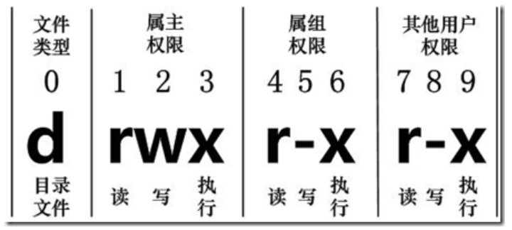

## Vim

esc 普通模式 i 插入模式 ：命令行模式
常用快捷键
普通模式
复制整行： yy
复制从光标开始的下 n 行： nyy
粘贴：p(鼠标前粘贴) P(鼠标后粘贴)
截切：d
删除整行：dd
删除光标的上下行数：n+行数+d+j(删除下行号) n+行数+d+k(上)
删除单个字符：x
删除从光标开始的下 n 行：ndd
搜索：/（按 n 下一个）
设置行号：:set nu
取消行号： :set nonu
光标移动到文件的首行：gg
光标移到行首：0 或者^
光标移动到行末：$

光标移动到文件的末尾：G
撤销：u
光标定位到 n 行：n+shift+g
退出：:q(直接退出 不保存 在为编辑文件时) :q!(强制退出不保存) :wq（保存退出）

## 关机重启

shutdown -h now/halt 关机
shutdown -h 1 一分钟后关机 也是 shutdown 的默认操作
shutdown -r now / reboot 立刻重新启动
sync 将内存同步到磁盘
虽然现在关机重启前自动做了 sync 但是最好还是手动敲一下

## 登录注销

切换用户 su - 用户名
注销：logout 可以从 root 用户切换到之前的用户（注销指令在图形化系统中无效）

## 用户管理

useradd 用户名
添加的用户 aa 默认在 /home/aa
用 aa 登录时自动切换到 aa 目录
新的用户名并指定家目录

```shell
useradd -d 指定用户目录
```

#### 修改密码

```shell
passwd 用户名
```

#### 删除密码

```shell
userdel 用户名
```

#### 查询用户信息

```shell
id 用户名
```

#### 查看当前用户

```shell
whoami
```

#### 用户组

类似角色,系统可以对共性的用户进行统一管理
新增组

```shell
groupadd 组名
```

删除组

```shell
groupdel 组名
```

#### 运行级别

- 0 ：关机
- 1 ：单用户【用于找回丢失密码】
- 2 ：多用户没有网络服务
- 3 ：多用户有网络服务（一般生产环境）
- 4 ：系统未使用保留给用户
- 5 ：图形界面
- 6 ：重启
  默认运行级别可以设置

进入不同的运行级别

```shell
init 3
```

查看默认运行级别

```shell
systemctl get-default
```

查看当前运行级别

```shell
systemctl get
```

设置默认运行级别

### 找回密码

### 文件目录类

#### 帮助指令

man
help 命令用于显示 shell 内部的帮助信息。help 命令只能显示 shell 内部的命令帮助信息。而对于外部命令的帮助信息只能使用 man 或者 info 命令查看。

```shell
man 指令
```

```shell

```

#### 切换 shell

```shell
exec bash
exec zsh
```

#### pwd 指令

显示当前工作目录的绝对路径

```shell
pwd
```

#### ls

```shell
ls [选项][目录/文件]
ls -a
ls -l
ls -al 混合写法 al命令的顺序无关
ls /home -al 指定目录查询
ls -lh （h表示适合人类阅读）
```

> 绝对路径从根目录开始 /...
> 相对路径从当先目录开始 ../

选项

- -a ：显示当前所有文件和目录包括隐藏的文件（隐藏文件是以.开头）
- -l ：以列表方式显示信息

#### cd 指令

回到自己的家目录

```shell
cd ~
cd - 回到上次的目录
```

回到上一个目录

```shell
cd ..
```

#### mkdir

```shell
mkdir [选项] 要创建的目录
mkdir /home/aaa
mkdir -p /home/aaa/bbb （-p和路径无关和要创建的目录数量相关）
```

选项：
-p : 创建多级目录

#### rmdir

```shell
rmdir [选项] 要删除的空目录  （rm--remove）
```

> 如果删除的不是空目录则删除失败
> 使用 rm -rf 目录删除非空目录（递归删除）

#### touch

创建空文件

```shell
touch 文件名
touch aaa.txt
```

#### copy 文件或者目录

```shell
cp [选项] 拷贝文件位置 目标位置
cp aaa.txt bbb（将aaa.txt 拷贝到同目录下的bbb下）
cp -r /home/bbb /opt (将home下的bbb文件整个拷贝到opt目录下)
\cp -r /home/bbb /opt （强制覆盖不提示操作）
```

选项：
-r 递归复制整个文件夹

#### rm 删除目录 文件 （remove）

```shell
rm [选项] 目标文件或目录
```

选项：

- -r 递归删除整个文件夹
- -f 强制删除不提示

#### mv 移动文件或者重命名

```shell
mv oldName newName (old 和 new 在同级目录下为重命名)
mv 111.txt 222.txt (重命名)
mv 111.txt bbb (移动到bbb中 类似剪切)
```

#### cat 查看文件不能修改（concatenate）

```shell
cat [选项]  文件
```

选项：
-n ；显示行号（-number）

#### more 指令

more 指令是一个基于 VI 编辑器的文本过滤器，它以全屏幕的方式按页显示文本文件的内容。
操作：
空格：向下翻页
enter：向下翻一行
q:退出
ctrl+P:向下滚动一屏
ctrl+B:返回上一屏
=：输出当前行行号
:f:输出文件名和当前行的行号

#### less 指令 分屏查看

less 根据需要加载内容

```shell
less 文件
```

操作：
空格：向下翻页
pagup:向上翻页
pagdown:向下翻页
/: 向下查找字符串 按 n 查找下一个 N 查找上一个
？：向上查找字符串 按 n 查找上一个 N 查找上一个

#### echo

输出内容到控制台

```shell
echo [选项] [内容]
```

#### head

显示文件开头 默认前十行

```shell
head 文件
head -n 5 文件 （查看文件的前五行）
```

#### tail

和 head 意义相反

```shell
tail 文件
tail -n 5
tail -f 文件 （实时查看文件的更新）
```

#### clear 清屏

或者 ctrl+l

#### >(覆盖写) 和 >>（追加写）

```shell
ls -l > 文件 （将列表的内容写入到文件中 覆盖写 ）
ls -l /home > aa.txt (将home目录下的文件列表的内容写入aa.txt中)
ls -al >> 文件 （列表的内容追加到文件末尾）
ls -al /home >> aa.txt  （将home目录下的文件列表内容追加到aa.txt中）
cat 文件1 > 文件2 （将文件1中的内容覆盖写入到文件2中去）
cat 文件1 >> 文件2 (将文件1中的内容追加到文件2中去)
echo "内容" >> 文件  （将内容追加到文件去）
ech0  "内容" > 文件
```

#### ln 指令

软连接 类似快捷键方式

```shell
ln -s [源文件或目录][软连接名]（源文件或者目录创建连接名）
```

#### history

查看或者执行已经执行过的指令

```shell
history
history 10 (显示最近的10条指令)
!5 （执行历史编号为5的指令 不能有空格）
```

#### 时间日期类

```shell
date 显示当前时间
date +%Y 显示年
date +%m 显示月份
date +%d 显示哪一天
date +%Y-+%m-+%d
```

#### 设置日期

```shell
date -s 字符串时间
date -s "2022-11-09 10:33:30"
cal [选项] 查看日历,不加选线显示本月日历
```

### find 查找

```shell
find [扫描范围] [选项]
find /home -name aa.txt
```

选项：
-name 查找指定的文件名
-user 查找属于用户的文件
-size 查找指定的文件大小的文件

#### locate 定位

locate 指令快速定位文件路径，使用前需要更新 locate 时刻

```shell
locate  搜索文件
updatedb 更新
locate aa.txt  定位aa.txt
which 查看指令在哪个目录下
which ls
```

#### grep 指令过滤

配合|使用 表示过滤指定内容

```shell
grep [选项] 查找内容 源文件
cat aa.txt | grep "hello"
```

选项：
-n 显示匹配的行号和行
-i 忽略大小写

#### 压缩和解压

```shell
gzip 文件 （只能压缩为 .gz文件）
gzip aa.txt
gunzip 文件.gz （解压文件）
gunzip aa.txt.gz
zip [选项] 用于压缩文件和目录
zip -r myhome.zip /home/ (将home和home下的文件夹都压缩)
unzip [选项] （解压）
unzip -d /opt/tmp /home/myhome.zip
```

zip 选项：
-r 递归压缩目录
unzip 选项：
-d<目录> 指定解压后的存放目录 如果没有选项 解压到当前文件夹中

#### 打包命令

可以打包和压缩

```shell
tar [选项] xxx.tar.gz 打包的内容 ()
```

选项：
-c 产生.tar 文件
-v 显示详细信息
-f 指定压缩包的文件名
-z 打包同时压缩
-x 解压.tar 文件

解打包和解压缩
-x 对 tar 包做解打包操作
-v 显示解打包的过程
-f 文件名，指定要解压的文件名
-z 压缩和解压缩.tar.gz 格式
-j 压缩和解压缩.tar.bz2 格式
-t 只查看包中有哪些文件或目录，不做解打包操作
-C 目录名，指定解打包位置

### 组管理和权限管理

Linux 的用户都属于一个组，每个文件有所有者、所在组、其他组

#### 修改文件的所有者

```shell
chown 用户名 文件名
chown enki bb.txt
```

#### 创建组

```shell
groupadd 组名
groupadd monster
```

#### 查看文件所在的组

```shell
ls -ahl
```

#### 修改文件/目录所在的组

基本指令
`chgrp 组名 文件名`

#### 改变用户所在组

#### 权限的基本介绍

`drwxr-xr-x 17 enki enki 4.0K 11月 9 04:30`
第一列的 0-9 位数字
0 位: 确定文件类型

1. d :目录 相当于文件夹
2. `-` ：普通文件
3. c : 字符设备类文件 鼠标、键盘
4. b :块设备如硬盘
5. l : 链接

1-3 位确定所有者（该文件的所有者）拥有该文件的权限

- r=4:读
- w=2:写
- x=1（execute）:可执行
  > 可以用数字代表权限 rwx(=4+2+1=7) 没有权限为 -

第 4-6 位确定所属组（同用户组的）拥有该文件的权限
第 7-9 位确定其他用户拥有该文件的权限

> 文件权限以 rwx 顺序排序
> 

第二列的数字：
若是目录表示：目录下的文件
若是文件为： 文件的硬链接数目

第三列为 文件的所有者
第四列为 文件的分组
第五列为 文件大小
第六列为 文件最后修改日期

#### 修改权限

通过 chmod 指令，可以修改文件或者目录的权限。
使用+ - =改变
u 为所有 g 所有组 o 其他用户 a 所有人

```shell
chmod u=rwx,g=rwx,o=rwx aa.txt/或者目录
chmod o+w 文件/目录（将文件或者目录的其他用户加上写权限）
chmod a-x 文件/目录 (将文件的全部用户的权限取消执行权限)
```

或者通过数字改变

```shell
chmod 777 aa.txt
```

#### 修改文件所有者

```shell
chown newowner 文件/目录 (改变所有者)
chown root aa.txt
chown -R root aaa(将aaa目录下的全部文件的所有者改为root)
```

#### 修改文件/目录所在组-chgrp

```shell
chgrp newgroup 文件/目录
```
