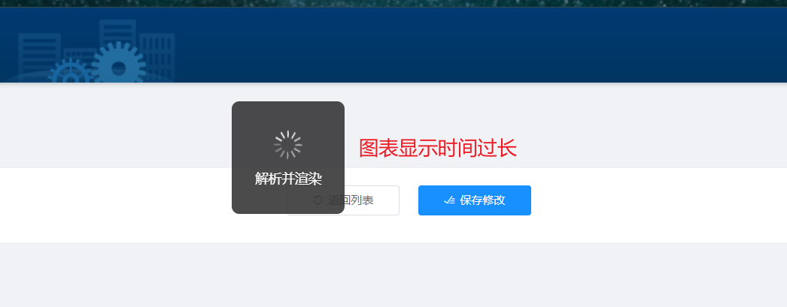
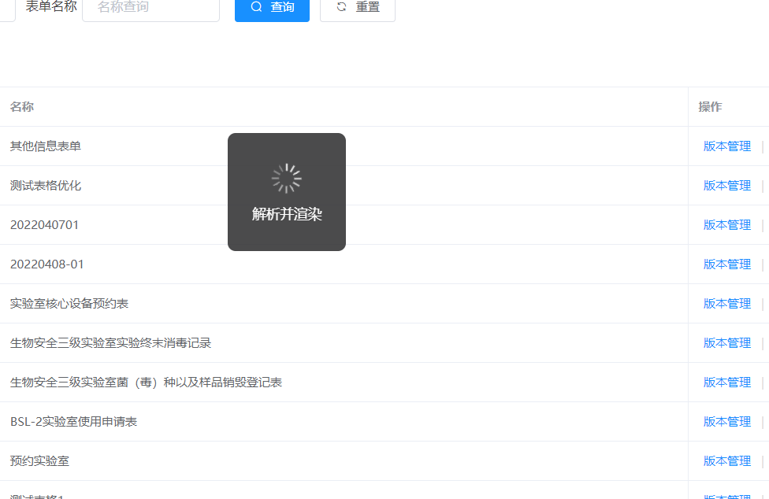
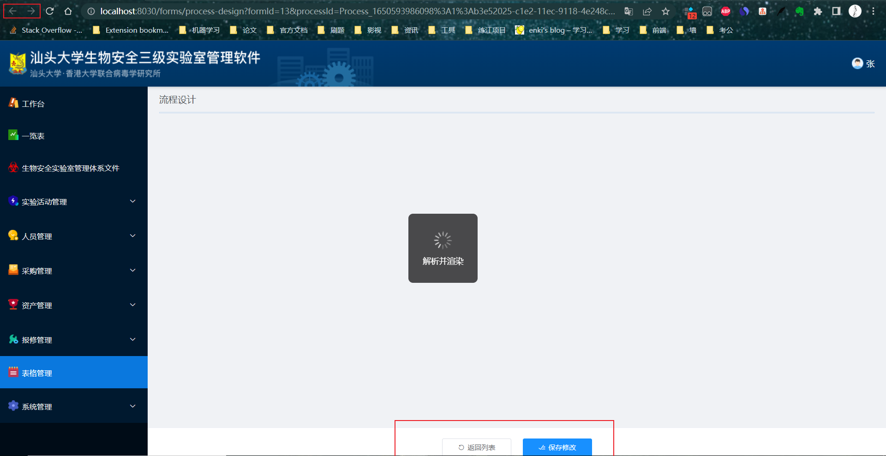
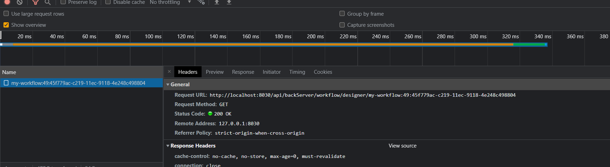
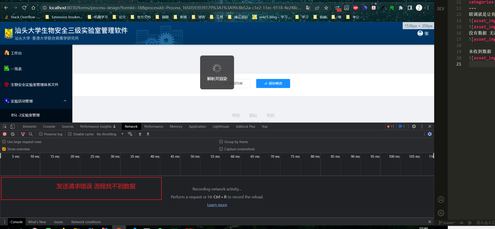
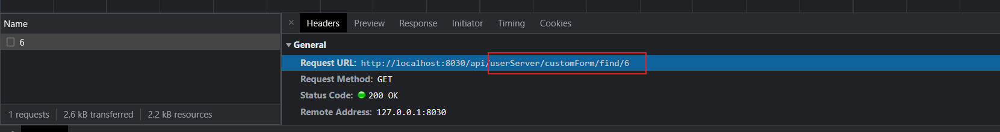

联调就是让你跟后端的接口调试，你需要搞明白你要给后台什么参数，后台会返回给你什么内容。

  <!-- more -->

没有数据 无法返回

未收到数据

SqlSession [org.apache.ibatis.session.defaults.DefaultSqlSession@208220b9] was not registered for synchronization because synchronization is not active
JDBC Connection [com.mysql.cj.jdbc.ConnectionImpl@69ba72da] will not be managed by Spring
==> Preparing: SELECT `sdt`.id, `sdt`.parent_id, `sdt`.name, `sdt`.icon, `sdt`.description, `sdt`.is_deleted FROM system_document_type AS `sdt` WHERE `sdt`.is_deleted = 0 AND `sdt`.parent_id = 0
==> Parameters:
<== Columns: id, parent_id, name, icon, description, is_deleted
<== Row: 2, 0, 程序文件, cxwj.png, 描述, 0
====> Preparing: SELECT COUNT(_) FROM system_document AS `sd` WHERE `sd`.`document_type` = ? AND `sd`.is_deleted = 0
====> Parameters: 2(Integer)
<==== Columns: COUNT(_)
<==== Row: 7
<==== Total: 1
<== Row: 3, 0, 安全手册, aqsc.png, 描述, 0
====> Preparing: SELECT COUNT(_) FROM system_document AS `sd` WHERE `sd`.`document_type` = ? AND `sd`.is_deleted = 0
====> Parameters: 3(Integer)
<==== Columns: COUNT(_)
<==== Row: 7
<==== Total: 1
<== Row: 4, 0, 标准操作规程, bzczgc.png, 描述, 0
====> Preparing: SELECT COUNT(_) FROM system_document AS `sd` WHERE `sd`.`document_type` = ? AND `sd`.is_deleted = 0
====> Parameters: 4(Integer)
<==== Columns: COUNT(_)
<==== Row: 0
<==== Total: 1
<== Row: 5, 0, 风险评估报告, fxpgbg.png, 描述, 0
====> Preparing: SELECT COUNT(_) FROM system_document AS `sd` WHERE `sd`.`document_type` = ? AND `sd`.is_deleted = 0
====> Parameters: 5(Integer)
<==== Columns: COUNT(_)
<==== Row: 0
<==== Total: 1
<== Row: 40, 0, MSDS 测试 01, aqglsc.png, 描述, 0
====> Preparing: SELECT COUNT(_) FROM system_document AS `sd` WHERE `sd`.`document_type` = ? AND `sd`.is_deleted = 0
====> Parameters: 40(Integer)
<==== Columns: COUNT(_)
<==== Row: 0
<==== Total: 1
<== Total: 5
Closing non transactional SqlSession [org.apache.ibatis.session.defaults.DefaultSqlSession@208220b9]
