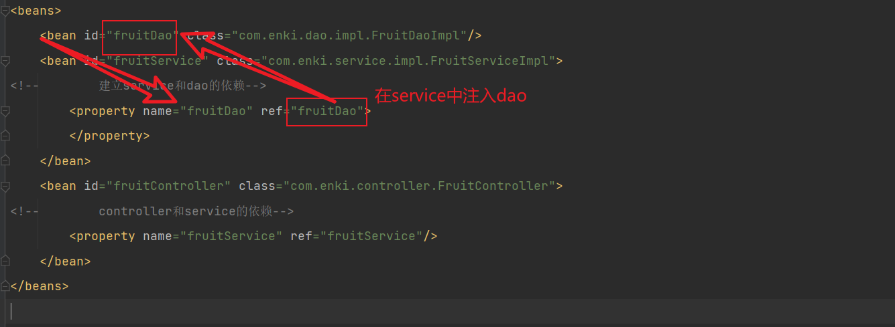

## Spring 框架

Spring 基础框架，可以视为 Spring 基础设施，基本上任何其他 Spring 项目都是以 Spring Framework 为基础的。

## IOC

### IOC 容器

**思想**：
IOC：Inversion of Control，翻译过来是反转控制。
若程序员在 service 类中的方法里面创建了具体的 service 对象 该对象的生命周期则依赖于方法若在方法外创建则依赖于类的生命周期
将 service 的对象的声明周期转移到通过解析 xml 文件的容器中，容器中生成 service 对象，所以 service 对象的生命周期从程序员转移到了该容器中去。称为控制反转。
**DI 依赖注入（IOC 思想的实现）**
在原始的 javaWeb 中利用 xml 文件在类中生成其他类的对象作为属性 为成员变量进行赋值


> IOC 就是一种反转控制的思想， 而 DI 是对 IOC 的一种具体实现

### IOC 在 Spring 中的实现

ApplicationContext：
继承自 BeanFactory


### 基于 xml 管理 bean

创建 spring 项目 引入依赖：spring-context
创建 spring 的 xml 文件这里的 xml 文件可以任意名字不同于 springmvc


> resource 和 java 目录打包后是在同一个目录下是同级的

容器通过反射构造对象 使用类的无参构造创建独享 若没有无参构造器则会报错

获取 bean 的方式

```java
        ApplicationContext ioc = new ClassPathXmlApplicationContext("applicationContext.xml");
//        获取bean
//        1. 根据xml中的id匹配name

        Student studentOne = (Student) ioc.getBean("studentOne");
        System.out.println(studentOne);
//        2.根据类型获取 xml中的配置的某个类型的bean只能有一个 否则报错
//        org.springframework.beans.factory.NoUniqueBeanDefinitionException:
//        No qualifying bean of type 'com.enki.pojo.Student' available: expected single matching bean but found 2: studentOne,studentT
        Student studentT = ioc.getBean(Student.class);
        System.out.println(studentT);
//        根据类型和ID
        Student studentOne1 = ioc.getBean("studentOne", Student.class);


//        要是没有匹配到bean
//        org.springframework.beans.factory.NoSuchBeanDefinitionException: No bean named 'studentOne' available

    }

```

> 通过类的实现的接口来获取 bean 前提是 实现接口的类要唯一 bean 唯一
> 否则报错:org.springframework.beans.factory.NoUniqueBeanDefinitionException: No qualifying bean of type 'com.enki.pojo.Person' available: expected single matching bean but found 2: studentOne,emp

```java
//        根据类型实现的接口匹配 Student implements Person
        Person bean = ioc.getBean(Person.class);
        System.out.println(bean);

```

### DI 为\<bean>属性赋值

#### set 注入

属性（有 get set 方法的字段）利用 set 方法赋值

```xml
<bean id="studentOne" class="com.enki.pojo.Student">
    <property name="age" value="0"></property>
    <property name="gender" value="男"></property>
    <property name="name" value="张三"></property>
    <property name="sId"   value="1"></property>
</bean>
```

#### 构造器注入

对应类的构造函数

```java
   public Student(Integer sId, String name, Integer age, String gender) {
        this.sId = sId;
        this.name = name;
        this.age = age;
        this.gender = gender;
    }
```

```xml
<bean id="studentT" class="com.enki.pojo.Student">
    <constructor-arg value="02"></constructor-arg>
    <constructor-arg value="lisi"></constructor-arg>
    <constructor-arg value="10"></constructor-arg>
    <constructor-arg value="女"></constructor-arg>
</bean>

<!--   <constructor-arg value="参数值" name="指定参数名非必须 " index="指定参数索引非必须"></constructor-arg>省略name和index 默认按照构造器参数顺序 -->
```

若不同的构造器的参数类型相同且数量相同可以设置参数类型 type 通过参数数据类型找到参数列表中对应参数 映射到对应的构造器上


## 特殊值处理

### 字面量的处理

> 字面量表示非变量的值 使用 value 属性给 bean 的属性赋值时，Spring 会把 value 属性的值看做字面量 所以赋值给 null 则不能使用 value

### null 值处理

```xml
<property name="name">
<null />
</property>
```

### 类类型复制属性

**引用已经声明的 bean**

```xml
  <bean id="emp" class="com.enki.pojo.Emp">
        <property name="TId"  value="01"></property>
        <property name="msg"  value="人员信息"></property>
        <property name="TAge" value="02"></property>
        <property name="TName" value="jack"></property>
<!--        使用ref 引用外部bean -->
        <property name="dept" ref="Dept"></property>
<!--        数组类型的赋值-->
        <property name="hobbies">
            <array>
                <value >eat</value>
                <value>games</value>
            </array>
        </property>
<!--        为map数组复制 如果是引用类型的则使用-ref方式引用-->
        <property name="teacherMap">
            <map>
                <entry key="01" value-ref="teacher01"></entry>
                <entry key="02" value-ref="teacher02"></entry>
            </map>
        </property>
    </bean>
```

### p 命名空间

在通过构造方法或 set 方法给 bean 注入关联项时通常是通过 constructor-arg 元素和 property 元素来定义的。在有了 p 命名空间和 c 命名空间时我们可以简单的把它们当做 bean 的一个属性来进行定义。

> 使用 p 命名空间时需要先声明使用对应的命名空间，即在 beans 元素上加入 xmlns:p="http://www.springframework.org/schema/p"

### bean 的作用域

singleton：默认作用域。若一个 bean 的作用域是单例的，那么每个 IoC 容器只会创建这个 bean 的一个实例对象。所有对这个 bean 的依赖，以及获取这个 bean 的代码，拿到的都是同一个 bean 实例。**Spring 中的 bean 不是线程安全的，所以只有在我们只关注 bean 能够提供的功能，而不在意它的状态（属性）时，才应该使用这个作用域**
prototype：多例模式。若一个 bean 的作用域是 prototype，那么 Spring 容器并不会缓存创建的 bean，程序中对这个 bean 的每一次获取，容器都会重新实例化一个 bean 对象。通常，如果我们需要使用 bean 的状态（属性），且这个状态是会改变的，那么我们就可以将它配置为这个作用域，以解决线程安全的问题
xml 中配置 bean


### bean 的生命周期

### bean 的后置处理器

bean 的后置处理器会在生命周期的初始化前后添加额外的操作，需要实现 BeanPostProcessor 接口，
且配置到 IOC 容器中，需要注意的是，bean 后置处理器不是单独针对某一个 bean 生效，而是针对 IOC 容
器中所有 bean 都会执行

```xml
 <bean id="user" class="com.enki.pojo.User">
        <property name="age"  value="0"></property>
        <property name="email" value="1291889140@qq.com"></property>
        <property name="id" value="1"></property>
    </bean>
    <bean id="myBeanProcessor" class="com.enki.pojo.MyBeanProcessor"/>
```

```java
public class MyBeanProcessor implements BeanPostProcessor {
    @Override
    public Object postProcessBeforeInitialization(Object bean, String beanName) throws BeansException {
        System.out.println("前置处理"+beanName+"="+bean);
        return bean;
    }

    @Override
    public Object postProcessAfterInitialization(Object bean, String beanName) throws BeansException {
        System.out.println("后置处理"+beanName+"="+bean);
        return bean;
    }
}
```

### FactoryBean

FactoryBean 是 Spring 提供的一种整合第三方框架的常用机制。和普通的 bean 不同，配置一个 FactoryBean 类型的 bean，在获取 bean 的时候得到的并不是 class 属性中配置的这个类的对象，而是 getObject()方法的返回值。

```java
public class UserFactoryBean implements FactoryBean<User> {
//    返回一个对象交给ioc管理
    @Override
    public User getObject() throws Exception {
        return new User();
    }
// 返回对象的类型
    @Override
    public Class<?> getObjectType() {
        return User.class;
    }
//返回对象是否单例
    @Override
    public boolean isSingleton() {
        return FactoryBean.super.isSingleton();
    }
}

```


### 基于 xml 的自动装配

byName 方式

byType 方式
autowire 改为 byType 方式后变不关心 bean id 而是根据 bean 的类型进行匹配。若有多个相同类型的 bean 可以进行匹配需要设置 primary 属性标注为首选 bean

## 基于注解管理 bean

**在 bean 上标注组件并在 xml 中扫描即可**
将注解标注在之前可作为 bean 的类上，简化 bean 配置
常用标注：
@Component 将类标注为普通组件
@Controller 控制层组件
@Service 业务层组件
@Repository 持久层组件


@Controller 和@Service@Repository 都是@Component 的别名，作用便是方便开发人员对 bean 的区分

组件对应的 bean id
默认情况为类名首字母小写为 id UserController 对应的 id 为 userController
自定义 id 使用注解的 value 值复制
@Service("myUserService")

### 基于注解的自动装配

@Autowired 标注自动配置 setter 方法进行装配
标注在成员变量上不需要 setter 方法
标示在 set 方法上
标注在当前参数标注的有参构造上

@Autowired 的工作方式 默认使用 ByType 进行匹配为 bean 进行赋值
当有两个相同类型的 bean 需要进行匹配时默认转为 ByName 进行自动装配
若两种情况都无法满足使用@Qualifier 注解 指定一个 bean 为当前属性赋值

## AOP

使用**代理模式**：相当于一个黑帮老大以前自己去打人，但现在他学会了代理模式就让手下代理他去收拾他的目标对象，而在次过程中可以让手下在收拾目标之前做一些额外的动作例如收租，收尸等等，这些额外的动作不直接是目标所做出来的看做时动作的增强。即代理的动作作为增强的动作出现，从目标任务上抽取出来。
**静态代理**

**动态代理**
种类：
AOP 的源码中用到了两种动态代理来实现拦截切入功能：jdk 动态代理和 cglib 动态代理。
jdk 动态代理是由 java 内部的反射机制来实现的，要求必须要有接口 并最终生成的代理类 和目标实现类 实现相同的接口 。cglib 动态代理底层则是借助 asm 来实现的。
**横切关注点**
围绕业务代码的代理类所创建的非核心业务代码，其横穿整个应用并对整个应用起作用
**通知**
每个横切关注点所实现的方法叫做通知方法，根据通知的位置分为前置通知、
返回通知、异常通知、后置通知、环绕通知、
**切面**
封装通知的方法的类
**连接点**
抽取横切关注点的位置。连接通知和核心代码的地方
**切入点**
代码找到连接点的方式

AOP 的思想由 AspectJ 实现

切面

```java
@Component
@Aspect
public class LoggerAspect {
    /*
    "execution(方法的返回类型 方法位置 方法以及参数)"
    */
    @Before("execution(public int com.enki.spring.CalculaterImpl.add(int,int))")//切入点表达式 作用在连接点的位置
    public void beforeAdviceMethod(){
        System.out.println("Logger....前置通知");
    }


}

 public void testBefore(){
        ClassPathXmlApplicationContext ioc = new ClassPathXmlApplicationContext("aop-annotation.xml");
        Calculator bean = ioc.getBean(Calculator.class);//通过接口找到代理对象而不是目标对象
        bean.add(1,2);
    }
```


环绕通知

```java
 /**
     *
     * @param joinPoint
     * @return 返回值必须和目标对象一致
     */
    @Around("pointCut()")
    public Object aroundAdviceMethod(ProceedingJoinPoint joinPoint)
    {
        Object result = null;
        try {
            System.out.println("环绕通知的前置");
//            目标对象
            result = joinPoint.proceed();
            System.out.println("环绕通知的返回");

        } catch (Throwable e) {
            e.printStackTrace();
            System.out.println("环绕通知的异常");

        }finally {
            System.out.println("环绕通知的后置");
        }
        return result;

    }
```

## 切入点表达式的语法

支持的 AspectJ 切入点指示符如下：
**execution：用于匹配方法执行的连接点；**
within：用于匹配指定类型内的方法执行；
this：用于匹配当前 AOP 代理对象类型的执行方法；注意是 AOP 代理对象的类型匹配，这 样就可能包括引入接口也类型匹配；
target：用于匹配当前目标对象类型的执行方法；注意是目标对象的类型匹配，这样就 不包括引入接口也类型匹配；
args：用于匹配当前执行的方法传入的参数为指定类型的执行方法； @within：用于匹配所以持有指定注解类型内的方法；
@target：用于匹配当前目标对象类型的执行方法，其中目标对象持有指定的注解；
@args：用于匹配当前执行的方法传入的参数持有指定注解的执行；
@annotation：用于匹配当前执行方法持有指定注解的方法；
bean：Spring AOP 扩展的，AspectJ 没有对于指示符，用于匹配特定名称的 Bean 对象的 执行方法；
reference pointcut：表示引用其他命名切入点，只有@ApectJ 风格支持，Schema 风 格不支持。

**通配符**
AspectJ 类型匹配的通配符：
_：匹配任何数量字符；
..：匹配任何数量字符的重复，如在类型模式中匹配任何数量子包；而在方法参数模式 中匹配任何数量参数。 +：匹配指定类型的子类型；仅能作为后缀放在类型模式后边。 说明： java.lang.String 匹配 String 类型；
java._.String 匹配 java 包下的任何“一级子包”下的 String 类型； 如匹配 java.lang.String，但不匹配 java.lang.ss.String
java..* 匹配 java 包及任何子包下的任何类型; 如匹配 java.lang.String、java.lang.annotation.Annotation
java.lang.*ing 匹配任何 java.lang 包下的以 ing 结尾的类型；
java.lang.Number+ 匹配 java.lang 包下的任何 Number 的自类型； 如匹配 java.lang.Integer，也匹配 java.math.BigInteger
[https://blog.ityoung.tech/?p=836]

### 切面的优先级

在同一个连接点上应用不止一个切面时, 除非明确指定, 否则它们的优先级是不确定的。

切面的优先级可以通过实现 Ordered 接口或利用 @Order 注解指定.注解内的数字越小优先级越高，默认为最大值

> 不能控制方法的执行顺序 所以要放在类上才有效果


## spring 整合 jdbc

添加依赖
在测试类上使用注解
@RunWith(SpringJUnit4ClassRunner.class) //指定在 spring 测试环境中执行 通过注入方式直接获取 ioc 的 bean
@ContextConfiguration("classpath:spring-temp.xml") //设置 spring 测试环境中的配置文件 classpath 表示 resource 路径

```java
@RunWith(SpringJUnit4ClassRunner.class) //指定在spring测试环境中执行 通过注入方式直接获取ioc的bean
@ContextConfiguration("classpath:spring-temp.xml") //设置spring测试环境中的配置文件 classpath表示resource路径
public class Temp {
    @Autowired
    private JdbcTemplate jdbcTemplate;
    @Test
    public void testInsert(){
        jdbcTemplate.update("insert into t_emp values (? ,?,?,?)",4,"缓存","12","mess");
    }
}
```

## 实现声明式事务

> 为数据库字段设置字段 unsigned（不出现负号） 防止余额之类的数字变为负数
> `stock` int(10) unsigned DEFAULT NULL COMMENT '库存（无符号）'

相比于编程式事务，声明式事务具有更大的优点，它能够将事务管理代码从业务方法中分离出来，以声明的方式来实现业务管理。
事务管理代码的固定模式作为一种横切关注点，可以通过 AOP 方法模块化，进而借助 Spring AOP 框架实现声明式事务管理。

##

spring 基于 xml 的自动装配 是在类中由系统对其中的外部类进行引入。那么为什么要使用自动转配

## 依赖注入和自动装配

装配 ：创建应用对象之间协作关系的行为称为装配或者当一个对象的属性是另一个对象时，实例化时，需要为这个对象属性进行实例化。这就是装配。
依赖注入的实现方式:构造器注入和 setter 注入，反射注入、工厂注入等
依赖注入的本质就是装配，装配是依赖注入的具体行为

## 设置事务的隔离级别

@Transactional 可以放在方法和类上
设置只读和超时连接和回滚策略

## 事务的隔离级别

读未提交：A 读取 B 未提交的数据产生脏读
读已提交： A 只能读取 B 中已经提交的数据产生不可重复读
可重复读：A 可以多次从一个字段中读取相同的值会产生幻读。
串行化

> mysql 可重复读避免了幻读且默认为可重复读的隔离级别

事务的传播行为
事务传播行为（propagation behavior）指的就是当一个事务方法被另一个事务方法调用时，这个事务方法应该如何进行。
例如：methodA 事务方法调用 methodB 事务方法时，methodB 是继续在调用者 methodA 的事务中运行呢，还是为自己开启一个新事务运行，这就是由 methodB 的事务传播行为决定的。

## SpringMVC

新建 web 工程


## 配置 web.xml

```xml
  <servlet-mapping>
        <servlet-name>SpringMVC</servlet-name>
        <url-pattern>/</url-pattern>
        <!-- <url-pattern> /和/*的区别 /不能匹配.jsp的请求 /*匹配任意请求 但jsp请求会被Tomcat处理 -->
    </servlet-mapping>

```

springmvc 的配置文件由 dispatchservlet 自动进行配置，其位置默认在 web-inf
为\<servlet-name>-servlet.xml

tomcat 热启动


get post（表单提交 或者 Ajax） 请求剩下的都是 get 请求 浏览器只支持两种。默认请求方式为 get

## ant 风格的路径

？：表示任意的单个字符 \*：表示任意的 0 个或多个字符
\*\*：表示任意层数的任意目录

## 转发和重定向

转发 请求路径不变 更多使用 ThymeleafView

## viewcontroller

```xml
<!--    视图控制器 开启mvc注解驱动-->
    <mvc:view-controller path="/" view-name="index"></mvc:view-controller>
    <mvc:annotation-driven />

```

设置视图控制器 不需要写控制器方法

## RESTFull

访问资源相同那么访问资源的路径就相同
REST 风格提倡 URL 地址使用统一的风格设计，从前到后各个单词使用斜杠分开，不使用问号键值对方
式携带请求参数，而是将要发送给服务器的数据作为 URL 地址的一部分，以保证整体风格的一致性。

## axios

params：{}不论 get post 参数发送的数据会拼接到请求地址中，（get 方式没有请求体）
data{}参数以 jason 格式发送
