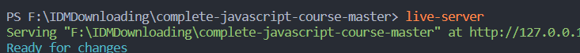

 
# JavaScript高级教程
>[网址](https://www.udemy.com/course/advanced-javascript-concepts/)

javascript interpreter and 编译器
解析器随着解析语句的增加而变慢，编译器预先将代码文件编译为低级语言代码，不需要对重复的代码不断的解析，使得速度上会更快
  <!-- more -->
JIT Compiler将两者结合

JavaScript不是完全意义的解释性语言，在技术实施上不是

V8引擎优化机制之隐藏类和内联缓存
webassembly

内存中的栈溢出 垃圾回收会自动清理无效的内存内容

global variable 全局变量

事件监听器  setInterval()不会被自动删除 会在后台内存中一直占用

单线程语言只有一个调用堆栈，类似于只有一只手的人吃饭，等嘴里的事务吃完后在用同一只手送食物 在调用其他方法是只能等待前一个方法执行完毕JavaScript高级教程
网址
asset_img

asset_img
javascript interpreter and 编译器
解析器随着解析语句的增加而变慢，编译器预先将代码文件编译为低级语言代码，不需要对重复的代码不断的解析，使得速度上会更快

JIT Compiler将两者结合

JavaScript不是完全意义的解释性语言，在技术实施上不是

V8引擎优化机制之隐藏类和内联缓存
webassembly

内存中的栈溢出 垃圾回收会自动清理无效的内存内容

asset_img
global variable 全局变量

事件监听器 setInterval()不会被自动删除 会在后台内存中一直占用

单线程语言只有一个调用堆栈，类似于只有一只手的人吃饭，等嘴里的事务吃完后在用同一只手送食物 在调用其他方法是只能等待前一个方法执行完毕
js是单线程语言 但web提供的api是异步

JavaScript runtime
测试网址 http://latentflip.com/loupe/?code=JC5vbignYnV0dG9uJywgJ2NsaWNrJywgZnVuY3Rpb24gb25DbGljaygpIHsKICAgIHNldFRpbWVvdXQoZnVuY3Rpb24gdGltZXIoKSB7CiAgICAgICAgY29uc29sZS5sb2coJ1lvdSBjbGlja2VkIHRoZSBidXR0b24hJyk7ICAgIAogICAgfSwgMjAwMCk7Cn0pOwoKY29uc29sZS5sb2coIkhpISIpOwoKc2V0VGltZW91dChmdW5jdGlvbiB0aW1lb3V0KCkgewogICAgY29uc29sZS5sb2coIkNsaWNrIHRoZSBidXR0b24hIik7Cn0sIDUwMDApOwoKY29uc29sZS5sb2coIldlbGNvbWUgdG8gbG91cGUuIik7!!!PGJ1dHRvbj5DbGljayBtZSE8L2J1dHRvbj4%3D

js是单线程语言 但web提供的api是异步

JavaScript runtime
测试网址 http://latentflip.com/loupe/?code=JC5vbignYnV0dG9uJywgJ2NsaWNrJywgZnVuY3Rpb24gb25DbGljaygpIHsKICAgIHNldFRpbWVvdXQoZnVuY3Rpb24gdGltZXIoKSB7CiAgICAgICAgY29uc29sZS5sb2coJ1lvdSBjbGlja2VkIHRoZSBidXR0b24hJyk7ICAgIAogICAgfSwgMjAwMCk7Cn0pOwoKY29uc29sZS5sb2coIkhpISIpOwoKc2V0VGltZW91dChmdW5jdGlvbiB0aW1lb3V0KCkgewogICAgY29uc29sZS5sb2coIkNsaWNrIHRoZSBidXR0b24hIik7Cn0sIDUwMDApOwoKY29uc29sZS5sb2coIldlbGNvbWUgdG8gbG91cGUuIik7!!!PGJ1dHRvbj5DbGljayBtZSE8L2J1dHRvbj4%3D

web api在回调队列中等待直到 堆栈中为空且整个文件执行完毕之后再进入stack中

node.js是JavaScript runtime 用c++写的
## Vue
不同的框架选择

## Date Type
number 浮点型
string 
underfined

const 如果知道为常量
默认情况下只用const 而let(块域)只在确定会变的时候才用 避免用var(function-scoped)
若不声明变量 js会默认为全局变量

NaN 类型是 number为无效
只能转 Boolean String number

表达式产生值  function在JavaScript中作为value存在
可以调用代码下方的函数声明 但不能调用函数表达式

函数声明: function 函数名(参数){
    要执行的代码
}
表达式：
var/let/const 变量=function(参数){
    要执行的代码
}
 ## 课程路径
 

 

 ## DOM 连接html和JavaScript
dom树 每个html元素都是一个对象 dom 来自web api（使用js编写）不属于JavaScript

# HOW JAVASCRIPT WORKS BEHIND THE SCENES

JavaScript引擎包括一个调用栈（拥有执行context）和一个堆（包含对象）

编译 代码经过编译之后再执行
解析器 在读取过程中进行执行（速度慢）

JavaScript代码 先被解析（read）-> 抽象为语法树AST ->编译为机器码并被立即执行，在执行的过程中进行优化在编译在执行

执行上下文： 执行JavaScript代码的环境保存有必要的代码执行信息 只有一个执行上下文存在
全局上下文中执行top-level代码和函数体之外的代码 并进去调用栈的底部

 

箭头函数没有参数对象和this关键字 可以从最近的常规函数父级对象的中获取
当调用函数时候会产生新的执行context 并保存函数变量且入栈 直到执行完毕后出栈

Scoping:How our program's variables are organized and accessed."Where do variables
live?"or "Where can we access a certain variable,and where not?";
scop寻找变量的位置以及变量是否可以访问

lexical scope

全局变量在global scope中 函数中的变量为局部变量在function scope中 外部不可访问
block scope 中的变量外部也不能访问  且只适用于let 和 const 例如变量为var的外部就可以访问 

scope chain 每个内部scope都可以访问外部的scope的变量 像一个链子一样 而反过来不行

var是function scope中的变量不属于块scope中

hoist 函数表达式 var 变量会上升为top-level 进入TDZ var变量为undefined 会引起难以注意的bug 先声明函数在使用

this关键字 方法中指向方法本身 函数中严格模式下为undefined 否则指向window对象 箭头函数没有this  箭头函数的this指向父范围  event listener指向DOM 对象中的function中的this指向调用他的对象

在函数中使用的箭头函数会继承其父域中的this 并且箭头函数没有参数

元类型存贮在调用栈中对象存贮在堆中 因为内存远比栈要大得多 调用栈中只保存对象指向内存的地址

const 标示在原始元素是不能修改内容的 但不适用于对象 对象的引用不变而已
将对象进行复制之后 两者在调用栈中执行内存的地址都相同 改变一个对象的内容会影响另一个对象

使用assign对对象进行合并并返回新的独立对象 但不能复制对象中的对象 只是浅拷贝

JavaScript没有引用传值 只有按值传递

高级函数将函数作为参数传入 传入的函数作为回调函数（callback function）

方法是一种可以调用的函数对象

array.foreach 和map的区别 foreach在原数组上进行修改 map会产生一个新的数组

Dom树的每个节点为node 每个node在JavaScript中用一个对象表示 该对象可以访问节点的方法和属性

html中的所有内容都将进入dom 每个html元素都可以有独有的属性
继承 子类型可以访问到父节点的方法和属性
DOM apl的工作方式

原型链 链中的对象可以使用原型的方法 继承自原型 子类继承原型的方法 

通过原型方法.prototype来添加方法 让子类来使用 而不写在原型本身是为了防止每个子类都继承该方法而使得空间的浪费 只在需要的时候向原型拿取就可以

原型链中 用于向上寻找对象中的方法和属性

Object.create 和 new 之间的区别

javascript 中没有真正的class

js文件引入的顺序 使得 script.js不能访问到other.js的内容
; //1
setTimeout(() => console.log(`0 sec timer`), 0); //3
Promise.resolve(`Resolved promise 1`).then(res => console.log(res)); //2
console.log(`end`); //4
~~~

执行顺序 top-level code首先执行 test start 和 end （js解析器会read整个文件）
promise任务总会在callback queue任务之前执行

对于异步结果而言JavaScript不能知道他的返回值，所有的信息返回的都是一个promise，而函数中的return作为promise的fulfilled 值

cd../..返回两级

node_module 中的文件都可以用npm进行安装不需要全部打包给别人
用npm i 让npm在package.json文件中找到依赖并安装

npm run start 中start是script中的start脚本名称

code clean 

not if else

对象==vaule