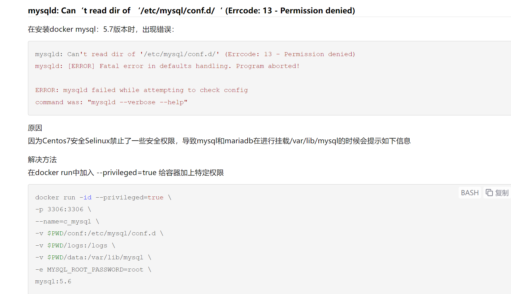

####

docker run = docker create + docker start

docker create 和 docker start 的区别
docker -a 的-a 的含义

docker 安装 mysql 后不能启动 mysql 查看 log `docker logs 72d82e8b3548`发现找不到启动文件

### 删除 被停止的 container

docker system prune

