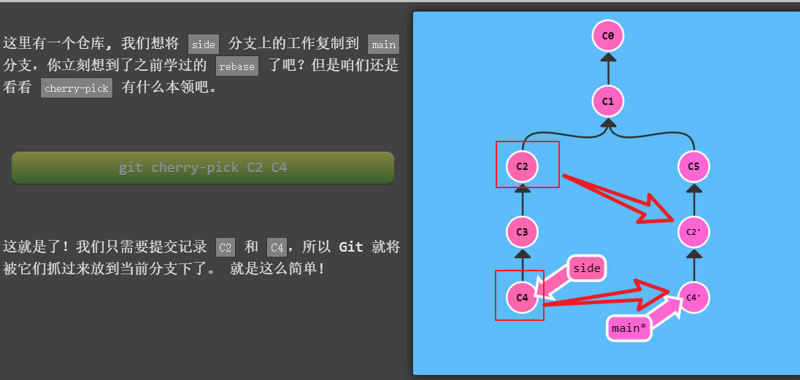

#git

> 结合 vscode
> 将已有项目推送到 gitHub 上

在当前项目的一级目录下不要在任何子文件中，

  <!-- more -->

```git
连接用户名和邮件
git config --global user.name Enki-Zhang
git config --global user.email 17855378518@163.com
然后初始化git
git init
提交代码到暂存区
git add -A
commit代码 并注释 此后再修改代码 vscode 代码左侧出现竖条提示修改
git commit -m 'init commit'
查看分支情况
git status
退回当前版本
git reset --hard HEAD
查看分支中的版本情况
git log
根据版本信息选择退回的时间
git reset --hard 629ace6034a78b8c225758ed539c03ae60d6945e
创建新的分支 分支和主分支平行 为主分支的代码副本 再修改左侧出现竖条点击可看见未修改代码之前的情况
git branch new-feature
查看分支
git branch
切换分支
git checkout new-feature

新建分支并切换分支
git checkout -b <分支>
提交暂存区
git add -A
在分支上修改代码后并提交
git commit -m 'add new feature'
选择主分支
git checkout master
合并分支 将需要合并的分支合并如主分支 总在分支上修改代码 确定之后再融入主分支（分支上的代码commit之后再融合）
git merge new-feature
```

push code to github
在 github 上创建新项目名字随意
若要将已有项目 push 到此仓库中不要选择创建 readme 文件(github 也有该提示)
复制已有仓库的 git remote add origin...语句


```git
连接远程仓库
git remote add origin git@github.com:Enki-Zhang/P3-bate.git
push到origin(remote 分支的名字)的一个分支master上
git push origin master
push 到origin的新分支new-feature上
git push origin new-feature
修改提交暂存区
git add -A
commit提交
git commit -m 'modify  readme.txt'
push 到远程仓库的master上
git push origin master
```

> 没有项目 可以先在 github 上新建仓库在 push 代码
> his 定义表单的版本
> 历史 保存 info 查看 info
>  info
> 保存按钮 info
> 表单没有审批流程 只有保存
> 有审批流程没有人审批 可以保存 提交不可用 1
> 已经有审批且通过不能提交和保存
> 流程设计返回当前进度
> 

git rebase
第二种合并分支的方法是 git rebase。Rebase 实际上就是取出一系列的提交记录，“复制”它们，然后在另外一个地方逐个的放下去。

Rebase 的优势就是可以创造更线性的提交历史，这听上去有些难以理解。如果只允许使用 Rebase 的话，代码库的提交历史将会变得异常清晰。

git branch -f main HEAD~3

git checkout main^ 移动 HEAD

## HEAD

HEAD 是一个对当前检出记录的符号引用 —— 也就是指向你正在其基础上进行工作的提交记录。
HEAD 总是指向当前分支上最近一次提交记录。大多数修改提交树的 Git 命令都是从改变 HEAD 的指向开始的。

### 强制修改分支位置

```git
git branch -f main HEAD~3
```

上面的命令会将 main 分支强制指向 HEAD 的第 3 级父提交。

```git
git checkout <分支名>
```

选择一个分支点为当前分支点

### 撤销变更

git reset 只对本地仓库有用

```git
git reset local^ 撤销local分支并退回到local的上一个分支
```

```git
git revert pushed 撤销远程仓库的分支并 相当于引入更改创建新的分支
```

### 整理提交记录

"开发人员有时会说“我想要把这个提交放到这里, 那个提交放到刚才那个提交的后面”,"
将一些提交复制到当前所在的位置（HEAD）下面的话， Cherry-pick 是最直接的方式了

```git
git cherry-pick <提交号>...
```



当不知道节点的哈希时 使用 rebse
