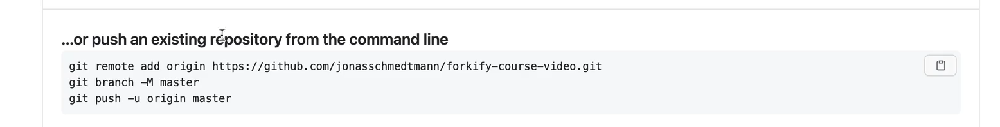
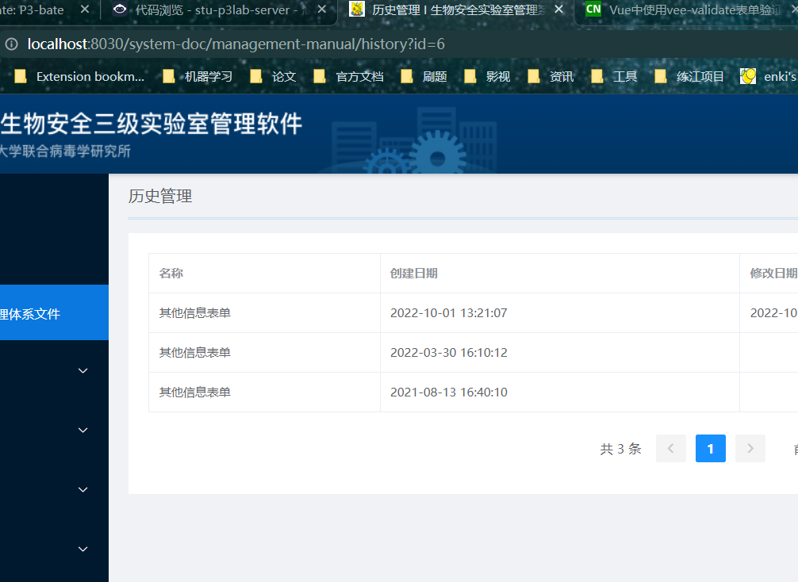
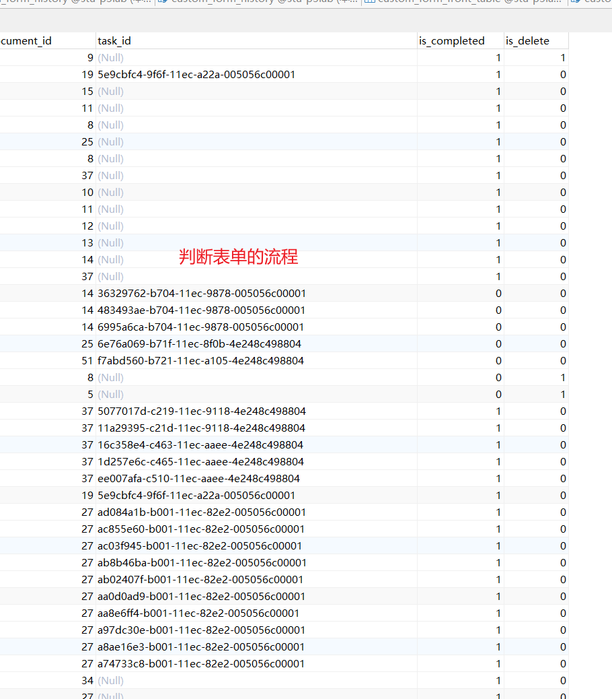

#git

> 结合 vscode
> 将已有项目推送到 gitHub 上

在当前项目的一级目录下不要在任何子文件中，

```git
连接用户名和邮件
git config --global user.name Enki-Zhang
git config --global user.email 17855378518@163.com
然后初始化git
git init
提交代码到暂存区
git add -A
commit代码 并注释 此后再修改代码 vscode 代码左侧出现竖条提示修改
git commit -m 'init commit'
查看分支情况
git status
退回当前版本
git reset --hard HEAD
查看分支中的版本情况
git log
根据版本信息选择退回的时间
git reset --hard 629ace6034a78b8c225758ed539c03ae60d6945e
创建新的分支 分支和主分支平行 为主分支的代码副本 再修改左侧出现竖条点击可看见未修改代码之前的情况
git branch new-feature
查看分支
git branch
切换分支
git checkout new-feature
提交暂存区
git add -A
在分支上修改代码后并提交
git commit -m 'add new feature'
选择主分支
git checkout master
合并分支 将需要合并的分支合并如主分支 总在分支上修改代码 确定之后再融入主分支
git merge new-feature
```

push code to github
在 github 上创建新项目名字随意
若要将已有项目 push 到此仓库中不要选择创建 readme 文件(github 也有该提示)
复制已有仓库的 git remote add origin...语句


```git
连接远程仓库
git remote add origin git@github.com:Enki-Zhang/P3-bate.git
push到origin(remote 分支的名字)的一个分支master上
git push origin master
push 到origin的新分支new-feature上
git push origin new-feature
修改提交暂存区
git add -A
commit提交
git commit -m 'modify  readme.txt'
push 到远程仓库的master上
git push origin master
```

> 没有项目 可以先在 github 上新建仓库在 push 代码
> his 定义表单的版本
> 历史 保存 info 查看 info
>  info
> 保存按钮 info
> 表单没有审批流程 只有保存
> 有审批流程没有人审批 可以保存 提交不可用 1
> 已经有审批且通过不能提交和保存
> 流程设计返回当前进度
> 
