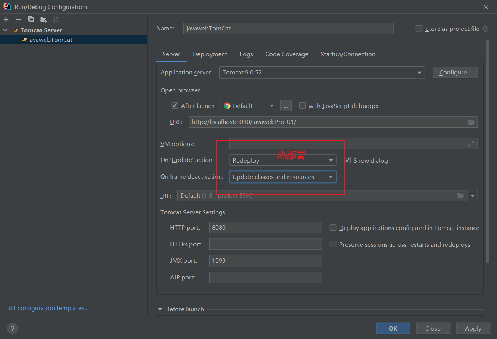
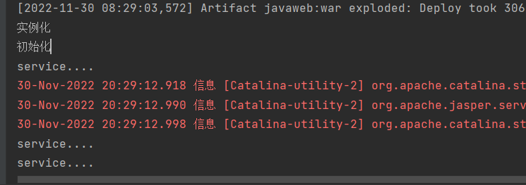
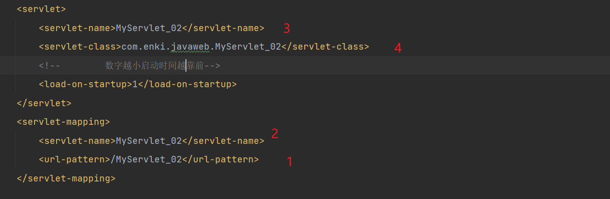
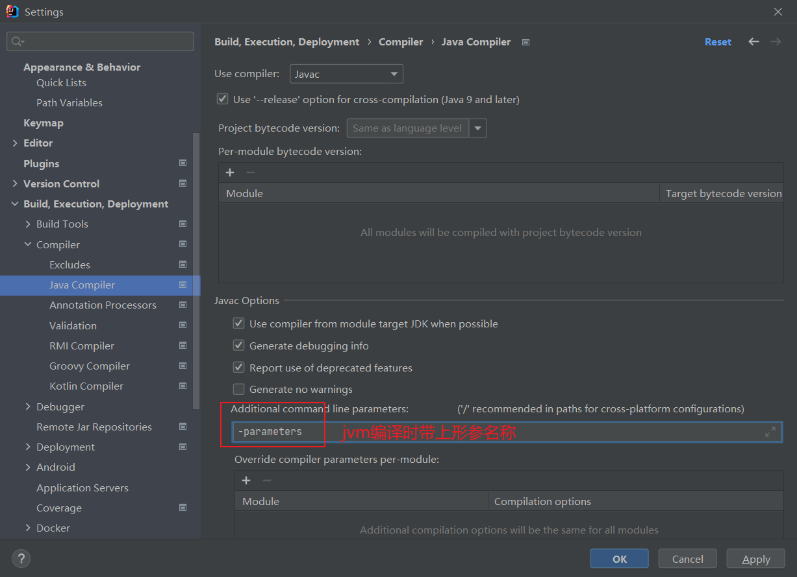
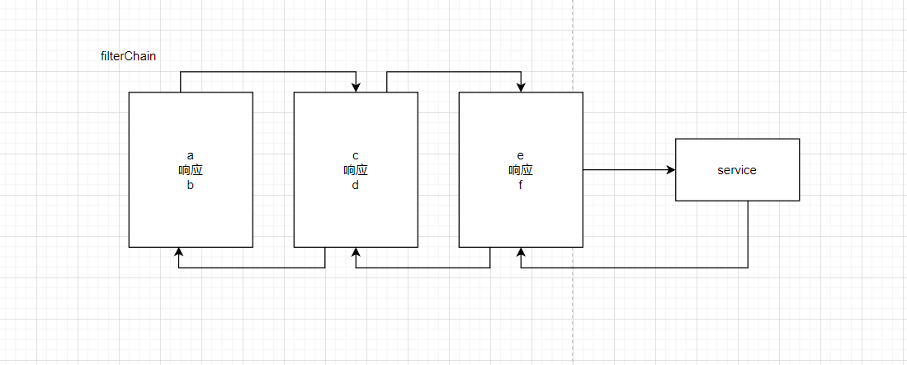
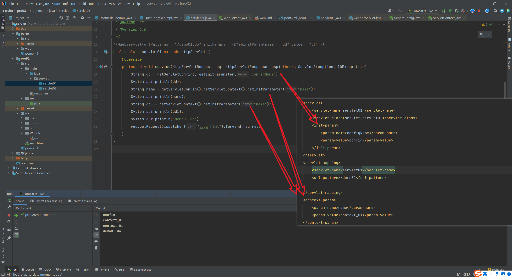

### tomcat 热部署



#### [Intellij] Project Structure 配置说明

#### servlet 继承关系和生命周期

servlet 的默认方法是 405 风格的若子类不实现父类的 get post 等方法会报错 405

**生命周期**
init()
service()

servlet 只实例化和初始化一次 要提高响应时间需要设置初始化时机
默认在第一次接受时实例化，初始化
设置启动顺序最小为 0
单例 线程不安全 所有线程共用该实例会造成冲突不安全所以不要在 servlet 中定义成员变量或者可修改的变量

````xml
<!-- 数字越小启动时间越靠前-->
        <load-on-startup>1</load-on-startup>```
````


http 无状态 服务器无法区分不同的请求时那个客户端发送的
通过会话解决

servlet 的生命周期中，可以看出，执行的是 service 方法，为什么我们就只需要写 doGet 和 doPost 方法呢?

service 方法会被自动调用 HttpServlet 中的 service 方法已经做了逻辑转向

GenericServlet 的两个 init 方法

方便开发，只是用 init()方法不需要对 ServletConfig 参数的维护就是不需要自己构建一个新的变量让父类方法自己构建
http://www.yunjuu.com/info/211161.html

session 会话跟踪技术

session 会话保存作用域
request 一次响应请求范围
session 一次会话有效
application 一次程序范围内有效

服务器端的内部转发和客户端重定向的区别
服务器重定向是在内部进行转发 客户端不知道
客户端重定向是服务器通知客户端向另一个 servlet 进行请求，改变客户端的请求地址

### thymeleaf

配置路径前缀后缀

```xml
   <!-- 配置上下文参数 -->
    <context-param>
        <param-name>view-prefix</param-name>
        <param-value>/</param-value>
    </context-param>
    <context-param>
        <param-name>view-suffix</param-name>
        <param-value>.html</param-value>
    </context-param>
```

dispatchServlet
其中配置的需要和 controller 在 xml 中进行对应
从 url 找到 servletPath 中的 path 中定位到 controller 组件


servletConfig 和 servletContext 的范围

### mvc 设计模式

model： 模型 完成业务

- pojo/vo 值对象
- dao 数据对象 其中的方法都是单精度方法或细粒度方法 只考虑一个动作
- bo 业务对象 业务方法比较复杂 为粗粒度发方法 一般的 bo 类中需要操作多条 dao 方法才能完成业务

* DTO 数据传输对象

事务管理应该以业务层的方法为单位
view ：视图
controller 接受用户请求并交由 model 处理

ioc
每层之间的依赖
设计的原则高内聚(层内部) 和低耦合（层间）

1. 控制反转
   若程序员在 service 类中的方法里面创建了具体的 service 对象 该对象的生命周期则依赖于方法若在方法外创建则依赖于类的生命周期
   将 service 的对象的声明周期转移到通过解析 xml 文件的容器中，容器中生成 service 对象，所以 service 对象的生命周期从程序员转移到了该容器中去
2. 依赖注入
   

过滤器
实现 init doFilter destory 方法

通过注解配置@WebFilter("\*.do")表示拦截所有.do 结尾的 servlet
过滤器链 chain

响应顺序
a c e service f d b
过滤器的执行顺序若是注解方式是按照类名的排序执行
配置文件中安装配置文件的顺序执行

ThreadLocal

监听器 观察者模式 不主动访问

### java 不同关键词的范围

### QQZone

数据库实体： 用户登录信息、用户详情信息、日志、回帖、主任回复

数据库范式 常用 1 2 3
列不可再分
一张表只表达一层含义 只描述一个事情
表中的每一列和主键都直接依赖

主键和业务无关

servletContext 和 servletconfig 对象https://blog.csdn.net/qq_32224047/article/details/106985763


context 方法只能得到 context 的 initparams
config 可以通过 context 方法得到 context 的 initparams
context 的范围要大于 config
一个 servlet 对应一个 config 一个 context 对应多个 servlet
