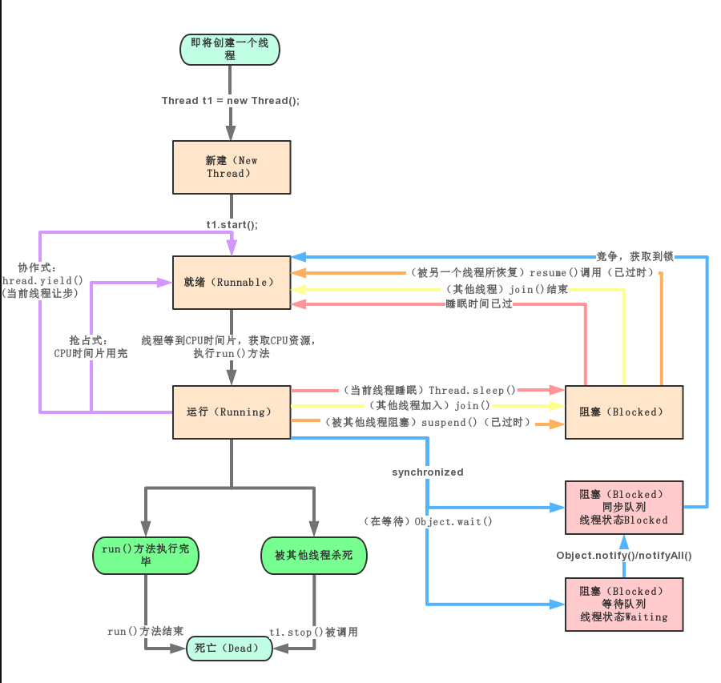

##

在 java 中线程来使用有两种方法。 1.继承 Thread 类，重写 run 方法 2.实现 Runnable 接口，重写 run 方法

## 两次启动线程.start()


## 多线程机制

进程中启动主线程，主线程 start 子线程后，主线程执行完毕并不会造成子线程的结束，进程中所有线程都结束才会结束进程

## 调用 start()

继承 Thread 类
调用 start（） 会触发多线程执行 ；
调用 run（） 还是当做执行了一个普通方法，没有多线程执行。
start() 方法调用 start(0)方法后，该线程并不一定会立马执行，只是将线程变成了可运行状态。具体什么时候执行，取决于 CPU，由 CPU 统一调度。
但 java 不能多继承 可以实现接口来创建线程
使用 Runable 方法

```java
  Thread thread = new Thread(new _Runable());//代理模式
        thread.start();
```

Thread 构造器中的参数有实现 Runable 接口从而可以调用 Thread 的 start()方法。相当于利用 Thread 的 start 方法
使用的 Runable 接口的优势
1、避免 Java 单继承的问题

2、适合多线程处理同一资源

3、代码可以被多线程共享，数据独立，很容易实现资源共享

## 线程终止

- 通知方法 主线程中修改子线程中的关键字的方法来终止

* stop()：stop()是立即终止，会导致一些数据被到处理一部分就会被终止，而用户并不知道哪些数据被处理，哪些没有被处理，产生了不完整的“残疾”数据，不符合完整性，所以被废弃
* interrupt()中断

```java
package com.enki;

/**
 * @author Enki
 * @Version 1.0
 */
public class _Runable implements Runnable{


    @Override
    public void run() {
        int time=0;
        while (true){
            time++;
            System.out.println("我马上休眠了");
            try {
                Thread.sleep(1000);
                Thread.interrupted();
            } catch (InterruptedException e) {
//                e.printStackTrace();
                System.out.println("线程中断");
            }
            if (time==80){
                break;
            }
        }

    }

    public static void main(String[] args) throws InterruptedException {
        Thread thread = new Thread(new _Runable());
        thread.start();
        for (int i = 0; i < 10; i++) {
            Thread.sleep(1000);
            System.out.println("主线程消息");
        }
        thread.interrupt();
    }
}

```

> 结果是在主线程打印完成后中断子线程 thread

- 线程插队
  yield:线程的礼让。让出 cpu，让其他线程执行，但礼
  让的时间不确定，所以也不一定礼让成功
  join: 线程的插队。插队的线程一旦插队成功，则肯定先执行完插入的线程所有的任务。线程让其他线程在该线程执行过程中的某点进行插队，插入的线程会被执行完毕，之后再继续执行被插队的线程。

### 用户线程和守护线程

用户线程：也叫工作线程，当线程的任务执行完或者通知方式结束
守护线程:一般是为工作线程服务的，当所有的用户线程结束，守扩线程自动结束
常见的守护线程：垃圾回收机制

设置守护线程

```java
package com.enki;

/**
 * @author Enki
 * @Version 1.0
 */
public class _Thread01 {
    public static void main(String[] args) throws InterruptedException {
        MyDaeThread myDaeThread = new MyDaeThread();
        //        当主线程结束 子线程退出
       //        设置守护线程
        myDaeThread.setDaemon(true);
        myDaeThread.start();
        for (int i = 0; i < 10; i++) {
            System.out.println("工作");
            Thread.sleep(1000);

        }
    }

}

class MyDaeThread extends Thread {
    @Override
    public void run() {

        while (true) {
            try {
                Thread.sleep(5000);
            } catch (InterruptedException e) {
                e.printStackTrace();
            }
            System.out.println("聊天");


        }
    }
}
```

> 

### 线程状态




### java 同步机制

加锁会降低效率
Java 语言中，引入了对象互斥锁的概念，来保证共享数据操作的完整性。
每个对象都对应于一个可称为“互斥锁”的标记，这个标记用来保证在任一时刻，只能有一个线程访问该对象。
关键字 synchronized 来与对象的互斥锁联系。当某个对象用 synchronized 修饰时，表明该对象在任一时刻只能由一个线程访问
同步的局限性：导致程序的执行效率要降低。同步方法 (非静态的) 的锁可以是 this, 也可以是其他对象(要求是同一个对象)
同步方法（静态的）的锁为当前类本身。

#### Lock 锁

```java
public class WindowWithRunable implements Runnable {
    private static int ticket = 100;
    private ReentrantLock lock = new ReentrantLock();//获得锁
    @Override
    public void run() {

        while (true) {
//            synchronized (this) {
            try {
                lock.lock();
                if (ticket > 0) {
                    try {
                        Thread.sleep(100);
                    } catch (InterruptedException e) {
                        e.printStackTrace();
                    }
                    System.out.println(Thread.currentThread().getName() + "：卖票，票号为：" + ticket);
                    ticket--;
                } else {
                    break;
                }
            } catch (Exception e) {
                e.printStackTrace();
            }finally {
                lock.unlock();
            }
        }

    }
}

```

#### synchronized
