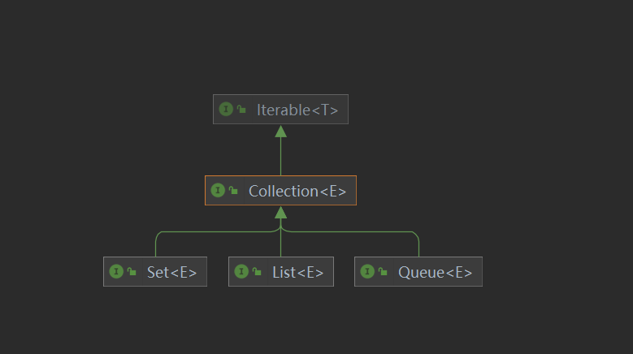
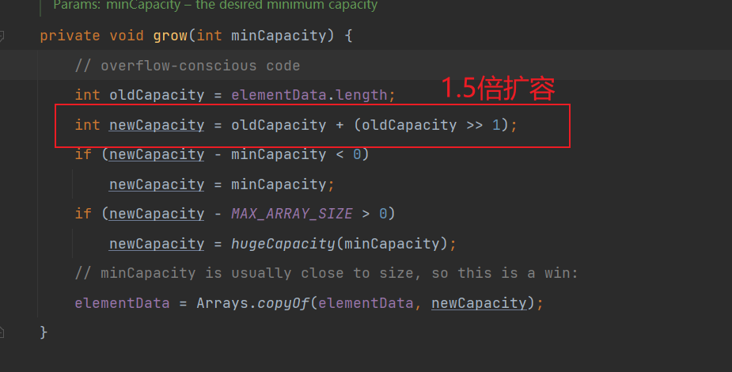
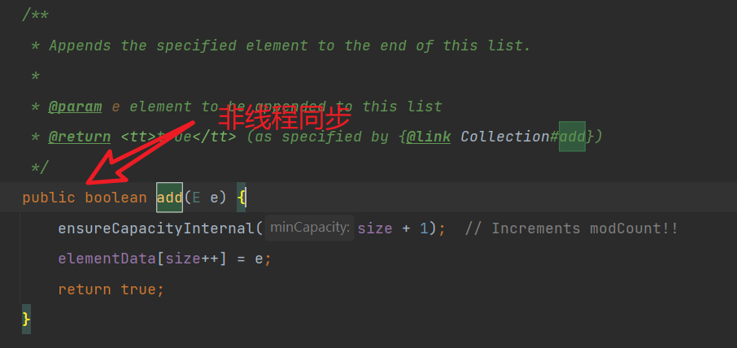
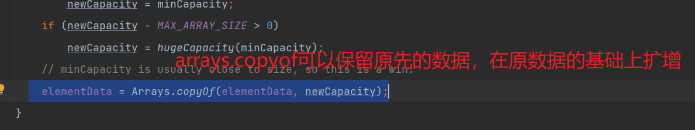
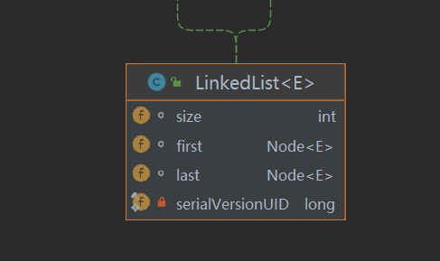
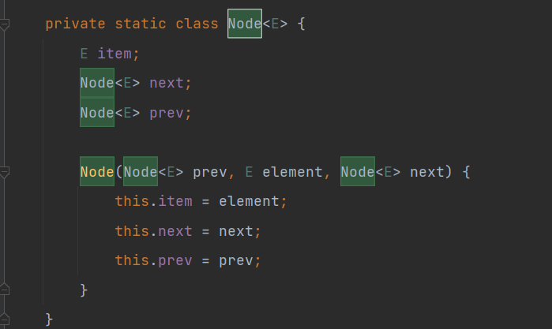
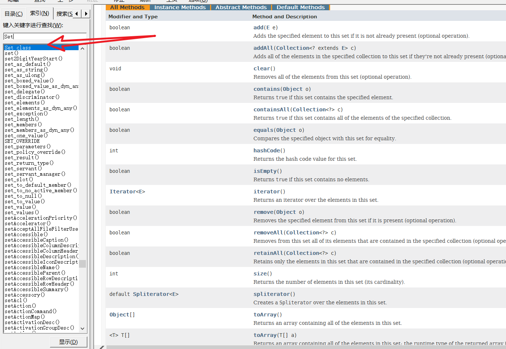
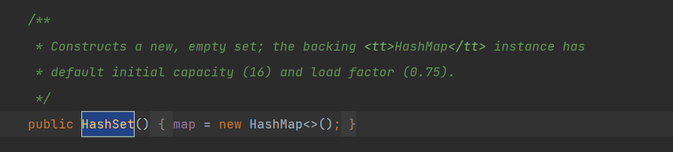

idea 显示所有的快捷键 Ctrl+j

## 集合和数组的区别

数组与集合的区别如下：

1）数组长度不可变化而且无法保存具有映射关系的数据；集合类用于保存数量不确定的数据，以及保存具有映射关系的数据。

2）数组元素既可以是基本类型的值，也可以是对象；集合只能保存对象。

## 集合的体系结构图

.png>)

## 关于 collection 接口

collection 有三个子接口

1. List：有序(存取顺序相同)可重复的集合
2. Set：无序不可重复集合
3. Queue Java 提供的队列实现
   
   Collection 接口继承了 Iterable 接口 其子类可以用 iterator()方法进行遍历，返回 Iterator 接口的对象。
   > Iterator 仅用于遍历集合，Iterator 本身并不存放对象

遍历方法：

```java
Iterator it = list.iterator();
while(it.hasNext()) {
　　Object obj = it.next();
}
```

list 遍历如下：

```java
  LinkedList<Integer> list = new LinkedList<>();
        list.add(1);
        list.add(2);
        Iterator<Integer> iterator = list.iterator();
        while (iterator.hasNext()) {
            Integer next = iterator.next();
            System.out.println(next);
        }
```

结果

> 1
> 2

或者用增强 for 循环遍历元素

```java
  for (Object l : list) {
            System.out.println(l);
        }
```

增强 for 依旧使用的是迭代器

### list

List 存储内容时直接在内存中开辟一块连续的空间，然后将空间地址与索引对应，接口的实现类在实现插入元素时，都会根据索引进行排列,而由于 List 的元素在存储时互不干扰，没有什么依赖关系，自然可以重复
list 的方法：

- 位置相关：List 和 数组一样，都是从 0 开始，我们可以根据元素在 list 中的位置进行操作，比如说 get, set, add, addAll, remove;
- 搜索：从 list 中查找某个对象的位置，比如 indexOf, lastIndexOf;
- 迭代：使用 Iterator 的拓展版迭代器 ListIterator 进行迭代操作;
  范围性操作：使用 subList 方法对 list 进行任意范围的操作。

实现 List 接口的集合主要有：ArrayList、LinkedList、Vector、Stack
https://www.cnblogs.com/bingyimeiling/p/10255037.html

> Collections.sort 的接口

```java
    Collections.sort(books, new Comparator<Book>() {
            @Override
            public int compare(Book o1, Book o2) {
                /**
                 * 返回负数，第一个元素排在第二个元素前面；
                 * 返回0，第二个元素等于第一个元素；
                 * 返回正数，第一个元素排在第二个元素后面 ；
                 * 下面代码为升序排列比较规则
                 */
//                大于0 降序 小于0 升序
                return o1.price-o2.price;
            }
        });
```

### ArrayList

ArrayList 是一个动态数组(底层由数组实现)，也是我们最常用的集合，是 List 类的典型实现。它允许任何符合规则的元素插入甚至包括 null。每一个 ArrayList 都有一个初始容量（10），该容量代表了数组的大小。随着容器中的元素不断增加，容器的大小也会随着增加。，在每次向容器中增加元素的同时都会进行容量检查，当快溢出时，就会进行扩容操作。再次自动扩容 elementDate 为原先的 1.5 倍。所以如果我们明确所插入元素的多少，最好指定一个初始容量值（设置初始值后 自动扩容也是 1.5 倍），避免过多的进行扩容操 作而浪费时间、效率。

ArrayList 基本等同于 Vector , 除了 ArrayList 是线程不安全(执行效率高)


> 在多线程情况下，不建议使用 ArrayList
> ArrayList 擅长于随机访问。同时 ArrayList 是非同步的。
> 

### Vector

vector 扩容；如果是无参，默认 10，满后，就按 2 倍扩容。如果指定大小，则每次直接按 2 倍扩容.

### linkedList

LinkedList 是 List 接口的另一个实现，除了可以根据索引访问集合元素外，LinkedList 还实现了 Queue 接口，可以当作双端队列来使用，也就是说，既可以当作“栈”使用，又可以当作队列使用。

每个节点（Node 对象)，里面又维护了 prev、next、item 三个属性，其中通过，prev 指向前一个，通过 next 指向后一个节点。最终实现双向链表。


## Set

- 无序（添加和取出的顺序不一致），没有索引
- 不允许重复元素，所以最多包含一个 null

set 的遍历方式：
可以使用迭代器，增强 for 但不能用索引
常用方法：


### HashSet 类

HashSet 其实是 HashMap

HashSet 不保证元素是有序的,取决于 hash 后，再确定索引的结果。(即,不
保证存放元素的顺序和取出顺序一致)
不能有重复元素/对象(只能放一个 null).在前面 Set 接口使用已经讲过

## Map 接口

map 的数据结构为 key-value
key 不能重复 value 可以重复（key value 可以引用所有数据类型）
