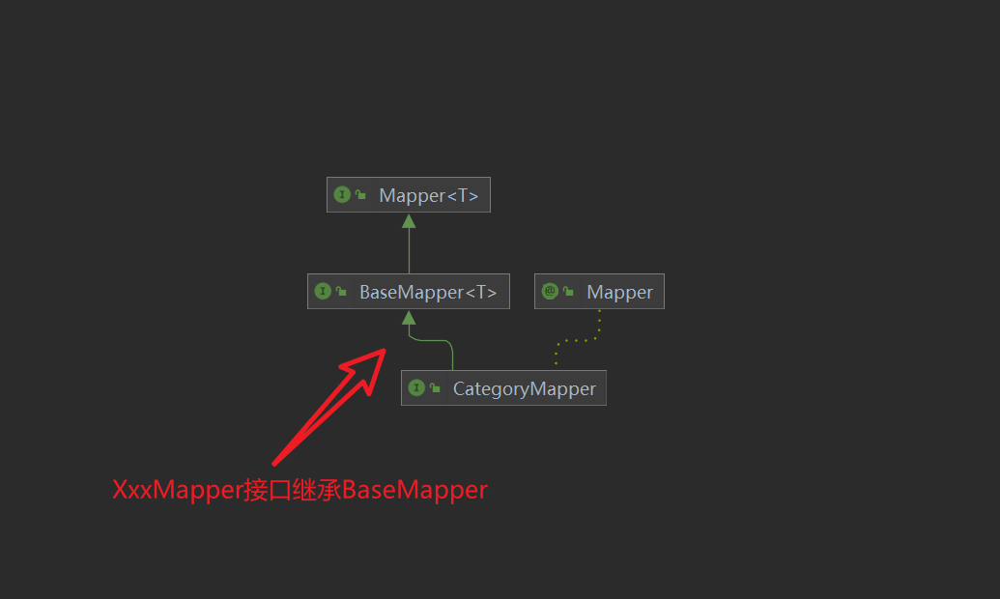

# Mybatis-plus 中 BaseMapper 和 IService 功能相似重复，为什么要提供两个接口？

 1.从分层角度来解释，BaseMapper 是 DAO 层的 CRUD 封装，而 IService 是业务业务逻辑层的 CRUD 封装，所以多了批量增、删、改的操作封装，这也比较符合官方指南中的阐述；

2.IService 是对 BaseMapper 的扩展，从 BaseMapper、IService、ServiceImpl 三者的类关系以及源码可以看出；此外，个人认为应该还有一个原因，就是 IService 和 BaseMapper 提供的是两种实现方式：如果继承 BaseMapper，则不需要去实现其内部方法，依靠 mybatis 的动态代理即可实现 CRUD 操作；而如果自定义 IBaseService 去继承 IService，则需要去实现 IService 中的方法；
