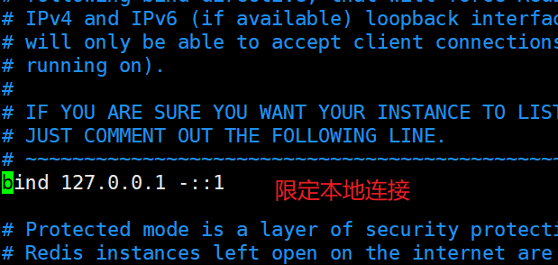
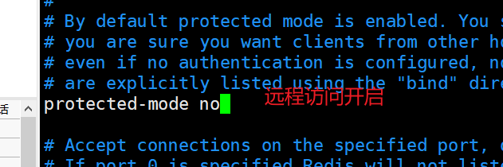
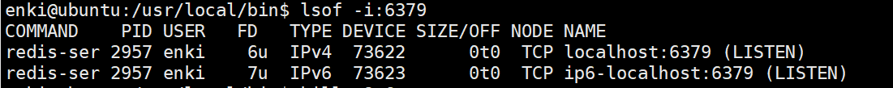
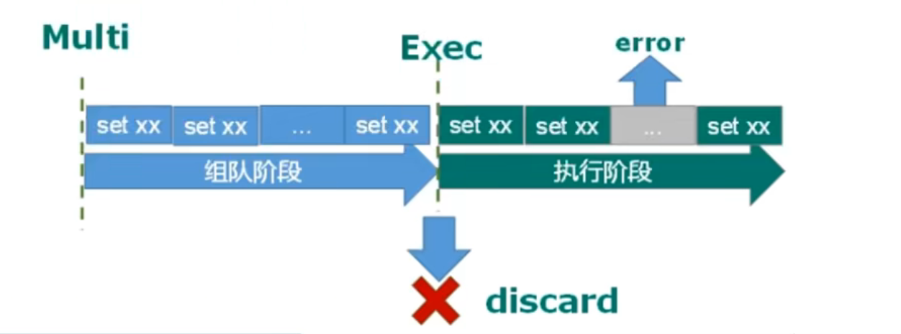

# Redis

NoSql 数据库减少内存和 IO 压力

## 特点 提高性能

1.key-value 存储数据库。该类数据库使用哈希表，在哈希表中包含特定的 key 和与其对应的指向特定数据的指针。常用的有 Redis。

2.列存储数据库。该类数据库主要用来应对分布式存储的海量数据，一个键指向了多个列。常用的有 HBase。

3.文档型数据库。该类数据库将结构化、半结构化的文档以特定格式存储，如 json 格式。一个文档相当于关系型数据库中的一条记录，也是处理信息的基本单位。常用的有 MongoDB。

4.图形数据库。该类数据库使用图形理论来存储实体之间的关系信息，最主要的组成部分是：结点集、连接节点的关系。常用的有 Neo4j。

<!--more-->

### redis 数据结构

## redis 常用命令

https://blog.csdn.net/Lzy410992/article/details/116094703

## 使用场景

数据并发读写
海量数据读写
对数据提高可拓展性

## 连接 Ubuntu 的 redis

将配置文件复制到 etc 下并修改
用配置文件的方式启动 redis 作为后台启动的方式

```shell
redis-server /etc/redis.conf
```

客户端连接

```shell
/usr/local/bin$ redis-cli
```

## 配置文件



修改之后重启 redis
查到 6379 端口号的进程

杀死并重启


> 如果依旧超时：查看防火墙

## key 键操作

## 验证码发送

输入手机号后发送验证码并设置有效时间 同一个手机一天只能发送三次

```java
import redis.clients.jedis.Jedis;

import java.util.Random;

/**
 * @author Enki
 * @Version 1.0
 */
public class PhoneCode {
    public static void main(String[] args) {
//       verifyCode("17855378517");

        getRedisCode("17855378517","691880");
    }

    //    六位数字
    public static String getRandomCode() {
        Random random = new Random();
        StringBuilder randomCode = new StringBuilder();
        for (int i = 0; i < 6; i++) {
            randomCode.append(random.nextInt(10));
        }
        return randomCode.toString();
    }

    /**
     * 每个手机一天最多发送三次验证码 设置过期时间 120s
     * @param phone
     */
    public static void verifyCode(String phone) {
        Jedis jedis = new Jedis("192.168.159.130", 6379);
//        拼接key
        String countKey = "VC" + phone + ":count";
//        验证码key
        String codeKey = "VC" + phone + ":code";

// 设置发送次数
        String count = jedis.get(countKey);
        if (count == null) {
//            设置发送次数为1
            String setex = jedis.setex(countKey, 24 * 60 * 60, "1");
        } else if (Integer.valueOf(count) <= 2) {
            jedis.incr(countKey);
        } else {
            System.out.println("今天的发送次数超过了三次");
            jedis.close();
            return; //防止超过三次再发送验证码
        }
//        将验证码放到redis中
        String randomCode = getRandomCode();
        jedis.setex(codeKey,120,randomCode);
        jedis.close();
    }
    public static  void getRedisCode(String phone,String code){
//        获取验证码
        Jedis jedis = new Jedis("192.168.159.130", 6379);
        String codeKey = "VC" + phone + ":code";
        codeKey = jedis.get(codeKey);
        if (code.equals(codeKey)){
            System.out.println("success");

        }else {
            System.out.println("fail");

        }
        jedis.close();

    }
}

```

maven pom 爆红 修改镜像 或者删除仓库的数据

### 事务和锁机制

#### 悲观锁

每次去拿数据的时候都认为别人会修改，所以每次在拿数据的时候都会上锁，这样别人想拿这个数据就会 block 直到它拿到锁。一般的关系型数据库使用较多

#### 乐观锁

每次去拿数据的时候都认为别人不会修改，所以不会上锁，但是在更新的时候会判断一下在此期间别人有没有去更新这个数据，可以使用版本号等机制（当版本号不一样的时候说明已经被更新，不能在继续操作上一个版本号的操作）乐观锁适用于多读的类型，提高数据的吞吐量。redis 使用的情况

### 事务操作

Redis 事务是一个单独的隔离操作：事务中的所有命令都会序列化、按顺序地执行。事务在执行的过程中，不会被其他客户端发送来的命令请求所打断。Redis 事务的主要作用就是串联多个命令防止别的命令插队。
事务分为组队和执行两个过程，组队是将命令放在队列中，等到执行阶段一起执行。组队的过程中可以通过 discard 进行放弃组队
multi exec discard


#### 事务的错误

组队中的任一命令报告错误 组队失败 整个队列消失

```shell
127.0.0.1:6379(TX)> set k1 kk
QUEUED
127.0.0.1:6379(TX)> incr k1
QUEUED
127.0.0.1:6379(TX)> set k2 1
QUEUED
127.0.0.1:6379(TX)> exec
1) OK
2) (error) ERR value is not an integer or out of range
3) OK
127.0.0.1:6379>
```

若是在执行阶段出现错误，将跳过出现错误的命令

```shell
127.0.0.1:6379> multi
OK
127.0.0.1:6379(TX)> set k1 kk
QUEUED
127.0.0.1:6379(TX)> incur k1
(error) ERR unknown command `incur`, with args beginning with: `k1`,
127.0.0.1:6379(TX)> incr k1
QUEUED
127.0.0.1:6379(TX)> set k2 1
QUEUED
127.0.0.1:6379(TX)> exec
(error) EXECABORT Transaction discarded because of previous errors.

```

### watch 监视

使用 watch 监视一个或者多个 key,跟踪 key 的 value 修改情况，如果有 key 的 value 值在事务 EXEC 执行之前被修改了，整个事务被取消。EXEC 返回提示信息，表示
事务已经失败。（采用了乐观锁机制）
当两个线程同时操作一个 key 时 添加 watch 如下

```shell
127.0.0.1:6379> watch a
OK
127.0.0.1:6379> multi
OK
127.0.0.1:6379(TX)> incrby a 10
QUEUED
127.0.0.1:6379(TX)> exec
1) (integer) 25
```

```shell
127.0.0.1:6379> watch a
OK
127.0.0.1:6379> multi
OK
127.0.0.1:6379(TX)> incrby a 10
QUEUED
127.0.0.1:6379(TX)> exec
(nil)
```

取消监视 unwatch

### redis 的事务特性

- 单独的隔离操作。
  事务中的所有命令都会序列化、按顺序地执行。事务在执行的过程中，不会被其他客户端发送来的命令请求所打断。

- 没有隔离级别的概念。
  队列中的命令没有提交之前都不会实际被执行，因为事务提交前任何指令都
  不会被实际执行。

* 不保证原子性
  事务中如果有一条命令执行失败，其后的命令仍然会被执行，没有回滚。

### 秒杀

#### linux 安装 redis

在 docker 外部新建 redis.conf 文件

```shell
mkdir  -p /mydata/redis/conf
cp redis.conf /mydata/redis/conf/redis.conf
```

修改 redis.conf 文件 源文件需要从官网下
映射 redis 端口

```
docker run -p 6379:6379 --name myredis -v /mydata/redis/data:/data \
-v /mydata/redis/conf/redis.conf:/etc/redis/redis.conf \
-d redis redis-server /etc/redis/redis.conf
```

查看 docker 进程
`docker ps`
