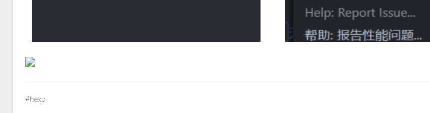
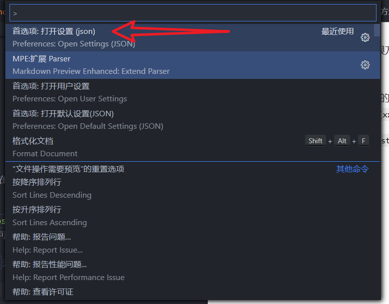
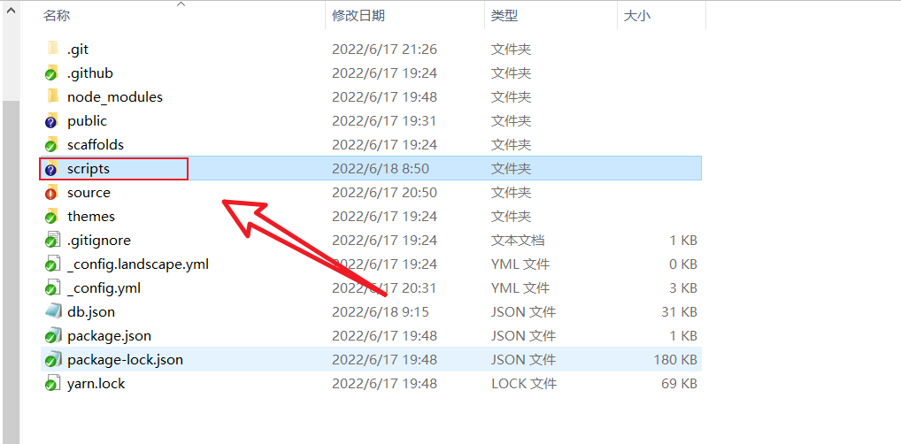
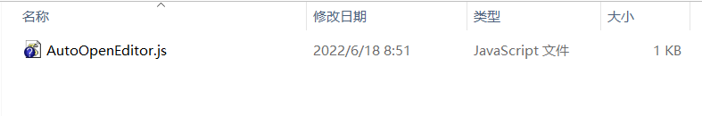

使用 vscode 写 Markdown 文件虽然很方便，但是搭配 hexo 却不能很好的显示图片。就像这样：

我在网上找了较多的教程和解决方法，算是找到一个还行的办法:
在一篇博文中看到这样的解释
“在 hexo3.0 版本中编写 md 文件时新的图片插入方式：只要在\_config.yml 中添加`post_asset_folder: true`，就会在生成新 post 时创建一个同名文件夹；在 md 中输入``，就可以插入这个文件夹中的图片”

<!--more-->

于是我们需要安装 vscode 的插件`Paste Image`和`Markdown Preview Enhanced`并配置一些设置
在`Paste Image`配置中一些设置，
按住 Ctrl+shift+p 打开设置选项


先贴个 Markdown 的插图语法
``方便理解
在 setting.json 中最后插入如下
`"pasteImage.path": "${currentFileNameWithoutExt}/", "pasteImage.insertPattern": ""`
这样我们通过插件快捷键 Ctrl+alt+v 粘贴后的会直接保存到同名文件名下,并且会在文档中插入 hexo 的插图代码

## 分享一个 hexo new post "文章名"的懒人技巧

在跟目录中打开文件 script 或者新建也行

随便起一个脚本

输入:

```js
let spawn = require("hexo-util/lib/spawn");

hexo.on("new", (data) => {
  spawn("code", [hexo.base_dir, data.path]);
});
```

这样每次 new 文章后自动用 vscode 打开同名文件

## 调试，发布

回到 git bash，输入调试命令：

```shell
$ hexo server --debug
```

在本地查看无误之后，输入生成和发布命令,就可已将新主题发布到自己的博客网站上了

```shell
$ hexo generate
$ hexo deploy
```

如出现缓存引起的异常，可以在生成命令前执行清除缓存命令，

```shell
$ hexo clean
```
