<!-- # vue 学习记录 -->

## vscode启动脚手架

cd 到项目想要创建的文件夹下面 `vue create 文件名` 启动脚手架


`npm run serve` 启动vue

效果

## vue目录结构

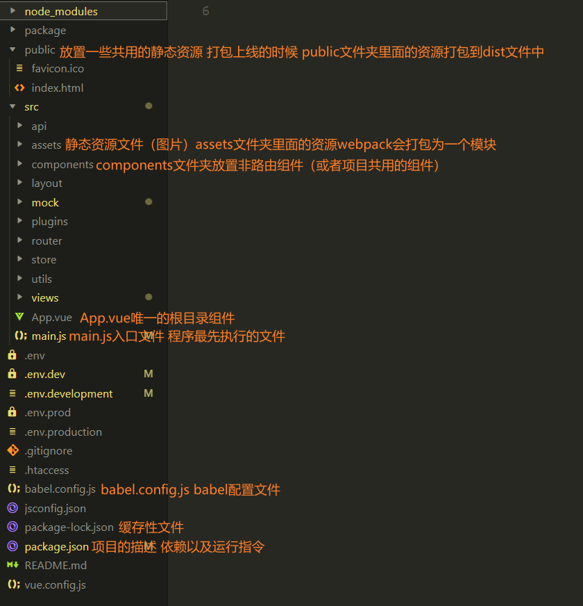

## vue路由相关

this.\$route和 this.$router的区别

### 路由参数

params参数：属于路径当中的一部分，需要注意，在配置路由的时候，需要占位
query参数：不属于路径当中的一部分，类似于ajax中的querystring /home?k=v&kv=, 不需要占位

```js
   this.$router.push({
           name: "search",
           params: {
               // 替换掉路径的keyword path: "/search/:keyword",
               keyword: this.keyword,
           },
           // 路径中添加？AS=keyword  path: /search/:keyword?(AS)...,
           query: {
               AS: this.keyword.toUpperCase()
           },
       },
       (err) => console.log(err)
   );
```


> 需要注意使用params时候 path必须使用name指定

## 编程式导航多次跳转时提示错误

I: 编程式路由跳转到当前路由（参数不变），**多次执行**会抛出NavigationDuplicated的警告错误?
--路由跳转有两种形式：声明式导航、编程式导航
--声明式导航没有这类问题的，因为vue-router底层已经处理好了
1.1为什么编程式导航进行路由跳转的时候，就有这种警告错误那？
"vue-router":"@3.5.3": 最新的vue-router引入promise 需要传递resolve和reject参数

可以传递reject参数捕获err


这种方法每次都要手动传递参数

将push重写

```js
const originalPush = VueRouter.prototype.push;
VueRouter.prototype.push = function push(location, onResolve, onReject) {
    // console.log(`push被调用`);
    if (onResolve || onReject)
        return originalPush.call(this, location, onResolve, onReject);
    return originalPush.call(this, location).catch((err) => err);
};
```

## 添加欢迎页面、登录页面

参考链接
<https://segmentfault.com/q/1010000007897556>

## axios 二次封装的原因

原因：不过随着项目规模增大，如果每发起一次HTTP请求，就要把这些比如设置超时时间、设置请求头、根据项目环境判断使用哪个请求地址、错误处理等等操作，都需要写一遍，这种重复劳动不仅浪费时间，而且让代码变得冗余增加，难以维护。为了提高代码质量，所以应该在项目中二次封装 axios 再使用。

使用请求和响应拦截器：请求拦截器在请求创建之前进行处理，响应拦截器可以在数据返回时进行处理

## 跨域问题

协议、域名、端口号不同请求，称之为跨域
使用webpack的配置
跨域 协议域名端口号不同请求 称为跨域
webpack.config.js文件相当于vue.config.js文件、

```js
module.exports = {
    productionSourceMap: false,
    // 关闭ESLINT校验工具
    lintOnSave: false,
    // 配置跨域问题
    devServer: {
        proxy: {
            "/api": {
                target: "http://gmall-h5-api.atguigu.cn",
                // pathRewrite: { "^/api": "" },
            },
        },
    },
};
```

## 事件委派

声明式导航 出现卡顿  会一直将router-link组件不断创建实例 耗费内存出现卡顿
编程式导航+事件委派 事件委派 全部子节点的事件委派到父节点 
通过自定义属性标记各级子节点，为以后路由跳转传递参数
>```<a :data-categoryName="c1.categoryName" :data-category1Id="c1.categoryId">{{c1.categoryName}}</a>```
>```:data-categoryName```即为自定义绑定属性


>2)组件name属性的作用?
2.1开发者工具中可以看见组件的名字
2.2注册全局组件的时候，可以通过组件实例获取相应组件的名字

## vuex

Vuex是官方提供一个插件，状态管理库，集中式管理项目中组件共用的数据
Vuex是插件，通过vuex仓库进行存储项目的数据 将大仓库转为小仓库按照模块化进行处理

state{} 仓库存储数据的地方
mutation{}  修改state的唯一手段
action{} 处理action书写 自己的业务逻辑 可以处理异步
getters{}  计算属性 简化仓库数据让组件获取仓库的数据更加方便


> 流程

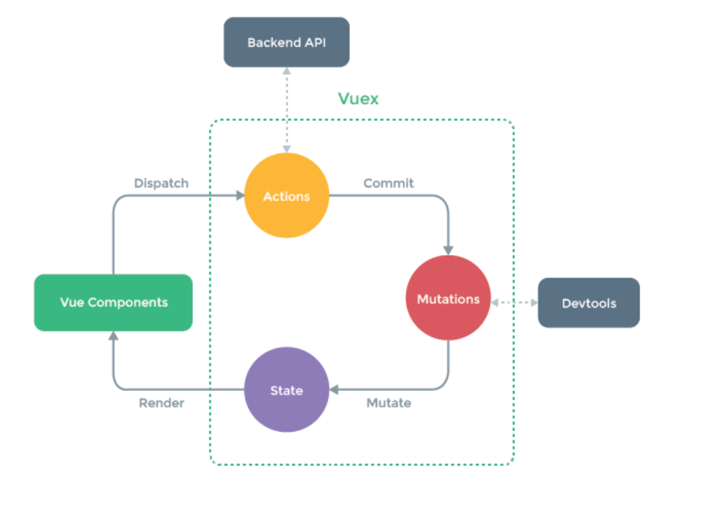

vue Components分发请求

```js
<
script >
    export default {
        name: " ",
        data() {
            return {
                n: 1,
                //   sum: 0,
            };
        },
        methods: {
            plus() {
                //   this.sum += this.n;
                this.$store.dispatch(`plus`, this.n);
            },
            reduction() {
                //   this.sum -= this.n;
            },
            isOdd() {
                /* if (this.sum % 2 != 0) {
                  this.sum++;
                } */
            },
            waiting() {
                setTimeout(() => {
                    // this.sum++;
                }, 3000);
            },
        },
    }; <
/script>
```

states中响应数据

~~~js
// 存储数据
const state = { sum: 0 }; 
~~~

到action中选择方法计算

~~~js
//响应组件的动作
const actions = {
  plus(context, value) {

    console.log( `actions参数显示` , context, value);
    // 将plus大写提示在mutation中的函数
    context.commit( `PLUS` , value);

  }, 
}; 
~~~

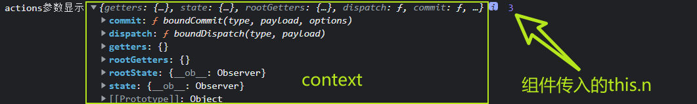

到mutations中操作数据

~~~js
// 操作数据
const mutations = {
  PLUS(state, value) {

    console.log( `mutations中的plus的参数显示` , state, value);
    // 操作state
    state.sum += value;

  }, 
}; 
~~~

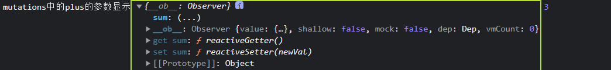

render到模板中

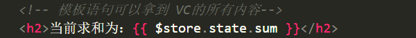

>> actions中的函数没有意义可以直接在组件中commit

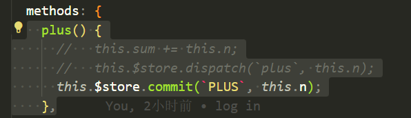

getters使用
当state中的数据需要经过加工后再使用时，可以使用getters加工。（类似于computed）

```js
//将state数据进行加工
const getters = {
    bigSum(state) {
        return state.sum * 10;
    },
};
```

组件中读取数据：```$store.getters.bigSum

```

mapState使用 ```computed: { ...mapState([`sum`, `schoolName`]) },``` 并使用ES6简写,表示```sum(){return this.$state.sum}``` ```schoolName(){return this.$state.schoolName}```vue将重复的部分省去使得开发者只需要写函数名和重要的函数体部分

>...mapState({sum,schoolName}) 等同于 ...mapState({sum:sum,schoolName:sum})sum取出来的是变量sum,而不是 sum:`sum` 用在computed中其他的map用在methods中
不需要经过action直接commit的情况

mapMutations ```...mapMutations({ plus: `PLUS` }),```

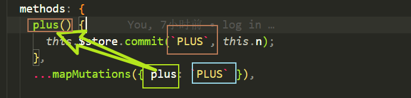

> this.value值需要在模板中传```<button @click="plus(n)">+</button>

```

平时如果不写plus()写成plus表示plus(event)默认传入的event

简写形式```...mapMutations([`PLUS`]),``` 修改模板中的方法


mapActions```...mapActions({ isOdd: `isOdd` }),```相当于```this.$store.dispatch(`isOdd`, this.$store.state.sum);```

简写形式 ` `  ` ...mapActions([ ` isOdd` ]), 

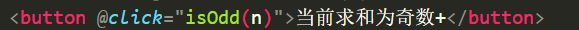

modules管理：
将store进行模块化管理

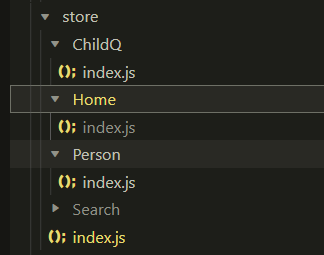

```js
const childQ = {
    namespaced: true,
    state: {
        sum: 1,
        schoolName: `上学`
    },
    actions: {
        isOdd(context, value) {
            if (context.state.sum % 2) {
                context.commit(`ISODD`, value);
            }
        },
        waiting(context, value) {
            setTimeout(() => {
                context.commit(`WAITING`);
            }, 3000);
        },
    },
    mutations: {
        PLUS(state, value) {
            console.log(`mutations中的plus的参数显示`, state, value);
            state.sum += value;
        },
        ISODD(state, value) {
            state.sum++;
        },
        REDUCTION(state, value) {
            state.sum--;
        },
        WAITING(state, value) {
            state.sum++;
        },
    },
};

export default childQ;
```

在index.js中使用

```js
export default new vuex.Store({
    modules: {
        childQ,
        person,
    },
});
```

取出单个module中的数据  需要 namespaced:true

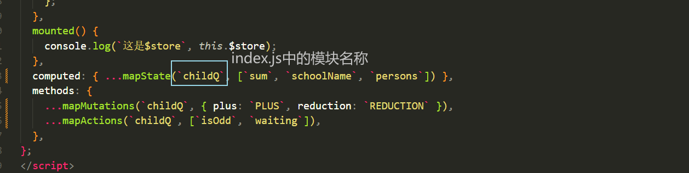

vue-router和vue的版本需要匹配否则报错

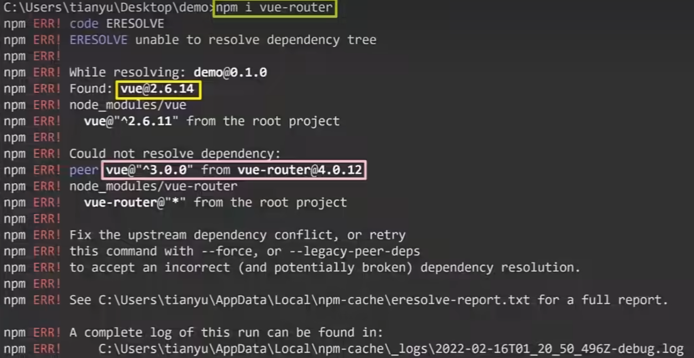

> 组件命名用大驼峰

## 函数的防抖和节流

节流 在规定的间隔时间范围内不会重复触发回调 只有大于这个时间间隔才会触发回调 把频繁的触发变为少量的触发 _.throttle()

```js
 onSearch: _.debounce(function() {
     console.log(`发送请求`);
 }, 1000),
```

防抖  前面的所有触发都被取消 最后一次执行在规定的时间之后才会触发 ***连续快速触发 只会执行一次***

```js
    add: _.throttle(function() {
        this.count++;
        console.log(`节流执行`);
    }, 10000),
```

> 利用lodash 插件 包含防抖和节流业务

对外暴露的函数为_function 不用箭头函数
按需引入 优化项目

## 自定义指令

对象式

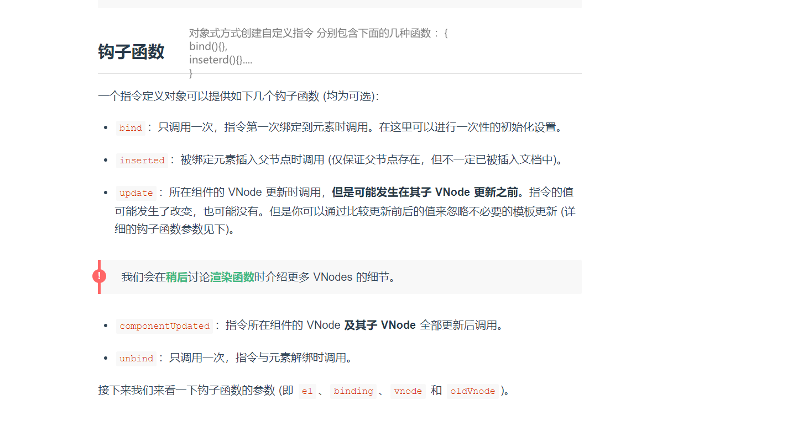

函数式

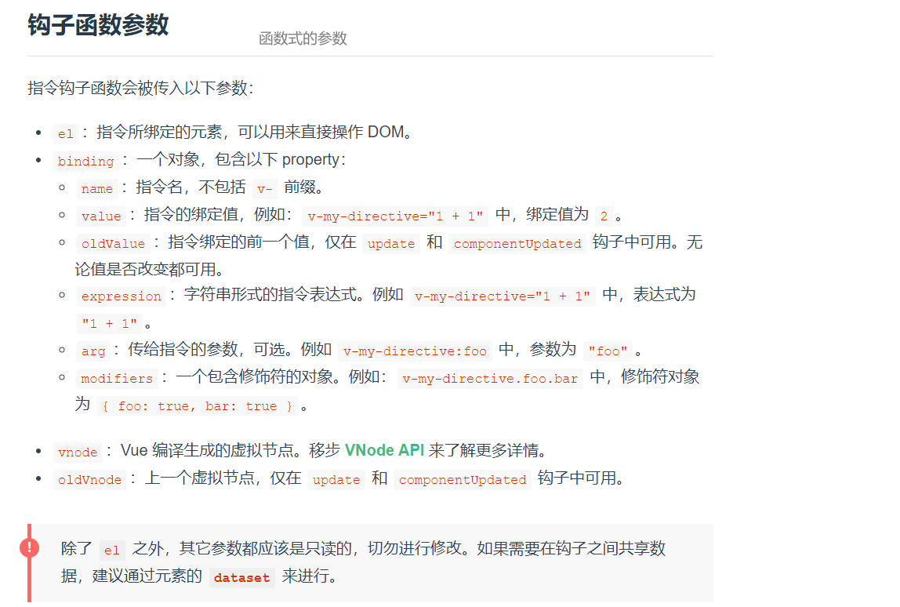

```js
 directives: {
     focus: function(el, value) {},
 },
```

## 事件委派

当事件的循环次数很大，并且每次循环的事件都有绑定事件时，会非常消耗内存。这时候可以利用冒泡的机制和事件流的特性将事件绑定在父节点上
数据绑定

## mock数据

拦截ajax请求 
新建mock文件夹 创建json数据

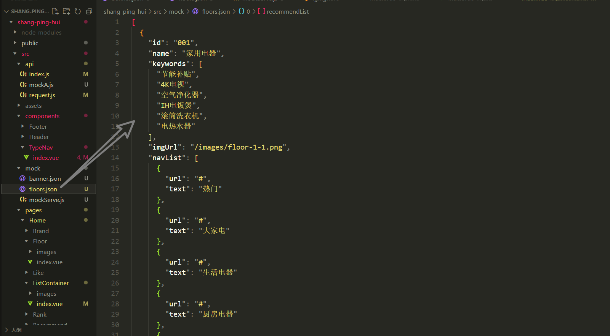

创建api文件

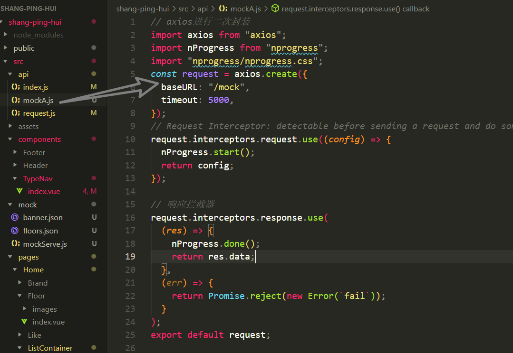

ajax请求

```js
export const reqBannerList = () => {
    return mockRequest.get("/banner");
};
```

在组件中向vuex请求数据
v-model

> 语法糖：指计算机语言中添加的某种语法，这种语法对语言的功能并没有影响，但是更方便程序员使用。通常来说使用语法糖能够增加程序的可读性，从而减少程序代码出错的机会。

v-model 适用于表单元素 有value元素

1. 双向绑定一般都应用在表单类元素上（如：input、se1ect等）
2.v-model:value可以简写为v-model, 因为v-model默认收集的就是value值。

计算属性 将属性进行加工称为新的属性

watch 类似计算属性 $watch

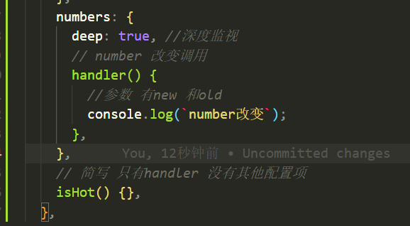

或者用vm.$watch('监视内容', function(){})function类似handler

vue的v-for的key

key没有指定或者指定为index（diff算法）

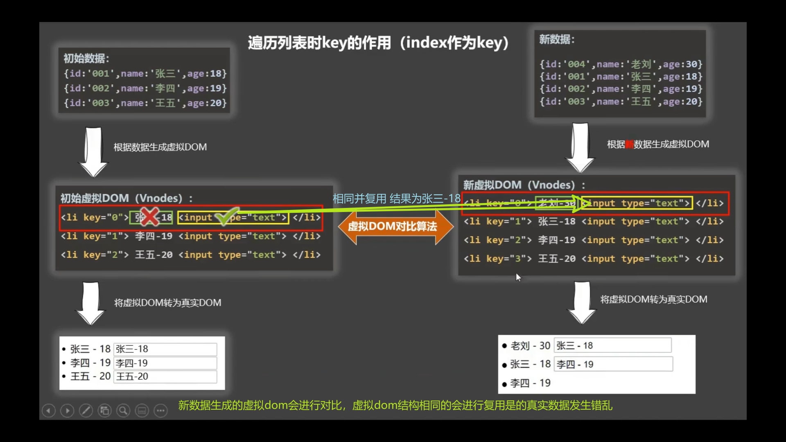

 2, 对比规则：
(1). 旧虚拟DoM中找到了与新虚拟DoM相同的key:

1. 若虚拟D0M中内容没变，直接使用之前的真实D0M!
2，若虚拟D0M中内容变了，则生成新的真实D0M, 随后替换掉页面中之前的真实D0M。
(2). 旧虚拟DoM中未找到与新虚拟DOM相同的key
创建新的真实D0州，随后渲染到到页面。
 用index作为key可能会引发的问题：
1. 若对数据进行：逆序添加、逆序删除等破坏顺序操作：
会产生没有必要的真实D0州更新==>界面效果没问题，但效率低。
2. 如果结构中还包含输入类的D0M:
会产生错误D0M更新==>界面有问题。
开发中如何选择key?:
1. 最好使用每条数据的唯一标识作为key, 比如id、手机号、身份证号、学号等唯一值。
2. 如果不存在对数据的逆序添加、逆序删除等破坏顺序操作，仅用于渲染列表用于展示，
使用index作为key是没有问题的。

this.$set()不能在vm的实例添加数据不能直接在data中添加

## 生命周期

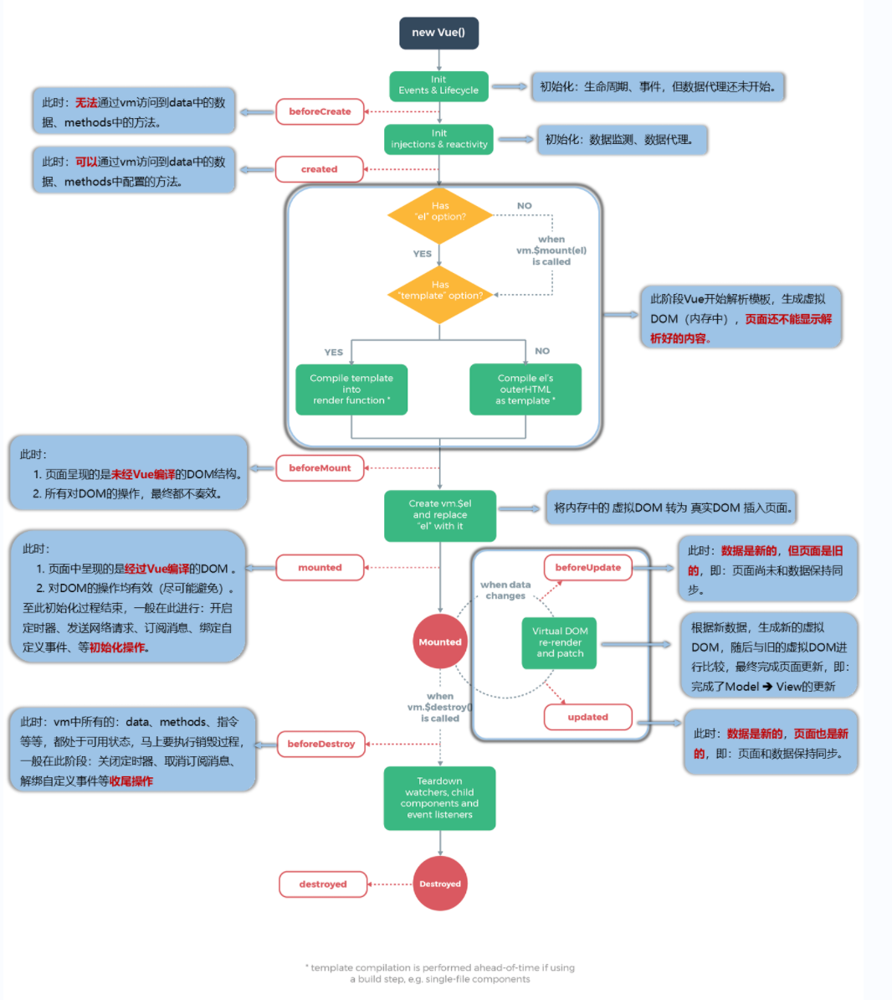

生命周期：

1. 又名：生命周期回调函数、生命周期函数、生命周期钩子。
2. 是什么：Vue在关键时刻帮我们调用的一些特殊名称的函数。
3. 生命周期函数的名字不可更改，但函数的具体内容是程序员根据需求编写的。
4. 生命周期函数中的this指向是vm或组件实例对象。
vm重要的钩子
(重要)挂载完毕==>调用mounted函数。=>【重要的钩子】
(重要)
将要销毁==>调用beforeDestroy函数。======>【重要的构子】

常用的生命周期钩子：
1.mounted: 发送ajax请求、启动定时器、绑定自定义事件、订阅消息等【初始化操作】。
2.beforeDestroy: 清除定时器、解绑自定义事件、取消订阅消息等【收尾工作】。
关于销毁Vue实例
1, 销毁后借ue开发者工具看不到任何信息。
2. 销毁后自定义事件会失效，但原生D0州事件依然有效。
3. 一般不会再beforeDestroy操作数据，因为即便操作数据，也不会再触发更新流程了。

组件

1. 关于组件名：
一个单词组成：
第一种写法（首字母小写）：schoo1
第二种写法（首字母大写）：Schoo1
多个单词组成：
第一种写法(kebab-case命名)：my-school
第二种写法(CamelCase命名)：MySchoo1(需要Vue脚手架支持)
备注：
(1). 组件名尽可能回避HTML中已有的元素名称，例如：2、H2都不行。
(2). 可以使用name配置项指定组件在开发者工具中呈现的名字。(和注册的名称无关)
2. 关于组件标签：
第一种写法： `<schoo1></schoo1>`

第二种写法： `<schoo1/>`

备注：不用使用脚手架时，<scoo1/>会导致后续组件不能渲染。

4. 关于this指向：
(1). 组件配置中：
data函数、methods中的函数、watch中的函数、computed中的函数它们的this均是【VueComponent实例对象】
(2).new Vue(options)配置中：
data函数、methods中的函数、watch中的函数、computed中的函数它们的this均是【Vue实例对象】。


表示动态绑定中的""中时js表达式

props, 是只读的，Vue底层会监测你对props的修改，如果进行了修改，就会发出警告，若业务需求确实需要修改，那么请复制props的内容到data中一份，然后去修改data中的数据。

mixin 混入
插件

scoped样式
作用：让样式在局部生效，防止冲突。
写法： `<style scoped>`

浏览器本地存储 localStorage存储在本地 浏览器关闭不会清空
sessionStorage关闭浏览器 清空

组件中区分子父组件

import组件的组件为父组件 被import的为子组件

默认插槽 `<slot>`

vue3.0对应的是vuex的4版本 vue2.0对应vuex的3版本

route

1. 路由组件通常存放在pages文件夹，一般组件通常存放在components文件夹。
2. 通过切换，“隐藏”了的路由组件，默认是被销毁掉的，需要的时候再去挂载。
3. 每个组件都有自己的$oute属性，里面存储着自己的路由信息。
4. 整个应用只有一个router, 可以通过组件的$router属性获取到。

children路由

```js
{
    path: "/login",
    component: Login,
    meta: {
        show: false
    },
    children: [{
        path: "demo03", //不加/
        component: Demo03,
    }, ],
},
```

路由参数

~~~js

    <!-- 跳转路由 字符串写法 -->
    <router-link
      :to="{
        path: `/home01/message/detail` ,
        query: {
          id: 1,
          title: `zhangsan` ,
        },
      }"
    >
      <button>跳转</button>
    </router-link>

~~~

命名路由
简化路由路径

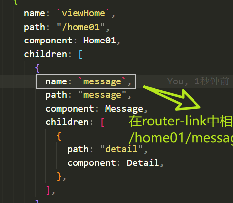

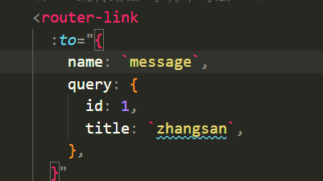

param参数

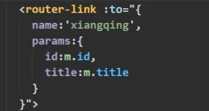

特别注意：路由携带params: 参数时，若使用to的对象写法，则不能使用path配置项，必须使用name配置

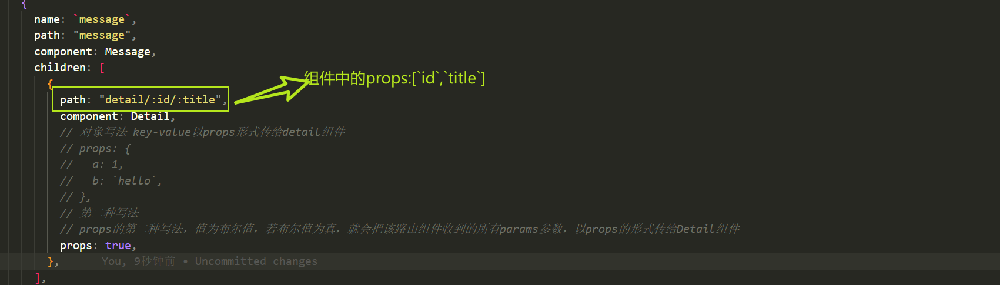

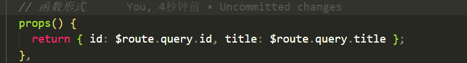

> params方式和query方式的区别

query方式生成的url为/xx?id=id，params方式生成的url为xx/id
path只能使用query方式
params方式需要注意的是需要定义路由信息如：path: '/xx/:id', 这样才能进行携带参数跳转，否则url不会进行变化，并且再次刷新页面后参数会读取不到

replace 将当前路径替换掉历史记录 push将历史记录保存

`<router-link>` 的replace属性

1. 作用：控制路由跳转时操作浏览器历史记录的模式
2. 浏览器的历史记录有两种写入方式：分别为push和replace,
push是追加历史记录，replace是替换当前记。路由跳转时候默认为push
3. 如何开启replace模式：
`<router-link replace .......>` News `</router-link>`

路由缓存防止路由跳转后数据消失 ` `  ` <keep-alive include="组件名称"> `  ` ` 缓存多个用数组
路由守卫
对路由权限的校验
路由元信息 可以设置页面title
后置路由守卫在切换完之后调用
路径中#表示不会作为路径的一部分发送给服务器 model:hash

1. 对于一个url来说，什么是hash值？一
# 及其后面的内容就是hash值」

2.hash值不会包含在HTTP请求中，即：hash值不会带给服务器。
3.hash模式：I
1. 地址中永远带着#号，不美观。
2. 若以后将地址通过第三方手机app分享，若app校验严格，则地址会被标记为不合法。
3. 兼容性较好。
4.history模式：
1. 地址干净，美观。
2. 兼容性和hash模式相比略差。
3. 应用部署上线时需要后端人员支持，解决刷新页面服务端404的问题。
build 后出现dist文件夹出现原始的HTML js css文件
-
