<!-- # vue 学习记录 -->

## vscode启动脚手架

cd 到项目想要创建的文件夹下面 `vue create 文件名` 启动脚手架

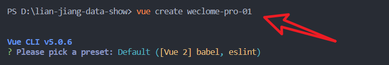

`npm run serve` 启动vue 

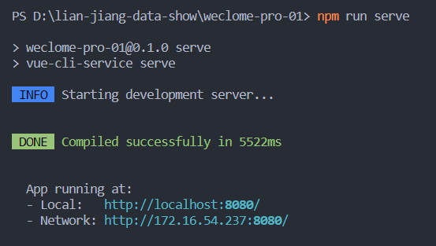

效果

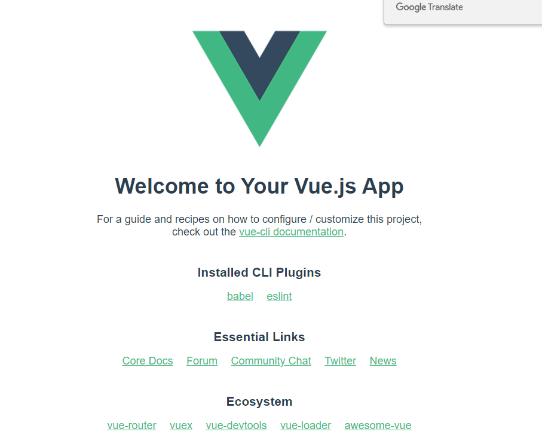

## 关于SPA(single-page application)

简单了解下SPA: **单页应用**（英语：single-page application，缩写SPA）是一种网络应用程序或网站的模型，它通过动态重写当前页面来与用户交互，而非传统的从服务器重新加载整个新页面。这种方法避免了页面之间切换打断用户体验，使应用程序更像一个桌面应用程序 -------维基百科

## vue路由相关

## 添加欢迎页面、登录页面

参考链接
https://segmentfault.com/q/1010000007897556

## hash 和 history model模式  


## 
 项目中已经删除组件newIndex.vue
 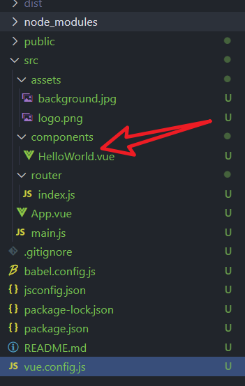
 报错如下
 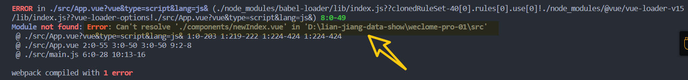


v-for中的key 作用？


```vue
<template>
<!--这里写 html -->
<template/>
<script>
 export default {};
 // 这里写js
</script>
<style lang = "less" scoped>
 <!--这里写css-->
</style>
```
一个.vue 文件就等于单独组件。因为.vue文件是自定义的，浏览器不识别，所以要对该文件进行解析,在webpack构建中，需要安装vue-loader 对.vue文件进行解析。

template里面最外层必须是只有一个容器
script 中的 export default {} 即导出这个组件，外部可以引用。
style 中的 lang 指额外表示支持的语言可以让编辑器识别,scoped 指这里写的css只适用于该组件

导航是路由的切换
router.beforeEach(async (to, from, next)
next判断能否进入目标路由


push 和 apply 的区别

router.push 重定向报错问题
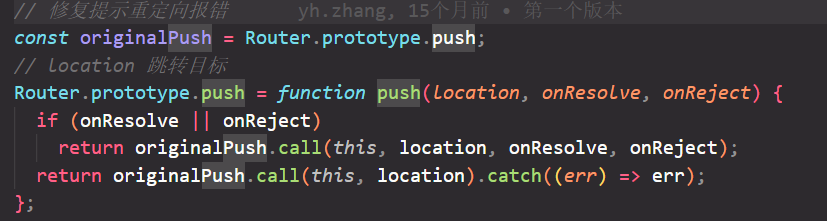

axios 二次封装的原因

将公共组件隐藏和显示

p3没有做axios的封装

跨域 协议域名端口号不同请求 称为跨域
webpack.config.js文件相当于vue.config.js文件、

没有noprogress进度条

vuex 当项目比较大，组件通信数据比较复杂，这种情况在使用vuex

Vuex是插件，通过vuex仓库进行存储项目的数据 将大仓库转为小仓库按照模块化进行处理

state{} 仓库存储数据的地方
mutation{}  修改state的唯一手段
action{} 处理action书写 自己的业务逻辑 可以处理异步
getters{}  计算属性 简化仓库数据让组件获取仓库的数据更加方便

函数的防抖和节流
节流 在规定的间隔时间范围内不会重复触发回调 只有大于这个时间间隔才会触发回调 把频繁的触发变为少量的触发 _.throttle()
防抖  前面的所有触发都被取消 最后一次执行在规定的时间之后才会触发 连续快速触发 只会执行一次
 
利用lodash 插件 包含防抖和节流业务
对外暴露的函数为_function 不用箭头函数
按需引入 优化项目 

声明式导航 出现卡顿  会一直将router-link组件不断创建实例 耗费内存出现卡顿
编程式导航+事件委派 事件委派 全部子节点的事件委派到父节点 点击a标签时进行路由跳转 如何确定点击的是a标签？ 在子标签中加上标示 自定义属性 可以获取当前节点 利用节点的dataset获取标示
如何确定是几级标签

编程式导航是利用组件的$router.push|place方法 跳转

2)组件name属性的作用?
2.1开发者工具中可以看见组件的名字
2.2注册全局组件的时候，可以通过组件实例获取相应组件的名字


##  路由参数
~~~js
  methods: {
    goSearch() {
      //路由参数传递
      // 字符串
      // this.$router.push(
      //   "/search/" + this.keyword + "?k=" + this.keyword.toUpperCase()
      // );
      // 模板字符串
      // this.$router.push(
      //   `/search/${this.keyword}?k=${this.keyword.toUpperCase()}`
      // );
      // 对象 给路由起个名字name
      this.$router.push({
        name: "search",
        params: {
          keyword: this.keyword,
        },
        query: { k: this.keyword.toUpperCase() },
      });
    },
  },
~~~
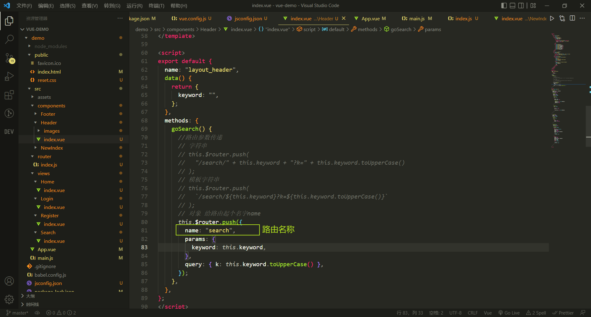
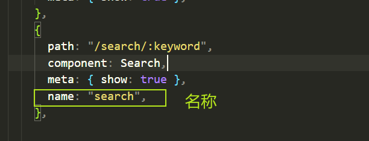
## 编程式导航路由跳转
I:编程式路由跳转到当前路由（参数不变），**多次执行**会抛出NavigationDuplicated的警告错误?
--路由跳转有两种形式：声明式导航、编程式导航
--声明式导航没有这类问题的，因为vue-router底层已经处理好了
1.1为什么编程式导航进行路由跳转的时候，就有这种警告错误那？
"vue-router":"@3.5.3":最新的vue-router引入promise 需要传递resolve和reject参数

可以传递reject参数捕获err 
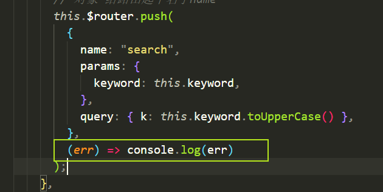
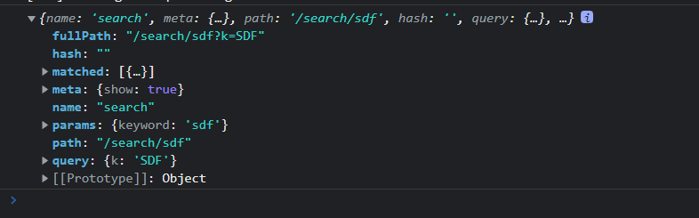
这种方法每次都要手动传递参数 

三级联动 
注册全局组件 注册一次全局使用 home search detail

## axios封装
原因：不过随着项目规模增大，如果每发起一次HTTP请求，就要把这些比如设置超时时间、设置请求头、根据项目环境判断使用哪个请求地址、错误处理等等操作，都需要写一遍，这种重复劳动不仅浪费时间，而且让代码变得冗余增加，难以维护。为了提高代码质量，所以应该在项目中二次封装 axios 再使用。

7.1跨域问题
什么是跨域：协议、域名、端口号不同请求，称之为跨域


## vuex 
Vuex是官方提供一个插件，状态管理库，集中式管理项目中组件共用的数据
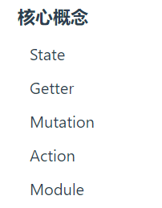
