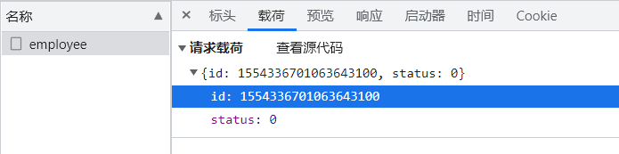

软件环境
开发环境(development):开发人员在开发阶段使用的环境，一般外部用户无法访问
测试环境(testing):专门给测试人员使用的环境，用于测试项目，一般外部用户无法访问
生产环境(production):即线上环境，正式提供对外服务的环境

## 登录校验

使用 session 和 cookie 或者 Token 验证

## 雪花算法的精度丢失问题

发送到服务器中的 js 如下

数据库中的 id 信息如下

js 只能确保前十六位的数字是精确的，导致提交的 id 和数据库中的 id 不一致。
我们可以在服务器响应页面的 json 中进行处理，将 long 型的数据转为 String 字符串

# 公共字段自动填充如何获得 request 中的用户信息

通过 ThreadLocal 来获取，客户端发送的每次 http 请求中，对应的服务器都会分配一个新的线程来处理，在处理中涉及到下面类中的方法都属于相同的一个线程：

1. LoginCheckFilter 的 doFilter 方法
2. EmployeeController 的 update 方法
3. MyMetaObjectHandler 的 updateFill 方法

可以在上面的三个方法中分别加入如下代码

```java
long id = Thread.currentThread().getId();
log.info("线程id：{}", id);
```

知道一次请求属于一次线程。ThreadLocal 为每个线程提供单独一份存储空间，具有线程隔离的效果，只有在线程内才能获取到对应的值，线程外则不能访问当前线程对应的值

>

```java
@DeleteMapping()
    public R<String> deleteCategory( @RequestBody Category category,Long ids){
        log.info("删除分类 {}",category.getId());

        return null;
    }
```

@RequestBody 获取请求体中的数据并赋予 category 但要获取 URL 中的参数不能用该注解
