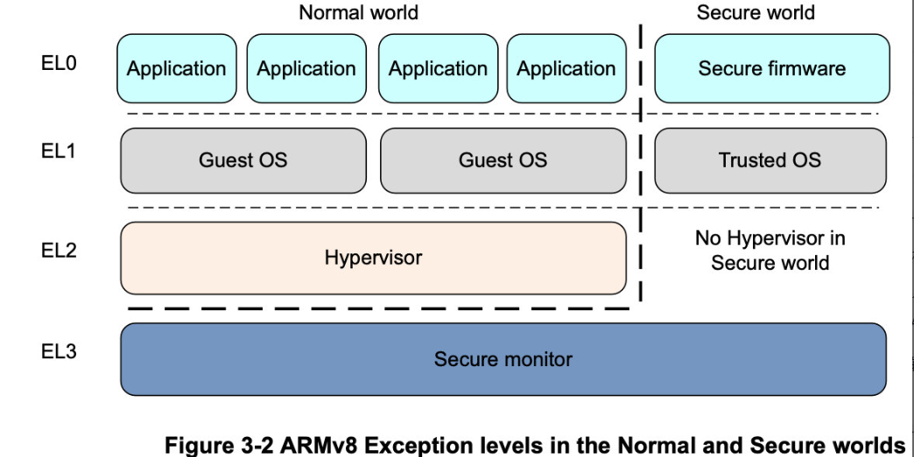

# 计算机操作系统

## 《现代操作系统原理和实现》

### 操作系统概述

什么是操作系统：
操作系统的共性分为两点：
1. 对硬件进行行为管理和抽象
2. 为应用提供服务并进行管理
<!--more-->
## CPU和指令集架构

指令集架构是连接cpu和软件之间的桥梁，包括：

* 指令集
* 特权级
* 寄存器
* 执行模式
* 安全模式
* 性能加速拓展等
  
### 特权级
 [AArch64](https://en.wikipedia.org/wiki/AArch64)的特权级分为异常级别，有四个特权级如图
 

EL3 负责在安全世界和普通世界进行切换。
这四种特权级分别可以切换，例如在EL0和EL1进行切换的场景有

1. 应用程序调用操作系统提供的系统调用（系统调用提供用户程序与操作系统之间的接口）

## 内存管理
### 物理地址和虚拟地址
为什么要引入虚拟地址

# 深入理解计算机系统
## 第一章 计算机系统漫游
系统的硬件组成部分
1. 总线

## 信息的表示和处理

大多数计算机使用8位的块或者字节 作为最小的可寻址内存单元，
不同字节数的机器的虚拟地址空间的大小不同，32位的机器虚拟地址空间为4GB，64位字长的机器为16EB