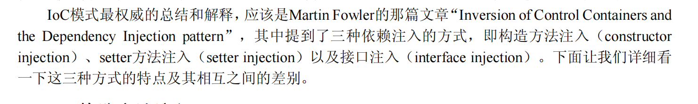
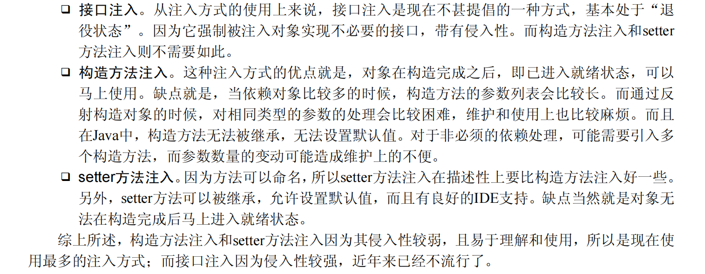
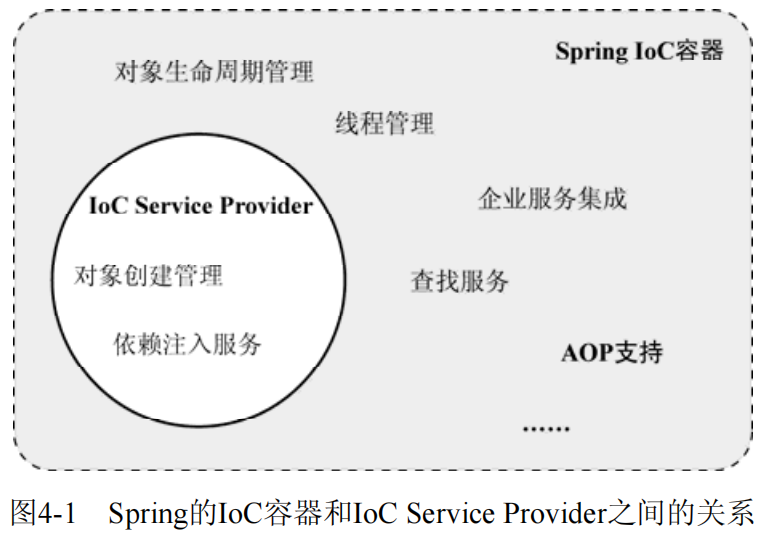
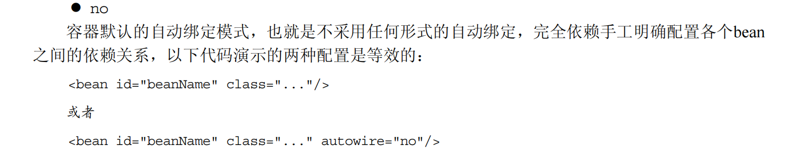

# IOC

## 依赖注入方式

- 构造器注入
- getset 注入
- 接口注入 具有侵入性 基本不用
  

xml 配置文件的功能告诉 IOC Service Provider 依赖注入关系的管理方式
或者使用元数据（注解方式）

BeanFactory 和 FactoryBean 区别

autowire 的自动绑定模式：no、byname、bytype、constructor、autodetect

byname

# AOP

aop 相比于 oop（纵向开发） 而言是对类的一种横向的插入（横切），在封装好的对象中剖开并插入相关的代码（Aspect 切面）。所以切面是和业务无关但是却被业务模块所共同调用的逻辑或责任封装起来，便于减少系统的重复代码，降低模块之间的耦合度，并有利于未来的可操作性和可维护性。
使用"横切"技术，AOP 把软件系统分为两个部分：核心关注点和横切关注点。业务处理的主要流程是核心关注点，与之关系不大的部分是横切关注点。横切关注点的一个特点是，他们经常发生在核心关注点的多处，而各处基本相似，比如权限认证、日志、事物。AOP 的作用在于分离系统中的各种关注点，将核心关注点和横切关注点分离开来。

- 横切关注点
  从每个方法中抽取出来的同一类非核心业务代码，

* 切面
  对通知方法进行封装的类。类是对物体特征的抽象，切面就是对横切关注点的抽象
* 通知
  放在横切关注点的方法称为通知方法分为 前置通知 返回通知（在被代理的目标方法成功结束后执行） 异常通知 后置通知（在被代理的目标方法最终结束后执行） 环绕通知
* 目标  
  抽取非核心业务代码的对象
* 代理
  向目标对象应用通知之后创建的代理对象。不需要手动创建，由 AOP 进行创建
* 连接点
  抽取横切关注点的位置，或者横切关注点放置的地方。
* 切入点
  定位连接点的方式

AOP 的作用
简化代码：把方法中固定位置的重复的代码抽取出来，让被抽取的方法更专注于自己的核心功能，
提高内聚性。
代码增强：把特定的功能封装到切面类中，看哪里有需要，就往上套，被套用了切面逻辑的方法就
被切面给增强了。

AOP 的核心思想是动态代理（代理模式是一种设计模式，能够使得在不修改源目标的前提下，额外扩展源目标的功能。即通过访问源目标的代理类，再由代理类去访问源目标）
