# Java 数据类型常见面试题总结

这篇文章绝对干货！文章涉及到的概念经常会被面试官拿来考察求职者的 Java 基础。

本篇采用大家比较喜欢的面试官问答的形式来展开。

基本数据类型

👨‍💻 面试官 ： Java 中有哪 8 种基本数据类型？

🙋 我 ：Java 中有 8 种基本数据类型，分别为：

6 种数字类型 ：byte、short、int、long、float、double

1 种字符类型：char

1 种布尔型：boolean

👨‍💻 面试官 ： 它们的默认值和占用的空间大小知道不？

🙋 我 ：这 8 种基本数据类型的默认值以及所占空间的大小如下：
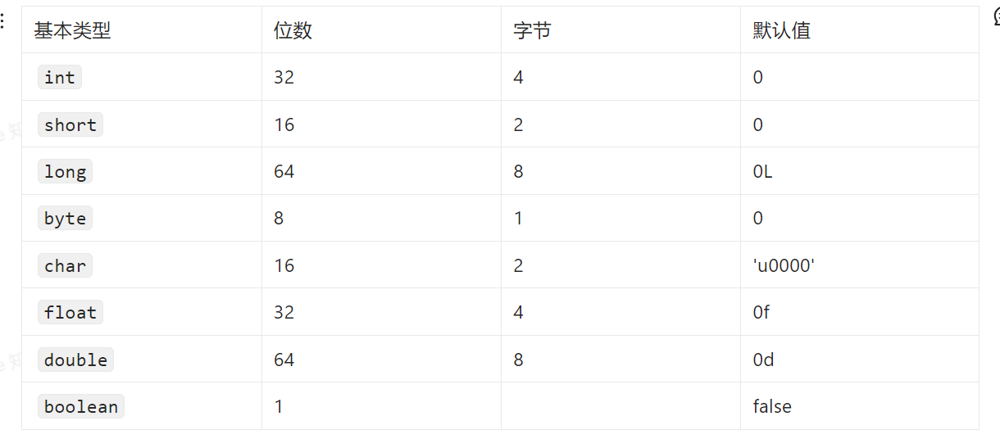

另外，对于 boolean，官方文档未明确定义，它依赖于 JVM 厂商的具体实现。逻辑上理解是占用 1 位，但是实际中会考虑计算机高效存储因素。

注意：

Java 里使用 long 类型的数据一定要在数值后面加上 L，否则将作为整型解析：

char a = 'h'char :单引号，String a = "hello" :双引号

## 包装类型

👨‍💻 面试官 ： 说说这 8 种基本数据类型对应的包装类型。

🙋 我 ：这八种基本类型都有对应的包装类分别为：Byte、Short、Integer、Long、Float、Double、Character、Boolean

👨‍💻 面试官 ：那基本类型和包装类型有啥区别不？

🙋 我 ：包装类型不赋值就是 Null ，而基本类型有默认值且不是 Null。

另外，这个问题建议还可以先从 JVM 层面来分析。

基本数据类型直接存放在 Java 虚拟机栈中的局部变量表中，而包装类型属于对象类型，我们知道对象实例都存在于堆中。相比于对象类型， 基本数据类型占用的空间非常小。

> 《深入理解 Java 虚拟机》 ：局部变量表主要存放了编译期可知的基本数据类型（boolean、byte、char、short、int、float、long、double）、对象引用（reference 类型，它不同于对象本身，可能是一个指向对象起始地址的引用指针，也可能是指向一个代表对象的句柄或其他与此对象相关的位置）。

## 包装类型的常量池技术

👨‍💻 面试官 ： 包装类型的常量池技术了解么？

🙋 我 ： Java 基本类型的包装类的大部分都实现了常量池技术。

Byte,Short,Integer,Long 这 4 种包装类默认创建了数值 [-128，127] 的相应类型的缓存数据，Character 创建了数值在[0,127]范围的缓存数据，Boolean 直接返回 True Or False。

Integer 缓存源码：

```java
/**
*此方法将始终缓存-128 到 127（包括端点）范围内的值，并可以缓存此范围之外的其他值。
*/
public static Integer valueOf(int i) {
    if (i >= IntegerCache.low && i <= IntegerCache.high)
      return IntegerCache.cache[i + (-IntegerCache.low)];
    return new Integer(i);
}
private static class IntegerCache {
    static final int low = -128;
    static final int high;
    static final Integer cache[];
}
```

Character 缓存源码:

```java
public static Character valueOf(char c) {
    if (c <= 127) { // must cache
      return CharacterCache.cache[(int)c];
    }
    return new Character(c);
}

private static class CharacterCache {
    private CharacterCache(){}

    static final Character cache[] = new Character[127 + 1];
    static {
        for (int i = 0; i < cache.length; i++)
            cache[i] = new Character((char)i);
    }
}
```

Boolean 缓存源码：

```java
public static Boolean valueOf(boolean b) {
    return (b ? TRUE : FALSE);
}
```

如果超出对应范围仍然会去创建新的对象，缓存的范围区间的大小只是在性能和资源之间的权衡。

两种浮点数类型的包装类 Float,Double 并没有实现常量池技术。

```java
Integer i1 = 33;
Integer i2 = 33;
System.out.println(i1 == i2);// 输出 true
Float i11 = 333f;
Float i22 = 333f;
System.out.println(i11 == i22);// 输出 false
Double i3 = 1.2;
Double i4 = 1.2;
System.out.println(i3 == i4);// 输出 false
```

下面我们来看一下问题。下面的代码的输出结果是 true 还是 flase 呢？

```java
Integer i1 = 40;
Integer i2 = new Integer(40);
System.out.println(i1==i2);
```

Integer i1=40 这一行代码会发生装箱，也就是说这行代码等价于 Integer i1=Integer.valueOf(40) 。因此，i1 直接使用的是常量池中的对象。而 Integer i1 = new Integer(40) 会直接创建新的对象。

因此，答案是 false 。你答对了吗？

记住：**所有整型包装类对象之间值的比较，全部使用 equals 方法比较。**
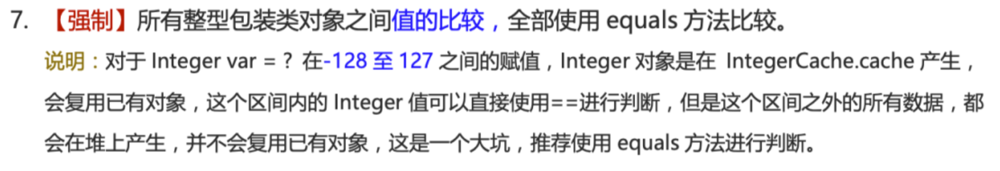

## 为什么要有包装类型？

👨‍💻 面试官 ： 为什么要有包装类型？

🙋 我 ：

Java 本身就是一门 OOP（面向对象编程）语言，对象可以说是 Java 的灵魂。

除了定义一些常量和局部变量之外，我们在其他地方比如方法参数、对象属性中很少会使用基本类型来定义变量。

为什么呢？

我举个例子，假如你有一个对象中的属性使用了 基本类型，那这个属性就必然存在默认值了。这个逻辑不正确的！因为很多业务场景下，对象的某些属性没有赋值，我就希望它的值为 null。你给我默认赋个值，不是帮倒忙么？

另外，像泛型参数不能是基本类型。因为基本类型不是 Object 子类，应该用基本类型对应的包装类型代替。我们直接拿 JDK 中线程的代码举例。

Java 中的集合在定义类型的时候不能使用基本类型的。比如：

```java
public class HashMap<K,V> extends AbstractMap<K,V>
    implements Map<K,V>, Cloneable, Serializable {
}

Map<Integer, Set<String>> map = new HashMap<>();
```

## 自动拆装箱

什么是自动拆装箱？原理？

👨‍💻 面试官 ： 什么是自动拆装箱？原理了解么？

🙋 我 ：

基本类型和包装类型之间的互转。举例：
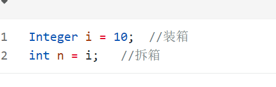
上面这两行代码对应的字节码为：
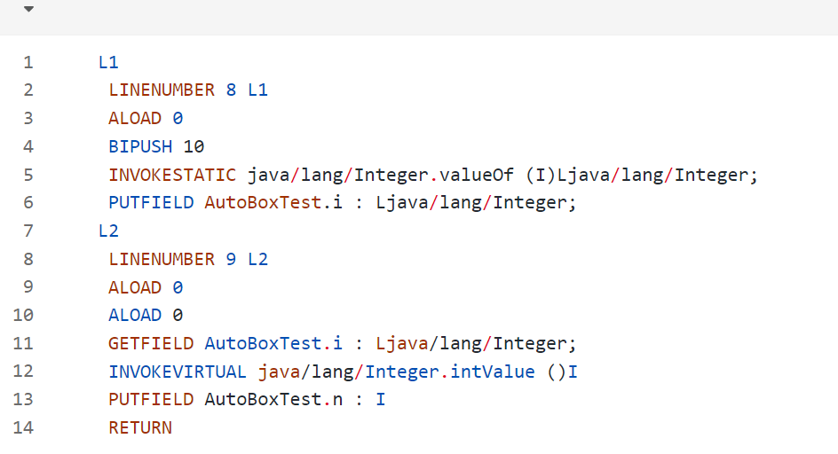
从字节码中，我们发现装箱其实就是调用了 包装类的 valueOf()方法，拆箱其实就是调用了 xxxValue()方法。

因此，

●
Integer i = 10 等价于 Integer i = Integer.valueOf(10)
●
int n = i 等价于 int n = i.intValue();

## 自动拆箱引发的 NPE（NullPointerException） 问题

👨‍💻 面试官 ： 自动拆箱可能会引发 NPE 问题，遇到过类似的场景么？

🙋 我 ：

案例 1

在《阿里巴巴开发手册》上就有这样一条规定。
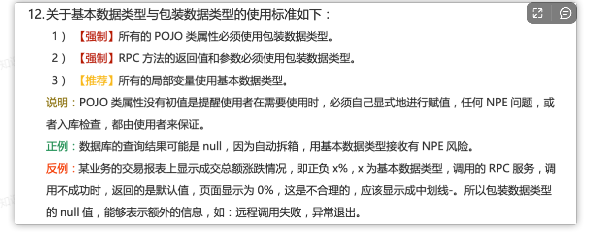
我们从上图可以看到，有一条是这样说的：“数据库的查询结果可能是 null，因为自动拆箱，用基本数据类型接收有 NPE 风险”。

我们来模拟一个实际的案例：
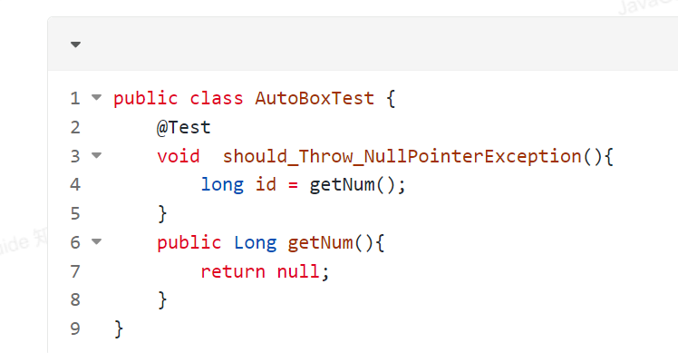
运行代码之后，果然出现了 NPE 的问题。

为什么会这样呢? 我们对 AutoBoxTest.class 进行反编译查看其字节码（我更推荐使用 IDEA 插件 jclasslib 来查看类的字节码）。
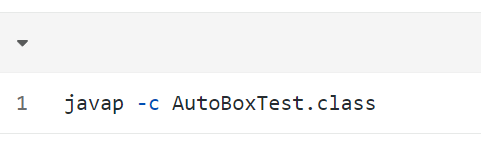
反编译后得到的 should_Throw_NullPointerException() 方法的字节码如下：
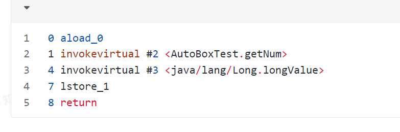
我们可以发现自动拆箱 Long -> long 的过程，不过是调用了 longValue() 方法罢了！
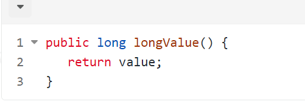
也就是说下面两行的代码实际是等价的:

因为，getNum()返回的值为 null ，一个 null 值调用方法，当然会有 NPE 的问题了。

案例 2

通过上面的分析之后，我来考了一个不论是平时开发还是面试中都经常会碰到的一个问题：“三目运算符使用不当会导致诡异的 NPE 异常”。

请你回答下面的代码会有 NPE 问题出现吗？如果有 NPE 问题出现的话，原因是什么呢？你会怎么分析呢？
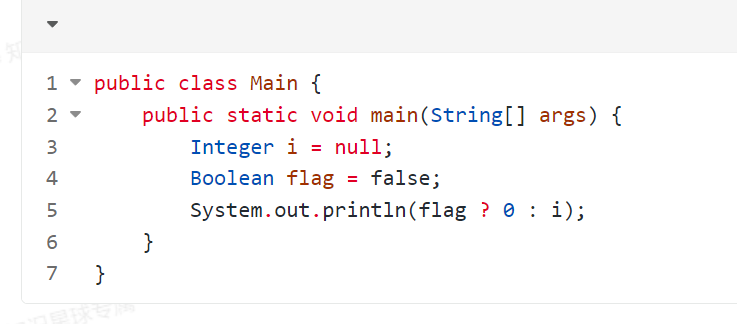
答案是会有 NPE 问题出现的。

我们还是通过查看其字节码来搞懂背后的原理（这里借助了 IDEA 插件 jclasslib 来查看类字节码）。
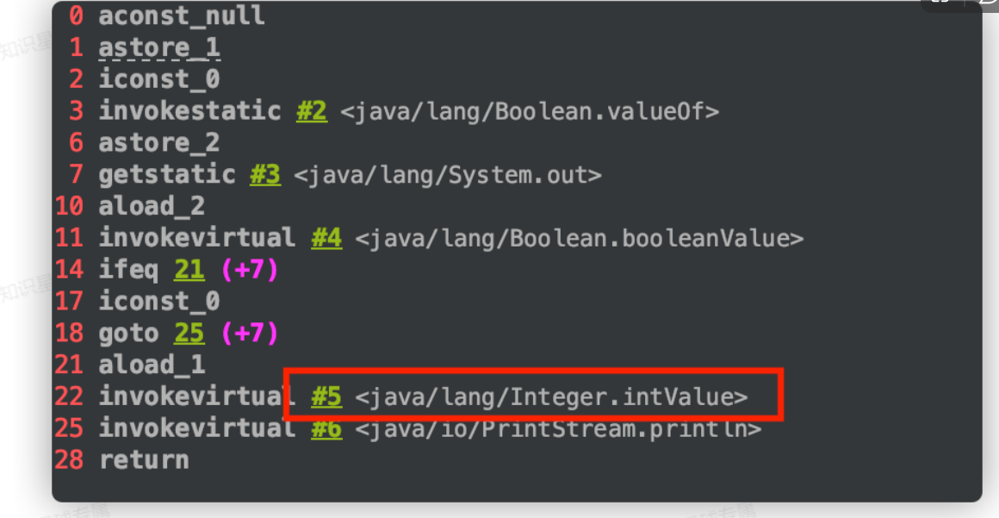
从字节码中可以看出，22 行的位置发生了 拆箱操作 。

详细解释下就是：flag ? 0 : i 这行代码中，0 是基本数据类型 int，返回数据的时候 i 会被强制拆箱成 int 类型，由于 i 的值是 null，因此就抛出了 NPE 异常。
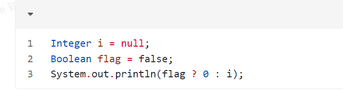
如果，我们把代码中 flag 变量的值修改为 true 的话，就不会存在 NPE 问题了，因为会直接返回 0，不会进行拆箱操作。

我们在实际项目中应该避免这样的写法，正确 ✅ 修改之后的代码如下：
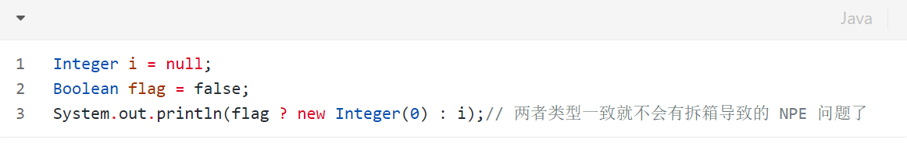
这个问题也在 《阿里巴巴开发手册》中 被提到过。
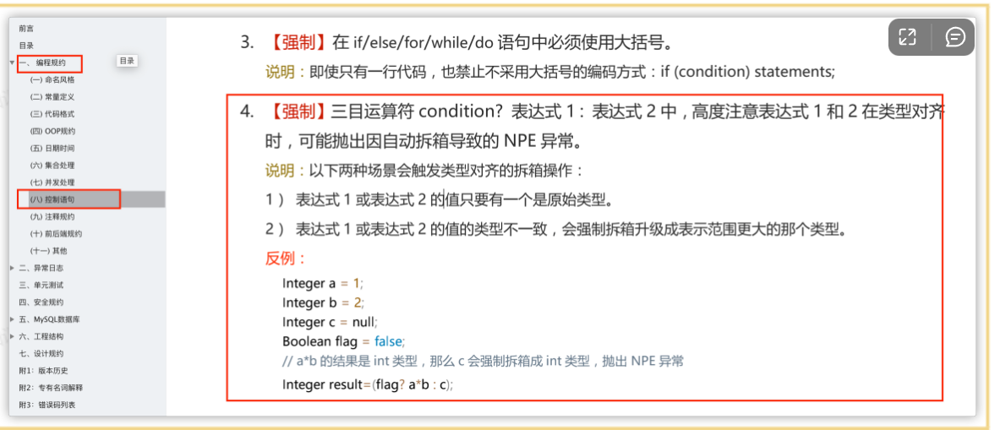
