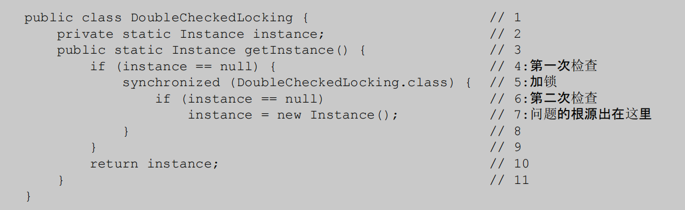

> java 中的 this 当一个对象创建后，Java 虚拟机（JVM）就会给这个对象分配一个引用自身的指针，这个指针的名字就是 this。

## 线程基础

### 线程状态

初始，可运行(分为拿到了 cpu 资源或者等待 cpu 时间片对应于操作系统的运行和就绪态)，阻塞（等待获取锁资源），无限等待（等待其它线程显式地唤醒，否则不会被分配 CPU 时间片），有限等待（超时自动唤醒），终止


> 关于线程等待 Thread.sleep(time)常用一个`线程睡眠`进行描述
> Object.wait() 线程进入等待或者无限等待状态 常用`线程挂起`进行描述
> 睡眠和挂起描述的是行为，阻塞和等待描述的是状态
> 阻塞是被动的而等待是主动的

### 线程常用方法

- sleep( ) 和 wait( ) 的这 5 个区别
  Thread.sleep()不会释放锁资源，Object.wait()会释放锁资源
  sleep 必须传入时间，时间到自动苏醒
  wait 可以不传入时间表示一直阻塞直到 notify 进行唤醒，带时间会自动苏醒当苏醒后立即获得锁便继续执行，否则进入到等待队列中去。
  sleep() 方法没有释放锁，而 wait() 方法释放了锁
  wait() 方法被调用后，线程不会自动苏醒，需要别的线程调用同一个对象上的 notify()，sleep 会自动苏醒
- yield()
  告诉调度器，当前线程愿意放弃 cpu
- interrupt() 调用线程的 interrupt() 方法会设置线程的中断标记，中断标记的作用在于向目标线程发出 中断请求，告知该线程需要停止执行当前任务，并在合适的时机终止执行。它是一种协作机制，用于线程之间的协调和通信。调用 interrupt 不会立即中断线程，只标记当前线程为中断状态，在合适的时机进行实际中断。
  > 因此可以在循环体中使用 interrupted() 方法来判断线程是否处于中断状态，从而提前结束线程。

### 线程和进程的区别

进程：进程是代码在数据集合上的一次运行活动，是系统进行资源分配和调度的基本单位。
线程：线程是进程的一个执行路径，一个进程中至少有一个线程，多个线程共享进程资源。

### 启动线程的方式

继承 Thread 类或者实现 Runable 接口可以重写 run 方法实现线程主体
实现 Callable 接口 需要实现 call 方法实现线程主体，并且可以借助 Future 接口返回线程的执行结果和异常
使用 start（）在处理器中注册线程并执行 run 方法
若只执行 run 方法会相当于执行了 Main 函数的一个方法体 并没有启动真正意义的新的线程。

---

### Volatile 是轻量级同步机制

Volatile 是轻量级同步机制，保证可见性，禁止指令重排、不保证原子性

> 1. 指令重排序：
>    对象分配的过程：1. 分配内存空间即 new 关键字执行 2. 初始化对象即执行构造函数 3. 将对象的引用指向分配的内存空间，即通过 *.*访问对象属性和方法
>    其中 2 和 3 的顺序可以颠倒，致使未初始化的对象引用暴露出来。
> 2. 保证可见性：当变量被 Volatile 修饰后，对一个 Volatile 变量的读，总能看到任意线程对于 Volatile 变量的最后的写入。
> 3. 原子性：
>    单个的 volatile 变量的读写具有原子性，但复合操作不具有。

- 禁止指令重排： 在对这个变量进行读写操作的时候，会通过插入特定的 内存屏障 的方式来禁止指令重排序。

- 如何保证可见性
  volatile 在写操作执行之前会出发 lock 前缀指令。

  1. 将当前处理器中的数据写回到系统内存中去。利用缓存锁定，根据缓存一致性机制阻止多个处理器修改同一内存数据。
  2. 一个处理器的缓存回写到内存会导致其他处理器的缓存无效.

> 处理器数据先从内存中进入到缓存中去，并不直接操作内存 这样提高数据的处理速度。
>
> 1.  总线锁
>     当一个处理器在总线上输出此信号时，其他处理器的请求将被阻塞住，那么该处理器可以独占共享内存。
> 2.  缓存锁： 阻止同时修改由两个以上处理器缓存的内存区域数据

- 不能保证原子性：对于复合操作不能保证原子性

### Volatile 的内存规则和行为

- 写：
  写入一个 volatile 变量后，会将改线程本地内存中的该变量值刷新到共享内存中去
- 读：
  读取一个 volatile 变量，会将本地内存中的该变量旧值设置为无效，并从共享内存中去读取新值。
  通过借助共享内存给桥梁，实现了两个线程之间的通信，保证了读线程能够及时看到写线程对共享变量的修改。

> 锁释放与 volatile 写有相同的内存语义；锁获取与 volatile 读有相同的内存语义
> CAS 操作同时具备 volatile 读和 volatile 写的内存语义，即 CAS 读取共享数据时的过程和 volatile 读过程相同，总是将共享变量读取到内存中去，从而读取到最新值。CAS 的修改数据也会将数据刷新到共享内存中去。

---

## synchronized

- 什么是 Synchronized：这是 Java 控制多线程访问共享资源的一种方式，是线程之间通信的一种方式。

- 什么同步代码块：同步代码块用于阻止多个线程同时对同一方法中的部分代码进行访问。
  理解起来，可以看成同步代码块相当于一个保护共享资源的一块区域，这个区域需要有特定身份的线程才能够进行访问，而这个身份便是锁。

- 什么是锁：锁是一个概念，Java 中任何对象都能够成为一把锁，且只要获得了被同步代码块认可的锁即可访问同步代码块中的共享资源。

一般而言 Synchronized 的形式为

```java
Synchronized(锁){
    //同步代码块
    //这里访问共享资源
}
```

总体而言，Synchronized 修改的地方分为方法和代码块上：
修饰代码块，我们知道锁定的便是代码块中的内容。
修饰方法，则可以分为修饰的是静态方法还是普通方法：

1. 静态方法：静态方法属于类，其锁住的便是整个 Class 对象。只要是同一个类便是同一个锁
2. 普通方法：锁住的是方法调用该方法的对象。只要是同一个类下的同一个方法实例便是同一个锁

- Synchronized 特点
  原子性，有序性，可见性，可重入性，不能禁止重排序

**实现原理**
synchronized 的锁存放于对象头中，其中的 Mark word 标记字段记录了锁的变化，Mark Word 存储对象的 HashCode 分代年龄 锁标志位。

- 加锁和解锁的过程
  通过锁监视器，同一个对象同一时间只与一个 monitor 相关联，当对象尝试获得锁时，monitorenter 会将 monitor 计数器+1，表示占有锁，其他线程在想要需要等待。
  如果该线程继续重入锁，则计数器继续+1.
  锁释放：进过 monitorexit 每次将计数器-1，一直减到 0 表示该线程释放锁。
  如果其他线程获取锁失败，会进去到同步队列进行阻塞，一直到锁被释放才能够尝试获取锁。
  
  对象监视器，同步队列以及执行线程状态之间的关系
- 可重入锁
  统一进程再次获取相同锁的时候不会因为锁未释放而阻塞，会自动获取。

### synchronized 锁升级过程

总结而言： 偏向锁通过对比 Mark Word 解决加锁问题，避免执行 CAS 操作。而轻量级锁是通过用 CAS 操作和自旋来解决加锁问题，避免线程阻塞和唤醒而影响性能。重量级锁是将除了拥有锁的线程以外的线程都阻塞。

jdk1.6 之前的 synchronized 基于进入和退出 monitor 对象来同步代码块。这种锁称为重量级锁，为了提升获得锁和释放锁带来的性能增加了“偏向锁”和“轻量级锁”，锁随着竞争关系不断升级，同时这种锁升级却不能降级。

1. 偏向锁
   当同步代码块中只有一个线程在访问，不存在竞争的情况下，会使用偏向锁来偏向于第一个访问锁的进程，从而达到减少锁释放和获取所消耗的性能。
   偏向锁获取过程如下：

   1. 第一次访问，当前线程进入到同步代码块获得锁时，在对象头和栈帧中存储线程 ID 并设置锁标志位为偏向锁，以后带有相同线程 ID 的线程尝试获取锁时不需要进行加锁和解锁的过程。

   2. 进程访问同步代码块获取锁时，判断对象头中的标志位是否是偏向锁，且线程 ID 是否指向当前线程。若是则直接执行同步代码，否则若线程 ID 未指向当前线程，通过 CAS 竞争将 mark word 中的线程 Id 设置为当前线程之后，指向同步代码块，若竞争失败，会在全局安全点即（在这个时间点上没有字节码正在执行）上对进程进行挂起，偏向锁升级为轻量级锁。

   > 1. 偏向锁的释放，只在其他线程尝试竞争时才会释放。适用于无竞争状态
   >    竞争过程偏向锁是在无锁争用的情况下使用的，也就是同步开在当前线程没有执行完之前，没有其它线程会执行该同步块，一旦有了第二个线程的争用，偏向锁就会升级为轻量级锁，如果轻量级锁自旋到达阈值后，没有获取到锁，就会升级为重量级锁；(旋转的阈值在 1.6 之后引入了自适应阈值，并不是固定的)
   > 2. 这里的 CAS 竞争：它会尝试原子性地将对象头的锁状态从无锁（或其他状态）修改为自己的线程 ID，尝试获取锁的过程中可能会涉及多次循环尝试，直到成功获取锁。如果 CAS 竞争失败，代表当前线程无法直接获得偏向锁，因为有其他线程尝试获取同一个对象的锁

2. 当偏向锁有竞争时会升级为轻量级锁。当进程进入同步代码块中 JVM 在当前线程栈帧中创建存储锁记录的空间用于拷贝对象头的 mark word, 之后使用 CAS 将对象头中的 mark word 替换为指向锁记录的指针，若成功则获得轻量级锁，若失败则表示有竞争继续 cas 自旋操作。
   轻量级锁在释放时将锁记录中的 Mark word 替换会对象头，如果成功表示没有竞争, 失败则表示存在竞争需要进行锁膨胀为重量级锁

> 轻量级锁通过 CAS 自旋获取锁，避免了竞争过程中线程的阻塞，提高了执行效率。但自旋也会消耗 cpu。

### synchronized 和 volatile 有什么区别

synchronized 可以用在方法和代码块上，多用于实现多线程之间的同步，volatile 只能修饰变量，多用于解决变量之间的可见性。volatile 是轻量级的同步实现，能够保证数据的可见性 和 禁止指令重排序不能保证原子性 sys 可以保证原子性和可见性

---

## JMM

### 线程之间的通信

java 线程通根据内存共享（隐形不可见）和消息传递（显示的）来实现
Java 的内存中堆是共享的。通过读写内存的公共状态进行隐式通信
在消息传递的并发模型中通过线程之间的消息传递进行通信。

### Java 内存模型


- JMM 是 Java 内存模型一种规范，屏蔽了各种硬件和操作系统对内存访问的差异，从而在不同平台上达到一致性的内存访问效果，同时也规定了线程和内存之间的关系，线程之间的共享变量 存储在主内存中，每个线程有自己的本地私有内存，其中存储了 主内存中的共享变量的副本，以主内存作为变量共享以及更新的桥梁从而，JMM 控制了 Java 线程之间的通信
  **内存的可见性的实现:smiley:**
- 线程通过 JMM 的通信：
  线程 A 向其他线程发送消息，需要借助共享内存去实现通信，即线程 A 先将自身本地内存中的变量刷到共享内存中去，其他线程在从共享内存中去读取线程 A 更新过的共享变量。
  所以 JMM 控制本地内存和共享变量的交互从而实现了内存的*可见性*。
- 指令的重排序
  Java 源代码到执行过程实现： 1.编译器的重排序，2. 指令的并行重排序，3. 内存系统重排序，最终执行的指令排序。这些重排序可能会导致多线程程序出现内存可见性问题。
  > 1 属于编译器重排序，2 和 3 属于处理器重排序
  > 针对禁止编译器重排序依赖于 JMM 的编译器重排序
  > 针对处理器重排序，依赖于在指令排序之前插入特定的类型的内存屏障

由于处理器对内存的读/写操作的执行顺序，不一定与内存实际发生的读/写操作顺序一致。处理器内部的写缓存对外不可见，且一般都允许进行重排序，从而造成了结果的不一致。
为了保证内存可见性，Java 编译器在**生成指令序列的适当位置**会插入内存屏障指令来禁止特定类型的处理器重排序。

> 相当于在指令位置插入红绿灯，人为的控制指令的执行前后顺序。

- happens-before 原则
  解释操作之间的内存可见性。如果一个操作执行的结果需要对另一个操作可见，那么这两个操作之间必须要存在 happens-before 关系，但并不意味着 A 操作要在 B 操作之前执行，仅仅是 A 操作的结果对 B 可见。
  而 happens-before 的实现来自于 JMM 限制编译器和处理器的重排序优化。
  > MM 可以通过 happens-before 关系向程序员提供跨线程的内存可见性保证

---

## 重排序

重排序遵循数据依赖性，不改变存在依赖的数据执行顺序
**对单线程的影响**

- as-if-serial，单线程下对存在控制依赖的操作重排序，不会改变执行结果

  > 控制依赖：如 if-else while 等判断

  **对多线程的影响**
  在多线程程序中，对存在控制依赖的操作重排序，可能会改变程序的执行结果。通过 happens-before 完成对多线程内存可见性的保证。

---

## 顺序一致性模型

在顺序一致性模型中，系统中的所有处理器都能够看到相同的、全局一致的操作序列。

- 什么是数据竞争
  多个线程未同步且同一个变量进行读写操作

- 顺序一致性模型的特点
  1. 一个线程中的所有操作必须按照程序的顺序来执行
  2. 每个操作对所有线程来说都是原子执行的，并且操作的结果对所有线程都是立刻可见的
     顺序一致性模型中，所有操作完全按程序的顺序串行执行

---

## 锁


### 说说乐观锁和悲观锁

乐观锁与悲观锁是一种广义上的概念，体现了看待线程同步的不同角度
悲观锁：在对共享数据操作的过程中，认为每次对数据的使用过程中都会有其他线程试图修改数据，所以在每次的线程访问时都需要加锁，其他线程的操作只能等待。可以使用 synchronized 关键字或 Lock 类来实现悲观锁。适合于写操作较多的场景。（数据库的行锁和表锁）

乐观锁：认为线程在访问共享资源时候，不会有其他线程试图修改数据，只在数据更新时候去检查是否有其他线程修改了数据。 由无锁编程实现，适合于读多写少的场景，使用版本号或者 cas 实现

#### CAS

对比交换，是一条 cpu 原子指令，解释为：CAS 操作输入一个操作前的旧值和想要更新的新值，在操作期间若旧值没有变化，则更新，否则不更新。也因为 CAS 是原子操作，并发时不需要使用锁，也因为是无锁机制，cas 是乐观锁的一种
_CAS 三大问题_

- CAS 的 ABA 问题
  CAS 检查旧值无法判断旧值的变化次数，假如旧值 A 在检查前变为 B 又变为 A，CAS 无法知道旧值已经发生了变化。对于次，我们可以添加版本号，每次变量更新时都将版本号+1
- 循环时间长开销大
  自旋情况下回消耗 cpu 资源
- 只能保证一个共享变量的原子操作
  是对多个共享变量操作时，循环 CAS 就无法保证操作的原子性，这个时候就可以用锁

### 自旋锁 VS 适应性自旋锁

为什么需要自旋锁：锁在切换线程过程中，需要对线程进行阻塞或者唤醒，这中间需要 cpu 状态切换完成，资源消耗非常明显，而对于锁定时间很短的同步资源而言，利用系统级的阻塞和唤醒花费的时间要明显大于其锁定时间，因此在多处理器中我们让想要获取锁的线程稍微等待一下，不要进入阻塞状态而继续占有 cpu，让占有锁的线程释放锁之后去直接获取锁。
这其中的“等待一会”便是线程的自旋操作，但自旋也有时间限制，要求要小于系统对线程切换的时间，防止得不偿失，白白占用 cpu 资源，一般当自旋超过 10 次（默认）便需要考虑阻塞。

适应性自旋锁：为了更灵活的使用自旋锁，减少在占有锁的进程中在自旋进程刚刚自旋完就释放锁的情况，自适应自旋锁将根据上一次锁自旋时间和对应锁占有者释放情况控制当前锁自旋次数。若上一次成功获得过锁，会增加自旋次数，反之认为获得锁的概论小而减少自旋时间。

### ReentrantLock

可以实现公平锁（默认）和非公平锁，

内部维护了表示锁占用状态的 state 变量，当同一个线程来获取锁时，state 会+1 并
继续获得锁，依次达到锁可重入效果，同时若获取失败进入到 CLH 队列中等待，ReentrantLock 释放锁的次数和重入锁的次数相同才能够释放。

### AQS

用来构建锁和同步器的框架。AQS 是将每条请求共享资源的线程封装成一个 CLH 锁队列的一个结点(Node)来实现锁的分配。使用 volatile 修饰变量 state 表示同步状态，同时当资源被占用时，线程会使用 CLH 锁实现线程的阻塞和分配。

---

## 双重校验锁

- 版本 1
  
  B 线程执行到 2 时候，为完成初始化，此时 A 依旧会向下走，从而创建多个初始化对象
- 版本 2
  
  在创建对象的方法上同步锁，会使得其他线程阻塞，而消耗资源
- 旧版的双重校验锁
  
  当找不到对象引用时候，会进行加锁。当 A 线程走到 7，其中出现了对创建对象的重排序，使得先完成对象内存空间的分配，在进行初始化对象，而 B 线程访问 4 时知道对象不为 null，会去访问 instance 但此时 instance 还未创建完成，从而访问一个未初始化的对象。因此我们需要在创建对象的时候禁止 JMM 的重排序。
- 双重校验锁

  ```java
  public class Singleton {
  private volatile static Singleton uniqueSingleton;

      private Singleton() {
      }

      public Singleton getInstance() {
          if (null == uniqueSingleton) {
              synchronized (Singleton.class) {
                  if (null == uniqueSingleton) {
                      uniqueSingleton = new Singleton();
                  }
              }
          }
          return uniqueSingleton;
      }

  }
  ```

- 静态内部类初始化
  

---

### 线程池

好处：

1. 降低资源消耗。通过重复是利用资源降低线程创建和销毁造成的消耗
2. 提高响应速度。任务到达线程池中不需要等待即可执行任务
3. 提高线程的可管理性。利用线程池对线程的分配和调优监控，做到合理的管理线程

线程池工作流程：
当提交过来一个线程后
线程池判断当前运行的线程数小于核心线程数，则启动一个新的线程处理任务
若核心线程数达到最大值后，**任务会被放入等待队列中进行排队**。
若等待队列达到最大值，此时判断线程池中的非核心线程数+核心线程数是否达到最大线程数量 若没达到则创建线程来处理等待队列中的任务。否则任务进入到拒绝策略中。
线程从等待队列中取任务执行，执行完毕后在超过非核心线程的最长等待时间会，且当前线程数超过核心线程数会被关闭。

#### 创建线程池的方式

通过 Executors 创建
通过 ThreadPoolExecutor 手动创建线程池。

- 线程池参数
  核心线程数
  最大线程数
  非核心线程数空闲时间
  时间单位
  等待队列
  线程工厂
  拒绝策略

* 等待队列
  有界队列：
  - ArrayBlockingQueue 按照先进先出排序 数组实现
  - LinkedBlockingQueue 链表实现 可设置容量 不设置容量为无限队列容量 Integer.MAX_VALUE
  - DelayQueue 延迟队列 执行定时周期任务的队列
    无界队列
  - PriorityBlockingQueue 优先级队列
* 拒绝策略
  AbortPolicy ：直接抛出异常，**默认**使用此策略
  CallerRunsPolicy：用调用者所在的线程来执行任务，哪来回哪去
  DiscardOldestPolicy：丢弃阻塞队列里最老的任务，也就是队列里靠前的任务，把最前面的挤掉
  DiscardPolicy ：当前任务直接丢弃。

### 线程池重启后的任务

此时应用重启了，那么这些任务将会丢失

### 核心线程数可以大于最大线程数吗

不可以

### 拒绝策略

### 为什么阿里规范不能用 Executors 创建

`线程池不允许使用 Executors 去创建，而是通过 ThreadPoolExecutor 的方式，这样的处理方式让写的同学更加明确线程池的运行规则，规避资源耗尽的风险`

使用 Executors 创建出来的常见线程池有

- newFixedThreadPool 固定线程数的线程池，其阻塞队列是无界队列会产生 OOM
- newCachedThreadPool 没有限制线程的数量会消耗大量的资源
- Executors.newSingleThreadExecutor()方法创建的线程池只有一个工作线程，在线程异常终止后会创建新的线程替代，使得消耗大量的系统资源
- 同时 Executors 类隐藏了线程池的一些细节，例如线程池的最大容量、队列类型等，这可能导致在某些情况下无法满足特定的需求，例如需要限制线程池的大小或者使用特定类型的队列。

#### 线程池 submit 和 execute 方法的区别

submit 会返回线程执行的异步结果 future 对象 根据 future 对象可以判断是否执行成功
execute 用于提交不需要返回值的任务

#### 线程池的关闭

shutdown() 将线程池状态置为 shutdown,并不会立即停止，任务不能继续提交，直到线程池内部处理完成才结束
shutdownNow()能立即停止线程池，正在跑的和正在等待的任务都停下了

### ConcurrentHashMap

并发环境下 hashMap 会产生环形链造成死循环。而 hashTable 的同步方法会阻塞其他线程的访问进去等待状态，效率底下。ConcurrentHashMap 是并发效率高的 hashMap 能够
证线程安全的同时又能保证高效的操作。
ConcurrentHashMap 使用了分段锁技术来提高 Hash table 中的访问问题，在写操作时通过使用分段锁技术对操作段加锁而不影响其他段的操作。
1.8 之前是使用分段锁技术，即由 Segment 和 HashEntry 实现，每个 segment 包含了 HashEntry 数组，当线程进行并发写时，只锁定具体的 segment，不涉及其他 segment。默认的 Segment 长度是 16。
put：根据插入的 key 计算 hash 确定对应的 segment，若 segment 不为空则使用 ReentrantLock 进行加锁，若锁获取失败则自旋，当拿到锁后遍历 entry 数组并若 key 相同则替换，不同则插入。
1.8 之后使用 Node 数组+链表+红黑树的方式实现并发安全。
put:计算 hash 确定对应的 node 若为空则 CAS+自旋进行初始化并写入数据，否则使用 synchronized 写入数据并判断链表长度大于 8 则树化，否插入到链表末尾。

### ConcurrentHashMap 为什么 key 和 value 不能为 null

因为 null 值由二义性，在并发条件下无法确定 null 到底是一个键或值不存在，还是真正的 null 值，不能够很好的保证并发情况下的安全。

> HashMap key 和 value 可以 null 因为 HashMap 本身不是线程安全的不需要设计到并发安全问题

### key 为什么不能为 null

Java 的集合框架通常禁止键或值为 null，以确保编程规范的一致性。null 无法散列不能确定 hash 位置

### ThreadLocal

本地线程变量，访问改变量的线程都会有一个本地拷贝，从而线程操作该变量的时候实际上是操作自己内存中拷贝，从而实现线程隔离的效果。实际上是个 map 集合
ThreadLocal 主要用来保存用户信息的上下文，这样多线程用户访问的各个请求会根据 ThreadLocal 的数据确定具体的用户

- 内存泄露的问题
  如果 ThreadLocal（ThreadLocalMap 的 Key）被垃圾回收器回收了，但是 ThreadLocalMap 生命周期和 Thread 是一样的，它这时候如果不被回收，就会出现这种情况：ThreadLocalMap 的 key 没了，value 还在，这就会造成了内存泄漏问题。
  我们需要在 ThreadLocal 用完后对其进行回收 remove

---

参考链接：https://pdai.tech/md/java/thread/java-thread-x-lock-all.html
