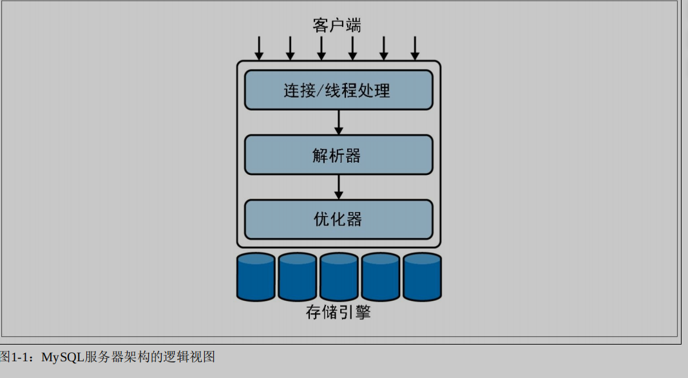
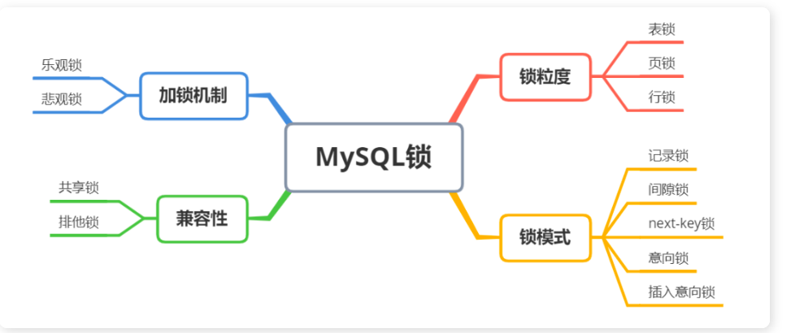
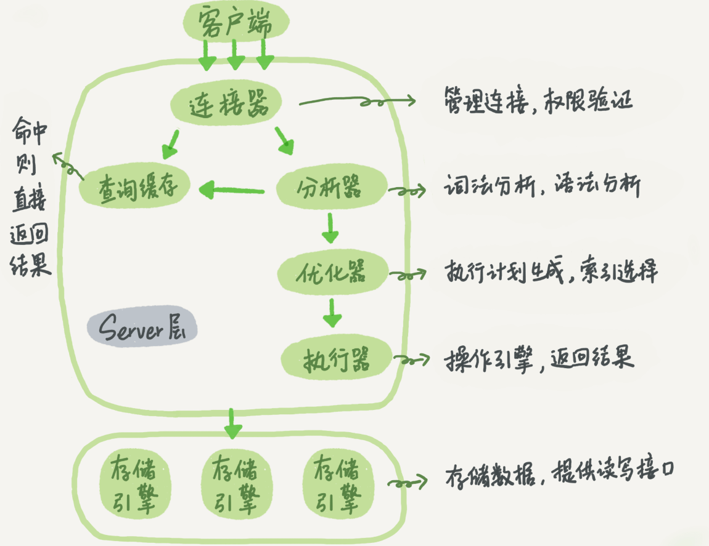

# MySQL 主要内容整理（高性能 MySQL）

---

## MySQL 基础架构



1. 最上层的客户端所包含的服务并不是 MySQL 独有的，大多数基于网络的客户端/服务器工具或服务器都有类似的服务，包括连接处理、身份验证、确保安全性等。
2. 第二层包含了大多数 MySQL 的核心功能，包括查询解析、分析、优化、以及所有的内置函数（例如，日期、时间、数学和加密函数），所有跨存储引擎的功能也都在这一层实现：存储过程、触发器、视图等。

   > 在旧版本中，MySQL 可以使用内部查询缓存（query cache）来查看是否可以直接提供结果。但是，随着并发性的增加，查询缓存成为一个让人诟病的瓶颈。从 MySQL 5.7.20 版本开始，查询缓存已经被官方标注为被弃用的特性，并在 8.0 版本中被完全移除。

3. 第三层是存储引擎层。存储引擎负责 MySQL 中数据的存储和提取。存储引擎层还包含几十个底层函数，用于执行诸如“开始一个事务”或者“根据主键提取一行记录”等操作。但存储引擎不会去解析 SQL，不同存储引擎之间也不会相互通信，而只是简单地响应服务器的请求。

### 并发控制

- 锁



- 表级锁：开销小，加锁快；不会出现死锁；锁定粒度大，发生锁冲突的概率最
  高，并发度最低。
- 行级锁：开销大，加锁慢；会出现死锁；锁定粒度最小，发生锁冲突的概率最
  低，并发度也最高。
- 页面锁：开销和加锁时间界于表锁和行锁之间；会出现死锁；锁定粒度界于表
  锁和行锁之间，并发度一般

Innodb 默认支持行级锁，相比于 MyISAM 的表级锁而言更加细腻，对于并发事务的读写而言性能更高，行级锁的分类分为：间隙锁，临键锁，记录锁，
处理并发读/写访问的系统通常实现一个由两种锁类型组成的锁系统。这两种锁通常被称为共享锁（shared lock）和排他锁（exclusive lock），也叫读锁（read lock）和写锁（write lock）。其中资源上的读锁是共享的，或者说是相互不阻塞的。多个客户端可以同时读取同一个资源而互不干扰。写锁则是排他的，也就是说，`一个写锁既会阻塞读锁也会阻塞其他的写锁`。
锁定策略是锁开销和数据安全性之间的平衡，这种平衡会影响性能

- 表锁
  表锁（table lock）是 MySQL 中最基本也是开销最小的锁策略。它会锁定整张表。当客户端想对表进行写操作（插入、删除、更新等）时，需要先获得一个写锁，这会阻塞其他客户端对该表的所有读写操作。只有没有人执行写操作时，其他读取的客户端才能获得读锁，读锁之间不会相互阻塞。
- 行锁
  使用行级锁（row lock）可以最大程度地支持并发处理（也带来了最大的锁开销）。行锁只锁定特定行而不影响其他行的读写操作，但系统也需要花费更多的开销监控这些行级锁、锁定的时间、锁定类型以及何时清理不需要的行锁。行级锁是在存储引擎而不是服务器中实现的
- 事务
  事务就是一组 SQL 语句，作为一个工作单元以原子方式进行处理，事务中的那些语句要么全部执行要么全部失败。事务遵循 ACID 特性
  > 事务的实现：事务隔离性由锁来实现。原子性、致性、持久性通过数据库的 redolog 和 undo log 来完成。redo log 称为重做日志，用来保证事务的原子性和持久性。
- 日志
  重做日志用来实现事务的持久性，即事务 ACID 中的 D。
  其由两部分组成：
  一是内存中的重做日志缓冲（redo log buffer），其是易失的；
  二是重做日志文件（redo log file），其是持久的。

## 多版本并发控制

- 隔离级别：
  
  READ UNCOMMITTED（读未提交）在事务中可以查看其他事务中还没有提交的修改
  `读取未提交的数据，也称为脏读`
  READ COMMITTED（读已提交）B 事务只能看到 A 事务提交之后的数据和修改。这个级别会产生`不可重复读问题`，因为 B 事务在 A 事务修改前后读取的数据可能会不一致，这意味着同一事务中两次执行相同语句，可能会看到不同的数据结果
  REPEATABLE READ（可重复读）MYSQL 默认隔离级别，保证了在同一个事务中多次读取相同行数据的结果是一样的，解决了不可重复读问题。但不能解决幻读：当 A 事务在读取某个范围内的记录时，另外一个事务 B 又在该范围内插入了新的记录，当 A 事务再次读取该范围的记录时，会产生幻行。
  SERIALIZABLE（可串行化）

> 幻读：可重复读隔离级别下，是存在幻读的问题：
> Innodb 引擎为了解决「可重复读」隔离级别下的幻读问题，就引出了 next-key 锁，它是`记录锁`和`间隙锁`的组合。
> `Record Lock`，记录锁，锁的是记录本身；
> `Gap Lock`，间隙锁，锁的就是两个值之间的空隙，以防止其他事务在这个空隙间插入新的数据，从而避免幻读现象。

innodb MVCC 主要是为 Repeatable-Read 事务隔离级别做的。在此隔离级别下，A、B 客户端所示的数据相互隔离，互相更新不可见
MVCC 是行锁的变种，他在很多时候避免了加锁操作，大多时候可以实现非阻塞的读操作，写操作也只锁定特定的行因此细腻度更好，开销更低。
MVCC 的实现是通过保存数据的某个时间点的快照来实现的，因此不管执行多长时间，每个事务看到的数据都是一致的。根据事务开始的时间不同，每个事务对同一张表，且同一时刻看到的数据是不一样的。

InnoDB 中的 MVCC 设计： 在每条记录后面保存两个隐藏的列来实现，保存了行的创建时间和行的过期时间。（实际存储时候将系统版本号替代时间）每开始一个事务系统版本号会自动递增。

SELECT
确定行创建时间： InnnoDB 查找版本早于当前的事务版本的数据行，以确保当前事务读取的数据不晚于当前事务开始时间，
确定行删除时间：要么行删除版本未定义要么大于当前事务开始时间，确保事务读取的行在事务开始之前存在

> 确定了行创建时间和删除时间均符合要求才能够进行返回结果；

INSERT
新插入的每一行保存当前系统版本号作为行版本号
DELETE
删除的每一行保存当前的系统版本号作为行删除版本号
UPDATE
插入一行新的记录，保存当前系统版本号作为行版本号，同时保存当前系统版本号到原来的行作为删除标识。

https://pdai.tech/md/db/sql-mysql/sql-mysql-mvcc.html

## 索引

### 说一下索引实现

MySQL 的默认存储引擎是 InnodB,innodb 默认的索引结构为 B+树，B+树只有叶子节点才存储数据，非叶子节点存储键值，指向了索引的方向。叶子节点的结构为`双向有序的数据链表`，因此他可以进行范围查找。同时 B+树一个节点可以存储多个孩子，使得 B+树显得更加矮胖，从而 B+树可以减少磁盘的查询次数并且不同于普通的二叉树，只需要遍历一次就可以得到所有的叶子数据，从而提高查找效率。

### 为什么使用 B+树

B+树：只有叶子节点才会存储数据，非叶子节点只存储键值，指向索引方向。叶子节点之间使用双向指针连接，最底层的叶子节点形成了一个双向有序链表,可以进行范围查找，同时为了维护底层叶子的有序性，在插入和删除时候需要对索引进行维护涉及到页面分裂和页面合并等操作。


> 为什么不用普通二叉树？

普通二叉树存在退化的情况，如果它退化成链表，相当于全表扫描。平衡二叉树相比于二叉查找树来说，查找效率更稳定，总体的查找速度也更快。

> 为什么不用平衡二叉树呢？

平衡二叉树每个节点只存储一个键值和数据的，B+树可以存储多个，同时树的高度也会更低那么对应的查找磁盘的次数也会少，

> 为什么用 B+ 树而不用 B 树呢

B+Tree 的磁盘读写能力相对于 B Tree 来说更强，IO 次数更少，B+Tree 永远是在叶子节点拿到数据，不需要遍历整个树就能拿到所有数据，所以 IO 次数是稳定的，叶子节点按照顺序排序，B+树的排序能力更强

### Innodb 索引

索引，在 MySQL 中也叫作键（key）
优点：
● 索引大大减少了服务器需要扫描的数据量。
● 索引可以帮助服务器避免排序和临时表。
● 索引可以将随机 I/O 变为顺序 I/O。

- 分类
  B-Tree；B-tree 通常意味着所有的值都是按顺序存储的，并且每一个叶子页到根的距离相同。B-tree 是按照索引列中的数据大小顺序存储的，所以很适合按照范围来查询

索引类型分为`主键索引`（`聚簇索引`）和`非主键索引`（`二级索引`）。

> 非叶子节点包含了索引列和一个指向下级节点的指针

- 聚簇索引：聚簇索引的叶子节点存的是整行数据。术语“聚簇”表示数据行和相邻的键值紧凑地存储在一起。因为无法同时把数据行存放在两个不同的地方，所以一个表只能有一个聚簇索引（不过，覆盖索引可以模拟多个聚簇索引的情况）。InnoDB 根据主键聚簇数据，如果你没有定义主键，InnoDB 会选择一个唯一的非空索引代替。如果没有这样的索引，InnoDB 会隐式定义一个主键来作为聚簇索引。
- 二级索引：非主键索引的叶子节点内容是主键的值。这意味着通过二级索引查找行，存储引擎需要找到二级索引的叶子节点，以获得对应的主键值，然后根据这个值去聚簇索引中查找对应的行。这里做了双倍工作：两次 B-tree 查找而不是一次。使用主键值作为指针会
  让二级索引占用更多的空间，换来的好处是，InnoDB 在移动行时无须更新二级索引中的
  这个“指针”。

索引的主键不要使用 UUID 这样随机的主键值，它使得插入变得完全随机，且数据本身没有聚簇特性 。写入的数据不能按照顺序进行插入，需要耗费大量时间寻找合适的位置，且可能导致频繁的页分裂

> 使用 InnoDB 时应该尽可能地按主键顺序插入数据，并且尽可能地按照单调增加的聚簇键的值顺序插入新记录。

### 覆盖索引

> 覆盖索引不等同于二级索引

如果一个索引包含（或者说覆盖）所有需要查询的字段的值，我们就称之为覆盖索引，即不需要进行回表操作。在一个覆盖索引中，如果索引是针对 (age, id, username) 创建的，那么叶子节点存储了按照 age 排序的索引列值，并且还包含了每个索引行对应的 id 和 username 列的值。当执行覆盖查询时，数据库引擎可以直接从这些叶子节点中获取所有需要的列值，从而避免了额外的数据页访问，提高了查询效率。

> EXPLAIN 的 Extra 列可以看到“Using index”的信息，表示使用了覆盖索引

### 索引分类

根据叶子的内容索引分为主键索引和非主键索引（只在叶子节点存放主键信息）

> 如果我执行 `select * from T where k between 3 and 5`，需要执行几次树的搜索操作，会扫描多少行？其中 k 是非聚簇索引

- 查询过程
  现在非聚簇索引中查找 3 得到对应的主键，到聚簇索引中找到主键对应的行数据（第一次回表）
  现在非聚簇索引中查找 5 得到对应的主键，到聚簇索引中找到主键对应的行数据（第二次回表）
  在 k 索引树取下一个值 k=6，不满足条件，循环结束(第三次查询)。
  > 可以看到，这个查询过程读了 k 索引树的 3 条记录，回表了两次。在这个例子中，由于查询结果所需要的数据只在主键索引上有，所以不得不回表。

### 索引创建的注意

- 索引建立在查询频繁的字段上
- 维护索引需要成本，索引的数量应该合适
- 选择区分度高的字段作为索引
- 组合索引时将区分度高的放在前面
- 需要频繁更新的字段不适合作为索引
- 不建议用无序的值(例如身份证、UUID )作为索引

> .优化器怎么去看索引的区分度
> 一条语句可能命中多个索引，而优化器会选择合适的索引以最小的代价执行命令，我们使用 show index from table 可以查看索引的基数，即 Cardinality 字段的数字，基数越大反应了索引的区分度越大

### 索引优化

- sql 语句修改为`select ID from T where k between 3 and 5`，这时只需要查 ID 的值，而 ID 的值已经在 k 索引树上了，因此可以直接提供查询结果，不需要回表。也就是说，在这个查询里面，索引 k 已经“覆盖了”我们的查询需求，我们称为`覆盖索引`，避免了回表。
- 由于`覆盖索引`可以减少树的搜索次数，显著提升查询性能，所以使用覆盖索引是一个常用的性能优化手段。
  > `索引下推优化`能减少回表查询次数，提高查询效率。
  > 索引下推的下推其实就是指将部分上层（Server 层）负责的事情，交给了下层（引擎层）去处理。使用索引下推当被索引的列为判断条件时，先一步 过滤出符合条件的数据没，减少了回表的次数，Innodb 索引的数据和索引在一起不存在回表，也就是说只有二级索引可以使用索引下推

### 范式

### 当一个查询语句同时出现了 where、group by、having 和 order by 、join 时，执行顺序如下

查表- 选字段 - 对字段分组- 过滤-筛选-排序

- from join 先执行得到关联的表
- WHERE 子句：首先执行 WHERE 子句，提取满足条件的记录。
- GROUP BY 子句：然后按照 GROUP BY 子句中指定的列进行分组，一般结合分组聚合函数 COUNT、MAX、SUM 等在 select 中对分组进行过滤。
- HAVING 子句：分组后接着使用 HAVING 子句进行过滤保留符合条件的分组。
- SELECT 子句：接着执行 SELECT 子句，选择需要显示的列。
- ORDER BY 子句：最后根据 ORDER BY 子句中指定的列对结果进行排序。
  > having 只能用在 group by 之后
  > where 肯定在 group by 之前
  > 注意若选取的列名和关键字相同 用""包起来表示别名

### 一条 SQL 查询语句在 MySQL 中如何执行的



1. 查询缓存：连接器和客户端建立连接后，查询数据库缓存，如果之间执行过同样的语句则直接从内存中读取结果（执行缓存失效的情况非常频繁，MySQL8.0 后取消 ）
2. 词法分析：没有命中缓存，将解析 sql 语句为执行做准备，需要先用分析器进行词法和语法分析，判断语句是否正确。
3. 优化器优化：将正确的 sql 语句进行优化，如是否使用索引，查询表的顺序等等
4. 执行：最后通过执行器去执行语句，返回执行结果

### MySql 的存储引擎

mysql 主要分为两种存储引擎，分别是 MylSAM 和 Innodb。两者的区别在于 MyIsm 只支持表锁且索引的为非聚簇索引结构为 B 树，而 innodb 引擎支持行锁，且支持聚簇索引，innodb 索引结构为 B+树

### 如何查看执行计划

https://tobebetterjavaer.com/sidebar/sanfene/mysql.html#_26-%E6%80%8E%E4%B9%88%E7%9C%8B%E6%89%A7%E8%A1%8C%E8%AE%A1%E5%88%92-explain-%E5%A6%82%E4%BD%95%E7%90%86%E8%A7%A3%E5%85%B6%E4%B8%AD%E5%90%84%E4%B8%AA%E5%AD%97%E6%AE%B5%E7%9A%84%E5%90%AB%E4%B9%89
执行计划中的 key 列显示了使用的索引名称
Extra 中的 using index 表明了使用了覆盖索引

### 锁

### Innodb 行锁的实现

行锁是细腻度最小的锁，相比于表锁和页面锁发生冲突的可能性最低。根据查询语句的限定行锁由记录锁、间隙锁和临建锁实现例如：
当使用唯一索引进行等值查找，例如 select \* from user where id=9 时，innodb 会使用记录锁将 id=9 的数据进行加锁。而当使用 等值或者范围查询时例如 select \* from t where id > 1 and id < 6 for update 会及将 id 在 1-6 范围内的数据使用间隙锁进行加锁。select \* from t where id > 1 and id <= 6 for update 当查询数据区间在 1-6 且包含边界时，即命中了部分 记录例如（13456） 时会利用记录锁加锁同时将 1-5 之间的数据使用间隙锁进行加锁，防止其他事务在间隙中插入新行，这种结合记录锁和间隙锁的方式成为临键锁
而当使用唯一索引并匹配到了记录时，临建锁会退化为记录锁，

## 死锁

### MySQL 的乐观锁和悲观锁实现

### 表跟表是怎么关联的

外键

- 内连接和外连接
  内连接：返回两个表的公共部分
  全连接：在两张表进行连接查询时，返回左右表的所有行，没有就填充 null,MySQL 不支持全外连接，所以只能采取关键字 UNION 来联合左、右连接
  左外连接：在两张表进行连接查询时，会返回左表所有的行，和右表中连接字段相等的记录，右表中不符合的记录填充为 null
  右外连接：在两张表进行连接查询时，会返回右表所有的行，和左表中连接字段相等的记录 不符合搜索条件的地方均为 NULL。

### 慢查询优化

查看慢查询 使用 MySQL 的慢查询日志定位问题语句
优化：

1. sql 语句本身：
   是否使用了不必要的列，是否指定了查询的范围，
   索引是否失效查询执行计划，是否是进行了全表扫描，查看是否正确使用了索引，索引是否可以使用到覆盖索引，使用联合索引是否成功等方面
2. 数据表是否是

### sql 性能优化

从三个方面进行回答
1、数据库设计；
2、索引设计；
3、查询优化；

- 数据库设计 尽量使用不使用 NULL 尽可能使用 NOT NULL
  使用 VARCHAR 替代 CHAR
- 索引的正确使用

### 是否使用了索引

show index from table
select 语句查看执行计划 explain 根据执行计划中的列 type 显示关联类型或访问类型
如果是 ALL 则是全表扫描，Key 列中会显示实际使用的索引。查看 Extra 列 == Using index：表示 MySQL 将使用覆盖索引，避免了回表

### 索引失效的情况

- 查询条件中包含了 or
- 包含了 like 通配符，当使用了 where name like "xxx%",依旧会匹配首字母并利用查找找到何时的数据因此，索引不会失效，同时使用的左模糊匹配（"%xx"）不一定执行全表扫描，若查询的数据在二级索引中，则只会遍历二级索引树不会回表。（覆盖索引）
- 索引列中使用了 mysql 内置函数，对索引列进行了运算
- 索引字段上使用了！= <>
- 未正确使用联合索引，使用了非最左匹配
- 列类型不匹配
- 表很小 mysql 认为查询全表的效率更高时

### 多个单列索引

在一张表中建立多个单列索引 A、B,查询条件 A=1and B=2 时索引的优化器会选择如何使用索引最高效，因此虽然两个索引都可以用但是若只选择一个索引查询效率更加高效也只选择一个索引，若是在 mysql5.7 版本后并且 INnnoDB 索引中使用 OR 会将两个索引都用上

> 多个单列索引在多条件查询时优化器会选择最优索引策略，可能只用一个索引，也可能将多个索引全用上！ 但多个单列索引底层会建立多个 B+索引树，比较占用空间，也会浪费一定搜索效率，故如果只有多条件联合查询时最好建联合索引！

### 联合索引失效

建立索引 create index tb on table(a,b,c)
联合索引失效的场景 查询 a=1 c=2 b=2 这样的查询顺序会失效吗
不会失效，查询优化器会自动优化
原因：
`alter table `test` add index search(a,b,c,d)`建立联合索引 a b c d
联合索引遵循最左匹配原则，mysql 会一直向右匹配直到遇到范围查询(>、<、between、like)就停止匹配，当 a>2 时即使 a 为最左匹配同样不能使用索引，当查询 b=2 c=2 时候未使用最左匹配 不能使用索引。其中使用=和 in 时 abcd 的索引无论为顺序还是乱序，查询优化器会自动优化可识别的形态

> 联合索引必须按照顺序使用，类似电话簿中的查询，若不知道姓，那查询起来将毫无用处，

当建立一个联合索引 (a,b,c,d) 时，查询条件 a, b, c, d 的顺序不会影响是否使用索引。
https://blog.csdn.net/qq_35275233/article/details/87888809

https://blog.csdn.net/Abysscarry/article/details/80792876

### Mysql 日志

binlog 二进制日志 记录数据库所有的更改操作，主要用于数据的备份和恢复
redo log 重做日志 保存了事务的持久性 用于数据宕机后的数据恢复
undo log 回滚日志 保证了事务的原子性，用于事务的回滚和 MVCC

redo log undo log 是 mysql 中 innodb 引擎独有的
当数据库宕机后，mysql 根据 redolog 进行恢复数据库，保持数据的持久性。记录了数据提交后的数据状态

undo log 回滚日志 记录了在事务提交之前的数据状态

1. 在事务为提交之前 记录数据到 undo log 中去 当事务回滚时根据 undo log 进行回滚、
2. 实现 MVCC 通过 Read view +undo log 实现 MVCC

### 手写个 sql 死锁，如果字段非索引会发生死锁吗

begin
update user set age= 1 where id=1;

begin
update user set age =1 where id =2;
此时两个事务均为提交获取到各自的排他锁
事务 1 执行
update user set age = 3 where id = 2;
事务 1 会一直等待释放
update user set age = 2 where id =1;
2 等待 1 释放 进入死锁

### 如何判断是否使用了索引

利用执行计划 explain 查看查询语句的执行计划 查看其中的 type 字段是否使用了索引
查看表是否有索引 使用 show index from table 的命令

---

## mysql 题目

## 聚合函数 having group by 的使用场景

聚合函数在 SQL 中用于对数据进行统计和分组计算，而 HAVING 子句通常与 GROUP BY 子句一起使用。HAVING 子句允许对分组后的结果进行筛选，仅返回满足特定条件的分组。

## 当一个查询语句同时出现了 where、group by、having 和 order by 、join 时，执行顺序如下

查表- 选字段 - 对字段分组- 过滤-筛选-排序

- from join 先执行得到关联的表
- WHERE 子句：首先执行 WHERE 子句，提取满足条件的记录。
- GROUP BY 子句：然后按照 GROUP BY 子句中指定的列进行分组，一般结合分组聚合函数 COUNT、MAX、SUM 等在 select 中对分组进行过滤。
- HAVING 子句：分组后接着使用 HAVING 子句进行过滤保留符合条件的分组。
- SELECT 子句：接着执行 SELECT 子句，选择需要显示的列。
- ORDER BY 子句：最后根据 ORDER BY 子句中指定的列对结果进行排序。
  > having 只能用在 group by 之后
  > where 肯定在 group by 之前
  > 注意若选取的列名和关键字相同 用""包起来表示别名

### sql 语句编写顺序

```sql
SELECT column1, column2
FROM table
WHERE condition
GROUP BY column
HAVING condition
ORDER BY column
LIMIT number;
```

计算时间差

```SQL
TIMESTAMPDIFF(unit, start_date, end_date)  计算时间差
unit：HOUR（小时）
DAY（天）
WEEK（周）
MONTH（月）
```

USING 是用于指定连接条件的关键字，通常用于 JOIN 操作中,连接条件是基于列名的相等匹配

```sql
JOIN table2 USING (column_name);
```

使用 ON 语法时，连接条件是基于一个或多个列之间的逻辑表达式，可以使用比较运算符（如等于、大于等）

```sql
JOIN table2 ON table1.column_name = table2.column_name;
```

```sql
year(列名)=时间 提取年份为指定时间的列
```

```sql
group by 子句后面的列名指定了用于分组的列。所有具有相同值的行会被分为同一组
```

```sql
avg(col)计算指定列的平均值
```

```sql
IF(condition, value_if_true, value_if_false)
```

```sql
ROUND(number, decimals)四舍五入
```

连接字符

```sql
CONCAT(string1, string2, ...)其中，string1、string2 等是要连接的字符串参数。你可以根据需要提供多个参数。
```

limit

```sql
limit和OFFSET 使用 OFFSET 子句用於指定返回結果的起始位置

```

count 去重 注意不需要,分割

```sql
SELECT COUNT(DISTINCT column_name)
FROM table_name;
```

case where 表达式
CASE WHEN 表达式可以灵活地在 SELECT 查询、WHERE 条件和 ORDER BY 子句等部分中使用，以满足特定需求。

```sql
SELECT name, age,
    CASE
        WHEN age < 18 THEN '未成年'
        WHEN age >= 18 AND age < 60 THEN '成年'
        ELSE '老年'
    END AS age_group
FROM users;
```

---

## MyBatis

### #{}和${}的区别

`#{}`：Mybatis 在处理#{}时，是预编译处理，将参数以带引号的占位符的方式填充，能够防止 sql 注入。
${}：是字符串替换，会将 SQL 中的${}替换成变量的实际值。
使用#{}可以有效的防止 SQL 注入，提高系统的安全性。无论内容是什么，都以普通字符串参数去解析

- 使用${}的场景
表名作参数时或者使用Order by  group by 等需要列名的解析的场景，必须使用${} 若使用#{}会以字符串的形式替换造成列名包含引号产生错误

> SQL 注入 在字符串中注入 SQL 语句，并在执行过程中忽略了字符检查使得数据库执行了恶意的语句并得到意料之外的结果

### 说说 Mybatis 的一级、二级缓存

- 一级缓存是 MyBatis 的默认缓存，也称为本地缓存。一级缓存是 MyBatis 的默认缓存，也称为本地缓存。
- 二级缓存是在多个 SqlSession 之间共享的缓存，它的作用范围更广
  一般使用其他的缓存中间件来进行配置如 redis

## 题

### 主键设计

主键作为一条记录的唯一标识，不能有重复 且不为空

如果数据 A 持有某事务的排它锁（Exclusive Lock），那么其他事务对数据 A 加共享锁（Shared Lock）或排它锁都会失败
