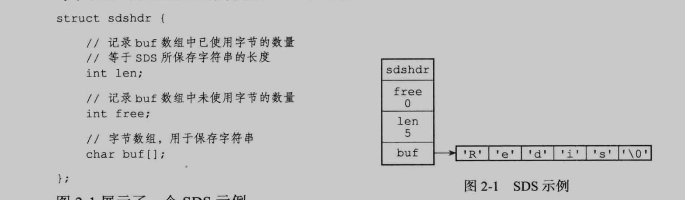
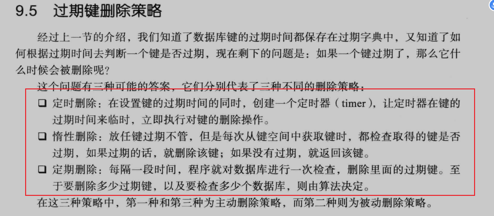

## 简单动态字符串 SDS

Redis 中 C 字符串作为字符串字面量存在，用在无需对字符串进行修改的地方。而简单动态字符串（SDS）作为可修改的字符串值存在并使用，同时 SDS 也作为缓存区使用。

---

#### SDS 的数据结构

buf 字符串末尾以'\n'结尾并且字符串中记录了剩余未分配的空间。和 C 字符串不同的点在于记录了字符串本身的长度，从而查询字符串长度复杂度为 O(1)并杜绝了发生缓存溢出的可能。而 SDS 中的 free 字段可以减少内存重新分配的次数

#### 字典

以键值对的形式保存字典数据,当产生冲突是以头插法插入新的元素
rehash 过程 如果执行的是扩展操作，那么 ht[1]的大小为第一个大于等于 ht[0],used\*2 的 2^n(2 的 n 次方幂).
如果执行的是收缩操作，那么 ht[1]的大小为第一个大于等于 ht[0].used 的 2^n.之后将旧表的数据重新散列到新表 H1 上,并将 H0 清空作为下一个 H1;

### 跳跃表

对于传统的链表的元素查找只能够进行顺序访问。但是如果通过添加索引的方式，通过索引查找链表就可以加快元素的搜索时间，通过索引下级链表区间进行划分，确定目标元素的区间从而减小搜索范围。
跳表在这种意义上便是在链表上实现二分查找。

### 整数集合

集合中均为整数并不能重复，用于集合中元素不多且均为整数的情况下，其中保存编码格式的目的是经可能的节约空间， 涉及到集合的升级过程，

### 压缩列表（z1p11st)是列表键和哈希键的底层实现之一（目的节约内存）

结构为双向列表

