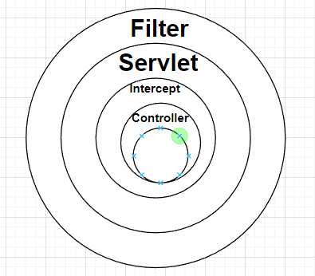

## 过滤器、拦截器和监听器

- 过滤器（Filter）：当有一堆请求，只希望符合预期的请求进来。

- 拦截器（Interceptor）：想要干涉预期的请求。

- 监听器（Listener）：想要监听这些请求具体做了什么。
  

## 使用原则

实际上这个原则是有的：把整个项目的流程比作一条河，那么监听器的作用就是能够听到河流里的所有声音，过滤器就是能够过滤出其中的鱼，而拦截器则是拦截其中的部分鱼，并且作标记。所以当需要监听到项目中的一些信息，并且不需要对流程做更改时，用监听器；当需要过滤掉其中的部分信息，只留一部分时，就用过滤器；当需要对其流程进行更改，做相关的记录时用拦截器。
