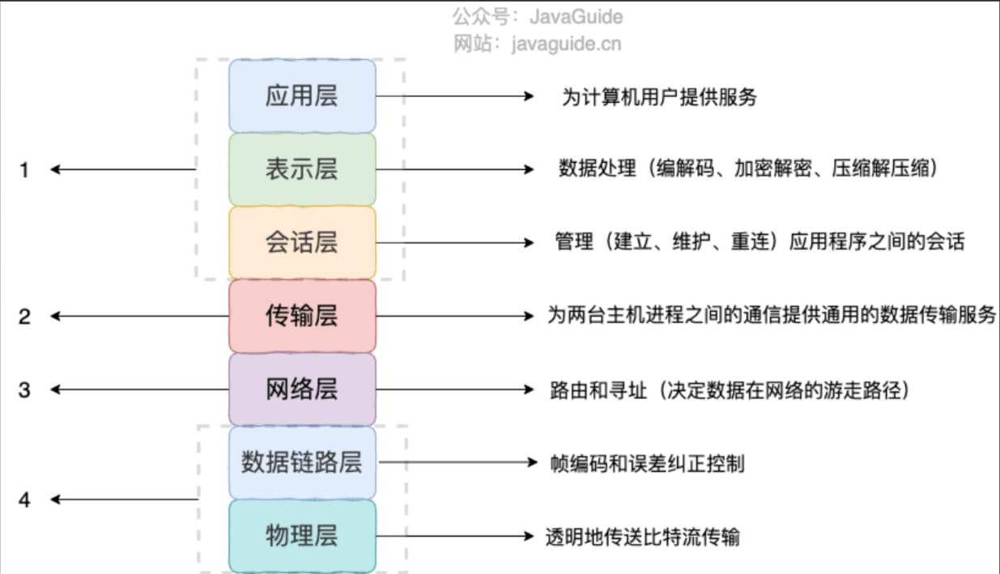
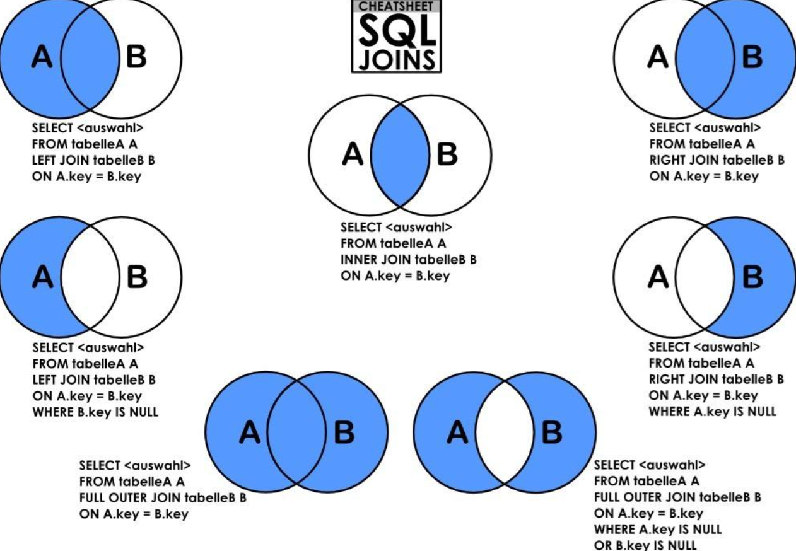

# 项目

## 在校实验室管理平台

1)团队项目：
应用技术：Java、Spring、Spring Boot、MybatisPlus、Redis、MySQL、Swagger、Git。  
项目描述：项目采用前后端分离开发，前端框架为 Vue+ElementU，后端使用 Springboot 框架整合 MyBatisPlus、Redis，主要功能为：管理员对于实验室人员管理，日常打卡记录，人员资料显示，实验设备的管理，留言版模块等普通员工的完成学校医学院实验室的人员与器材的管理，提供了版本的迭代均通过 Git 提交 CODING 管理协作平台管理
主要工作：1、负责项目部分的需求分析。
2、利用 Redis 缓存技术优化数据访问，有效提高了数据库查询速度。
3、负责后端接口的编写，以及前后端接口的联调，和前端同学共同统一接口的格式，接口格式遵循 Restful 风格。
4、和团队一起对项目进行改进和优化，例如建议将用户登录信息部分封装保护用户隐私同时利用 token 进行用户登录的校验。
项目成果：项目一期已经完成。
个人收获：对于 Redis 的使用有了更深刻的理解，同时也拥有了非常宝贵的团队开发经历，对 SpringBoot 的。

---

## 秒杀系统

### 用户登录验证

JWT 是一种基于 token 的认证流程实现，主要结合 SpringSecurity 生成 token

- 客户端向服务器端发送用户名和密码
- 服务器端验证通过后，在当前会话（session）中保存相关数据，比如说登录时间、登录 IP 等。
- 服务器端向客户端返回一个 session_id，客户端将其保存在 Cookie 中。
- 客户端再向服务器端发起请求时，将 session_id 传回给服务器端。
- 服务器端拿到 session_id 后，对用户的身份进行鉴定

> 使用 JWT 和 Session 的区别
> JWT 需要每次请求的时候验证一次，并且只要 JWT 没有过期，哪怕服务器端重启了，认证仍然有效。
> Session 在没有过期的情况下是不需要重新对用户信息进行验证的，当服务器端重启后，用户需要重新登录获取新的 Session

### 登录存活 Http 无状态 用户进行登录后如何完成支付

> ? 例如登录->添加购物车->下单->结算->支付，这系列操作都要知道用户的身份才行。但服务器不知道这些请求是有关联的，每次都要问一遍身份信息。

- cookie 中
- 基于 token 的登录校验：在用户登录时将 token 写到 redis 中，并将 token 返回，前端通过 axios 拦截器将 token 放入到请求头中，当前用户每次请求都会携带请求头信息，服务器在根据请求头对 redis 进行验证。也可以将 token 放在 cookie 中不过 cookie 中并不安全 并且 cookie 中存在大小限制一般是 4kb

### 缓存穿透的解决方案有哪些？

- 缓存 null 值
- 布隆过滤
- 增强 id 的复杂度，避免被猜测 id 规律
- 做好数据的基础格式校验
- 加强用户权限校验
- 做好热点参数的限流

### 缓存雪崩问题及解决思路

缓存雪崩是指在同一时段大量的缓存 key 同时失效或者 Redis 服务宕机，导致大量请求到达数据库，带来巨大压力。

解决方案：

- 给不同的 Key 的 TTL 添加随机值
- 利用 Redis 集群提高服务的可用性
- 给缓存业务添加降级限流策略
- 给业务添加多级缓存

### 登录使用 JWT

### 项目中的 AOP 思想的体现

使用过滤器和拦截器以及 log 日志记录

### RabbitMq 异步下单

执行流程：

1. 系统初始化将商品数量加载到 Redis 中
2. 后端收到秒杀请求后，先在 redis 中预减库存，提前判断如果库存数量不足则返回秒杀失败，从而直接截断了后续请求。
3. 否则判断这个秒杀订单是否形成，判断是否已经秒杀到了，避免一个账户秒杀多个商品
4. 秒杀单形成并且库存充足无重复秒杀，将秒杀请求封装后放入消息队列，同时返回前端秒杀标识 ，前端接收到数据后，显示排队中，并根据商品 id 轮询请求服务器（200ms 轮询一次。
5. 后端 RabbitMQ 监听秒杀 MIAOSHA_QUEUE 的这个名字的通道，如果有消息过来就获取到传入的信息，执行真正的秒杀之前，要判断数据库的库存，判断是否重复秒杀，然后执行秒杀事务（秒杀事务是一个原子操作：库存减 1，下订单、写入订单详情）

**秒杀中出现的问题**

执行秒杀事务的时候，先生成订单详情，然后生成秒杀订单，为了进一步确保秒杀过程中一个用户只能秒杀一件商品，可以给秒杀订单表 miaosha_order 添加一个唯一索引，如果再次插入相同的 user_id 与 goods_id，那么将不会被允许，从而在事务中插入失败而回滚：

### 秒杀库存如何防止超卖

扣减库存时候，要保证数据库中的字段值不能为负数，

1. 通常在扣减库存的场景下使用行级锁，通过数据库引擎本身对记录加锁的控制，保证数据库的更新的安全性，并且通过 where 语句的条件，保证库存不会被减到 0 以下。意思是在 sql 语句对数据库进行操作时候进行控制。
2. 通过对库存字段设置为无符号型 那么出现负数则报错。

#### 秒杀的 ABA 问题

### 秒杀系统的设计

1.秒杀页面静态，将活动页面缓存到 redis 中，用户浏览商品等常规操作不会请求到服务端。只有到了秒杀时间点且用户点了秒杀按钮才允许访问服务端，这样处理能过滤掉绝大多数的无效请求

### 流程

将参与秒杀的商品缓存到 redis 中，并设置内存标记每个商品是否有库存，当用户点击秒杀按钮是前端发送请求，后端根据每位用户生成唯一的秒杀路径，并存入到 redis 中，前端将路径进行拼接为新的 url，发送给后端并进行路径校验，进行秒杀，先查询内存标记有库存在查询 redis 进行预减，当 redis 库存小于 0 后，返回失败，否则将请求放入到消息队列中进行排队，从队列中取出订单并更新数据库，创建订单并完成秒杀。

### 限流

- 接口限流
  拦截器拦截请求，用户每点击一次请求按钮，都会在用户 id 的缓存请求 key 中记录访问次数，查看是否有接口限流的注解，得到限流信息，并提取 request 的请求地址和用户 id 和访问路径组合为 key 作为用户的唯一标示符，value 为访问次数，通过查询访问次数是否合法来决定是否对请求进行放行，

### 分布式 session 实现

用户登录成功之后，给这个用户生成一个 sessionId(用 token 来标识这个用户)，并写到 cookie 中传递给客户端；然后客户端在随后的访问中，都在 cookie 中传递这个 token，服务端拿到这个 token 之后，就根据这个 token 来取得对应的 session 信息（token 利用 uuid 生成）

### 登录密码的加盐加密

防止查表法和彩虹表攻击 在密码中混入随机字符（加盐）生成随机盐值混入密码中，使得每次相同的密码得到不同的哈希值，盐值和密码应该放在服务器中存放在用户对应的数据库中

### 接口设计

- 参数校验
  GET 请求参数会在 URL 中 使用 requestParam/PathVariable 传递参数
  POST、PUT 向服务器提交数据 参数在请求体中使用 requestBody 传递参数

### 流量削峰

- 消息队列
- 用户答题 填写验证码 延缓请求，起到对请求流量进行削峰的作用，从而让系统能够更好地支持瞬时的流量高峰
-

### 系统缓存

- 页面缓存+URL 缓存+对象缓存
  页面缓存 减少服务器压力 直接访问 redis
- 用户信息缓存 更新用户需要保证数据一致性问题 先更新数据库在修改 redis

### 问题

缓存一致性问题
先更新数据库在更新缓存
修改 token 关联的对象以及 id 关联的对象，先更新数据库后删除缓存，不能直接删除 token，删除之后就不能登录了，再将 token 以及对应的用户信息一起再写回缓存里面去

- 缓存穿透 对这些不存在的数据缓存一个空数据，对这类请求进行过滤
- 缓存击穿 使用互斥锁，只有拿到这把互斥锁的线程可以进数据库请求数据，其他线程等待，待该线程查到数据存入缓存后其他线程直接使用缓存中的数据
- 缓存雪崩 为了防止缓存在同一时间大面积过期导致的缓存雪崩，可以通过观察用户行为，合理设置缓存过期时间来实现；为了防止缓存服务器宕机出现的缓存雪崩，可以使用分布式缓存 及时更新用户缓存

- 消息队列 用户的请求，服务器接收后，首先写入消息队列，秒杀业务
  假如消息队列长度超过最大数量，则直接抛弃用户请求或跳转到错误页面。

### 唯一 ID 一人一单

在分布式情况下使用 setnx 操作对下单进行加锁，并在
使用 redis 的 setnx(只有在键不存在时才会执行存储操作)，同时增加过期时间防止死锁，当线程进行操作是判断是否有其他线程获取锁，没有则执行，否则等待

- 问题
  存在分布式锁误删问题，当 a 线程阻塞并是的分布式锁超时删除，B 线程拿到锁后 a 线程会将锁进行误删，此时需要在线程中加入线程标识，每次删除锁需要对线程进行判断防止误删。最后使用 Lua 脚本对加锁和解锁做原子操作

### 超卖现象

简单的在操作数据库的时候给 SQL 语句加上限定只有库存量大于 0 才能够减库存
内存标记并预减库存
超卖现象是多线程安全问题，使用乐观锁

#### 高并发 减少数据库访问

- 预减少库存，秒杀地址隐藏，使用内存标记

- redis 的预见库存 防止大量的请求，请求到数据库中
  先对每个商品进行 hashMap 内存标记，标记是否还有库存剩余，扣减库存时候 先查询内存标记，如果为 FALSE 直接返回，不需要查数据库查询 redis 的商品库存，先对该商品进行减少，库存数小于 0 是则不需要访问数据库 直接返回失败

### 接口地址隐藏 防止根据秒杀的链接提前秒杀

只有秒杀时候再将秒杀的 url 地址通过 UUID 拼接数字，随机生成地址并缓存在 redis 中并发给前端，前端请求过来后验证秒杀的路径，通过再执行秒杀。

## java 中常见的数据对象

- PO (Persistent Object)：持久化对象。用于封装与数据库表映射的数据实体，通常与数据库的一张表对应，一个 PO 对象对应表中的一条记录。
- VO (Value Object)：值对象。主要用于业务层之间的数据传输或者展示层展示数据的封装。与 PO 相比，VO 一般不对应数据库中的具体表，而是由多个 PO 组合而成，以满足特定的业务需求。
- TO (Transfer Object)：传输对象。用于在客户端和服务器之间传输数据。TO 通常包含需要传输的数据，并提供了相应的 getter 和 setter 方法，也可以包含一些业务逻辑，例如分页查询。
- BO (Business Object)：业务对象。用于封装业务逻辑处理的类，通常位于业务层。BO 对象承载着业务规则的集合，负责处理具体的业务逻辑，如校验数据、计算相关数据等。
- DAO (Data Access Object)：数据访问对象。用于封装对数据库的访问，提供 CRUD 操作等。DAO 层负责将数据库中的数据转换为 BO/PO 对象，供业务层使用。
- POJO (Plain Old Java Object)：简单 Java 对象。指普通的 Java Bean，没有继承任何类或实现任何接口，只有私有属性、Getter/Setter 方法和默认构造方法。POJO 通常用于数据传输或业务层与 DAO 层之间的数据封装。

## ServletContext、HttpSession 和 HttpServletRequest 的区别和联系

作用范围： Context 域 > Session 域 > Request 域
Session 域 只要会话不结束就会存在 但是 Session 有默认的存活时间(30 分钟)

- ServletContext 一个 web 应用程序只有一个 ServletContext 对象且不依赖于用户会话
- HttpSession 存在于一次用户会话中 每个用户都有自己的 HttpSession 对象，用于存储该用户的会话状态。HttpSession 可以用来跨页面或跨请求存储用户数据，这些数据只对当前用户可见
- HttpServletRequest 表示一次 Http 请求 包含了请求方法、请求头、请求参数。在处理 HTTP 请求时，开发人员通常使用 HttpServletRequest 对象来获取请求信息，并将响应发送回客户端。HttpServletRequest 可以通过 getSession()方法获取 HttpSession 对象，也可以通过 getServletContext()方法获取 ServletContext 对象。

## java

### 排序算法

#### 插入排序

- 直接插入排序
  假设要插入的元素之前的所有元素已经排好序，则遍历之前的所有元素找到插入位置。

```java
    public static int[] DirectInsertionSort(int[] nums) {
//            从第二个元素开始 依次向前比较 遇见大的往后挪
            for (int i = 1; i < nums.length; i++) {
                int tem = nums[i];
                int j = i - 1;
                while (j >= 0 && nums[j] > tem) {
                    nums[j + 1] = nums[j];
                    j--;
                }
                nums[j + 1] = tem;
            }
            return nums;
        }
```

- 折半插入排序
  通过二分查找找到当前待插入元素的位置

```java
  public static int[] binarySearch(int[] nums) {
        int n = nums.length;
        for (int i = 1; i < n; i++) {
            int tem = nums[i];
            int left = 0;
            int right = i - 1;
            while (left <= right) {
                int middle = (left + right) / 2;
                if (nums[middle] > tem)
                    right = middle - 1;
                else left = middle + 1;
            }
            for (int j = i - 1; j >= left; j--) {
                nums[j + 1] = nums[j];
            }
            nums[left] = tem;
        }
        return nums;
    }
```

- 希尔排序
  每一趟希尔排序选取固定步长的子表进行直接插入排序，一直到整个序列有序。

##### 交换排序

- 冒泡排序
  每一趟冒泡排序，从后向前依次比较元素，如果不满足比较条件就交换，每一趟都会得到未排序序列中最大或者最小的元素，到序列顶端，因此待排序数量不断减 1，直到只剩最后一个元素时数据有序。

```java
   public static int[] BubbleSort(int[] nums) {
    // 需要排序的趟数
        for (int i = 0; i < nums.length - 1; i++) {
            boolean isSwap = false; // 如果当前趟没有元素交换 则已经有序
            for (int j = 0; j < nums.length - i - 1; j++) { // j 为需要排序的序列位置终点
                if (nums[j] > nums[j + 1]) {
                    Swap(j, j + 1, nums);
                    int tem = nums[j];
                    nums[j] = nums[j+1];
                    nums[j+1] = tem;
                    isSwap = true;
                }

            }
            if (!isSwap) {
                return nums;
            }
        }
        return nums;
    }
```

- 快速排序
  每一趟排序，在未排序的序列中选取任意一个元素作为排序基准，指针从两边对向扫描直到指针相遇，将待排序的数据根据基准放在基准两边（小于基准的在基准左边，大于基准的在基准右边），最后将指针相遇的位置为基准的位置。

```java
  //    快排
    public static int[] QuickSort(int[] nums, int low, int high) {
        if (low < high) {
            int a = part(nums, low, high);
            QuickSort(nums, low, a - 1);
            QuickSort(nums, a + 1, high);
        }
        return nums;
    }

    //    将high指向的数 若小于tem 放到num[low]中 反之放在 num[high]中 因为tem被覆盖会空出一个位置放tem (low == high)
    private static int part(int[] nums, int low, int high) {
        int tem = nums[low];//将序列第一个作为基准
        while (low < high) {
            while (low < high && tem <= nums[high]) high--;
            nums[low] = nums[high];//将小于基准的移到左边 第一次会覆盖基准 此时原先nums[high]位置的元素可以被覆盖
            while (low < high && tem >= nums[low]) low++;
            nums[high] = nums[low];//
        }
        nums[low] = tem;
        return low;
    }

```

- 堆排序
  将一维数组视为完全二叉树，当每个父节点均大于孩子节点为大根堆反之为小根堆。
  依次取出堆顶元素，并从新构建堆，直到堆仅剩一个元素，即为所需的排序结果。

---

## java 基础

> java 是一种编译与解释并存的语言

### 面向对象的特性：继承、封装、多态

### \*基本数据类型

6 种数字类型：
4 种整数型： byte 、 short 、 int 、 long
2 种浮点型： float 、 double
1 种字符类型： char
1 种布尔型： boolean
各种数字类型的对应的长度如下

其中重点熟悉 int 的长度。

### \*String 为什么不是基本数据类型

String 不是基本数据类型，他是一个对象由 java.lang.String 包实现。

#### \*string 常用方法

string.length()
string.charAt()
string.indexOf()
string.trim()去除两端空格
string.split() 分割字符串
string.includes()是否包含子串

#### \*String、StringBuffer、StringBuilder 的区别

> String final 关键字用于防止修改 防止出现外星方法 子类通过重写父类方法从而线程不安全 破坏父类方法

String 中的对象是不可变的（ final 修饰不能继承并且没有改变字符串的方法），也就可以理解为常量，线程安全。StringBuffer 对方法加了同步锁或者对调用的方法加了同步锁，所以是线程安全的。

> 
> StringBuilder 并没有对方法进行加同步锁，所以是非线程安全的
> String 修改对象会生成新的对象并改变对象引用的地址，StringBuffer 和 Stringbuilder 修改时不会生成新的对象，只在对象本身进行改变
> 重载：重载就是同样的⼀个⽅法能够根据输⼊数据的不同，做出不同的处理;名称相同参数不同
>  > 

#### 字符串拼接用“+” 还是 StringBuilder?

“+”的字符串拼接方式，实际上是通过 StringBuilder 调用 append() 方法实现的，接完成之后调⽤ toString() 得到⼀个 String 对象 string +="string" 每一次调用都会 new 新的 StringBilder 并调用 append 方法

在循环中使用 + 会不断的生成新的 stringbuilder 对象
直接使用 StringBuilder 对象进行字符串拼接的话不会每循环一次就会创建一个 StringBuilder 对象

### String s1 = new String("abc");这句话创建了几个字符串对象？

new String("abc")在堆中创建对象 并在栈中创建指向其的引用对象 s1

### java 的包装类和基本数据类型的区别

分别对应的包装类如下：
Byte 、 Short 、 Integer 、 Long 、 Float 、 Double 、 Character 、 Boolean
区别：

- 存储方式：基本数据类型的局部变量存放在 Java 虚拟机栈中的局部变量表中，基本数据类型的成员变量（未被 static 修饰 ）存放堆中。包装类型属于对象类型，⼏乎所有对象实例都存在于堆中。
- 默认值：基本数据类型均有默认值，但包装类一般没有默认值为 null
  比较方式上：基本数据类型用== 包装类需要重写 equals 方法

### 访问控制权限


### ⾃动装箱与拆箱

装箱：将基本类型转为对应的包装类型 使用`Integer i = 10 等价于 Integer i = Integer.valueOf(10)`
拆箱：将包装类型转为基本数据类型 调用 xxxvalue 方法 `int n = i 等价于 int n = i.intValue() ;`

### 拆箱的 NEP 问题

### 包装类的缓存机制

Byte , Short , Integer , Long 这 4 种包装类默认创建了数值 [-128，127] 的相应类型的缓存数
据， Character 创建了数值在 [0,127] 范围的缓存数据， Boolean 直接返回 True or False。
这样多次创建相同的对象时，会直接返回缓存中的对象，避免了重复创建对象的开销。

```java
Integer a = 127;//变量 a 存放在栈中，而值 127 存放在常量池中。
Integer b = 127;
System.out.println(a == b); // true，因为两个对象指向了同一个缓存对象

Integer c = 128;// c是对象引用 存在于栈中 并指向了Integer对象 并且128大于缓存范围会被封装为Integer对象放在堆中
Integer d = 128;
System.out.println(c == d); // false，因为两个对象没有缓存，是不同的对象
```

### 继承封装多态

封装
封装是指把⼀个对象的状态信息（也就是属性）隐藏在对象内部，不允许外部对象直接访问对象的内部信息。但是可以提供⼀些可以被外界访问的⽅法来操作属性
继承
不同类型的对象，相互之间经常有⼀定数量的共同点
多态
⽗类的引⽤指向⼦类的实例

### 深拷贝和浅拷贝

浅拷贝在堆上创建新的对象并将对象中的引用类型指向之前对象的引用地址
深拷贝直接复制源对象

### equals 和 hashcode

因为 Object 的 equals 方法是比较的对象的内存地址，而 String 的 equals 方法比较的是对象的值。
hashcode 的效率要高于 equal
hashcode 相同不代表对象相同，会发送碰撞。

### 接口和抽象类

- 抽象方法：被 abstract 修饰 只有声明 没有实现 void method();
  抽象方法必须在抽象类中 ，并被子类实现，但抽象类中并不一定要有抽象方法
- 抽象类 被 abstract 修饰的类称为抽象类，可以有自己的成员变量和普通类一样，也可以有抽象方法，

- 接口：一种规范和约束，提供了供别人调用的方法，接口中所有的方法不能有具体的实现，变量全是 public static final 方法全是 public abstract。接口通过 extends 可以拓展多个接口，但类只能单继承。jdk 8 之后接口有自己的默认方法（一个默认的方法实现，实现类可以直接继承或者重写它，用 default 修改时）和静态方法，但默认方法 和静态方法都不是普通方法，

### hashSet 如何检查重复

先计算 hashcode 如果不相同 则插入，如果相同比较对应的 equals 方法，相等则不插入，不相同在再散列。减小 equals 方法的比较

#### 为什么重写 equals() 时必须重写 hashCode() 方法？

因为两个相等的对象的 hashCode 值必须是相等。也就是说如果 equals 方法判断两个对象是相等的，那这两个对象的 hashCode 值也要相等

### JDK8 新特性 Lambda

能够使用 Lambda 的依据是必须有相应的函数接口（函数接口，是指内部只有一个抽象方法的接口）
lambda 可以省略接口名和方法名的原因在于可以通过上下文进行推断 因为 java 是强类型语言每个变量都需要定义类型，从而不需要显示的指定

### JDK8 新特性

引入 Lambda 表达式

引入强大的 Stream APl

## JVM 内存模型 运行时数据区域


> 栈运行，堆存储
> 由于堆是所有线程共有的，从堆里面申请内存要进行相关的加锁操作，因此申请堆内存的复杂度和时间开销比栈要大很多；从栈里面申请内存，虽然又简单又快，但是栈的大小有限，分配不了太多内存。
> 将内存分为堆和栈类似
> 使用 new 关键字创建的包装对象，不会使用缓存机制

> 常量池 用于存放编译器生成的各种字面量和符号引用。它在类加载时被创建，存储在方法区（方法区是堆中的一个逻辑部分称为“非堆”）中，是一块静态内存区域，不会被垃圾回收。
> 常量池存储的数据包括：
>
> - 字符串常量
> - 类、接口、字段和方法的符号引用
> - 数字常量
> - 类型和方法的描述符
>
> 常量池的作用是提高程序的运行效率和节省内存空间。通过共享常量池中的数据，可以避免重复创建对象，减少内存的占用

### 字符串常量池和常量池（class 文件常量池）区别和联系

常量池:

运行时常量池：存放在方法区中，用于存放编译期间生成的字面量和符号量
区别：

存储内容不同：字符串常量池只存储字符串常量，它存储以双引号包住的 String 字符串，而常量池存储字面量和符号引用。

存储位置不同：字符串常量池位于方法区中，而常量池位于类文件的常量池表中。

对象创建方式不同：字符串常量池中的字符串对象是通过字面量的方式创建的，而常量池中的对象可以通过字面量或符号引用的方式创建。

联系：

节省内存：字符串常量池和常量池都可以避免重复创建相同的对象，从而节省内存。

共享对象：在字符串常量池和常量池中，相同的常量只会创建一次，并被多个对象共享。

提高效率：使用常量池可以加快程序的运行速度，因为相同的常量只需要创建一次，之后都可以直接引用，而不需要重新创建。

##### 线程私有：

程序计数器(Program Counter Register)：每个线程都有一个程序计数器，用于记录当前线程正在执行的字节码指令的地址。当线程执行 Java 方法时，程序计数器保存的是正在执行的虚拟机字节码指令的地址。如果线程正在执行的是 Native 方法，则程序计数器的值为空（Undefined）。
作用：

- 字节码解释器通过改变程序计数器来依次读取指令，从而实现代码的流程控制
- 在多线程的情况下，程序计数器用于记录当前线程执行的位置

**栈**
Java 虚拟机栈(Java Virtual Machine Stacks)：每个线程都有一个 Java 虚拟机栈，主要用于存储方法的局部变量、操作数栈、方法返回值等信息。除了 native 方法之外所有的 java 方法都由栈调用（调用方法压栈帧、结束方法出栈帧），Java 虚拟机栈可以分为几个部分，包括局部变量表(Local Variable Array)、操作数栈(Operand Stack)和帧栈(Frame Stack)。

本地方法栈(Native Method Stack)：与 Java 虚拟机栈类似，本地方法栈用于存储 Native 方法执行所需的数据和信息。

#### 线程共享

堆(Heap)：用于存储 Java 应用程序创建的对象实例。所有的对象实例都存储在堆中，也是垃圾回收的主要管理区域从垃圾回收的角度，由于现在收集器基本都采用分代垃圾收集算法，所以 Java 堆还可以细分为：新生代和老年代；再细致一点有：Eden、Survivor、Old 等空间。进一步划分的目的是更好地回收内存，或者更快地分配内存。

方法区(Method Area)：用于存储类信息、常量、静态变量、即时编译器编译后的代码等数据。方法区也可以称为永久代(Permanent Generation)，但在 JDK8 之后，永久代被元数据区(Metaspace)所取代。
永久代相当于实现了方法区的概念，同时永久代在 JVM 中大小固定，而将元空间替换永久代是的元空间在本地内存中可以调整大小

#### 字符串常量池

字符串常量池 是 JVM 为了提升性能和减少内存消耗针对字符串（String 类）专⻔在堆内存中开辟的⼀块区域，主要⽬的是为了避免字符串的重复创建。

- 当 Java 程序中遇到字符串字面量时，会首先在字符串常量池中查找是否已经存在相同的字符串，如果已经存在，则直接返回常量池中的引用。如果不存在，则将该字符串添加到常量池中，并返回常量池中的引用。
  优点：
- 节省空间
- 提升性能 字符串不可变 可安全的多线程共享 并直接用==判断比较地址 比 equal 更快

> 在 Java 中，所有使用双引号（" "）定义的字符串都是存储在字符串常量池中的，
> 字符串对象则是通过调用 String 类的构造函数来创建的，在这种情况下，每次调用构造函数都会创建一个新的字符串对象，并将其存储在堆内存中。因此，如果需要频繁修改字符串内容或者需要比较字符串内容是否相同，建议使用字符串对象，要使用同一个字符串对象则使用字符串常量
> **如果一个字符串对象不是常量，那么它就不会被添加到字符串常量池中。
> 如果一个字符串对象调用 intern()方法，那么它将会将指定的字符串对象的引用保存在字符串常量池中**

### JVM 垃圾回收

对象分配和回收机制
对象优先在 Eden 区分配：当程序创建对象时，JVM 会首先尝试在 Eden 区分配内存空间。如果 Eden 区没有足够的空间，JVM 会触发一次垃圾回收，释放不再使用的对象，以便为新对象腾出空间。

大对象直接进入老年代：如果要创建的对象太大，无法在 Eden 区分配，JVM 会直接将它放入老年代。

长期存活的对象进入老年代：如果一个对象经过多次垃圾回收后仍然存活，JVM 会将其移动到老年代。这是为了避免在年轻代频繁回收对象造成性能损失。

动态对象年龄判定：JVM 会根据对象的年龄动态判定是否要将对象从年轻代移动到老年代。年龄判定的规则是：当一个对象经过一次垃圾回收后仍然存活，并且年龄达到某个阈值，就会被移动到老年代。

空间分配担保：当一次年轻代垃圾回收之前，JVM 会先检查老年代的剩余空间是否能够容纳年轻代所有的存活对象。如果不能，JVM 会进行一次 Full GC，以便为年轻代腾出足够的空间。

对象的销毁和回收：当一个对象不再被程序使用时，JVM 会通过垃圾回收器将其标记为无用对象，并在适当的时候回收该对象所占用的内存空间。

总的来说，JVM 会通过不同的垃圾回收器和内存分配算法，根据程序的实际情况来管理内存空间。这些算法和策略的设计旨在最大程度地提高 Java 程序的性能和可靠性。

### 泛型和通配符

` Generic<?> integerGeneric = new Generic<>("10");`定义?为泛型实参，当具体类型不确定是使用通配符?的到的类型为 Object
Java 中有两种通配符：? extends T 和? super T。
? extends T：该通配符表示只允许传递 T 类型或其子类型的对象
? super T 该通配符表示允许传递 T 类型或其父类型的对象

### java 的值传递

Java 中的所有参数传递方式都是基于值传递的。在 Java 中，当一个方法被调用时，它所接收的参数是原始值或者对象的引用，而不是对象本身。

#### serialVersionUID

在 Java 中，serialVersionUID 可以自动计算，也可以手动指定。如 果没有手动指定，Java 默认使用一个根据类名、接口名、成员等因素生成的 serialVersionUID。建议采用随机数或者一个特定含义的数字作为 serialVersionUID 的值

#### 重写重载

重载：如果多个⽅法(⽐如 StringBuilder 的构造⽅法)有相同的名字、不同的参数， 便产⽣了重载
重写就是当⼦类继承⾃⽗类的相同⽅法，输⼊数据⼀样，但要做出有别于⽗类的响应时，你就要覆盖⽗类⽅法

## 集合

##### ArrayList

初始容量 10 当超过容量后创建 1.5 倍的新数组将原先数据拷贝进去，作为扩容方式

当 new ArrayList（0）是直接赋值空数组

构造方法：

```java
// 指定容量
public ArrayList(int initialCapacity) {
// 大于0 构造容量的数组
        if (initialCapacity > 0) {
            this.elementData = new Object[initialCapacity];
        } else if (initialCapacity == 0) {
          // 如果传入的初始容量等于0，使用空数组EMPTY_ELEMENTDATA
            this.elementData = EMPTY_ELEMENTDATA;
        } else {
            throw new IllegalArgumentException("Illegal Capacity: "+
                                               initialCapacity);
        }
    }


    public ArrayList() {
    // 如果没有传入初始容量，则使用空数组DEFAULTCAPACITY_EMPTY_ELEMENTDATA
    // 使用这个数组是在添加第一个元素的时候会扩容到默认大小10
    this.elementData = DEFAULTCAPACITY_EMPTY_ELEMENTDATA;

    /**
* 把传入集合的元素初始化到ArrayList中
*/
public ArrayList(Collection<? extends E> c) {
    // 集合转数组
    elementData = c.toArray();
    if ((size = elementData.length) != 0) {
        // 检查c.toArray()返回的是不是Object[]类型，如果不是，重新拷贝成Object[].class类型
        if (elementData.getClass() != Object[].class)
            elementData = Arrays.copyOf(elementData, size, Object[].class);
    } else {
        // 如果c的空集合，则初始化为空数组EMPTY_ELEMENTDATA
        this.elementData = EMPTY_ELEMENTDATA;
    }
}

}
```

add
public boolean add(E e)

```java
   public boolean add(E e) {
    // 确保容量满足，
        ensureCapacityInternal(size + 1);  // Increments modCount!!
        elementData[size++] = e;
        return true;
    }

   private void ensureCapacityInternal(int minCapacity) {
        ensureExplicitCapacity(calculateCapacity(elementData, minCapacity));
    }

  private static int calculateCapacity(Object[] elementData, int minCapacity) {
    // 数组内容为空初始化容量大小 等于默认10或者指定容量
        if (elementData == DEFAULTCAPACITY_EMPTY_ELEMENTDATA) {
            return Math.max(DEFAULT_CAPACITY, minCapacity);
        }
        return minCapacity;
    }

private void ensureExplicitCapacity(int minCapacity) {、
// 修改器计数
        modCount++;
// 数组有空余 则添加
        // overflow-conscious code
        if (minCapacity - elementData.length > 0)
            grow(minCapacity);
    }


private void grow(int minCapacity) {
  // 保存原始数组长度
        // overflow-conscious code
        int oldCapacity = elementData.length;
        // 扩容长度 1.5倍
        int newCapacity = oldCapacity + (oldCapacity >> 1);
        // 扩容后依旧不够 将容量改为定义的长度
        if (newCapacity - minCapacity < 0)
            newCapacity = minCapacity;
            // 新容量超过了最大容量 使用最大容量
        if (newCapacity - MAX_ARRAY_SIZE > 0)
            newCapacity = hugeCapacity(minCapacity);
        // 将数组拷贝到新的扩容的数组中去
        // minCapacity is usually close to size, so this is a win:
        elementData = Arrays.copyOf(elementData, newCapacity);
    }
```

public void add(int index, E element)
添加元素到指定位置，平均时间复杂度为 O(n)
https://www.cnblogs.com/tong-yuan/p/10638855.html

#### ArrayList 等集合的快速失败

当对集合进行修改 remove 时 会触发 fail-fast 机制并爆出异常，原因在于 modCount 发生修改

#### ArrayList 和 Vector 的区别

ArrayList 在单线程模式下可以同时读写 在多线程可以同时读但不能同时写在多线程环境中时是线程不安全的 同时写出现并发修改异常。在多线程下可以使用 Vector 代替或者 Collections.synchronizedList 或者利用 JUC 方法：
CopyOnWriteArrayList：写时复制，主要是一种读写分离的思想
机制：
它包含了一个叫做 modCount 的变量，用于记录这个 ArrayList 对象被修改的次数
modCount 主要用于支持 fail-fast 机制，即在集合被修改后，如果其他线程尝试对该集
合进行操作，则会立即抛出 ConcurrentModificationException 异常

> fail-fast 机制当用 foreach 对集合进行 add 或者 remove 后会触发

- 扩容机制

### HashSet

```java
// HashSet底层使用HashMap
 public HashSet() {
        map = new HashMap<>();
    }
    // 添加元素
// 直接调用HashMap的put()方法，把元素本身作为key，把PRESENT作为value，也就是这个map中所有的value都是一样的。
// value 值为  private static final Object PRESENT = new Object();值始终被设置为同一个对象
public boolean add(E e) {
    return map.put(e, PRESENT)==null;
}
// 删除元素
// 直接调用HashMap的remove()方法
public boolean remove(Object o) {
    return map.remove(o)==PRESENT;
}
// 查询元素
// 这里只要一个检查元素是否存在的方法contains()，直接调用map的containsKey()方法
public boolean contains(Object o) {
    return map.containsKey(o);
}

```

### HashMap

- put 方法
  hashMap 每个位置存放的是一个键值对 根据 key 值得到 hash，在得到位置，如果此处已经有了节点，则遍历该位置上的链表（或者红黑树），查找是否已经存在相同的键对象，如果存在，则更新这个键值对；否则将新的键值对添加到链表（或者红黑树）的尾部（或者合适的位置）
  
  存储结构 数组（桶）链表红黑树

```java

/**
 * 默认的初始容量为16
 */
static final int DEFAULT_INITIAL_CAPACITY = 1 << 4;

/**
 * 最大的容量为2的30次方
 */
static final int MAXIMUM_CAPACITY = 1 << 30;

/**
 * 默认的装载因子
 */
static final float DEFAULT_LOAD_FACTOR = 0.75f;

/**
 * 当一个桶中的元素个数大于等于8时进行树化
 */
static final int TREEIFY_THRESHOLD = 8;

/**
 * 当一个桶中的元素个数小于等于6时把树转化为链表
 */
static final int UNTREEIFY_THRESHOLD = 6;

/**
 * 当桶的个数达到64的时候才进行树化
 */
static final int MIN_TREEIFY_CAPACITY = 64;

/**
 * 数组，又叫作桶（bucket）
 */
transient Node<K,V>[] table;

/**
 * 作为entrySet()的缓存
 */
transient Set<Map.Entry<K,V>> entrySet;

/**
 * 元素的数量
 */
transient int size;

/**
 * 修改次数，用于在迭代的时候执行快速失败策略
 */
transient int modCount;

/**
 * 当桶的使用数量达到多少时进行扩容，threshold = capacity * loadFactor
 */
int threshold;

/**
 * 装载因子
 */
final float loadFactor;

```

- 默认容量为 16 最大为 2 的 30 次方，当桶容量达到 64 时才可以树化。
- 装载因子用来计算容量达到多少时才进行扩容，默认装载因子为 0.75。capacity 表示数组的大小，size 为实际使用的大小 当 size / capacity > loadFactor 时，就需要对数组进行扩容。

- 树化 ，当数组达到 64 且链表的长度达到 8 时进行树化，当链表的长度小于 6 时反树化。
  > 为什么转回链表的节点数目为 6
  > 设置为 8 当发生碰撞是 会发⽣链表和红⿊树的不断转换，导致资源浪费

```java
// 空参构造方法
public HashMap() {
    this.loadFactor = DEFAULT_LOAD_FACTOR; // all other fields defaulted
}

//调用public HashMap(int initialCapacity, float loadFactor)传入默认装载因子
   public HashMap(int initialCapacity) {
        this(initialCapacity, DEFAULT_LOAD_FACTOR);
    }

  public HashMap(int initialCapacity, float loadFactor) {
    // 判断初始容量合法
        if (initialCapacity < 0)
            throw new IllegalArgumentException("Illegal initial capacity: " +
                                               initialCapacity);
        if (initialCapacity > MAXIMUM_CAPACITY)
            initialCapacity = MAXIMUM_CAPACITY;
            // 判断加载因子
        if (loadFactor <= 0 || Float.isNaN(loadFactor))
            throw new IllegalArgumentException("Illegal load factor: " +
                                               loadFactor);
        this.loadFactor = loadFactor;
        //计算扩容
        this.threshold = tableSizeFor(initialCapacity);
    }
    //计算容量 确保比传入的初始容量大的最小的 2 的幂次方数的方法
 static final int tableSizeFor(int cap) {
  // 先将cap减1，这样就可以保证最高位为1
        int n = cap - 1;
        // 二进制n右移一位 在或位 将最高位置的1后面的元素都变为1
        n |= n >>> 1;
        n |= n >>> 2;
        n |= n >>> 4;
        n |= n >>> 8;
        n |= n >>> 16;
        return (n < 0) ? 1 : (n >= MAXIMUM_CAPACITY) ? MAXIMUM_CAPACITY : n + 1;
    }
```

##### tableSizeFor 计算方法：

任何十进制最近的 2 整数幂的二进制表示都是比十进制高一位并且最高位为 1 后面全是 0.将最高有效位以及其后的位都变为 1，最后再+1，就进位到前一位变成 1.而减一操作是为了防止当传入的数据已经是 2 的幂时在次扩大倍数。如传入 8 在扩大后变为 16 会浪费内存

> 15 : 1111
> 16 :10000

#### Put 方法

```java
public V put(K key, V value) {
        return putVal(hash(key), key, value, false, true);
    }
// hash方法
    static final int hash(Object key) {
        int h;
        //  并让高16位与整个hash异或，这样做是为了使计算出的hash更分散
        return (key == null) ? 0 : (h = key.hashCode()) ^ (h >>> 16);
    }

   final V putVal(int hash, K key, V value, boolean onlyIfAbsent,
                   boolean evict) {
        Node<K,V>[] tab; Node<K,V> p; int n, i;
        // 数组长度为0 分配大小
        if ((tab = table) == null || (n = tab.length) == 0)
            n = (tab = resize()).length;
            //在0-n范围内查找对应的hash位置 没有该元素 添加
        if ((p = tab[i = (n - 1) & hash]) == null)
            tab[i] = newNode(hash, key, value, null);
        else {
          // 存在   如果桶中第一个元素的key与待插入元素的key相同，保存到e中用于后续修改value值
            Node<K,V> e; K k;
            if (p.hash == hash &&
                ((k = p.key) == key || (key != null && key.equals(k))))
                e = p;
                // 如果第一个元素是树节点，则调用树节点的putTreeVal插入元素
            else if (p instanceof TreeNode)
                e = ((TreeNode<K,V>)p).putTreeVal(this, tab, hash, key, value);
            else {
              // 遍历链表
                for (int binCount = 0; ; ++binCount) {
                    if ((e = p.next) == null) {
                      // 没有对应的节点 则插入
                        p.next = newNode(hash, key, value, null);
                        // 插入之前判断链表长度是否>8 数组上的元素没计算在链表长度内 -1
                        if (binCount >= TREEIFY_THRESHOLD - 1) // -1 for 1st
                        // 树化
                            treeifyBin(tab, hash);
                        break;
                    }
                    // 找到 key不重复 退出
                    if (e.hash == hash &&
                        ((k = e.key) == key || (key != null && key.equals(k))))
                        break;
                    p = e;
                }
            }
            if (e != null) { // existing mapping for key
                V oldValue = e.value;
                if (!onlyIfAbsent || oldValue == null)
                    e.value = value;
                afterNodeAccess(e);
                return oldValue;
            }
        }
          // 到这里了说明没有找到元素
    // 修改次数加1
        ++modCount;
        if (++size > threshold)
        // 判断是否需要扩容
            resize();
        afterNodeInsertion(evict);
        return null;
    }

```

#### 为什么 hashMap 的数组长度为 2 的幂次

- 第⼀个原因是为了⽅便哈希取余 数组下标与哈希值的转换可以使用位运算（&）代替取模运算（%），运算效率更高
- 第⼆个⽅⾯是在扩容时，利⽤扩容后的⼤⼩也是 2 的倍数，将已经产⽣ hash 碰撞的元素完美的转移到新的 table 中去

#### hashMap 的扩容

jdk1.8 中的优化操作，可以不需要再重新计算每⼀个元素的哈希值
因为 HashMap 的初始容量是 2 的次幂，扩容之后的长度是原来的⼆倍，新的容量也是 2 的次幂，所以，元素，要么在原位置，要么在原位置再移动 2 的次幂。
扩容操作的步骤如下：

- 创建一个新的数组，长度为原数组长度的两倍。
- 将原数组中的每个非空链表节点重新计算 hash 值，并将它们放入新数组的对应位置。
- 释放原数组中的节点引用，让 GC 回收无用的内存空间。
  （将负载因子调整为更小的值）

#### HashMap 多线程操作导致死循环问题

这是因为 HashMap 在进行 resize（扩容）操作时，需要对数组中的每个元素重新计算索引位置并放置到新的数组中，而在多线程环境下，在进行 resize 操作时，如果有两个或多个线程同时在尝试修改同一个 HashMap 对象时，就可能会导致链表成环，从而进入死循环状态。

> 具体地说，当一个线程正在对链表进行遍历时，另一个线程可能会向该链表中插入新的节点，从而改变链表结构，使得正在遍历的线程永远无法结束遍历，从而导致死循环。
>
> - 可以使用 ConcurrentHashMap：ConcurrentHashMap 是线程安全的哈希表实现:
> - 使用 Collections.synchronizedMap() 方法：该方法可以返回一个线程安全的 Map 对象，但性能较低，因为该对象在进行任何修改操作时都需要获得锁

#### hashMap 的插入方式

jdk1.7 使用头插法 并发条件下会造成环（局部性原理）本身 hashMap 就不是线程安全的类 jdk1.8 使用尾插法

#### HashMap 的常见遍历方式

- 迭代器遍历：使用 HashMap 自带的迭代器 Iterator 对键值对进行遍历

```java
       // EntrySet是将HashMap中的每个键值对封装成一个Entry对象，并将这些Entry对象放入一个Set集合中返回
       HashMap<Integer, String> map = new HashMap<>();
        map.put(1,"第1个元素");
        map.put(2,"第2个元素");
        map.put(3,"第3个元素");
        map.put(4,"第4个元素");
        map.put(5,"第5个元素");
        Iterator<Map.Entry<Integer, String>> iterator = map.entrySet().iterator();
        while (iterator.hasNext()) {
            Map.Entry<Integer, String> next = iterator.next();
            System.out.println(next.getKey()+"  "+next.getValue());
        }
        //EntrySet是将HashMap中的每个键值对封装成一个Entry对象，并将这些Entry对象放入一个Set集合中返回
        Set<Integer> keySet = map.keySet();
        Iterator<Integer> iterator = keySet.iterator();
        while (iterator.hasNext()) {
            Integer next = iterator.next();
            System.out.println(next+" "+map.get(next));
        }

```

- foreach 遍历：通过 foreach 循环遍历 HashMap 中的所有键值对

```java
    //lamba表达式
        map.forEach(((integer, s) -> System.out.println(integer+" "+s)));
```

> 在使用第一种和第二种遍历方式时，如果在遍历过程中对 HashMap 进行了修改操作（如添加、删除元素等），会抛出 ConcurrentModificationException 异常.同时 entrySet 的性能比 keySet 的性能高

#### vector

Vector 默认容量是 10

- Vector 最大容量 Integer.MAX_VALUE - 8
- Vector 扩容机制，如果用户没有指定扩容步长，按原数组长度的 2 倍扩容，否则按用户指定的扩容步长扩容。

- HashMap 默认容量是 16 (有时候面试会问，为啥是 16 啊，因为默认容量要为 2 的整数次幂，这样 map 的取 table 的 index 时，h & (length-1)中的 length-1 最后一位才可以为 1，然后与运算的时候 index 的值才可以分布均匀，不会出现没有奇数 index 的情况，选取 16 也是一个折中的结果，既不会还没插几个就不够用了，又不会因为空间太大造成浪费)
- HashMap 最大容量 2 的 30 次方
- HashMap 扩容机制，扩容到原数组的两倍（什么时候扩容？当前 count 大于 0.75\*当前容量设定值时，加载因子设置为 0.75 而不是 1，是因为设置过大，桶中键值对碰撞的几率就会越大，同一个桶位置可能会存放好几个 value 值，这样就会增加搜索的时间，性能下降，设置过小也不合适，如果是 0.1，那么 10 个桶，threshold 为 1，你放两个键值对就要扩容，太浪费空间了。）

Hashtable 默认容量是 11(Hashtable 默认大小是 11 是因为除（近似）质数求余的分散效果好：)
Hashtable 最大容量 Integer.MAX_VALUE - 8
Hashtable 扩容机制，扩容到原数组的 2n+1

#### TreeSet

### 异常

#### java 的异常机制

#### java 语法糖

## comparable 和 Comparator 的区别

Comparable 是排序接口。若一个类实现了 Comparable 接口，就意味着该类支持排序。并必须重写 compareTo 方法，compareable 需要修改源代码具有侵入性 高内聚特点
Comparator 接口实现必须重写 compare 方法，不需要修改源代码
它们可以给对象和基本类型进行排序。给基本类型排序可以直接调用 Arrays.sort()和 Conllections.sort()方法直接排序，默认是升序的。降序和对象排序需要重写相应的方法
使用 compareTo 的时候需要在比较的实体类中实现 compareable 接口，并重写 compareTo()方法，compareTo()通常用来进行对象的比较排序。
compare 函数的返回值-1、1、0 是什么个意思? 注意 sort 里面默认就是升序

返回值为-1, 表示左边的数比右边的数小，左右的数不进行交换。

返回值为 0, 表示左边的数等于右边的数，左右的数不进行交换。

返回值为 1, 表示左边的数比右边的数大，左右的数进行交换。(不进行交换的话，就没办法维持升序).

```java
  Collections.sort(arrayList, new Comparator<Integer>() {
            @Override
            public int compare(Integer o1, Integer o2) {
//                o1 在o2的后面一位
//                o1 < o2 结果为负数 交换顺序
               return o1.compareTo(o2); // o1- o2
            }
        });
```

### 序列化

Java 序列化是指把 Java 对象转换为字节序列的过程，而 Java 反序列化是指把字节序列恢复为 Java 对象的过程：
实现序列化：Java 对象序列化是将实现了 Serializable 接口的对象转换成一个字节序列
实现步骤 创建 ObjectOutPutStream 输出流调用 ObjectOutputStream 对象的 writeObject 得到可序列化对象。之后进行反序列化 创建 ObjectInputStream 输入流 调用 readObject 得到序列化对象

```java
    @Test
    void contextLoads() {
        try {
            ObjectOutputStream objectOutputStream = new ObjectOutputStream(new FileOutputStream("D:\\object.txt"));
            User person = new User("张三", 12);
            objectOutputStream.writeObject(person);
        } catch (IOException e) {
            e.printStackTrace();
        }
    }

    @Test
    public void input() {
        try {
            ObjectInputStream objectInputStream = new ObjectInputStream(new FileInputStream("D:\\object.txt"));
            User o = (User)objectInputStream.readObject();
            System.out.println(o);
        } catch (IOException e) {
            e.printStackTrace();
        } catch (ClassNotFoundException e) {
            e.printStackTrace();
        }

    }
```

序列化使用场景：

- 使用网络传输：先将对象序列化 接受到后再进行反序列化
- 将对象存贮到文件前先序列化，从文件中提取对象需要反序列化
- 将对象存储到 redis 中需要序列化 从 redis 中提取需要反序列化

序列化对应 TCP 协议的层

表示层处理数据的转换 所以表示层所在的位置为 TCP 协议中的应用层

### serialVersionUID 有什么作用？

序列化号 serialVersionUID 属于版本控制的作用,因为反序列化必须拥有 class 文件，但随着项目的升级，class 文件也会升级，serialVersionUID 保证升级前后的兼容性。反序列化时，会检查 serialVersionUID 是否和当前类的 serialVersionUID 一致。如果 serialVersionUID 不一致则会抛出 InvalidClassException 异常。强烈推荐每个序列化类都手动指定其 serialVersionUID，如果不手动指定，那么编译器会动态生成默认的 serialVersionUID
推荐序列化工具 Kryo 是一个快速序列化/反序列化工具

> static 变量属于类 保存在方法区中 不能进行序列化
> transient 关键字修饰可以标注不进行序列化的变量

### 类的加载机制

Java 虚拟机把描述类的数据从 Class 文件加载到内存，并对数据进行校验、转换解析和初始化，最终形成可以被虚拟机直接使用的 Java 类型称为类的加载
JVM 加载类的过程分为三个步骤：加载、链接（验证，准备，解析）、初始化
加载阶段：

- 由类的全限定名找到对应类的**二进制字节流文件**
- 将该字节流的静态存储数据结构转为 **JVM 运行时数据区的数据结构**
- 在 Java **堆中生成一个代表这个类的 java.lang.Class 对象**，作为对方法区中这些数据的访问入口
  Java 类加载机制遵循**双亲委派模型**，即当一个类加载器收到类加载请求时，它首先将该请求委派给父类加载器处理，如果父类加载器还存在其它父类，则依次委派，直到委派到最顶层的启动类加载器。如果所有的父类加载器都无法加载该类，则该类加载器才会尝试自己加载。

### 反射

Java 反射就是在运行状态中，对于任意一个类，都能够知道这个类的所有属性和方法；对于任意一个对象，都能够调用它的任意方法和属性；并且能改变它的属性。
注解利用默认无参构造方法进行实例化反射的 newInstance()无参对应类型也没有无参构造则报错

- 获取 class 对象的方式的主要有三种
  - 类名.class()
  - 对象.getClass()
  - Class.forName(全限定类名)

通过反射创建对象过程

1. 获取对象的 Class 对象
2. 使用 Class 对象的 newInstance 方法创建该对象的实例 newInstance 调用无参构造器创建对象
3. 若没有无参构造器使用 getDeclaredConstructor 指定构造器参数类型获取构造器对象，根据构造器的 newInstance 方法创建对象。

## 并发编程

#### 进程和线程

进程是操作系统资源分配的基本单位，而线程是处理器调度的基本单位；进程之间是相互独立并且需要特殊的机制进行通信，而线程共享同一进程的资源并且可以直接进行通信。

### 创建线程的方式

类继承 Thread 类 重写 run 方法 调用 start 方法
类实现 Runable 接口 重写 run 方法 调用 start 方法
类实现 Callable\<>接口 重写 call 方法 通过 FutureTask 获取任务执⾏的返回值

### 线程安全

> 变量 成员变量的读写一般线程不安全 方法的局部变量每个线程的同样的方法都会在栈帧中创建一个方法不涉及共享

对临界区有读写操作可能有线程安全问题

### 启动线程为什么用 start 不用 run

### Volatile

#### Volatile 和 JMM 内存模型的可见性

##### JMM

定义了 Java 程序中多线程并发访问共享内存时，这些线程之间如何进行通信和协调的规范
JMM 主要解决两个问题：

- 线程之间的可见性问题：如果一个线程修改了某个共享变量的值，其他线程能够立即看到这个修改。
- 线程之间的有序性问题：如果一个线程在执行顺序上需要满足一定的顺序关系，那么其他线程不能改变这个顺序

主要概念：

- 主内存：所有线程都可以访问的共享内存区域。
- 工作内存：每个线程自己的私有内存区域，存储了该线程正在使用的变量的副本。
- 内存屏障（Memory Barrier）：是一种同步机制，用于保证不同线程之间读、写内存操作的顺序关系。
- 原子性操作：对于一个多线程程序中的操作，要么全部执行成功，要么全部不执行，不允许出现部分执行的情况
  > 实现原子性的主要机制是 synchronized 关键字和 java.util.concurrent.atomic 包中的原子类。通过 synchronized 关键字可以保证某段代码的原子性，即同一时刻只有一个线程可以进入该代码块，其他线程需要等待当前线程执行完毕之后才能进入
- volatile 关键字：是一种轻量级的同步机制，用来保证可见性和有序性。

##### Volatile

Volatile 是 Java 虚拟机提供的轻量级的同步机制（三大特性）
**保证可见性 不保证原子性 禁止指令重排**
各个线程对主内存中共享变量的操作都是各个线程各自拷贝到自己的工作内存进行操作后在写回到主内存中的。
**<u>可见性</u>** 指的是当主内存区域中的值被某个线程写入更改后，其它线程会马上知晓更改后的值，并重新得到更改后的值。

volatile 不保证原子性
指令重排序:当一个变量被声明为 volatile 时，编译器不能优化对它的访问，因为这个变量的值可能会在不同的时间被更改。使用 volatile 关键字可以确保指令不会被重排，从而可以避免由于指令重排导致的并发问题

#### JMM java 内存模型

本身是一种抽象的概念，实际上并不存在，它描述的是一组规则或规范，通过这组规范定义了程序中各个变量（包括实例字段，静态字段和构成数组对象的元素）的**访问方式**
JMM 关于同步的规定：

- 线程解锁前，必须把共享变量的值刷新回主内存
- 线程解锁前，必须读取主内存的最新值，到自己的工作内
- 加锁和解锁是同一把锁

主内存和工作内存

- 所有变量都共享主内存，对所有线程开放先当于电脑的 4G 8G 内存
- 工作内存 各个线程私有 进行对变量的操作 首先要将变量从主内存拷贝到自己的工作内存空间，然后对变量进行操作，操作完成后再将变量写会主内存。
- 线程之间的通信（传值）必须借由主内存连接

#### Synchronized 和 Lock 的主要区别

1）synchronized 属于 JVM 层面，属于 java 的关键字 monitorenter（底层是通过 monitor 对象来完成，其实 wait/notify 等方法也依赖于 monitor 对象 只能在同步块或者方法中才能调用 wait/ notify 等方法）

Lock 是具体类（java.util.concurrent.locks.Lock）是 api 层面的锁

2）使用方法：

synchronized：不需要用户去手动释放锁，当 synchronized 代码执行后，系统会自动让线程释放对锁的占用

ReentrantLock：则需要用户去手动释放锁，若没有主动释放锁，就有可能出现死锁的现象，需要 lock() 和 unlock() 配置 try catch 语句来完成

3）等待是否中断

synchronized：不可中断，除非抛出异常或者正常运行完成

ReentrantLock：可中断，可以设置超时方法

设置超时方法，trylock(long timeout, TimeUnit unit)

lockInterrupible() 放代码块中，调用 interrupt() 方法可以中断

4）加锁是否公平

synchronized：非公平锁

ReentrantLock：默认非公平锁，构造函数可以传递 boolean 值，true 为公平锁，false 为非公平锁

5）锁绑定多个条件 Condition

synchronized：没有，要么随机，要么全部唤醒

ReentrantLock：用来实现分组唤醒需要唤醒的线程，可以精确唤醒，而不是像 synchronized 那样，要么随机，要么全部唤醒

#### synchronized 对象

在方法上锁住方法实例 在静态方法或代码块上锁住整个类

#### synchronized 关键字

加锁范围： 1.普通方法 锁住当前实例对象 2.静态同步方法 锁住当前 class 对象 3.同步代码快对象 锁住 Synchonized 括号⾥配置的对象
如何实现加锁的目的。

#### volatile 双重锁校验

先判断对象是否已经被初始化，在决定是否加锁
执行双重检查是因为，如果多个线程同时了通过了第一次检查，并且其中一个线程首先通过了第二次检查并实例化了对象，那么剩余通过了第一次检查的线程就不会再去实例化对象。

> https://www.cnblogs.com/xz816111/p/8470048.html

```java
public class Singleton {
  // 使用了volatile关键字后，重排序被禁止，所有的写（write）操作都将发生在读（read）操作之前。
    private volatile static Singleton singleton;
    private Singleton (){}
    public static Singleton getSingleton() {
    if (singleton == null) {
        synchronized (Singleton.class) {
        if (singleton == null) {
            singleton = new Singleton();
        }
        }
    }
    return singleton;
    }
}

```

### 多线程

进程是程序运行的基本单位，程序的一次执行过程，线程存在于进程中，一个进程有多个线程。线程共享进程中的堆和方法区，每个线程拥有自己独立的空间。各进程相互独立，但是线程可能相互影响
线程中的程序计数器：控制读取指令来控制执行流程并且记录当前线程的执行的位置，用于线程切换

虚拟机栈：每个方法创建的同时拥有一个栈帧存储存储局部变量表、操作数栈、常量池引⽤。方法的调用过程对应在栈帧的进栈和出栈
本地方法栈执行 Native 服务
了保证线程中的局部变量不被别的线程访问到，虚拟机栈和本地⽅法栈是线程私有的

堆和⽅法区是所有线程共享的资源，其中堆是进程中最⼤的⼀块内存，主要⽤于存放新创建的对象
(⼏乎所有对象都在这⾥分配内存)，⽅法区主要⽤于存放已被加载的类信息、常量、静态变量、即时
编译器编译后的代码等数据

- 上下文切换 多线程编程中一般线程的个数都大于 CPU 核心的个数，而一个 CPU 核心在任意时刻只能被一个线程使用，为了让这些线程都能得到有效执行，CPU 采取的策略是为每个线程分配时间片并轮转的形式。当一个线程的时间片用完的时候就会重新处于就绪状态让给其他线程使用

### 创建线程的方式

- 继承 Thread 类，重写 run()方法，调用 start()方法启动线程
- 实现 Runable 接口 实现 Runnable 接口，重写 run()方法
- 实现 Callable 接口

### 线程池

- 线程池
  池化管理线程的工具，关键在于将任务和线程进行解耦
- 为什么需要线程池
  线程池可以统一的对线程进行分配，调优和监控：
  - 降低资源消耗(线程无限制地创建，然后使用完毕后销毁)
  - 提高响应速度(无须创建线程)
  - 提高线程的可管理性
- 解决什么问题
  在并发环境下对资源进行管理和分配

- 实现
  Java 中的线程池核心实现类是 ThreadPoolExecutor

> 池化策略 资源控制 管理和复用资源

作用：线程池作用就是限制系统中执行线程的数量
原因：减少了创建和销毁线程的次数，每个工作线程都可以被重复利用，可执行多个任务
线程池用于管理线程执行，可以显著减少处理器单元的空闲时间，如何创建线程时间和销毁线程时间和大于线程执行时间可以考虑使用线程池，线程池通过缩短和调整线程创建和销毁时间来提高服务器效率

线程池
ThreadPoolExecutor 的 UML 继承图

线程池构造方法

```java
new ThreadPoolExecutor(int corePoolSize,
                       int maximumPoolSize,
                       long keepAliveTime,
                       TimeUnit unit,
                       BlockingQueue<Runnable> workQueue,
                       ThreadFactory threadFactory,
                       RejectedExecutionHandler handler)
```

参数：

- corePoolSize：核心线程数，线程池中始终存活的线程数
- maximumPoolSize: 线程池中允许存在的最大线程数
- keepAliveTime:非核心线程空闲时可以存活的时间
- TimeUnit：核心线程空闲时可以存活的时间的时间格式
- BlockingQueue: 阻塞队列，线程安全
- ThreadFactory：线程工厂，主要用来创建线程，默及正常优先级、非守护线程
- handler 拒绝策略


线程安排过程：
线程数量超过核心线程数，进入等待队列中，等待队列满后会创建新的工作线程直到达到最大线程数。

#### 线程池的堵塞队列种类


#### 线程池的拒绝策略

#### 线程死锁

0
指两个或两个以上的进程（线程）在执行过程中，由于竞争资源或者由于彼此通信而造成的一种阻塞的现象，若无外力作用，它们都将无法推进下去

#### 死锁

死锁是指两个或两个以上的进程（线程）在执行过程中，由于竞争资源或者由于彼此通信而造成的一种阻塞的现象，若无外力作用，它们都将无法推进下去。此时称系统处于死锁状态或系统产生了死锁，这些永远在互相等待的进程（线程）称为死锁进程（线程）
条件：
互斥
请求保持
不可剥夺
循环等待

预防死锁 ：破坏必要条件
避免死锁：分配算法 银行家

#### run 和 start 方法

run 方法为线程体 run 方法里面的代码才是被线程自身所调用的。线程的一个函数调用 run 方法需要等待 run 方法执行完毕才继续执行其他方法，run 方法可以重复调用 start 方法可以启动线程只能调用一次，调用 start 方法无需等待 run 执行完毕再执行其他方法。

#### 线程的状态


就绪：创建线程后调用 start 为就绪状态
运行：得到时间片
阻塞：放弃 CPU 进入阻塞状态

- 等待阻塞：wait 函数进入等待队列：

* 同步阻塞：获取 synchronized 同步锁失败（其他线程占用）
* 其他阻塞：sleep 方法或者 join 方法或者 IO 请求

#### java 中的线程调度算法

- 先来先服务
- 短作业优先
- 优先级调度
- 时间片轮转

分时调度模型和抢占式调度模型
分时调度模型是指让所有的线程轮流获得 cpu 的使用权，并且平均分配每个线程占用的 CPU 的时间片
抢占式调度模型，是指优先让可运行池中优先级高的线程占用 CPU，如果可运行池中的线程优先级相同，那么就随机选择一个线程，使其占用 CPU。处于运行状态的线程会一直运行，直至它不得不放弃 CPU

- wait 和 sleep
  wait 使得线程进入阻塞状态并释放对象的锁 wait() 方法被调用后，线程不会自动苏醒，需要别的线程调用同一个对象上的 notify()
  sleep 进入休眠 不释放锁 sleep() 方法执行完成后，线程会自动苏醒
  notify 唤醒线程
  notityAll()：唤醒所有处于等待状态的线程
- 终止线程
  使用 interrupt 方法中断线程
- 线程安全
  指某个方法在多线程环境中被调用时，能够正确地处理多个线程之间的共享变量，使程序功能正
  Servlet 和 SpringMVC 需要考虑线程安全问题 不是线程安全的，servlet 是单实例多线程的，当多个线程同时访问同一个方法，是不能保证共享变量的线程安全性的。可以使用 ThreadLocal 来处理多线程的问题
- 线程共享：
  线程之间的共享变量存储在主内存（main memory）中，每个线程都有一个私有的本地内存（local memory），本地内存中存储了该线程以读/写共享变量的副本。线程将私有内存数据放到本地内存用于线程之间的通信
- 垃圾回收
  垃圾回收是在内存中存在没有引用的对象或超过作用域的对象时进行的当引用计数为 null 时，会在下一次垃圾回收时进行回收即调用 finalize()方法

- synchronized
  synchronized 关键字加到 static 静态方法和 synchronized(class)代码块上都是是给 Class 类上锁
  A. 无论 synchronized 关键字加在方法上还是对象上，如果它作用的对象是非静态的，则它取得的锁是对象；如果 synchronized 作用的对象是一个静态方法或一个类，则它取得的锁是对类，该类所有的对象同一把锁。
  B. 每个对象只有一个锁（lock）与之相关联，谁拿到这个锁谁就可以运行它所控制的那段代码。
  C. 实现同步是要很大的系统开销作为代价的，甚至可能造成死锁，所以尽量避免无谓的同步控制。

## 设计模式

原则：  
开放封闭原则：尽量通过扩展软件实体来解决需求变化，而不是通过修改已有的代码来完成变化
里氏代换原则：子类可以拓展父类的功能 不能修改
依赖倒转原则：依赖倒置原则的核心思想是面向接口编程.对接口编程，依赖于抽象而不依赖于具体
接口隔离原则：使用多个隔离的接口，比使用单个接口要好
迪米特法则：类间解耦
单一职责原则:一个方法只负责一件事情

#### 单例模式

**保证一个类只有一个实例，并且提供一个访问该全局访问点**
懒汉式和饿汉式
饿汉式:类初始化时,会立即加载该对象，线程天生安全,调用效率高。
懒汉式: 类初始化时,不会初始化该对象,真正需要使用的时候才会创建该对象,具备懒加载功能。
静态内部方式:结合了懒汉式和饿汉式各自的优点，真正需要对象的时候才会加载，加载类是线程安全的。
枚举单例: 使用枚举实现单例模式 优点:实现简单、调用效率高，枚举本身就是单例，由 jvm 从根本上提供保障!避免通过反射和反序列化的漏洞， 缺点没有延迟加载。
双重检测锁方式 \(因为 JVM 本质重排序的原因，可能会初始化多次，不推荐使用)

#### 工厂模式

- 简单工厂模式
  可以根据实际的参数不同返回不同的实例
- 工厂方法模式
  ⼯⼚⽅法模式中，将简单⼯⼚中的⼯⼚类变为⼀个抽象接口。负责给出不同⼯⼚应该实现的⽅法，⾃⾝不再负责创建各种产品，⽽是将具体的创建操作交给实现该接⼜的⼦⼯⼚类来做
  > Collection 接⼜中 Iterator 的实现是工厂方法模式
  > 一种创建对象的最佳方式是用工厂方法代替 new 操作的一种模式，在创建对象时不会对客户端暴露创建逻辑，并且是通过使用一个共同的接口来指向新创建的对象，实现了创建者和调用者的分离

#### 抽象工厂模式

#### 代理模式

通过代理控制对象的访问，可以在这个对象调用方法之前、调用方法之后去处理/添加新的功能（AOP）
代理：
静态代理
动态代理

### 建造者模式

是将一个复杂的对象的构建与它的表示分离，使得同样的构建过程可以创建不同的方式进行创建。

#### 模板方法模式

定义一个操作中的算法骨架（父类），而将一些步骤延迟到子类中：
servlet 的 doPost init doGet 方法

### 外观模式

#### 原型模式

克隆 分为深复制和浅复制（只是拷贝了基本类型的数据，而引用类型数据，只是拷贝了一份引用地址）

### JUC

并发编程，为了保证数据的安全，需要满足以下三个特性：

原子性是指在一个操作中就是 cpu 不可以在中途暂停然后再调度，既不被中断操作，要不执行完成，要不就不执行。

可见性是指当多个线程访问同一个变量时，一个线程修改了这个变量的值，其他线程能够立即看得到修改的值。

有序性即程序执行的顺序按照代码的先后顺序执行。
线程的状态：

```java
 public enum State {
    // java能够创建线程吗？ 不能！
 	// 新建
    NEW,

    // 运行
    RUNNABLE,

    // 阻塞
    BLOCKED,

    // 等待
    WAITING,

    // 延时等待
    TIMED_WAITING,

    // 终止！
    TERMINATED;
}

```

实现线程的方式：
继承 Thread 类；
实现 Runnable 接口
实现 Callable 接口
使用匿名内部类方式

#### wait 和 sleep 的区别

类不同 wait 是属于 Object 类的方法，sleep 是 Thread 类的方法
是否会释放资源 sleep 会一直持有锁，不会释放锁，wait 则会释放锁。
使用范围不同 wait 和 notify 是一组，一般在线程通信的时候使用。sleep 是单独的方法，在任何地方都可以使用。
是否需要捕获异常 sleep 需要捕获中断异常，wait 不需要。

### 死锁

### 可以直接调⽤ Thread 类的 run ⽅法吗？

不行，直接使用 run 启动的线程是 main 线程下的 run 依旧是单线程需要 new Thread 并调用 start 方法


## 内存模型

## 转发和重定向的区别

当使用转发时，JSP 容器将使用一个内部的方法来调用目标页面，新的页面继续处理同一个请求，而浏览器将不会知道这个过程
重定向方式的含义是第一个页面通知浏览器发送一个新的页面请求，地址改变

### session 和 cookie 的区别

HTTP 协议是无状态的，一次请求完成，不会持久化请求与相应的信息。那么，在购物车、用户登录状态、页面个性化设置等场景下，就无法识别特定用户的信息。这时 Cookie 就出现了
Cookie 是客户端保存用户信息的一种机制，将服务器发送到浏览器的数据保存在本地，下次向同一服务器再发起请求时被携带发送。对于 Cookie，可以设置过期时间。cookie 用于服务器识别请求的客户端是否是同一个。存在客户端容易欺骗服务器
引入 session：Session 代表服务器和客户端一次会话的过程。Session 是一种在服务器端保存数据的机制，用来跟踪用户状态的数据结构，存在于整个用户的会话过程中
区别：

- 作用范围不同，Cookie 保存在客户端(浏览器)，Session 保存在服务器端。
  存取方式的不同，Cookie 只能保存 ASCII，Session 可以存任意数据类型，比如 UserId 等。
- 有效期不同，Cookie 可设置为长时间保持，比如默认登录功能功能 Session 一般有效时间较短，客户端关闭或者 Session 超时都会失效。
- 隐私策略不同，Cookie 存储在客户端，信息容易被窃取;Session 存储在服务端，相对安全一些。
- 存储大小不同， 单个 Cookie 保存的数据不 能超过 4K，Session 可存储数据远高于 Cookie
  > 获取 session 的办法
  > 通过从请求中得到 Jsession `HttpSession session = request.getSession();`在通过 `session.getAttribute` 得到信息
- 客户端禁止 cookie，session 还能用吗
  一般默认情况下，在会话中，服务器存储 session 的 sessionid 是通过 cookie 存到浏览器里。
  如果浏览器禁用了 cookie，浏览器请求服务器无法携带 sessionid，服务器无法识别请求中的用户身份，session 失效。
  解决方法：服务器的返回数据中包含 sessionid，浏览器发送请求时，携带 sessionid 参数。

## 网络

### HTTP 超文本传输协议

端口号 80

#### HTTP 请求方式

GET 向服务器请求数据
PUT 向服务器请求数据 并对客户端数据发生更新
POST 向服务器请求数据 向客户端插入新的资源
DELETE 删除资源


#### HTTP 常见字段

请求头部分：

- host 请求的服务器主机名和端口号
- User-Agent 客户端使用的浏览器或其他工具的名称和版本信息
- Accept-Language：客户端接受的语言类型列表。
- Referer：发送请求的页面的地址。
- Cookie：包含与请求相关的 cookie 数据。
- Authorization：包含用于进行身份验证的凭据。

响应头部分：

- Content-Type：响应内容的 MIME 类型。
- Content-Length：响应内容的长度。
- Server：响应所使用的服务器软件名称和版本信息。
- Set-Cookie：设置在客户端存储的 Cookie 数据。
- Location：用于重定向请求的新 URL。
- Cache-Control：用于控制缓存行为。
- Expires：指定响应过期的日期和时间。

#### TCP 传输的粘包问题

造成 TCP 粘包的原因主要有两个：一是发送方连续发送多个小数据包，这些小数据包在网络中的传输时间比较短，可能会在接收方还没有来得及处理前一起到达；二是 TCP 协议为了提高传输效率，采用了“滑动窗口”等技术，会将多个数据包合并成一个大的数据包发送。
问题:TCP 粘包问题对于接收方来说是非常麻烦的，因为它无法准确地确定每个数据包的边界，从而可能导致数据的重复、丢失或错误。
方法：HTTP 协议通过设置回车符、换行符作为 HTTP header 的边界，通过 Content-Length 字段作为 HTTP body 的边界

#### GET 和 POST

GET : 从服务器中获取资源 GET 请求的 URL 会包含？后跟请求参数 有大小限制和格式限制 GET 方法就是安全且幂等的
POST ：将请求参数放在 body 中 并且没有大小限制 post 会修改服务器数据 一般不是幂等也不安全

> 安全和幂等
> 在 HTTP 协议里，所谓的「安全」是指请求方法不会「破坏」服务器上的资源。
> 所谓的「幂等」，意思是多次执行相同的操作，结果都是「相同」的。

#### GET 请求可以修改时数据吗

#### SSL/TSL

SSL(Secure Sockets Layer)安全嵌套层，用以解决 HTTP 明文传输存在的不安全问题。

##### HTTPS 超文本安全传输协议

端口号 443
等于 HTTP + SSL/TSL
HTTPS 在 TCP 三次握⼿之后，还需进⾏ SSL/TLS 的握⼿过程，才可进⼊加密报⽂传输。
HTTPS 协议需要向 CA（证书权威机构）申请数字证书，来保证服务器的⾝份是可信的

#### HTTP 和 TCP 的联系

TCP 协议是 HTTP 协议的基石——HTTP 协议需要依靠 TCP 协议来传输数据。

#### HTTP 短连接和长连接

http 建立 TCP 连接分为短连接和长连接，短连接每得到一个资源后就关闭连接，而长连接（keep-alive）会在得到资源后暂时活跃不会立即失活。

#### 对称加密和非对称加密

加密和解密是一种数学互逆操作，其中互逆需要用秘钥完成，而**对称加密**中使用的加密和解密秘钥相同，类似于解压缩加密压缩文件所需要提供的密码。对称加密速度快

**非对称加密**即“加密”和“解密”使用【不同的】密钥 一般公钥（公开分享）经服务器发送给客户端 让客户端将信息通过公钥进行加密后传输，而服务器将接受到的加密信息通过私钥进行解密，保证只有服务器可以知道信息内容。在 HTTPS 中，TLS/SSL 协议下使用的非对称加密算法主要是 RSA 算法

> 常见的非对称加密算法有 RSA、DSA 和 ECC 等。其中，RSA 是最流行的一种非对称加密算法。它的安全性基于质因数分解问题，即将一个大的合数分解为两个质数的乘积的难度。DSA 是数字签名算法，用于数字签名和验证，其安全性基于离散对数问题。ECC 则是基于椭圆曲线的加密算法，其安全性也基于离散对数问题。

#### HTTP1.1 与 HTTP2 的比较

http1.1：是目前使用最广泛的协议 兼容性好，简单易用。但是 HTTP1.1 基于请求-响应模型，无法同时处理多个请求和响应。同⼀个连接中，HTTP 完成⼀个事务（请求与响应），才能处理下⼀个事务。即：再发出请求等待响应的过程种是没法做其他事情的，会造成【队头阻塞】问题
http2.0:使用二进制传输 并且 HTTP/2 使用多路复用技术，可以同时处理多个请求和响应，从而提高了性能 HTTP2 ，解决了【队头阻塞】的问题并且使用 TLS 加密提高数据安全性。

**报文段是网络层和传输层使用的数据单位，而报文则是应用层使用的数据单位**
TCP 的报文格式


重要数据：

- 序列号（Sequence Number）：占用 32 位，表示本报文段中第一个数据字节的序列号。对于 SYN 报文段，序列号是初始序列号（ISN），后面的 ACK 报文段确认该序列号。
- 确认号（Acknowledgment Number）：占用 32 位，只有在 ACK 标志位被设置时才有效，在 ACK 报文段中表示期望收到的下一字节的序列号

### 三次握手

首先 一个 TCP 的连接由一对套字节构成，对应每一端的（IP 地址和端口）

1. 客户端向服务器发送 SYN 报文，表示客户端发出连接请求报文段，其中标志位 SYN=1，并指明要连接的端口号和随机选择一个初始序号 seq=x。

2. 服务器收到 SYN 报文，回复 ACK 和 SYN 报文，服务器收到客户端的 SYN 报文后，如果同意建立连接，则发出确认报文 ACK=1，SYN=1，确认号 ack=x+1，将客户端发送的序列号+1 作为 ack 值这样可以防止数据丢失，同时也选择了自己的初始序列号 seq=y，将 ACK 和 SYN 放入一个报文段中，一起发给客户端。

3. 客户端收到 ACK 和 SYN 报文，回复 ACK 报文，会发送确认报文 ACK=1，确认号 ack=y+1，序号 seq=x+1，将 ACK 放入报文段中，然后一起发给服务器。
   SYN 包中包含有 seq
   
   > ack 作为确认号 利用前面接收到的 seq +1 发给对方进行确认

### 为什么要三次握手

- 阻⽌重复历史连接的初始化 根据序列号判断是否是最近一次的请求
- 同步双⽅的初始序列号
- 避免资源浪费

### 四次挥手

通信双方都发送 fin 连接并确认对方收到
下面是四次挥手的步骤：

第一次挥手（FIN）：连接发起方向连接接收方发送一个 FIN 包，表示已经没有数据要发送了，但是仍然可以接收数据。

第二次挥手（ACK）：连接接收方收到 FIN 包后，发送一个 ACK 包作为回应，表示已经收到了关闭请求。

第三次挥手（FIN）：当连接接收方也没有数据要发送时，它会发送一个 FIN 包向连接发起方请求关闭连接。

第四次挥手（ACK）：连接发起方收到 FIN 包后，发送一个 ACK 包作为回应，表示已经收到了关闭请求。

> 需要注意的是，在三次握手过程中，如果某个阶段超时没有收到回复，则会重新发送请求报文。而如果服务器不同意建立连接，则不会返回 ACK 报文，而是发送 RST 报文断开连接。
> 对于三次握手不仅是建立可靠连接同时也是用来交换初始序列号防止 TCP 的伪造
>  > 
> 如何防止对于 TCP 报文段的伪造


#### 为什么需要 TIME_WAIT 状态

- 防止旧链接的数据包 经过 2MSL 时长旧连接报文会消失防止其对新连接产生影响

#### TCP 如何保障传输可靠

TCP（传输控制协议）通过以下方式来保证数据传输的可靠性：

应答机制：发送方每次发送数据时，会等待接收方回复一个应答（ACK）包，以确认接收方已经成功收到数据。如果发送方在规定时间内没有收到接收方回复的 ACK 包，则会认为这个数据包丢失，重新发送该数据包。

重传机制：如果发送方没有收到接收方回复的 ACK 包，则会认为这个数据包丢失，并启动重传机制重新发送数据包，直到接收方正确地收到了该数据包。

滑动窗口机制：TCP 使用滑动窗口机制来控制发送方和接收方之间的数据流量。发送方只有在收到接收方的 ACK 包后，才可以继续发送下一个数据包；而接收方则可以根据自己的处理能力来控制发送方的发送速度。

流量控制：TCP 使用流量控制机制来避免发送方发送过多的数据导致接收方无法处理。TCP 会在连接建立时约定发送方和接收方的缓冲区大小，发送方会根据接收方的缓冲区大小来控制发送速度。

拥塞控制：TCP 使用拥塞控制机制来避免网络拥塞。TCP 会根据网络的状况和反馈信息来调整发送速度，以避免网络拥塞和数据丢失。

### 当键入网址后，到网页显示，其间发生了什么

您在浏览器中输入一个 URL，浏览器会按以下步骤处理：
解析 URL 得到对应服务器和资源路径
生成 http 请求
查询服务器的 IP 地址 先查询本地 NDS 服务器 没有向上请求根域名服务器 根据根域名服务器提供的信息依次向下找到目标服务器的地址
建立 TCP 连接：浏览器使用 HTTP 协议与 Web 服务器建立 TCP 连接。
发送 HTTP 请求：浏览器向 Web 服务器发送一个 HTTP 请求，该请求包含 URL 中请求的资源和其他元数据。
服务器响应：Web 服务器接收到浏览器的 HTTP 请求并返回一个 HTTP 响应，其中包含请求的资源（例如 HTML 文件）和其他元数据（例如状态代码，响应头等）。
浏览器渲染页面：如果响应包含 HTML 文件，则浏览器会解析 HTML 文件并创建 DOM 树。然后，浏览器会创建渲染树，并使用 CSS 样式对文档进行布局和绘制。最后，浏览器将渲染树呈现给用户。
以上是简化的过程，实际过程中可能还涉及缓存、重定向、HTTPS 加密等步骤。

### MySQL

#### SQL 语句分类

- 条件查询
  判断 NULL 用 is null 或者 is not null。
  判断空字符串,要用 =”或者 <>”。
  and 和 or 同时出现，and 优先级较高。如果想让 or 先执行，需要加“小括号”.以后在开发中，如果不确定优先级，就加小括号就行了。
  like 称为模糊查询，支持%或下划线匹配
  %匹配任意多个字符
  下划线：任意一个字符。
  （%是一个特殊的符号，\_ 也是一个特殊符号）

- 分组查询
  在一条 select 语句当中，如果有 group by 语句的话，select 后面只能跟：参加分组的字段，以及分组函数。其它的一律不能跟。
  having 可以对分组进行过滤，having 不能代替 where 并且只能和 group by 联合使用

  - group by 分组语句
    排序： desc 降序 asc 升序
    按照排序语句先后顺序，考虑主导

  ```sql
  select salary,age
  from people
  group by salary desc, age desc
  <!-- 按照薪资进行降序排序，只有薪资相同的才按照年龄降序排序 -->
  ```

#### 函数

- 单行处理函数 ： 一个输入对应一个输出
  low()转小写
  select lower(ename) as ename from emp;
  upper()转大写
  select upper(ename) as ename from emp;
  substr(被截取的字符串, 起始下标,截取的长度)
  select substr(ename,1,1) as ename from emp;
  length 取长度
  select length(ename) enamelength from emp;
  trim() 去空格
  str_to_date 将字符串转换成日期
  date_format 格式化日期
  format 设置千分位
  case .. when ..when..then..else.. end

  ```sql
  select name ,case age
  when 1 then
  '一岁'
  when 2 then
  '两岁'
  else '其他'
  end as 年龄
  <!-- 相当于 Switch case  -->
  ```

  round(原数字, 保留小数位数)

  ifnull 可以将 null 转换成一个具体值

- 分组函数 多个输入一个输出
  count # 计数
  sum # 求和
  avg # 平均值
  max # 最大值
  min # 最小值
  > 使用注意： 分组函数使用前必须先进行分组
  > 分组自动忽略 null
  > 分组中的 count(\*)代表表中的总行数
  > count(字段)表示不为 null 的字段总数
  > 分组函数不能直接使用在 where 中
  > 所有分组 可以组合使用

去重 distinct distinct 的作用范围包含他后面的所有的列

> DISTINCT 只能出现在所有字段的最前方,如果使用在两字段间,则字段的记录数量相互矛盾 DISTINCT 出现在两个或多个字段前,表示这些字段联合起来去重,只有每个字段都相同才会删去

- 联表查询
  连接查询：
- 内连接

- 外连接
  右外连接：a right join b 表示将 join 关键字右边的这张表看成主表，主要是为了将这张表的数据全部查询出来，捎带着关联查询左边的表。在外连接当中，两张表连接，产生了主次关系。
  左外连接：a left join b
  > 思考：外连接的查询结果条数一定是 >= 内连接的查询结果条数？
  > 正确。
- 子查询
  select 语句中嵌套存在的是子查询 子查询可以出现在
  

#### 数据库

事务的属性（ACID）

- 原子性(atomicity)：“原子”的本意是“不可再分”，事务的原子性表现为一个事务中涉及到的多个操作在逻辑上缺一不可。事务的原子性要求事务中的所有操作要么都执行，要么都不执行。
- 一致性(consistency)：“一致”指的是数据的一致，具体是指：所有数据都处于满足业务规则的一致性状态。一致性原则要求：一个事务中不管涉及到多少个操作，都必须保证事务执行之前数据是正确的，事务执行之后数据仍然是正确的。如果一个事务在执行的过程中，其中某一个或某几个操作失败了，则必须将其他所有操作撤销，将数据恢复到事务执行之前的状态，这就是回滚。
- 隔离性(isolation)：在应用程序实际运行过程中，事务往往是并发执行的，所以很有可能有许多事务同时处理相同的数据，因此每个事务都应该与其他事务隔离开来，防止数据损坏。隔离性原则要求多个事务在并发执行过程中不会互相干扰。
- 持久性(durability)：持久性原则要求事务执行完成后，对数据的修改永久的保存下来，不会因各种系统错误或其他意外情况而受到影响。通常情况下，事务对数据的修改应该被写入到持久化存储器中。

#### mysql 的键

- 主键 主键唯一标示一条字段，不允许有 null 通常主键自增长。
- 外键 外键是与另一个表中的主键相关联的字段，用于建立表与表之间的关系，可以重复 允许 null
- 索引 索引是一种特殊的数据结构，用于加速 SQL 查询的执行速度。它是将一列或多列数据进行排序的一种方式

#### mysql 表优化

- 字段优化
  - 选择合适的类型 TINYINT，SMALLINT，MEDIUM_INT 替代 INT 类型 非负数加上 unsigned
- 根据实际需求设置字段长度
  - 使用 Varchar(length) 代替 char
- 避免使用 NULL
  - NULL 值需要额外的存储空间，并且在查询时需要特殊处理，影响性能。如果一个字段不需要 NULL 值，则可以将其设置为 NOT NULL

#### 各个关键字书写顺序

select
from
where
group by
having
order by

#### 当一个查询语句同时出现了 where、group by、having 和 order by 时，执行顺序如下

- from
- WHERE 子句：首先执行 WHERE 子句，提取满足条件的记录。
- GROUP BY 子句：然后按照 GROUP BY 子句中指定的列进行分组，一般结合分组聚合函数 COUNT、MAX、SUM 等在 select 中对分组进行过滤。
- HAVING 子句：分组后接着使用 HAVING 子句进行过滤保留符合条件的分组。
- SELECT 子句：接着执行 SELECT 子句，选择需要显示的列。
- ORDER BY 子句：最后根据 ORDER BY 子句中指定的列对结果进行排序。
  > having 只能用在 group by 之后
  > where 肯定在 group by 之前
  > 注意若选取的列名和关键字相同 用""包起来表示别名

##### 排序

1. rank() over
   作用：查出指定条件后的进行排名，条件相同排名相同，排名间断不连续。
   说明：例如学生排名，使用这个函数，成绩相同的两名是并列，下一位同学空出所占的名次。即：1 1 3 4 5 5 7

2. dense_rank() over
   作用：查出指定条件后的进行排名，条件相同排名相同，排名间断不连续。
   说明：和 rank() over 的作用相同，区别在于 dense_rank() over 排名是密集连续的。例如学生排名，使用这个函数，成绩相同的两名是并列，下一位同学接着下一个名次。即：1 1 2 3 4 5 5 6

3. row_number() over
   作用：查出指定条件后的进行排名，条件相同排名也不相同，排名间断不连续。
   说明：这个函数不需要考虑是否并列，即使根据条件查询出来的数值相同也会进行连续排序。即：1 2 3 4 5 6

#### 联表查询

连表查询即两张表或多张表联合查询，联合查询得到的结果称为笛卡尔积，假设 A 表中有 n 条记录，B 表表中有 m 条记录，则它们联合查询得到的笛卡尔积为：n\*m

第一个需要查询的表为驱动表，将驱动表的每一条记录和被驱动表相匹配，匹配的过程只要访问驱动表一次但是要访问被驱动表多次。
内连接： 两表的交集 使用 ON
外连接：左连接：交集+左表剩下的内容 右表内容不符合显示为 null
右连接：交集+右表剩下的内容 左表内容不符合为 null

> 外连接的 on 和 where
> ON 子句用于指定连接条件，而 WHERE 子句用于对已连接好的结果集进行过滤。

#### mysql 的判断元组为空

= null 判断元组内容为 null 要判断为空用 is null 不为空用 is not null

#### 查看 sql 语句的执行过程

explain + sql 语句

#### blob 和 text 有什么区别

- blob 存储二进制文件
- text 只能存储文本数据，不能存储二进制数据

#### DATETIME 和 TIMESTAMP 的异同

- 存储范围：基本相同 "1000-01-01 00:00:00"到"9999-12-31 23:59:59"
- 存储精度：DATETIME 类型的存储精度为秒级，即最小单位为一秒钟。而 TIMESTAMP 类型的存储精度为微秒级，即最小单位为一百万分之一秒。
- 存储空间：DATETIME 类型占用 8 个字节的存储空间，其中包括日期和时间信息，TIMESTAMP 类型占用 4 个字节的存储空间，并且它使用的是从 1970 年 1 月 1 日开始计算的 UNIX 时间戳。
- 时区相关：DATETIME 存储时间与时区⽆关；TIMESTAMP 存储时间与时区有关，显⽰的值也依赖于时区

#### in 和 exists 区别

IN 操作符会将子查询中返回的结果与主查询的列进行比较，如果匹配成功，则该行被包括在结果集中。**是否包含**相反，EXISTS 操作符只是检查子查询中是否有符合条件的结果**是否包括**

> 则⼦查询表⼤的⽤ exists，⼦查询表⼩的⽤ in

#### 货币

MySQL ⾥记录货币⽤什么字段类型⽐较好

#### char 和 varChar 的区别

VARCHAR 类型用于存储可变长度字符串使用 1 （如果列的最大长度小于或等于 255 字节，则只使用 1 个字节表示）或 2 个字节存储字符串的长度，CHAR 类型用于存储固定长度字符串（最大 255），例如 MD5 密文

#### MySQL 锁

用于解决脏读、不可重复读、幻读、丢失更新的并发问题
锁的划分：
数据库层面：

- 共享锁（共享锁也叫读锁）
  - 被锁定的资源只能读不能写
- 排他锁（排它锁也叫独占锁、写锁或 X 锁）
  - 只能被拿到锁的事务进行操作 其他事务只能等待
    程序员层面：
- 乐观锁
  - 认为锁并发问题不总是发生，只在对数据修改时检查是否有并发问题，通常用版本号和时间戳设置
- 悲观锁
  - 认为并发问题只要访问数据就可能发生，因此在读取数据时就立即加锁，以防止其他事务对该数据进行修改。会增加开销

#### 事务

特性： ACID 原子性 一致性 隔离性 持久性
A:原子性 事务要么全部完成要么全部失败
C:一致性 在事务开始之前和结束之后，数据库必须处于一致状态。
I：隔离性 多个并发事务之间必须互相隔离，使得每个事务看到的数据都是一致的 MVCC 实现
D:持久性：一旦事务提交，则其所做的修改将永久保存在数据库中

#### MVCC 实现原理

MVCC 多版本并发控制 用于解决多个事务同时访问同一数据的并发问题。
MVCC 采用了乐观锁的思想，即假设事务不会相互干扰，直到提交时才对数据进行检查和更新。
实际处理中，即将每个数据创建多个版本（即数据快照），每个事务都会得到一个对应的版本。同时，在每个版本中都会记录该版本创建的时间戳和事务 ID，以及该版本所包含的数据内容。
在读取事务时，MVCC 会根据当前事务的时间戳和事务 ID，选择一个合适的版本来返回给用户。如果当前事务的时间戳早于某个版本的创建时间戳，那么这个版本就对当前事务不可见；反之，如果当前事务的时间戳晚于某个版本的创建时间戳，但早于该版本被提交的时间戳，那么这个版本就对当前事务可见。
这样写者修改未提交之前 不会对其他读者产生影响

#### 隔离级别


将隔离级别设置为
产生脏读 读取到了另一个事务未提交的数据
产生不可重复读 在一个事务内多次读取同一个数据，如果出现前后两次读到的数据不一样的情况
产生幻读：事务两次查询符合条件的记录数量 前后两次的查询结果不同
开启多个 mysql 的客户端：打开 cmd 输入 mysql -u 用户名 -p 输入密码后进入


- 查看 mysql 版本：select version()
  
- 查看隔离级别
  
- 查询数据
  

#### 数据库三大范式

- 第一范式 数据表中的每⼀列（每个字段）都不可以再拆分
- 第二范式 在第⼀范式的基础上，⾮主键列完全依赖于主键，⽽不能是依赖于主键的⼀部分.用于拆表
- 第三范式 在满⾜第⼆范式的基础上，表中的**⾮主键只依赖于主键**，⽽不依赖于其他⾮主键。消除传递依赖 ，使得查询时无需关联过多的表，从而提高查询效率
  > 数据库三大范式的作用是为了提高数据库的可靠性和效率，减少数据冗余，保证数据一致性，同时也方便了数据的处理和管理。

#### 索引

为什么要索引：
mysql 查找数据可以分为两种方式：

- 顺序搜索：将所有数据从头到尾的查找，必定费时费力
- 索引搜索：通过遍历索引直接查找到目标信息，类似于通用拼音或偏旁查询字典，节省时间。索引可以类比于字典前面的拼音和偏旁页因此，创建索引需要消耗磁盘空间，维护索引也需要消耗时间和空间，

查询索引需要从磁盘中查找，所以需要选择合适的索引结构（B+树）将磁盘的查找尽可能的降低，

> B+树 叶子节点存放关键字信息，并按照大小顺序排列 相邻叶节点按照大小连接起来，分支节点保存其子树中的最大节点的副本，表示子树的搜索方向
> 
> B+树的搜索过程：查找数据项 51 的内容，将 root 加载到内存中发生一次 IO 后，根据二分查找知道 51 在最大数据项为 59 的磁盘块中，向左孩子进行查找，在次读取磁盘，根据二分查找得到 51 在磁盘项 44 到 59 的磁盘项中，再次读取该磁盘查找到 51 项。IO 查询的次数等于树的高度，此时经过三次 IO 在理论上可以查询到上百万个数据中的内容

#### InnoDB 索引

在创建表时，InnoDB 存储引擎默认会创建一个主键索引，也就是聚簇索引，其它索引都属于二级索引
Innodb 根据索引类型不同，分为聚集和二级索引（辅助索引）。他们区别在于，聚集索引的叶子节点存放的是实际数据，所有完整的用户记录都存放在聚集索引的叶子节点，而二级索引的叶子节点存放的是主键值，而不是实际数据。

查找过程：若使用主键进行条件搜索，根据主键可以直接得到对应的信息。
若是使用非主键信息进行搜索，先在二级索引中找到对应主键信息，在根据主键查找聚簇索引得到内容。而从辅助索引到进行聚簇索引的过程为回表

- InnoDB 使用的是 B+树索引模型 数据存储在 B+树的叶子中 每个索引在 InnoDB 中对应一颗 B+树
- 索引类型分为主键索引（聚簇索引）存储整行的数据和辅助索引存储主键的值
- mysql 中创建表时，默认引擎为 InnoDB，所以必须有主键， 如果不指定主键 找到第一个非空且唯一的列为主键，如果没有非空且唯一的列则 mysql 会默认增加一个 6 字节的整数作为隐藏列作为主键，用于索引
  > 查询过程：主键查询：直接在 主键索引 所在的 B+ 树中查询，然后直接返回查询到的叶⼦节点
  > 普通查询： ⾸先，在普通索引所在的 B+ 树中，查询到待查询记录的 主键；
  > 然后，再根据这些查到的 主键，执⾏ “主键查询” （即，回表）

#### 索引失效

并不是查询条件中使用了索引就一定会使用索引查询，在某些情况下索引也会失效。

- 使用模糊查询
- 查询条件中对索引使用函数或者对索引进行表达式计算 因为索引保存的是索引字段的原始值，而不是经过函数计算后的值
- 列类型不匹配
- 联合索引使用非最左匹配 多个普通字段组合在一起创建的索引就叫做联合索引,联合索引要能正确使用需要遵循最左匹配原则,原因：联合索引按照第一列进行排序，根据第一列的顺序进行查找，不按照第一列查找其余列并不是顺序排序的自然不能进行二分查找，这时候索引就不能用了
  > 创建联合索引的语法：create index 索引名 on 表名（字段名 1，字段名 2）
- WHERE 语句中包含 OR 语句，并且其中一个子句无法使用索引，则整个查询可能无法使用索引。原因：OR 的含义就是两个只要满足一个即可，因此只有一个条件列是索引列是没有意义的，只要有条件列不是索引列，就会进行全表扫描。
- 数据量太小

#### like 索引失效讨论

like % %放在右边（即“a%”），代表查询以"a"开头的数据，如：abc （有时能用到索引）根据首字母排序 可以通过二分查找找到条件首字母从而得到符合的数据
两个%%（即“%a%”），代表查询数据中包含"a"的数据，如：cab、cba、abc （不能用到索引）这个是查询任意位置的字母满足条件即可，只有首字母是进行索引排序的，其他位置的字母都是相对无序的，所以查找任意位置的字母是用不上索引的。
%放在左边（即“%a”），代表查询以"a"为结尾的数据，如 cba （不能用到索引）尾部字母没有进行排序，不能进行有序查找

#### count 函数 count(1)、count(\*)与 count(列名)的执行区别

count()字段表示 统计符合查询条件的记录中 参数不为 null 的情况的个数
count(1) 参数为 1 永不为 null 实际为所有符合条件的个数。如何表中只有主键索引 而主键一般不为空，通过 count（1）直接返回主键个数不需要查询字段内容相比于 count（字段）效率要高
而 count（\*）实际是 count（0）相当于 count（1）
count（普通字段）需要全表扫描是效率最差的

#### Sql 慢查询优化

慢查询查询日志 解决办法

定位慢查询，使用 explain 分析
优化方法：

- 从语句本身出发：
  select 语句尽量使用明确的分组 不用\*
- 分页优化

#### B+树

#### mysql 架构

#### MyBatis 的一级缓存

- 一级缓存是 SqlSession 级别的，通过同一个 SqlSession 查询的数据会被缓存，下次查询相同的数据，就会从缓存中直接获取，不会从数据库重新访问
- 使一级缓存失效的四种情况：
  1.  不同的 SqlSession 对应不同的一级缓存
  2.  同一个 SqlSession 但是查询条件不同
  3.  同一个 SqlSession 两次查询期间执行了任何一次增删改操作
  4.  同一个 SqlSession 两次查询期间手动清空了缓存

#### MyBatis 的二级缓存

- 二级缓存是 SqlSessionFactory 级别，通过同一个 SqlSessionFactory 创建的 SqlSession 查询的结果会被缓存；此后若再次执行相同的查询语句，结果就会从缓存中获取
- 二级缓存开启的条件
  1.  在核心配置文件中，设置全局配置属性 cacheEnabled="true"，默认为 true，不需要设置
  2.  在映射文件中设置标签<cache />
  3.  二级缓存必须在 SqlSession 关闭或提交之后有效
  4.  查询的数据所转换的实体类类型必须实现序列化的接口
- 使二级缓存失效的情况：两次查询之间执行了任意的增删改，会使一级和二级缓存同时失效

#### 二级缓存的相关配置

- 在 mapper 配置文件中添加的 cache 标签可以设置一些属性
- eviction 属性：缓存回收策略
  - LRU（Least Recently Used） – 最近最少使用的：移除最长时间不被使用的对象。
  - FIFO（First in First out） – 先进先出：按对象进入缓存的顺序来移除它们。
  - SOFT – 软引用：移除基于垃圾回收器状态和软引用规则的对象。
  - WEAK – 弱引用：更积极地移除基于垃圾收集器状态和弱引用规则的对象。
  - 默认的是 LRU
- flushInterval 属性：刷新间隔，单位毫秒
  - 默认情况是不设置，也就是没有刷新间隔，缓存仅仅调用语句（增删改）时刷新
- size 属性：引用数目，正整数
  - 代表缓存最多可以存储多少个对象，太大容易导致内存溢出
- readOnly 属性：只读，true/false
  - true：只读缓存；会给所有调用者返回缓存对象的相同实例。因此这些对象不能被修改。这提供了很重要的性能优势。
  - false：的日志读写缓存；会返回缓存对象的拷贝（通过序列化）。这会慢一些，但是安全，因此默认是 false

#### MyBatis 缓存查询的顺序

- 先查询二级缓存，因为二级缓存中可能会有其他程序已经查出来的数据，可以拿来直接使用
- 如果二级缓存没有命中，再查询一级缓存
- 如果一级缓存也没有命中，则查询数据库
- SqlSession 关闭之后，一级缓存中的数据会写入二级缓存

#### mysql 的日志

- 如果 MySQL 数据库断电了，未提交的事务怎么办
  mysql 在操作执行之前将操作保存在日志中，然后在进行操作，当操作未执行断电或宕机时可以根据日志来进行恢复。

MySQL InnoDB 引擎中和一致性相关的有重做日志（redo log）、回滚日志（undo log）和二进制日志（binlog）。
redo log 记录数据修改前，操作执行前的操作
undo log 撤销日志记录事务开始前数据的状态，当一些更改在执行一半时，发生意外而无法完成，就可以根据撤消日志恢复到更改之前的状态
binlog 日志是 MySQL sever 层维护的一种二进制日志，是 MySQL 最重要的日志之一，它记录了所有的 DDL 和 DML 语句，除了数据查询语句 select、show 等，还包含语句所执行的消耗时间。

### Redis

#### Redis 的持久化策略

RDB:RDB 持久化策略：Redis 将内存中的数据**周期性**地 dump 到磁盘上，形成快照文件。当 Redis 重启时，可以通过**加载快照文件**来恢复数据。RDB 持久化是一种紧凑的存储方式，适用于**数据集较大但更新频率较低**的场景。

> RDB 持久化 命令：SAVE（阻塞式保存） 和 BGSAVE（开辟子进程进行保存不会阻塞主进程）

AOF:通过保存 Redis 服务器所执行的写命令来记录数据库状态的
AOF 持久化策略：Redis 会将每个**写操作以追加**的形式记录在一个日志文件中。当 Redis 重启时，通过**重新执行这些写操作**来恢复数据。AOF 状态打开是，服务所执行的写命令 以 协议格式将 写命令追加到服务器中的缓存区末尾中，AOF 持久化是一种追加式写入的方式，适用于**数据集较小但更新频率较高**的场景。

AOF 文件随着时间会越来越大，为了避免臃肿，AOF 重写功能，提供了新的 AOF 文件替换旧的 AOF 文件，新 AOF 文件保存了相同的数据库状态并且没有多余的命令（旧 AOF 文件记录的所有命令，但到达当前数据库状态的结果可以使用命令进行简化，例如对 list 经过四次添加变为 A B C D 并弹出了 A B 最终为 C D 那么新的 AOF 文件直接对 list 加入 C D 达到同样的状态,这样讲命令从三个减少到了一个，相当于用一条命令直接记录了当先数据库的最终状态）
同时 Redis 在 AOF 重写过程中一般使用子进程进行重写操作，子进程对数据库副本进行记录，主进程继续执行服务器命令，为了避免新的写入操作和重写后的 AOF 文件不一致问题，Redis 开辟了 AOF 重写缓存区新的执行命令会同步发送到 AOF 缓存区和重写缓存区中，

> AOF 使用写后日志 即 先将数据写到内存并执行后再写到日志中。可以**避免记录错误的执行，不会阻塞当前执行**

**两者的联系**
如果服务开启了 AOF 持久化那么服务器优先使用 AOF 文件来还原数据库状态
且只有在 AOF 在关闭状态时才会使用 RDB 持久化还原数据库。


---

#### Redis 的复制

Redis 的复制功能分为同步和传播两个步骤：
同步步骤目的在于将从服务器的状态更新至主服务器一致的状态：主服务器将 RDB 文件和缓存文件内容一起发送给从服务器用于同步
命令传播则在于当主服务的数据发送修改时，此时主从服务器的状态不一致需要将不一致的命令传播到从服务器上

#### AOF 的写回策略

当 AOF 文件越来越臃肿，包含有大量的无用信息，例如已经被删除键的信息，需要及时给 AOF 文件进行刷新。即重写机制

- 每秒写回：每秒种自动更新 AOF 文件 那间隔的 1 秒钟会宕机出现数据丢失
- 同步写回 每执行一次操作即写回 性能较低
- 系统控制写回 由系统进行控制写回时机 性能较好 宕机丢失数据较多

#### 哨兵


#### redis 锁怎么实现

### Docker

#### 常用命令

- 拉取镜像：docker pull nginx:latest
- 创建容器: docker create --name mynginx nginx:latest
- 启动容器: docker start mynginx
- 停止容器：docker stop mynginx
- 删除容器：docker rm mynginx
- 查看容器日志: docker logs mynginx

#### redis 数据结构

缓存一致性问题
先更新数据库在更新缓存
修改 token 关联的对象以及 id 关联的对象，先更新数据库后删除缓存，不能直接删除 token，删除之后就不能登录了，再将 token 以及对应的用户信息一起再写回缓存里面去

- 缓存穿透 对这些不存在的数据缓存一个空数据，对这类请求进行过滤
- 缓存击穿 使用互斥锁，只有拿到这把互斥锁的线程可以进数据库请求数据，其他线程等待，待该线程查到数据存入缓存后其他线程直接使用缓存中的数据
- 缓存雪崩 为了防止缓存在同一时间大面积过期导致的缓存雪崩，可以通过观察用户行为，合理设置缓存过期时间来实现；为了防止缓存服务器宕机出现的缓存雪崩，可以使用分布式缓存 及时更新用户缓存

- 消息队列 用户的请求，服务器接收后，首先写入消息队列，秒杀业务
  假如消息队列

#### 缓存问题

缓存一致性问题

先更新数据库在更新缓存
修改 token 关联的对象以及 id 关联的对象，先更新数据库后删除缓存，不能直接删除 token，删除之后就不能登录了，再将 token 以及对应的用户信息一起再写回缓存里面去

- 缓存击穿 较大并发访问的 key 失效，导致访问请求直接达到了数据库
  方法：
  使用互斥锁，只有拿到这把互斥锁的线程可以进数据库请求数据，其他线程等待，待该线程查到数据存入缓存后其他线程直接使用缓存中的数据
- 缓存穿透： 缓存穿透指的查询缓存和数据库中都不存在的数据，这样每次请求直接打到数据库，就好像缓存不存在一样。
  方法：
  缓存 null 值
  布隆过滤 布隆过滤器里会判断数据是否存在，如果判断数据不不能再，就不会访问存储
  增强 id 的复杂度，避免被猜测 id 规律
  做好数据的基础格式校验
  加强用户权限校验
  做好热点参数的限流

- 缓存雪崩 某⼀时刻发⽣⼤规模的缓存失效的情况 例如缓存服务宕机、大量 key 在同一时间过期，这样的后果就是⼤量的请求进来直接打到 DB 上，可能导致整个系统的崩溃，称为雪崩
  方法：
  给不同的 Key 的 TTL 添加随机值
  利用 Redis 集群提高服务的可用性
  给缓存业务添加降级限流策略
  给业务添加多级缓存

#### redis 的分布式锁

setnx(setnx(set if not exists) )

## 操作系统

> 考虑到磁盘 IO 是非常高昂的操作，计算机操作系统做了一些优化，当一次 IO 时，不光把当前磁盘地址的数据，而是把相邻的数据也都读取到内存缓冲区内，因为局部预读性原理告诉我们，当计算机访问一个地址的数据的时候，与其相邻的数据也会很快被访问到。每一次 IO 读取的数据我们称之为一页(page)。具体一页有多大数据跟操作系统有关，一般为 4k 或 8k，也就是我们读取一页内的数据时候，实际上才发生了一次 IO

### 线程同步方式

- 互斥锁
- 信号量
- 读写锁

### 进程通信

- 管道：
  - 无名管道： linux 中存在于进程内存间的匿名管道 由 pipe()创建 是半双工的 单向传递数据
  - 有名管道 文件系统的管道 用于多个进程之间的通信 且是全双工的
- 信号：
- 消息队列：允许一个或多个进程向消息队列中添加消息，并允许一个或多个进程从消息队列中读取消息

### 进程调度算法

- 先来先服务 作业 和进程 调度 根据作业的先后顺序进行调度
- 最短作业优先 作业调度 根据作业需要占用 CPU 的时间长短进行调度
- 优先级调度 作业和进程调度 根据作业优先级别进行调度 分为 非剥夺式优先级调度和剥夺式优先级调度
- 高响应比优先调度 作业调度 根据作业响应比进行调度
- 时间片轮转 作业和进程调度
- 多级反馈队列调度 作业和进程调度

## 如何准备项目经历的回答

你可以从下面几个方面来准备项目的回答（欢迎大家补充）：

1
你对项目整体设计的一个感受（面试官可能会让你画系统的架构图）
2
你在这个项目中你负责了什么、做了什么、担任了什么角色。
3
从这个项目中你学会了那些东西，使用到了那些技术，学会了那些新技术的使用。
4
你在这个项目中是否解决过什么问题？怎么解决的？收获了什么？
5
你的项目用到了哪些技术？这些技术你吃透了没有？举个例子，你的项目经历使用了 Seata 来做分布式事务，那 Seata 相关的问题你要提前准备一下吧，比如说 Seata 支持哪些配置中心、Seata 的事务分组是怎么做的、Seata 支持哪些事务模式，怎么选择？
6
你在这个项目中犯过的错误，最后是怎么弥补的？


## SpringBoot

剖析面试最常见问题之  Spring Boot

市面上关于 Spring Boot 的面试题抄来抄去，毫无价值可言。

这篇文章，我会简单就自己这几年使用 Spring Boot 的一些经验，总结一些常见的面试题供小伙伴们自测和学习。少部分关于 Spring/Spring Boot 的介绍参考了官网，其他皆为原创。

### springMVC 的执行流程


前端请求发送到 web 容器中，通过 dispatchServlet 将请求传递给 handlerMapping 从而确定处理器，生成处理器执行链 HandlerExecutionChain(包括处理器对象和处理器拦截器)一并返回给 DispatcherServlet ，DispatcherServlet 请求处理器适配器执行对应的 controller 完成业务逻辑之后，Controller 将结果返回给 DispatcherServlet。之后 DispatcherServlet 将结果传递给视图解析器将数据和视图结合再经过 DispatcherServlet 渲染并最终响应给前端

### mvc 常用注解

@Controller 用于标注控制层组件类
@RestController 在@Controller 的基础上增加了@ResponseBody 注解，用于标注 RESTful 风格的控制层组件类
@RequestMapping 将 url 的请求映射到 controller 中
@GetMapping 用于映射 HTTP GET 请求到处理器方法上
@PuTMapping
@PostMapping
@RequestParam 用于获取请求参数值
@PathVariable 用于获取 URL 路径参数值
@RequestBody 获取请求体内容
@ResponseBody 封装响应体
快速地实现请求映射、参数绑定、响应体格式等功能，从而简化代码编写，提高开发效率
@autowired 和@resource 的区别
自动装配的方式不同：@Autowired 默认按照 byType 的方式进行自动装配，如果出现多个同类型的 bean，则会按照 byName 的方式进行自动装配；而 @Resource 默认按照 byName 的方式进行自动装配，如果找不到对应名称的 bean，则会按照 byType 的方式进行自动装配
使用范围不同：@Autowired 可以用在字段、构造方法和 setter 方法上，而 @Resource 只能用在字段和 setter 方法上。

## 1. 简单介绍一下 Spring?有啥缺点?

Spring 是重量级企业开发框架 Enterprise JavaBean（EJB） 的替代品，Spring 为企业级 Java 开发提供了一种相对简单的方法，通过 依赖注入 和 面向切面编程 ，用简单的 Java 对象（Plain Old Java Object，POJO） 实现了 EJB 的功能

**虽然 Spring 的组件代码是轻量级的，但它的配置却是重量级的（需要大量 XML 配置） 。**

为此，Spring 2.5 引入了基于注解的组件扫描，这消除了大量针对应用程序自身组件的显式 XML 配置。Spring 3.0 引入了基于 Java 的配置，这是一种类型安全的可重构配置方式，可以代替 XML。

尽管如此，我们依旧没能逃脱配置的魔爪。开启某些 Spring 特性时，比如事务管理和 Spring MVC，还是需要用 XML 或 Java 进行显式配置。启用第三方库时也需要显式配置，比如基于 Thymeleaf 的 Web 视图。配置 Servlet 和过滤器（比如 Spring 的 DispatcherServlet）同样需要在 web.xml 或 Servlet 初始化代码里进行显式配置。组件扫描减少了配置量，Java 配置让它看上去简洁不少，但 Spring 还是需要不少配置。

光配置这些 XML 文件都够我们头疼的了，占用了我们大部分时间和精力。除此之外，相关库的依赖非常让人头疼，不同库之间的版本冲突也非常常见。

2. 为什么要有 SpringBoot?
   
   Spring 旨在简化 J2EE 企业应用程序开发。Spring Boot 旨在简化 Spring 开发（减少配置文件，开箱即用！）。

3. 说出使用 Spring Boot 的主要优点

1 开发基于 Spring 的应用程序很容易。
2Spring Boot 项目所需的开发或工程时间明显减少，通常会提高整体生产力。
3Spring Boot 不需要编写大量样板代码、XML 配置和注释。
4Spring 引导应用程序可以很容易地与 Spring 生态系统集成，如 Spring JDBC、Spring ORM、Spring Data、Spring Security 等。
5Spring Boot 遵循“固执己见的默认配置”，以减少开发工作（默认配置可以修改）。
6Spring Boot 应用程序提供嵌入式 HTTP 服务器，如 Tomcat 和 Jetty，可以轻松地开发和测试 web 应用程序。（这点很赞！普通运行 Java 程序的方式就能运行基于 Spring Boot web 项目，省事很多）
7Spring Boot 提供命令行接口(CLI)工具，用于开发和测试 Spring Boot 应用程序，如 Java 或 Groovy。
8Spring Boot 提供了多种插件，可以使用内置工具(如 Maven 和 Gradle)开发和测试 Spring Boot 应用程序。

4. 什么是 Spring Boot Starters?

Spring Boot Starters 是一系列依赖关系的集合，因为它的存在，项目的依赖之间的关系对我们来说变的更加简单了。

举个例子：在没有 Spring Boot Starters 之前，我们开发 REST 服务或 Web 应用程序时; 我们需要使用像 Spring MVC，Tomcat 和 Jackson 这样的库，这些依赖我们需要手动一个一个添加。但是，有了 Spring Boot Starters 我们只需要一个只需添加一个 spring-boot-starter-web 一个依赖就可以了，这个依赖包含的子依赖中包含了我们开发 REST 服务需要的所有依赖。

```xml
<dependency>
    <groupId>org.springframework.boot</groupId>
    <artifactId>spring-boot-starter-web</artifactId>
</dependency>

```

5. Spring Boot 支持哪些内嵌 Servlet 容器？

Spring Boot 支持以下嵌入式 Servlet 容器:


您还可以将 Spring 引导应用程序部署到任何 Servlet 3.1+兼容的 Web 容器中。

这就是你为什么可以通过直接像运行 普通 Java 项目一样运行 SpringBoot 项目。这样的确省事了很多，方便了我们进行开发，降低了学习难度。

6. 如何在 Spring Boot 应用程序中使用 Jetty 而不是 Tomcat?

Spring Boot （spring-boot-starter-web）使用 Tomcat 作为默认的嵌入式 servlet 容器, 如果你想使用 Jetty 的话只需要修改 pom.xml(Maven)或者 build.gradle(Gradle)就可以了。

Maven:

```xml
<!--从Web启动器依赖中排除Tomcat-->
<dependency>
	<groupId>org.springframework.boot</groupId>
	<artifactId>spring-boot-starter-web</artifactId>
	<exclusions>
		<exclusion>
			<groupId>org.springframework.boot</groupId>
			<artifactId>spring-boot-starter-tomcat</artifactId>
		</exclusion>
	</exclusions>
</dependency>
<!--添加Jetty依赖-->
<dependency>
	<groupId>org.springframework.boot</groupId>
	<artifactId>spring-boot-starter-jetty</artifactId>
</dependency>
```

Gradle:

```gradle
compile("org.springframework.boot:spring-boot-starter-web") {
     exclude group: 'org.springframework.boot', module: 'spring-boot-starter-tomcat'
}
compile("org.springframework.boot:spring-boot-starter-jetty")
```

说个题外话，从上面可以看出使用 Gradle 更加简洁明了，但是国内目前还是 Maven 使用的多一点，我个人觉得 Gradle 在很多方面都要好很多。

7. 介绍一下@SpringBootApplication 注解
   
   
   可以看出大概可以把 @SpringBootApplication 看作是 @Configuration、@EnableAutoConfiguration、@ComponentScan 注解的集合。根据 SpringBoot 官网，这三个注解的作用分别是：

● @EnableAutoConfiguration：启用 SpringBoot 的自动配置机制
● @ComponentScan： 扫描被@Component (@Service,@Controller)注解的 bean，注解默认会扫描该类所在的包下所有的类。
● @Configuration：允许在上下文中注册额外的 bean 或导入其他配置类

8. Spring Boot 的自动配置是如何实现的?

这个是因为@SpringBootApplication 注解的原因，在上一个问题中已经提到了这个注解。我们知道 @SpringBootApplication 看作是 @Configuration、@EnableAutoConfiguration、@ComponentScan 注解的集合。

●
@EnableAutoConfiguration：启用 SpringBoot 的自动配置机制
●
@ComponentScan： 扫描被@Component (@Service,@Controller)注解的 bean，注解默认会扫描该类所在的包下所有的类。
●
@Configuration：允许在上下文中注册额外的 bean 或导入其他配置类

@EnableAutoConfiguration 是启动自动配置的关键，源码如下(建议自己打断点调试，走一遍基本的流程)：


@EnableAutoConfiguration 注解通过 Spring 提供的 @Import 注解导入了 AutoConfigurationImportSelector 类（@Import 注解可以导入配置类或者 Bean 到当前类中）。

AutoConfigurationImportSelector 类中 getCandidateConfigurations 方法会将所有自动配置类的信息以 List 的形式返回。这些配置信息会被 Spring 容器作 bean 来管理。

```java
protected List<String> getCandidateConfigurations(AnnotationMetadata metadata, AnnotationAttributes attributes) {
		List<String> configurations = SpringFactoriesLoader.loadFactoryNames(getSpringFactoriesLoaderFactoryClass(),
				getBeanClassLoader());
		Assert.notEmpty(configurations, "No auto configuration classes found in META-INF/spring.factories. If you "
				+ "are using a custom packaging, make sure that file is correct.");
		return configurations;
	}
```

自动配置信息有了，那么自动配置还差什么呢？

@Conditional 注解。@ConditionalOnClass(指定的类必须存在于类路径下),@ConditionalOnBean(容器中是否有指定的 Bean)等等都是对@Conditional 注解的扩展。

拿 Spring Security 的自动配置举个例子:SecurityAutoConfiguration 中导入了 WebSecurityEnablerConfiguration 类，WebSecurityEnablerConfiguration 源代码如下：

```java
@Configuration
@ConditionalOnBean(WebSecurityConfigurerAdapter.class)
@ConditionalOnMissingBean(name = BeanIds.SPRING_SECURITY_FILTER_CHAIN)
@ConditionalOnWebApplication(type = ConditionalOnWebApplication.Type.SERVLET)
@EnableWebSecurity
public class WebSecurityEnablerConfiguration {

}
```

WebSecurityEnablerConfiguration 类中使用@ConditionalOnBean 指定了容器中必须还有 WebSecurityConfigurerAdapter 类或其实现类。所以，一般情况下 Spring Security 配置类都会去实现 WebSecurityConfigurerAdapter，这样自动将配置就完成了。

9. 开发 RESTful Web 服务常用的注解有哪些？

Spring Bean 相关：

●
@Autowired : 自动导入对象到类中，被注入进的类同样要被 Spring 容器管理。
●
@RestController : @RestController 注解是@Controller 和@ResponseBody 的合集,表示这是个控制器 bean,并且是将函数的返回值直 接填入 HTTP 响应体中,是 REST 风格的控制器。
●
@Component ：通用的注解，可标注任意类为 Spring 组件。如果一个 Bean 不知道属于哪个层，可以使用@Component 注解标注。
●
@Repository : 对应持久层即 Dao 层，主要用于数据库相关操作。
●
@Service : 对应服务层，主要涉及一些复杂的逻辑，需要用到 Dao 层。
●
@Controller : 对应 Spring MVC 控制层，主要用于接受用户请求并调用 Service 层返回数据给前端页面。

处理常见的 HTTP 请求类型：

●
@GetMapping : GET 请求、
●
@PostMapping : POST 请求。
●
@PutMapping : PUT 请求。
●
@DeleteMapping : DELETE 请求。

前后端传值：

●
@RequestParam 以及@Pathvairable ：@PathVariable 用于获取路径参数，@RequestParam 用于获取查询参数。
●
@RequestBody ：用于读取 Request 请求（可能是 POST,PUT,DELETE,GET 请求）的 body 部分并且 Content-Type 为 application/json 格式的数据，接收到数据之后会自动将数据绑定到 Java 对象上去。系统会使用 HttpMessageConverter 或者自定义的 HttpMessageConverter 将请求的 body 中的 json 字符串转换为 java 对象。

详细介绍可以查看这篇文章：《Spring/Spring Boot 常用注解总结》 。

10. Spirng Boot 常用的两种配置文件

我们可以通过 application.properties 或者 application.yml 对 Spring Boot 程序进行简单的配置。如果，你不进行配置的话，就是使用的默认配置。

11. 什么是 YAML？YAML 配置的优势在哪里 ?

YAML 是一种人类可读的数据序列化语言。它通常用于配置文件。与属性文件相比，如果我们想要在配置文件中添加复杂的属性，YAML 文件就更加结构化，而且更少混淆。可以看出 YAML 具有分层配置数据。

相比于 Properties 配置的方式，YAML 配置的方式更加直观清晰，简介明了，有层次感。

但是，YAML 配置的方式有一个缺点，那就是不支持 @PropertySource 注解导入自定义的 YAML 配置。

12. Spring Boot 常用的读取配置文件的方法有哪些？

我们要读取的配置文件 application.yml 内容如下：

```yml
wuhan2020: 2020年初武汉爆发了新型冠状病毒，疫情严重，但是，我相信一切都会过去！武汉加油！中国加油！

my-profile:
  name: Guide哥
  email: koushuangbwcx@163.com

library:
  location: 湖北武汉加油中国加油
  books:
    - name: 天才基本法
      description: 二十二岁的林朝夕在父亲确诊阿尔茨海默病这天，得知自己暗恋多年的校园男神裴之即将出国深造的消息——对方考取的学校，恰是父亲当年为她放弃的那所。
    - name: 时间的秩序
      description: 为什么我们记得过去，而非未来？时间“流逝”意味着什么？是我们存在于时间之内，还是时间存在于我们之中？卡洛·罗韦利用诗意的文字，邀请我们思考这一亘古难题——时间的本质。
    - name: 了不起的我
      description: 如何养成一个新习惯？如何让心智变得更成熟？如何拥有高质量的关系？ 如何走出人生的艰难时刻？
```

12.1. 通过 @value 读取比较简单的配置信息

```java
@Value("${wuhan2020}")
String wuhan2020;
```

使用 @Value("${property}") 读取比较简单的配置信息：

> 需要注意的是 @value 这种方式是不被推荐的，Spring 比较建议的是下面几种读取配置信息的方式。

12.2. 通过@ConfigurationProperties 读取并与 bean 绑定

LibraryProperties 类上加了 @Component 注解，我们可以像使用普通 bean 一样将其注入到类中使用。

```java
import lombok.Getter;
import lombok.Setter;
import lombok.ToString;
import org.springframework.boot.context.properties.ConfigurationProperties;
import org.springframework.context.annotation.Configuration;
import org.springframework.stereotype.Component;

import java.util.List;

@Component
@ConfigurationProperties(prefix = "library")
@Setter
@Getter
@ToString
class LibraryProperties {
    private String location;
    private List<Book> books;

    @Setter
    @Getter
    @ToString
    static class Book {
        String name;
        String description;
    }
}
```

这个时候你就可以像使用普通 bean 一样，将其注入到类中使用：

```java
package cn.javaguide.readconfigproperties;

import org.springframework.beans.factory.InitializingBean;
import org.springframework.boot.SpringApplication;
import org.springframework.boot.autoconfigure.SpringBootApplication;

/**
 * @author shuang.kou
 */
@SpringBootApplication
public class ReadConfigPropertiesApplication implements InitializingBean {

    private final LibraryProperties library;

    public ReadConfigPropertiesApplication(LibraryProperties library) {
        this.library = library;
    }

    public static void main(String[] args) {
        SpringApplication.run(ReadConfigPropertiesApplication.class, args);
    }

    @Override
    public void afterPropertiesSet() {
        System.out.println(library.getLocation());
        System.out.println(library.getBooks());    }
}
```

控制台输出：

12.3. 通过@ConfigurationProperties 读取并校验

我们先将 application.yml 修改为如下内容，明显看出这不是一个正确的 email 格式：

ProfileProperties 类没有加 @Component 注解。我们在我们要使用 ProfileProperties 的地方使用@EnableConfigurationProperties 注册我们的配置 bean：

```java

import lombok.Getter;
import lombok.Setter;
import lombok.ToString;
import org.springframework.boot.context.properties.ConfigurationProperties;
import org.springframework.stereotype.Component;
import org.springframework.validation.annotation.Validated;

import javax.validation.constraints.Email;
import javax.validation.constraints.NotEmpty;

/**
* @author shuang.kou
*/
@Getter
@Setter
@ToString
@ConfigurationProperties("my-profile")
@Validated
public class ProfileProperties {
   @NotEmpty
   private String name;

   @Email
   @NotEmpty
   private String email;

   //配置文件中没有读取到的话就用默认值
   private Boolean handsome = Boolean.TRUE;

}
```

具体使用：

```java

package cn.javaguide.readconfigproperties;

import org.springframework.beans.factory.InitializingBean;
import org.springframework.beans.factory.annotation.Value;
import org.springframework.boot.SpringApplication;
import org.springframework.boot.autoconfigure.SpringBootApplication;
import org.springframework.boot.context.properties.EnableConfigurationProperties;

/**
 * @author shuang.kou
 */
@SpringBootApplication
@EnableConfigurationProperties(ProfileProperties.class)
public class ReadConfigPropertiesApplication implements InitializingBean {
    private final ProfileProperties profileProperties;

    public ReadConfigPropertiesApplication(ProfileProperties profileProperties) {
        this.profileProperties = profileProperties;
    }

    public static void main(String[] args) {
        SpringApplication.run(ReadConfigPropertiesApplication.class, args);
    }

    @Override
    public void afterPropertiesSet() {
        System.out.println(profileProperties.toString());
    }
}
```

因为我们的邮箱格式不正确，所以程序运行的时候就报错，根本运行不起来，保证了数据类型的安全性：

```java
Binding to target org.springframework.boot.context.properties.bind.BindException: Failed to bind properties under 'my-profile' to cn.javaguide.readconfigproperties.ProfileProperties failed:

    Property: my-profile.email
    Value: koushuangbwcx@
    Origin: class path resource [application.yml]:5:10
    Reason: must be a well-formed email address
```

我们把邮箱测试改为正确的之后再运行，控制台就能成功打印出读取到的信息：

```java
ProfileProperties(name=Guide哥, email=koushuangbwcx@163.com, handsome=true)
```

12.4. @PropertySource 读取指定的 properties 文件

使用：想·

13. Spring Boot 加载配置文件的优先级了解么？

Spring 读取配置文件也是有优先级的，直接上图：

更对内容请查看官方文档：https://docs.spring.io/spring-boot/docs/current/reference/html/spring-boot-features.html#boot-features-external-config

14. 常用的 Bean 映射工具有哪些？

我们经常在代码中会对一个数据结构封装成 DO、SDO、DTO、VO 等，而这些 Bean 中的大部分属性都是一样的，所以使用属性拷贝类工具可以帮助我们节省大量的 set 和 get 操作。

常用的 Bean 映射工具有：Spring BeanUtils、Apache BeanUtils、MapStruct、ModelMapper、Dozer、Orika、JMapper 。

由于 Apache BeanUtils 、Dozer 、ModelMapper 性能太差，所以不建议使用。MapStruct 性能更好而且使用起来比较灵活，是一个比较不错的选择。

15. Spring Boot 如何监控系统实际运行状况？

我们可以使用 Spring Boot Actuator 来对 Spring Boot 项目进行简单的监控。

```xml
<dependency>
    <groupId>org.springframework.boot</groupId>
    <artifactId>spring-boot-starter-actuator</artifactId>
</dependency>
```

集成了这个模块之后，你的 Spring Boot 应用程序就自带了一些开箱即用的获取程序运行时的内部状态信息的 API。

比如通过 GET 方法访问 /health 接口，你就可以获取应用程序的健康指标。

16. Spring Boot 如何做请求参数校验？

数据的校验的重要性就不用说了，即使在前端对数据进行校验的情况下，我们还是要对传入后端的数据再进行一遍校验，避免用户绕过浏览器直接通过一些 HTTP 工具直接向后端请求一些违法数据。

Spring Boot 程序做请求参数校验的话只需要 spring-boot-starter-web 依赖就够了，它的子依赖包含了我们所需要的东西。

16.1. 校验注解

JSR 提供的校验注解:

●
@Null 被注释的元素必须为 null
●
@NotNull 被注释的元素必须不为 null
●
@AssertTrue 被注释的元素必须为 true
●
@AssertFalse 被注释的元素必须为 false
●
@Min(value) 被注释的元素必须是一个数字，其值必须大于等于指定的最小值
●
@Max(value) 被注释的元素必须是一个数字，其值必须小于等于指定的最大值
●
@DecimalMin(value) 被注释的元素必须是一个数字，其值必须大于等于指定的最小值
●
@DecimalMax(value) 被注释的元素必须是一个数字，其值必须小于等于指定的最大值
●
@Size(max=, min=) 被注释的元素的大小必须在指定的范围内
●
@Digits (integer, fraction) 被注释的元素必须是一个数字，其值必须在可接受的范围内
●
@Past 被注释的元素必须是一个过去的日期
●
@Future 被注释的元素必须是一个将来的日期
●
@Pattern(regex=,flag=) 被注释的元素必须符合指定的正则表达式

Hibernate Validator 提供的校验注解：

●
@NotBlank(message =) 验证字符串非 null，且长度必须大于 0
●
@Email 被注释的元素必须是电子邮箱地址
●
@Length(min=,max=) 被注释的字符串的大小必须在指定的范围内
●
@NotEmpty 被注释的字符串的必须非空
●
@Range(min=,max=,message=) 被注释的元素必须在合适的范围内

使用示例：

```java
@Data
@AllArgsConstructor
@NoArgsConstructor
public class Person {

    @NotNull(message = "classId 不能为空")
    private String classId;

    @Size(max = 33)
    @NotNull(message = "name 不能为空")
    private String name;

    @Pattern(regexp = "((^Man$|^Woman$|^UGM$))", message = "sex 值不在可选范围")
    @NotNull(message = "sex 不能为空")
    private String sex;

    @Email(message = "email 格式不正确")
    @NotNull(message = "email 不能为空")
    private String email;

}
```

16.2. 验证请求体(RequestBody)

```java
@RestController
@RequestMapping("/api")
public class PersonController {

    @PostMapping("/person")
    public ResponseEntity<Person> getPerson(@RequestBody @Valid Person person) {
        return ResponseEntity.ok().body(person);
    }
}
```

我们在需要验证的参数上加上了@Valid 注解，如果验证失败，它将抛出 MethodArgumentNotValidException。默认情况下，Spring 会将此异常转换为 HTTP Status 400（错误请求）。

16.3. 验证请求参数(Path Variables 和 Request Parameters)

一定一定不要忘记在类上加上 Validated 注解了，这个参数可以告诉 Spring 去校验方法参数。

```java

@RestController
@RequestMapping("/api")
@Validated
public class PersonController {

    @GetMapping("/person/{id}")
    public ResponseEntity<Integer> getPersonByID(@Valid @PathVariable("id") @Max(value = 5,message = "超过 id 的范围了") Integer id) {
        return ResponseEntity.ok().body(id);
    }

    @PutMapping("/person")
    public ResponseEntity<String> getPersonByName(@Valid @RequestParam("name") @Size(max = 6,message = "超过 name 的范围了") String name) {
        return ResponseEntity.ok().body(name);
    }
}
```

更多内容请参考我的原创： 如何在 Spring/Spring Boot 中做参数校验？你需要了解的都在这里！

17. 如何使用 Spring Boot 实现全局异常处理？

可以使用 @ControllerAdvice 和 @ExceptionHandler 处理全局异常。

更多内容请参考我的原创 ：Spring Boot 异常处理在实际项目中的应用

18. Spring Boot 中如何实现定时任务 ?

我们使用 @Scheduled 注解就能很方便地创建一个定时任务。

```java

@Component
public class ScheduledTasks {
    private static final Logger log = LoggerFactory.getLogger(ScheduledTasks.class);
    private static final SimpleDateFormat dateFormat = new SimpleDateFormat("HH:mm:ss");

    /**
     * fixedRate：固定速率执行。每5秒执行一次。
     */
    @Scheduled(fixedRate = 5000)
    public void reportCurrentTimeWithFixedRate() {
        log.info("Current Thread : {}", Thread.currentThread().getName());
        log.info("Fixed Rate Task : The time is now {}", dateFormat.format(new Date()));
    }
}
```

单纯依靠 @Scheduled 注解 还不行，我们还需要在 SpringBoot 中我们只需要在启动类上加上@EnableScheduling 注解，这样才可以启动定时任务。@EnableScheduling 注解的作用是发现注解 @Scheduled 的任务并在后台执行该任务。

```

## 面试视频

并发和 Spring
https://www.bilibili.com/video/BV1Hy4y1B78T
高并发高可用相关的内容
地址：https://www.bilibili.com/video/BV1B4411h7Nz
这份资料对应的笔记：https://doocs.github.io/advanced-java/#/
Redis 常见数据库结构、缓存过期策略、 缓存穿透、缓存击穿、缓存雪崩、数据库和缓存一致性保证、Redis 高可用等面试题
https://www.bilibili.com/video/BV1XU4y1J7Dr

## NEP 问题

Java 中自动拆箱可能会出现 NullPointerException（简称 NEP）问题，主要是因为自动拆箱过程中可能会将 null 转换成对应的基本类型，从而导致 NullPointerException 异常。
```

## Git

### git 合并冲突

- 两个人对同一项目的不同文件进行了修改
- 两个人对同一项目的同一文件的不同区域进行了修改
- 对同一项目的同一文件的同一区域进行了不同修改

第一第二中冲突互不干扰可以通过 git 自动合并进行解决，将分支修改进行整合
第三中需要人为决定进行手动修改，是保留一个还是全部保留合并是 git 会显示本地和远程之间的冲突，<<<<<<< 和 ======= 之间的所有内容都是你的本地更改，
======= 和 >>>>>>>> 之间的所有行都是来自远程存储库
多人写作 git
将管理员的分支 clone 下来
开发完成后进行提交合并
解决冲突

> git 常用命令
