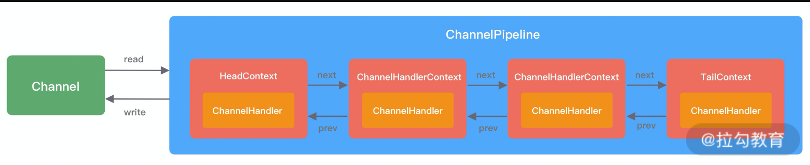

# NIO

核心组件：Selector、Channel、Buffer。它们的关系是：一个 Selector 管理多个 Channel，一个 Channel 可以往 Buffer 中写入和读取数据。Buffer 名叫缓冲区，底层其实是一个数组，会提供一些方法往数组写入读取数据。
buffer 会在切换读写模式后将 position 移动，读完在写时是将原数据覆盖

# netty

## channel 和 Buffer

Channel 表示一个数据源或数据目标，buffer 表示在内存中存储二进制数据的缓冲区。当使用 Channel 读取或写入数据时，需要通过 ByteBuffer 来进行数据传输。channel 将数据放入缓存中通过缓存来读取数据，具体地，我们可以将数据从 Channel 读取到 ByteBuffer 中，并将 ByteBuffer 的 position 设置为 0，然后再从 ByteBuffer 中读取数据。同样地，我们也可以将数据从 ByteBuffer 中写入到 Channel 中。

另外，不同类型的 Channel 可以支持不同的操作，例如 FileChannel 可以进行文件的读取和写入，SocketChannel 可以进行网络数据的读取和写入等。而 ByteBuffer 则是一个通用的缓冲区，可以用于任何类型的 Channel。

## ByteBuffer

缓存类
两种模式
写模式 ，向 buffer 中写入数据
读模式，从 buffer 中读取数据

ByteBuffer 的结构：

- ByteBuffer 对象本身并不存储任何数据，它只是一个指向底层数据结构的引用，底层数据结构通常是一个数组。
- 属性：
  - capacity 容量表示 ByteBuffer 对象最多能够存储的字节数
  - position 表示下一个要读取或写入的字节的位置
  - limit ByteBuffer 中当前可读或可写的最大字节数
  - 标记 标记是一个备忘位置，可以通过方法 mark() 标记当前位置，并通过 reset() 方法返回到该位置

操作缓存区：
分配缓存区空间：
allocate(int capacity)：创建指定容量的 ByteBuffer 缓冲区。

### netty 组件

netty 核心组件为:Channel、EventLoop 和 ChannelFuture
我们以工厂作业为例解释 Channel、EventLoop、Thread 和 EventLoopGroup 之间的作用：
Channel 相当于工厂的流水线上的机器
EventLoop 相当于工人
Thread 相当于发到某个流水线上的作业
EventLoopGroup 相当于工人的组长或者车间
所以一个 EventLoopGroup 管理多个 EventLoop 使用 Channel 处理 Thread 上的作业人（工人可以管理多个 channel 的 io 操作）

## ChannelPipeline

ChannelPipeline 是流水线
ChannelHandler 是流水线上的机器
