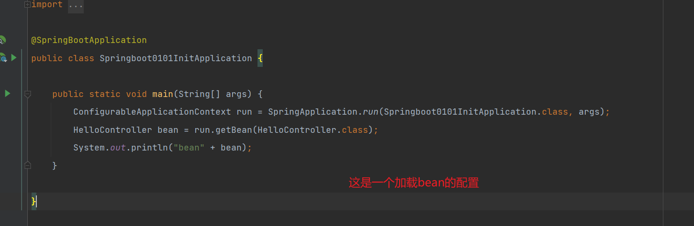
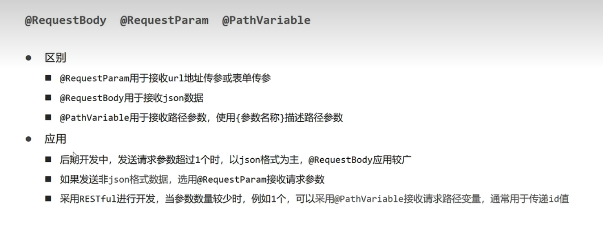
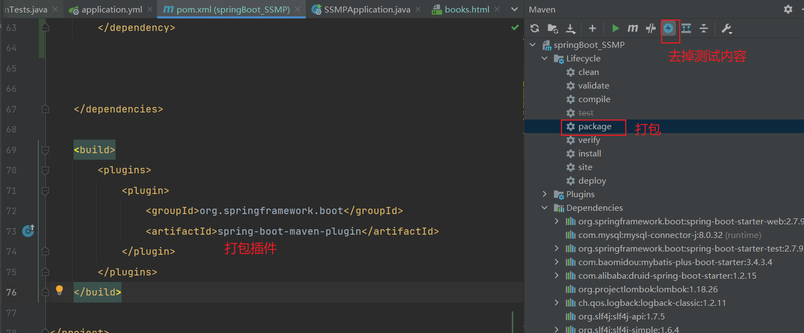
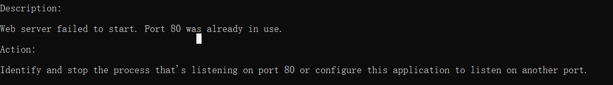
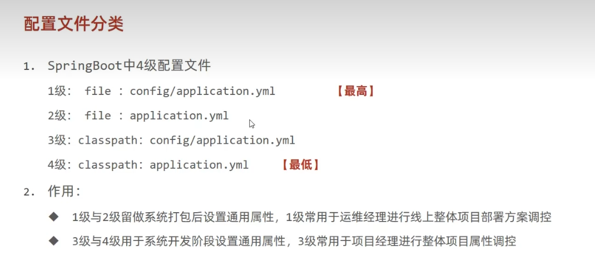

# Springboot 常见面试

springboot 的打包方式为 jar
引导类是 项目入口

起步依赖 传递依赖 解决了包名冲突的问题 \<parent>
start 减少依赖配置



yaml
YAML 使用 Python 风格的缩进来表示嵌套。它不能使用 Tab（制表符），因而使用空格来代替。没有通常的格式符号，如大括号、方括号、结束标记或引号。YAML 文件使用 .yml 或. yaml 扩展名。
语法：

·大小写敏感
·数据值前边必须有空格，作为分隔符
·使用缩进表示层级关系
。缩进时不允许使用 Tab 键，只允许使用空格（各个系统 Tab 对应的空格数目可能不同，导致层次混乱）。
·缩进的空格数目不重要，只要相同层级的元素左侧对齐即可
·#表示注释，从这个字符一直到行尾，都会被解析器忽略。
数据格式
对象：键值对的集合，又称为映射（mapping）/ 哈希（hashes） / 字典（dictionary）

```yaml
key:
  child-key: value
  child-key2: value2
```

数组：一组按次序排列的值，又称为序列（sequence） / 列表（list）

```yaml
- 数组1
- 数组2
```

引用

## restful



## 配置

properties>yml>yaml

## junit 整合

测试类要在引导类的范围下才能生效 或者手动指定引导类

```
@SpringBootTest(classes = SpringbootDemoJunitApplication.class)
```

## 整合 mybatisplus

导入坐标
配置文件
条件构造器

## 分页操作

分页数据

```vue
axios.get("/books/page/"+this.pagination.currentPage+"/"+this.pagination.pageSize,).then((res)=>{
console.log("分页") this.pagination.currentPage = res.data.data.current
this.pagination.total = res.data.data.total this.pagination.pagesize =
res.data.data.size this.dataList= res.data.data.records // console.log(res) })
```

将最后一行数据删除后 页码内容没有刷新
在 controller 中的分页 controller 中修改更新页码

```java
    @GetMapping("/page/{page}/{pageSize}")
    public R getPage(@PathVariable Integer page, @PathVariable Integer pageSize){
        IPage<Book> page1 = bookService.getPage(page, pageSize);
        if (page>page1.getPages()){
            page1 =  bookService.getPage((int) page1.getPages(), pageSize);
        }
        return new R(true,page1);
    }

```

## 运维

使用 maven 的 packing 打包 并跳过 test 测试内容


端口占用

查看占用的进程并杀死
找到所有含有 80 端口的进程找到对应的进程号

```cmd
netstat -ano | findstr 80
```


查看对应的任务

```cmd
tasklist | findstr 21996

```

强制终止进程

```cmd
taskkill -f -pid "21996"

```

## linux 发布

将 jar 包上传到 linux 中并使用 后台运行 javac -jar
终止服务需要找到进程端口杀死对应进程
在服务中修改临时属性 例如端口
属性加载的优先级 命令行大于配置文件

## 多配置文件

springboot 的配置文件的优先级


自定义配置文件

多环境开发
利用---分割线将文件中的环境进行分开

```yml
#应用环境
#设置启动环境
spring:
  profiles:
    active: dev
---
#test环境
server:
  port: 80
spring:
  datasource:
    druid:
      driver-class-name: com.mysql.jdbc.Driver
      url: jdbc:mysql://localhost:3306/mybatis_plus
      username: root
      password: enki
  profiles: test
mybatis-plus:
  global-config:
    db-config:
      #      table-prefix: tbl_
      id-type: auto

  configuration:
    log-impl: org.apache.ibatis.logging.stdout.StdOutImpl

---
spring: profiles:dev
server:
  port: 8082
```

将不同环境的配置文件进行命名 application-区分名称.yml
application-test.yml,application-pro.yml,application-区分名称.yml
主配置文件设置公共配置
其他环境设置局部配置

开启热部署

```xml
     <dependency>
            <groupId>org.springframework.boot</groupId>
            <artifactId>spring-boot-devtools</artifactId>
        </dependency>
```
