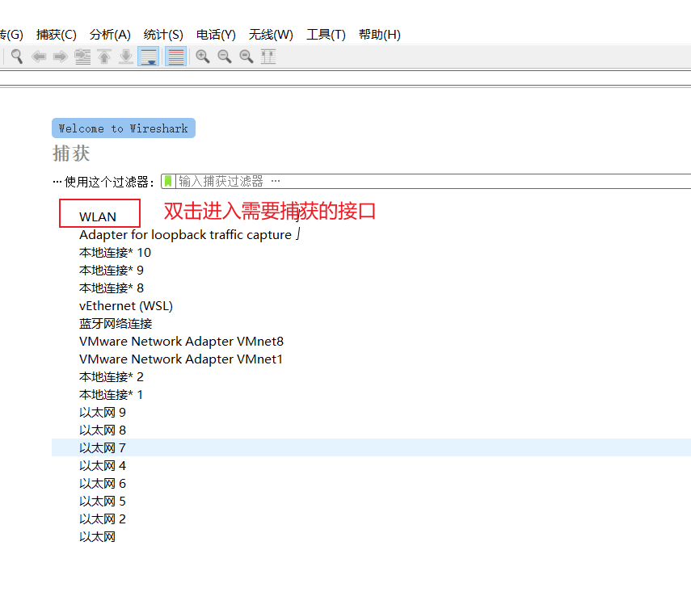
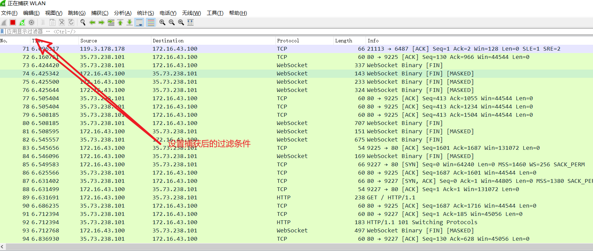
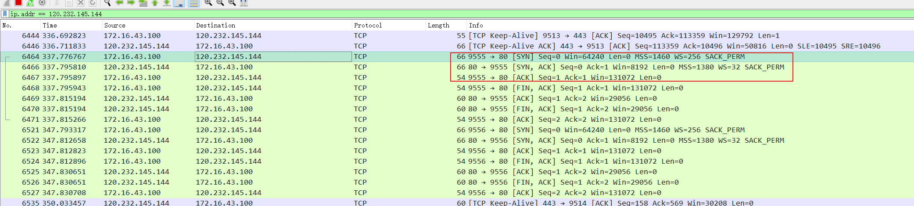
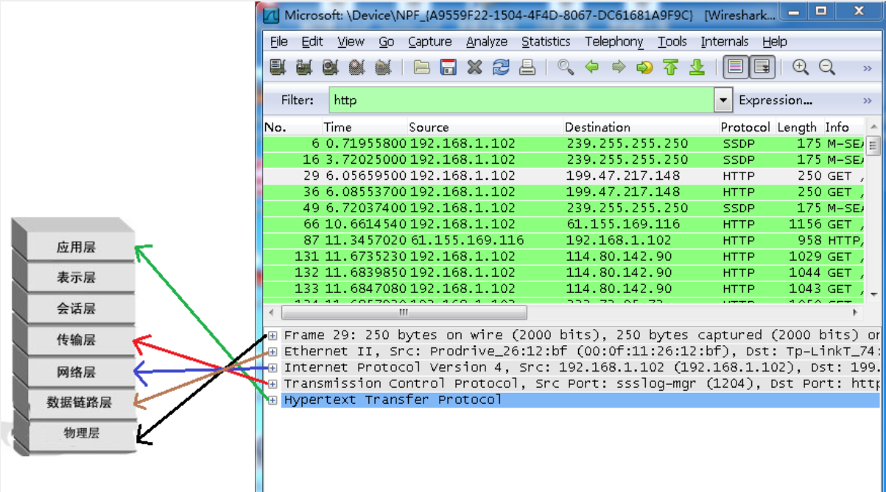

# 捕获接口

之后我们得到该接口的所有捕获信息，我们可以通过在捕获后设置条件过滤出我们想要的结果：

例如我们尝试查看 tcp 三次握手的过程，步骤如下：

- 在开启捕获后在浏览器中输入目标网址：wwww.baidu.com
- 通过 cmd ping www.baidu.com 得到网站的 ip 120.232.145.144
- 在 wireshark 中过滤出和www.baidu.com ip 相关的活动 输入 ip.addr == 120.232.145.144
  
  数据包详情区域：
  
  > https://www.cnblogs.com/linyfeng/p/9496126.html
  > （1）Frame: 物理层的数据帧概况
  > （2）Ethernet II: 数据链路层以太网帧头部信息
  > （3）Internet Protocol Version 4: 互联网层 IP 包头部信息
  > （4）Transmission Control Protocol: 传输层 T 的数据段头部信息，此处是 TCP
  > （5）Hypertext Transfer Protocol: 应用层的信息，此处是 HTTP 协议
