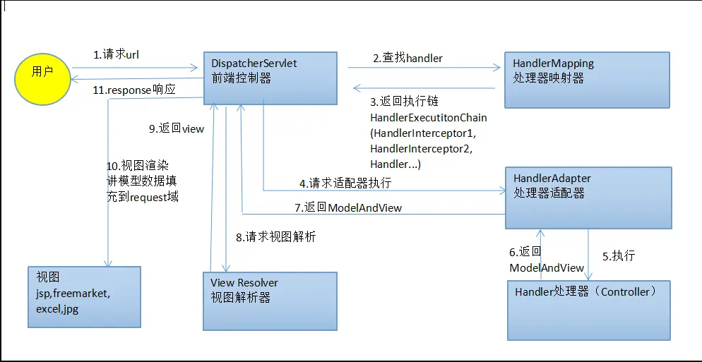

## Mysql 的 innoDB 和 myIsam (mesen)区别？

1. 事务支持：InnoDB 支持事务处理，而 MyISAM 不支持。如果需要对数据进行事务处理或者需要实现行级锁定，那么应该使用 InnoDB 存储引擎。
2. 锁机制：InnoDB 使用行级锁定，而 MyISAM 使用表级锁定。在高并发场景下，使用 InnoDB 可以更好地支持多用户并发访问，降低锁冲突。
3. 外键支持：InnoDB 支持外键，而 MyISAM 不支持。如果需要建立关联关系，需要使用 InnoDB 存储引擎。
   MyISAM 的索引为聚簇索引，数据结构是 B 树；InnoDB 的索引是⾮聚簇索引，数据
   结构是 B+树。

## Mysql 一条 sql 语句的执行流程？


## mybatis 中的#和$的区别

\#和\$都是用来表示占位符的符号 #符号用于预编译的 SQL 语句中，即在 SQL 语句中使用#符号后，预处理阶段 Mybatis 会将其替换为一个问号，到真正查询时替换为真实参数，而使用#{}传进来的参数，mybatis 默认会将其当成字符串,这种方式可以避免 SQL 注入攻击，并且能够更好地处理特殊字符。
而${}则是简单的替换，这可能会导致 SQL 注入
但假设传入的参数是表名 那么只能用${} 表名不加''

## 对泛型的理解

Java 泛型是一种在编译期间实现类型安全的机制。它允许程序员在定义类、接口和方法时使用一个或多个类型参数，然后在使用这些类、接口和方法时指定实际的类型。这样可以使代码更加通用，减少类型转换和运行时错误。Java 泛型可以应用于类、接口和方法
封装响应类

## hashMap

数据结构是 数 组 + 链 表 + 红⿊树,桶数组是⽤来存储数据元素，链表是⽤来解决冲突，红⿊树是为了提⾼查询的效率
如果链表长度>8&数组⼤⼩>=64，链表转为红⿊树,如果红⿊树节点个数<6 ，转为链表

## put

计算 Key 值的 hash
判断 桶 是否位空或者长度为 0，如果是则进⾏扩容操作 两倍扩容
根据 hash 值计算下标 如果对应⼩标正好没有存放数据，则直接插⼊即可否则需要覆盖。
如果没有找到相同的键，则创建新的节点并插入到链表或树中，然后检查链表长度是否超过 8 超过则链表转为树。
最后所有元素处理完成后，判断是否超过阈值； threshold ，超过则扩容

## hashMap 如何线程安全

使用 ConcurrentHashMap 类而不是 HashMap。ConcurrentHashMap 是线程安全的哈希表，适用于高并发环境。

使用 Collections.synchronizedMap 方法将 HashMap 转换为线程安全的 Map。该方法返回一个同步的 Map 对象，对其所有操作都进行同步处理。

使用锁来保护 HashMap 的访问。例如，可以使用 synchronized 关键字或者 ReentrantLock 来保护 HashMap 的读写操作。

## 为什么是 2 的倍数

hash 表中使用取模运算计算桶的位置 如果是 2 的幂次使用位运算可以替代取模运算快速的得到 hash 位置
可以将原先的数据很好的已经产⽣ hash 碰撞的元素在扩容后的数组中，因为 HashMap 的初始容量是 2 的次幂，扩容之后的长度是原来的⼆倍，新的容量也是 2 的次幂，所以，元素，要么在原位置，要么在原位置再移动 2 的次幂。

## 查找

使⽤ hash 函数，获取新的哈希值 2. 计算数组下标，获取节点 3. 当前节点和 key 匹配，直接返回 4. 否则，当前节点是否为树节点，查找红⿊树 5. 否则，遍历链表查找

## mysql 索引

MySQL 的默认存储引擎是 InnoDB，它采⽤的是 B+树结构的索引
⾮叶⼦节点只不存储真实的数据，只存储指引搜索⽅向的
数据项，叶⼦节点之间使⽤双向指针连接，最底层的叶⼦节点形成了⼀个双向有序链表，只有叶⼦节点才会存储数据，可以进⾏范围查询。

## 索引分类

主键索引: InnoDB 主键是默认的索引，数据列不允许重复，不允许为 NULL，⼀个表只能有⼀个
主键。
唯⼀索引: 数据列不允许重复，允许为 NULL 值，⼀个表允许多个列创建唯⼀索引。
普通索引: 基本的索引类型，没有唯⼀性的限制，允许为 NULL 值。
组合索引：多列值组成⼀个索引，⽤于组合搜索，效率⼤于索引合并

## jvm 的内存结构


> 栈运行，堆存储
> 由于堆是所有线程共有的，从堆里面申请内存要进行相关的加锁操作，因此申请堆内存的复杂度和时间开销比栈要大很多；从栈里面申请内存，虽然又简单又快，但是栈的大小有限，分配不了太多内存。
> 将内存分为堆和栈类似

## 序列化

Java 序列化是指把 Java 对象转换为字节序列的过程，而 Java 反序列化是指把字节序列恢复为 Java 对象的过程：
实现序列化：Java 对象序列化是将实现了 Serializable 接口的对象转换成一个字节序列
实现步骤 创建 ObjectOutPutStream 输出流调用 ObjectOutputStream 对象的 writeObject 得到可序列化对象。之后进行反序列化 创建 ObjectInputStream 输入流 调用 readObject 得到序列化对象
作用：使得数据能够在不同的程序之间进行传输或存储，并且能够被正确地重新解析和还原，这样就可以方便地实现跨平台、跨语言的数据传输和共享。此外，在一些分布式系统中，序列化也可以用于将数据存储到磁盘或内存中，以便稍后重用

JSON 序列化就是将数据对象转换成 JSON 字符串

```java @Test
    void contextLoads() {
        try {
            ObjectOutputStream objectOutputStream = new ObjectOutputStream(new FileOutputStream("D:\\object.txt"));
            User person = new User("张三", 12);
            objectOutputStream.writeObject(person);
        } catch (IOException e) {
            e.printStackTrace();
        }
    }

    @Test
    public void input() {
        try {
            ObjectInputStream objectInputStream = new ObjectInputStream(new FileInputStream("D:\\object.txt"));
            User o = (User)objectInputStream.readObject();
            System.out.println(o);
        } catch (IOException e) {
            e.printStackTrace();
        } catch (ClassNotFoundException e) {
            e.printStackTrace();
        }

    }
```

## Exception 和 Error 有什么区别

在 Java 中，所有的异常都有⼀个共同的祖先 java.lang 包中的 Throwable 类。 Throwable 类有两个重要的⼦类:exception 和 error
Exception :程序本身可以处理的异常，可以通过 catch 来进⾏捕获 Exception ⼜可以分为
Checked Exception (受检查异常，必须处理) 和 Unchecked Exception (不受检查异常，可以不
处理)数组越界
Error 属于程序⽆法处理的错误，如 Java 虚拟机运⾏错误（ Virtual MachineError ）、虚拟机内存不够错误
( OutOfMemoryError )、类定义错误（ NoClassDefFoundError ）等 。这些异常发⽣时，Java 虚拟机（JVM）⼀般会选择线程终⽌


## Springboot 知道哪些注解

@Component 声明为 bean
@Configuration spring 配置类组件
@Service 在业务层中声明为 bean 组件
@Controller 用于标注控制层组件类
@RestController 在@Controller 的基础上增加了@ResponseBody 注解，用于标注 RESTful 风格的控制层组件类
@RequestMapping 将 url 的请求映射到 controller 中
@GetMapping 用于映射 HTTP GET 请求到处理器方法上
@PuTMapping
@PostMapping
@RequestParam 用于获取请求参数值 从请求参数中获取参数值
@PathVariable 用于获取 URL 路径参数值 写在方法参数列表内
@RequestBody 获取请求体内容
@ResponseBody 封装响应体
restful 通过 get put post delete 统一风格的获取资源的约束

## 启动类常用注解

@SpringBootApplication
@SpringBootApplication 由以下三个注解组成：
@SpringBootConfiguration：指定该类是 Spring Boot 应用程序的配置类，通常放置在主类中。
@EnableAutoConfiguration：启用 Spring Boot 的自动配置机制，可以根据项目的依赖自动推断需要配置哪些组件。
@ComponentScan：指定扫描代码包的路径，查找带有@Component、

@Service、@Repository、@Controller 等注解的类，并将其注册为 Spring Bean
@MapperScan("mapper 接口包路径信息") ：扫描指定包下所有的接口类
@EnableTransactionManagement ：开启声明式事务的支持。添加该注解后，Spring 容器会自动扫描被 @Transactional 注解的方法和类。

### springMVC 的执行流程


前端请求发送到 web 容器中，通过 dispatchServlet 将请求传递给 handlerMapping 从而确定处理器，生成处理器执行链 HandlerExecutionChain(包括处理器对象和处理器拦截器)一并返回给 DispatcherServlet ，DispatcherServlet 请求处理器适配器执行对应的 controller 完成业务逻辑之后，Controller 将结果返回给 DispatcherServlet。之后 DispatcherServlet 将结果传递给视图解析器将数据和视图结合再经过 DispatcherServlet 渲染并最终响应给前端

## ArrayList 遍历的几种方式

看成数组
for 循环遍历
增强 for 循环
foreach 遍历
迭代器遍历
lambda 表达式流遍历

````java
ArrayList<String> list = new ArrayList<>();
// 添加元素到list中...
list.stream().forEach((element) -> {
    // 对元素进行操作...
});```
````

## ArrayList

默认 10 之后 1.5 倍扩容，将原数组拷贝到新数组中
为什么 1.5 倍 太大浪费空间 太小会频繁扩容
因为 1.5 可以充分利用移位操作，减少浮点数或者运算时间和运算次数。
线程安全
使用 collections.synchronizedList(new ArrayList());
使用 synchronized

vector 默认为 10 两倍扩容 浪费空间 线程安全 需要连续的空间 数据太多容易失败

## redis 应用场景有哪些

缓存：Redis 最常用的应用就是缓存，将经常被查询的数据放入缓存中，在下次请求时直接从缓存中获取，可以有效减少数据库的压力，提升系统的响应速度。

消息队列：Redis 可以作为消息队列来使用，支持发布/订阅模式（Pub/Sub），多个消费者可以同时监听同一个频道，当有新消息发送到该频道时，所有订阅了该频道的消费者都会收到相应的消息。

分布式锁：Redis 提供了原子性操作的特性，可以很方便地实现分布式锁的功能，在分布式环境中保证共享资源的访问互斥。

计数器和排行榜：Redis 的 INCR 操作可以实现简单的计数器功能，适用于实时统计用户在线时长、网站 PV 等；同时，Redis 对有序集合的支持也可以方便地实现排行榜和 Top N 等功能。

数据持久化：Redis 支持数据持久化，可以将内存中的数据定期或按照条件写入磁盘，以保证数据不会因为系统故障而丢失

## 缓存雪崩和缓存穿透是什么，怎么解决？

缓存雪崩是指在同一时段大量的缓存 key 同时失效或者 Redis 服务宕机，导致大量请求到达数据库，带来巨大压力。

穿透 用户请求的数据在缓存中和数据库中都不存在，不断发起这样的请求，给数据库带来巨大压力

### 缓存穿透的解决方案有哪些？

- 缓存 null 值
- 布隆过滤
- 增强 id 的复杂度，避免被猜测 id 规律
- 做好数据的基础格式校验
- 加强用户权限校验
- 做好热点参数的限流

### 缓存雪崩问题及解决思路

缓存雪崩是指在同一时段大量的缓存 key 同时失效或者 Redis 服务宕机，导致大量请求到达数据库，带来巨大压力。

解决方案：

- 给不同的 Key 的 TTL 添加随机值
- 利用 Redis 集群提高服务的可用性
- 给缓存业务添加降级限流策略
- 给业务添加多级缓存

### 2.8 缓存击穿问题及解决思路

缓存击穿问题也叫热点 Key 问题，就是一个被高并发访问并且缓存重建业务较复杂的 key 突然失效了，无数的请求访问会在瞬间给数据库带来巨大的冲击。

常见的解决方案有两种：

- 互斥锁
- 逻辑过期

## redis 分布式锁

在集群情况下加锁，利用 setnx 当 key 不存在是操作，key 存在不执行

```java
  // 获取锁
    Boolean success = stringRedisTemplate.opsForValue()
            .setIfAbsent(KEY_PREFIX + name, threadId + "", timeoutSec, TimeUnit.SECONDS);
```

## 、用 MyBatisPlus 做一个查询有哪几种写法

利用提供的 BaseMapper 中的查询语句 selectById selectList
使用条件构造器 QueryWrapper
使用 LambdaQueryWrapper
QueryChainWrapper 链式查询

```java
// 查询操作链式调用
List<User> userList = new QueryChainWrapper<>(userMapper)
        .eq("age", 20)
        .like("name", "Tom%")
        .list();
```

### 类的加载机制

Java 虚拟机把描述类的数据从 Class 文件加载到内存，并对数据进行校验、转换解析和初始化，最终形成可以被虚拟机直接使用的 Java 类型称为类的加载
JVM 加载类的过程分为三个步骤：加载、链接（验证，准备，解析）、初始化
加载阶段：

- 由类的全限定名找到对应类的**二进制字节流文件**
- 将该字节流的静态存储数据结构转为 **JVM 运行时数据区的数据结构**
- 在 Java **堆中生成一个代表这个类的 java.lang.Class 对象**，作为对方法区中这些数据的访问入口
  Java 类加载机制遵循**双亲委派模型**，即当一个类加载器收到类加载请求时，它首先将该请求委派给父类加载器处理，如果父类加载器还存在其它父类，则依次委派，直到委派到最顶层的启动类加载器。如果所有的父类加载器都无法加载该类，则该类加载器才会尝试自己加载。

### 双亲委派机制

JVM 的双亲委派机制是指，当一个类加载器收到了类加载请求时，它首先会把这个请求委托给它的父类加载器去完成。如果父类加载器还存在父类加载器，则再将请求向上委托，直到顶层的启动类加载器。只有当父类加载器无法完成这个加载请求（即在它的搜索范围内找不到对应的类）时，子类加载器才会尝试自己去加载这个类。
好处在于可以保证 Java 核心库中定义的类不会被用户自定义的类所替代，防止用户恶意篡改核心类，确保所有的类都是唯一的，保证了核心 api 的安全性，有效避免 Java 类库的重复加载，避免了资源浪费

### 反射

Java 反射就是在运行状态中，对于任意一个类，都能够知道这个类的所有属性和方法；对于任意一个对象，都能够调用它的任意方法和属性；并且能改变它的属性。
注解利用默认无参构造方法进行实例化反射的 newInstance()无参对应类型也没有无参构造则报错

- 获取 class 对象的方式的主要有三种
  - 类名.class()
  - 对象.getClass()
  - Class.forName(全限定类名)

获取成员变量：
通过 Class 类的 getDeclaredField()或 getDeclaredFields()方法获取

创建实例
得到 class 对象
class1.newInstance() ;
向下转型
或者得到 class 的构造器对象

```java
Class<?> cls = Class.forName("com.example.ClassName");
//写入构造器参数类型 int.class
Constructor<?> constructor = cls.getConstructor(parameterTypes);
Object obj = constructor.newInstance(args);

```

反射使用步骤：
获取想要操作的类的 Class 对象
调用 Class 类中的方法

## 多线程控制的计数器

CountDownLatch 能够使一个线程在等待另外一些线程完成各自工作之后，再继续执行。它相当于是一个计数器，这个计数器的初始值就是线程的数量，每当一个任务完成后，计数器的值就会减一，当计数器变为 0 时，在 CountDownLatch 上 await 的线程就会被唤醒，继续执行其他任务,它可以让某个线程等待直到其他线程完成一组操作后再继续执行

## hashMap

为什么两倍扩容
第⼀个原因是为了⽅便哈希取余
因为 HashMap 的初始容量是 2 的次幂，扩容之后的长度是原来的⼆倍，新的容量也是 2 的次幂，所以，元素，要么在原位置，要么在原位置再移动 2 的次幂
线程安全
hashTable
Collections.synchronizedMap

## stream 流

jdk8 新加的特性 用来
操作集合，是一种声明式编程 可以很好的提高代码的可读性和简洁性，操作分为惰性求值不产生新集合 和及早求值产生新集合
可以用来对集合进行过滤，将集合小写替换为大写 对集合进行排序

```java
/**
 * 通过Stream sorted对学生成绩进行排序
 * @param students 待排序学生集合
 * @return 排好序的学生集合
 */
private List<Student> sortedByStreamSorted(List<Student> students) {
    return students.stream()
                   .sorted(Comparator.comparing(Student::getScore))
                   .collect(Collectors.toList());
}

```

## IOC

控制反转 具体实现为 DI 依赖注入 由 spring 容器负责组件的装配
在 Spring 中，依赖注入有多种方式，包括构造函数注入、setter 方法注入、字段注入

## AOP

⾯向切⾯编程
AOP 主要应用于日志记录，性能统计，安全控制，事务处理等方面，实现公共功能性的重复使用
降低模块与模块之间的耦合度，提高业务代码的聚合度。（高内聚低耦合）
提高了代码的复用性
提高了代码的复用性
可以在不影响原有的功能基础上添加新的功能
使用 日志 log4j
概念
在 AOP 中有以下几个概念：

AspectJ：切面，只是一个概念，没有具体的接口或类与之对应，是 Join point，Advice 和 Pointcut 的一个统称。

Join point：连接点，指程序执行过程中的一个点，例如方法调用、异常处理等。在 Spring AOP 中，仅支持方法级别的连接点。

Advice：通知，即我们定义的一个切面中的横切逻辑，有“around”，“before”和“after”三种类型。在很多的 AOP 实现框架中，Advice 通常作为一个拦截器，也可以包含许多个拦截器作为一条链路围绕着 Join point 进行处理。

Pointcut：切点，用于匹配连接点，一个 AspectJ 中包含哪些 Join point 需要由 Pointcut 进行筛选。

Introduction：引介，让一个切面可以声明被通知的对象实现任何他们没有真正实现的额外的接口。例如可以让一个代理对象代理两个目标类。

Weaving：织入，在有了连接点、切点、通知以及切面，如何将它们应用到程序中呢？没错，就是织入，在切点的引导下，将通知逻辑插入到目标方法上，使得我们的通知逻辑在方法调用时得以执行。

AOP proxy：AOP 代理，指在 AOP 实现框架中实现切面协议的对象。在 Spring AOP 中有两种代理，分别是 JDK 动态代理和 CGLIB 动态代理。

Target object：目标对象，就是被代理的对象。

## 三次握手

首先 一个 TCP 的连接由一对套字节构成，对应每一端的（IP 地址和端口）

1. 客户端向服务器发送 SYN 报文，表示客户端发出连接请求报文段，其中标志位 SYN=1，并指明要连接的端口号和随机选择一个初始序号 seq=x。

2. 服务器收到 SYN 报文，回复 ACK 和 SYN 报文，服务器收到客户端的 SYN 报文后，如果同意建立连接，则发出确认报文 ACK=1，SYN=1，确认号 ack=x+1，将客户端发送的序列号+1 作为 ack 值这样可以防止数据丢失，同时也选择了自己的初始序列号 seq=y，将 ACK 和 SYN 放入一个报文段中，一起发给客户端。

3. 客户端收到 ACK 和 SYN 报文，回复 ACK 报文，会发送确认报文 ACK=1，确认号 ack=y+1，序号 seq=x+1，将 ACK 放入报文段中，然后一起发给服务器。

## 挥手

客户端打算关闭连接，此时会发送一个 TCP 首部 FIN 标志位被置为 1 的报文，也即 FIN 报文，之后客户端进入 FIN_WAIT_1 状态。
服务端收到该报文后，就向客户端发送 ACK 应答报文，接着服务端进入 CLOSE_WAIT 状态。
客户端收到服务端的 ACK 应答报文后，之后进入 FIN_WAIT_2 状态。
等待服务端处理完数据后，也向客户端发送 FIN 报文，之后服务端进入 LAST_ACK 状态。
客户端收到服务端的 FIN 报文后，回一个 ACK 应答报文，之后进入 TIME_WAIT 状态
服务端收到了 ACK 应答报文后，就进入了 CLOSE 状态，至此服务端已经完成连接的关闭。
客户端在经过 2MSL 一段时间后，自动进入 CLOSE 状态，至此客户端也完成连接的关闭。

## ThreadLocal

ThreadLocal 可以解释成线程的局部变量,也就是说一个 ThreadLocal 的变量只有当前自身线程可以访问，别的线程都访问不了，那么自然就避免了线程竞争。用于登录的 session 管理
