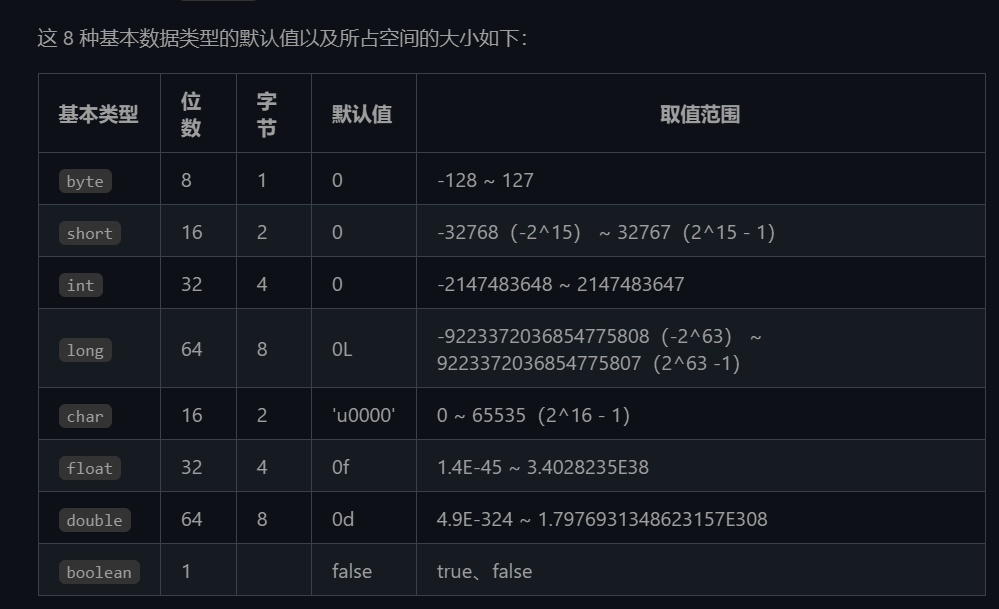
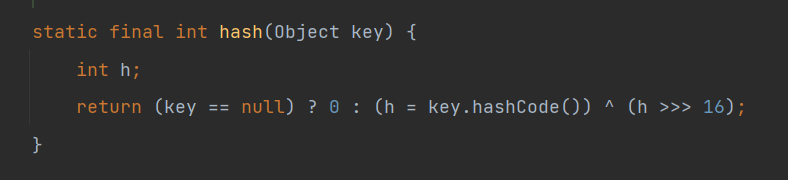

### 静态变量和静态常量

静态变量是被 static 修饰的变量 属于类变量，类加载时被初始化，只有一份拷贝，可以被多个对象所共享，
静态常量是被 static final 所修饰的，在类加载时初始化同时不能够再改变值，可以使用类名.的方式访问，一般存储参数配置等相关的信息。

### java 基本类型以及长度

### String 为什么不是基本数据类型 为什么是不可变的

String 是对象不是基本数据类型。String 类被 final 所修饰，不能被继承。同时 String 保存的字符串数组被 final 修饰且为私有。并且没有提供修改字符串数组的方法
为什么是不可变的：

1. 方便实现字符串常量池，当两个字符串变量内容一样则指向同一个字符串对象，若字符串可变 会同时修改多个指向该字符的引用。就无法实现常量池的思想
2. 可以方便的作为 hashMap 中的 key。key
3. 缓存 HashCode 因为 String 不可变不需要每次重新计算 String 对象的 hashcode
4. 不用考虑线程安全问题，不会出现多线程并发修改产生的问题

### Java 中字符串拼接方式

Java 对象使用+进行字符串的拼接，每次的拼接都会调用 stringBuilder 对象并调用 append 方法实现，在将拼接得到的对象 tostring 会一个 string

### final finalize finally 在 Java 的区别

final 修改类方法变量
修饰类 类不能被继承，即类不能被拓展
修饰方法 方法不能被重写
修改变量 变量初始化后不能够被改变

finalize 是 Java 一个方法名 用于对象清理和资源释放的，当对象被垃圾回收器回收时会被调用

finally 关键字 和 try catch 结合，处理异常代码，try 中的代码块执行完成后无论是否有异常抛出都会执行 finally 方法。同时 finally 也能够确保资源的最终释放如文件的关闭

### 传参如果是 string 是值传递还是引用传递

Java 只有值传递

### Java 中的序列化与反序列化

序列化的目的是将 Java 的对象转化为字节流，从而方便存储和传输。
反序列化时将字节流重新转为 Java 对象的过程。为了实现序列化可以实现 Java 的 Serializable 接口并使用同时指定 serialVersionUID 的值控制序列化的版本。
并使用 ObjectInputStream 或者 ObjectOutPutStream 来操作字节流。
使用 transient 关键字来选择某个字段不进行序列化，

## 异常

### 异常机制

### HashMap

- 扩容机制
  如果未指定初始容量 hashMap 会默认初始化容量为 16.
  若指定了初始容量且部位 2 的幂次，则会选择接近指定容量的最小 2 的幂次数作为初始容量。
  当 hashMap 的 put 操作时，需要判断加入 map 后的数据元素是否大于初始容量\*0.75 若是则进行原先容量的两倍扩容。

- 散列函数
  
  将计算得来的 hashcode 值右移 16 位，和原先的哈希值相亦或是的高 16 位和低 16 位均参与运算。减少冲突 散列均匀

### hashMap 的并发问题

## Java 的函数式编程

通过合并现有代码来生成新功能而不是从头开始编写所有内容，我们可以更快地获得更可靠的代码。

### Lambda 表达式

使用最小可能语法编写的函数定义

### 方法引用

方法引用是用来直接访问类或者实例的已经存在的方法或者构造方法。方法引用提供了一种引用而不执行方法的方式，它需要由兼容的函数式接口构成的目标类型上下文。

> Lambda 表达式是一种匿名函数，它允许你以更简洁的方式定义行为，通常用于替代匿名内部类,包含参数，箭头符号和函数体
> 函数式接口是只包含一个抽象方法的接口
