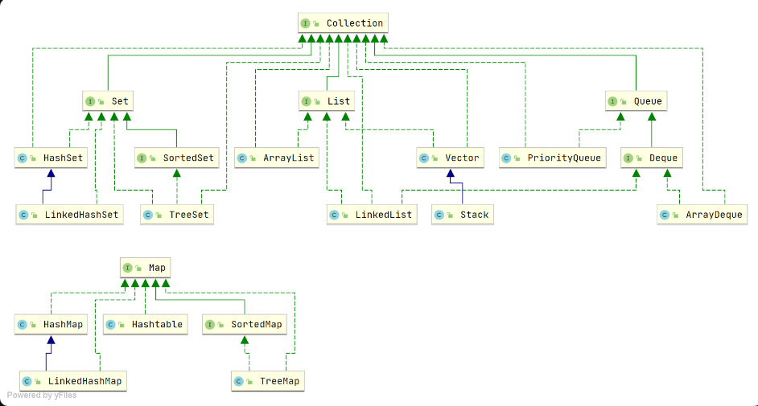

## 框架

集合可以更灵活有效的存储对象，相比于数组大小可变支持泛型，元素操作方便

### ArrayList

初始容量 10 1.5 倍扩容 将原数组拷贝给过去进行扩容

> 什么情况下使用 ArrayList 和 LinkedList
> Arraylist 底层是 Object[]，空间连续，支持随机访问，适用于查找和遍历的操作
> LinkedList 底层是双向链表，内存空间不连续，适用于快速的插入和删除操作

### 遍历方式

遍历方式 fori foreach 增强 for 问题出在遍历时候进行修改
对 ArrayList 遍历并修改会触发快速失败机制会抛出 Concurrent Modification Exception。原因在于集合在遍历过程中改变了 modcount 值，与迭代器 next 的 Modcount 值不相同则报错触发快速失败机制，

### 说一说 ConcurrentHashMap 的实现原理

ConcurrentHashMap 和 HashMap 的功能基本一致，区别在于 ConcurrentHashMap 是线程安全的

### 说一说 HashMap 的扩容机制

当 hashMap 中的元素大于数组长度\*阈值后需要进行扩容。将所有元素散列到扩容后的容器中。存放 key 的桶数组容量固定，在 jdk1.8 后扩容不需要进行重新计算 hash 进行定位，扩容后的元素要么在原先位置要么在原先位置加上旧容量的长度

### redis 字典的 rehash 为啥是渐进式的

这样做的原因在于，若 hash 桶的个数比较少那么服务器可以在瞬间就将
这些键值对全部 rehash 到 新的表中，但是，如果哈希表里保存的键值对数量不是四个，而是四百万、四千方基至四亿个键值对，那么要一次性将这些键值对全部 rehash 新的表中会造成服务器在一段时间内停止服务。
**渐进式的步骤**
在 h[0]表中维护一个索引计数指针，每次对字典执行操作之外在对计数指针上的键值对进行 rehash 到 h[1]表中直到所有键值对 rehash 完成。同时渐进式的 rehash 会在两张表中执行相同的删除、查找、更新操作，但添加操作只在新表 h[1]中进行，保证 h[0]只减不增，

### 为什么 HashMap 的数组长度要取 2 的整数幂

在得到 hash 值后，对其进行取模运算从而得到对应的数组下标（将数组长度-1 与& hash 值）而 2 的幂次方长度的数组-1 会使得 hash 值高位为 0 只保留低位

方便取 hash
方便散列

### hashMap 多线程为什么不安全

1.7 之前的头插法会造成链表成环，
1.8 在多线程 put 操作下会出现插入元素丢失的情况，如果两个线程的 key 相同会出现覆盖从而 丢失。

可以使用 HashTable
concurrentHashMap

### HashMap 的死锁情况

1.7 版本中多线程情况下头插法会使得链表发生翻转，从而形成环造成死循环产生死锁

### 假设有个 hashmap 上锁 put，get 不上锁会有线程安全问题吗？为什么？

对 HashMap 的 put 操作进行了锁定，而对 get 操作没有进行锁定，通常情况下是会有线程安全问题的
