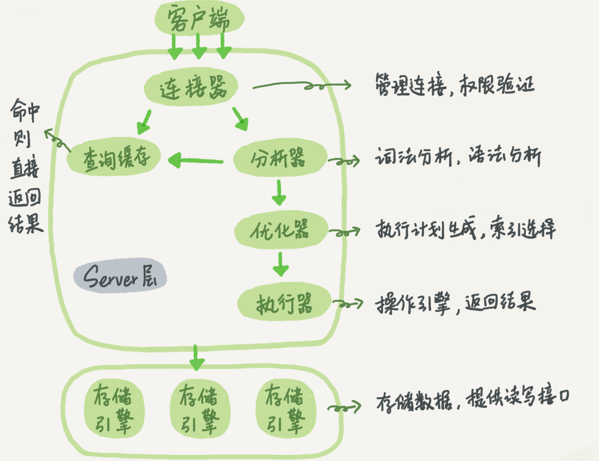
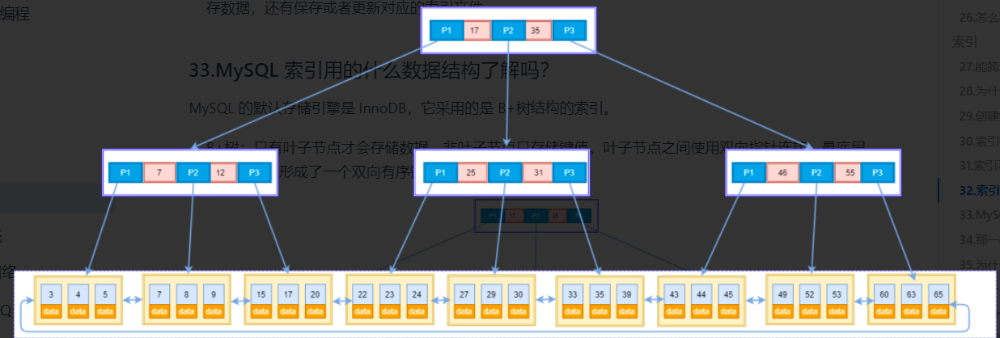
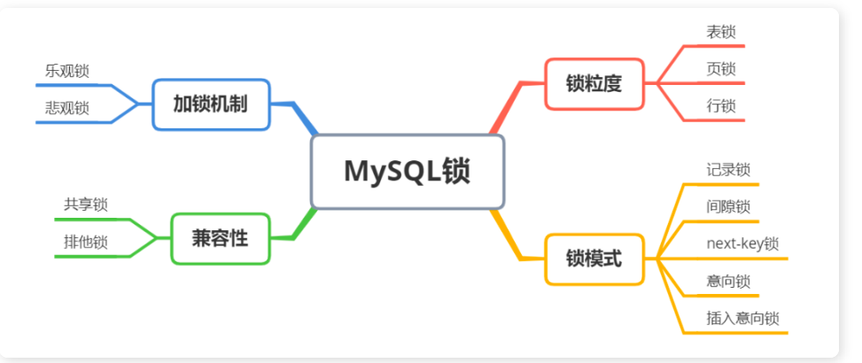

## 范式

## 当一个查询语句同时出现了 where、group by、having 和 order by 、join 时，执行顺序如下

查表- 选字段 - 对字段分组- 过滤-筛选-排序

- from join 先执行得到关联的表
- WHERE 子句：首先执行 WHERE 子句，提取满足条件的记录。
- GROUP BY 子句：然后按照 GROUP BY 子句中指定的列进行分组，一般结合分组聚合函数 COUNT、MAX、SUM 等在 select 中对分组进行过滤。
- HAVING 子句：分组后接着使用 HAVING 子句进行过滤保留符合条件的分组。
- SELECT 子句：接着执行 SELECT 子句，选择需要显示的列。
- ORDER BY 子句：最后根据 ORDER BY 子句中指定的列对结果进行排序。
  > having 只能用在 group by 之后
  > where 肯定在 group by 之前
  > 注意若选取的列名和关键字相同 用""包起来表示别名

## 数据库架构

主要分为 Server 层，存储引擎层

- Server 层：大多数 MySQL 的核心服务功能都在这一层，包括查询解析、分析、优化、缓存以及所有的内置函数（例如，日期、时间、数学和加密函数），所有跨存储引擎的功能都在这一层实现：存储过程、触发器、视图等。
- 存储引擎层： 负责数据的存储和提取。其架构模式是插件式的，支持 InnoDB、MyISAM、Memory 等多个存储引擎。现在最常用的存储引擎是 InnoDB，它从 MySQL 5.5.5 版本开始成为了默认存储引擎。
  > server 层通过 API 和存储引擎通信，屏蔽了不同存储引擎之间的差异。

## 一条 SQL 查询语句在 MySQL 中如何执行的



1. 查询缓存：连接器和客户端建立连接后，查询数据库缓存，如果之间执行过同样的语句则直接从内存中读取结果（执行缓存失效的情况非常频繁，MySQL8.0 后取消 ）
2. 词法分析：没有命中缓存，将解析 sql 语句为执行做准备，需要先用分析器进行词法和语法分析，判断语句是否正确。
3. 优化器优化：将正确的 sql 语句进行优化，如是否使用索引，查询表的顺序等等
4. 执行：最后通过执行器去执行语句，返回执行结果

## MySql 的存储引擎

mysql 主要分为两种存储引擎，分别是 MylSAM 和 Innodb。两者的区别在于 MyIsm 只支持表锁且索引的为非聚簇索引结构为 B 树，而 innodb 引擎支持行锁，索引分为聚簇索引和非聚簇索引同时结构为 B+树

## 索引

### 说一下索引是实现

MySQL 的默认存储引擎是 InnodB,innodb 默认的索引结构为 B+树，B+树只有叶子节点才存储数据，非叶子节点存储键值，指向了索引的方向。叶子节点的结构为双向有序的数据链表，因此他可以进行范围查找。同时 B+树一个节点可以存储多个孩子，使得 B+树显得更加矮胖，从而 B+树可以减少磁盘的查询次数并且不同于普通的二叉树，只需要遍历一次就可以得到所有的叶子数据，从而提高查找效率，

### 为什么使用 B+树

B+树：只有叶子节点才会存储数据，非叶子节点只存储键值，指向索引方向。叶子节点之间使用双向指针连接，最底层的叶子节点形成了一个双向有序链表,可以进行范围查找，同时为了维护底层叶子的有序性，在插入和删除时候需要对索引进行维护涉及到页面分裂和页面合并等操作。


> 为什么不用普通二叉树？

普通二叉树存在退化的情况，如果它退化成链表，相当于全表扫描。平衡二叉树相比于二叉查找树来说，查找效率更稳定，总体的查找速度也更快。

> 为什么不用平衡二叉树呢？

平衡二叉树每个节点只存储一个键值和数据的，B+树可以存储多个，同时树的高度也会更低那么对应的查找磁盘的次数也会少，

> 为什么用 B+ 树而不用 B 树呢

B+Tree 的磁盘读写能力相对于 B Tree 来说更强，IO 次数更少，B+Tree 永远是在叶子节点拿到数据，不需要遍历整个树就能拿到所有数据，所以 IO 次数是稳定的，叶子节点按照顺序排序，B+树的排序能力更强

### Innodb 索引

- `InnoDB`使用了`B+树`索引模型，所以数据都是存储在 B+树中的。每一个索引在`InnoDB`里面对应一棵 B+树。
- 索引类型分为`主键索引`（`聚簇索引`）和`非主键索引`（`二级索引`）。主键索引的叶子节点存的是整行数据。非主键索引的叶子节点内容是主键的值。

### 索引分类

根据叶子的内容索引分为主键索引和非主键索引（只在叶子节点存放主键信息）

- 主键索引: InnoDB 主键是默认的索引，数据列不允许重复，不允许为 NULL，一个表只能有一个主键。主键索引的叶子节点存的是整行数据，在 innodb 中主键索引成为聚簇索引
- 唯一索引: 数据列不允许重复，允许为 NULL 值，一个表允许多个列创建唯一索引。
- 普通索引: 基本的索引类型，没有唯一性的限制，允许为 NULL 值。
- 组合索引：多列值组成一个索引，用于组合搜索，效率大于索引合并
  > 基于非主键索引的查询需要多扫描一棵索引树

### 主键索引和非主键索引区别

如果我执行 `select * from T where k between 3 and 5`，需要执行几次树的搜索操作，会扫描多少行？
其中 k 是非聚簇索引

- 查询过程
  现在非聚簇索引中查找 3 得到对应的主键，到聚簇索引中找到主键对应的行数据（第一次回表）
  现在非聚簇索引中查找 5 得到对应的主键，到聚簇索引中找到主键对应的行数据（第二次回表）
  在 k 索引树取下一个值 k=6，不满足条件，循环结束(第三次查询)。
  > 可以看到，这个查询过程读了 k 索引树的 3 条记录，回表了两次。在这个例子中，由于查询结果所需要的数据只在主键索引上有，所以不得不回表。

### 索引优化

- sql 语句修改为`select ID from T where k between 3 and 5`，这时只需要查 ID 的值，而 ID 的值已经在 k 索引树上了，因此可以直接提供查询结果，不需要回表。也就是说，在这个查询里面，索引 k 已经“覆盖了”我们的查询需求，我们称为`覆盖索引`，避免了回表。
- 由于`覆盖索引`可以减少树的搜索次数，显著提升查询性能，所以使用覆盖索引是一个常用的性能优化手段。
  > `索引下推优化`能减少回表查询次数，提高查询效率。
  > 索引下推的下推其实就是指将部分上层（Server 层）负责的事情，交给了下层（引擎层）去处理。使用索引下推当被索引的列为判断条件时，先一步 过滤出符合条件的数据没，减少了回表的次数，Innodb 索引的数据和索引在一起不存在回表，也就是说只有二级索引可以使用索引下推

### 如何查看执行计划

https://tobebetterjavaer.com/sidebar/sanfene/mysql.html#_26-%E6%80%8E%E4%B9%88%E7%9C%8B%E6%89%A7%E8%A1%8C%E8%AE%A1%E5%88%92-explain-%E5%A6%82%E4%BD%95%E7%90%86%E8%A7%A3%E5%85%B6%E4%B8%AD%E5%90%84%E4%B8%AA%E5%AD%97%E6%AE%B5%E7%9A%84%E5%90%AB%E4%B9%89
执行计划中的 key 列显示了使用的索引名称
Extra 中的 using index 表明了使用了覆盖索引

### 隔离级别


产生脏读 读取到了另一个事务未提交的数据
产生不可重复读 在一个事务内多次读取同一个数据，如果出现前后两次读到的数据不一样的情况
产生幻读：事务两次查询符合条件的记录数量 前后两次的查询结果不同

### 锁



- 表级锁：开销小，加锁快；不会出现死锁；锁定粒度大，发生锁冲突的概率最
  高，并发度最低。
- 行级锁：开销大，加锁慢；会出现死锁；锁定粒度最小，发生锁冲突的概率最
  低，并发度也最高。
- 页面锁：开销和加锁时间界于表锁和行锁之间；会出现死锁；锁定粒度界于表
  锁和行锁之间，并发度一般

Innodb 默认支持行级锁，相比于 MyISAM 的表级锁而言更加细腻，对于并发事务的读写而言性能更高，行级锁的分类分为：间隙锁，临键锁，记录锁，

### Innodb 行锁的实现

行锁是细腻度最小的锁，相比于表锁和页面锁发生冲突的可能性最低。根据查询语句的限定行锁由记录锁、间隙锁和临建锁实现例如：
当使用唯一索引进行等值查找，例如 select \* from user where id=9 时，innodb 会使用记录锁将 id=9 的数据进行加锁。而当使用 等值或者范围查询时例如 select \* from t where id > 1 and id < 6 for update 会及将 id 在 1-6 范围内的数据使用间隙锁进行加锁。select \* from t where id > 1 and id <= 6 for update 当查询数据区间在 1-6 且包含边界时，即命中了部分 记录例如（13456） 时会利用记录锁加锁同时将 1-5 之间的数据使用间隙锁进行加锁，防止其他事务在间隙中插入新行，这种结合记录锁和间隙锁的方式成为临键锁
而当使用唯一索引并匹配到了记录时，临建锁会退化为记录锁，

## 死锁

### 如何解决幻读

可重复读隔离级别下，是存在幻读的问题：
Innodb 引擎为了解决「可重复读」隔离级别下的幻读问题，就引出了 next-key 锁，它是`记录锁`和`间隙锁`的组合。
`Record Lock`，记录锁，锁的是记录本身；
`Gap Lock`，间隙锁，锁的就是两个值之间的空隙，以防止其他事务在这个空隙间插入新的数据，从而避免幻读现象。

#### MVCC 实现原理

多并发版本控制，是通过维护数据的历史版本从而解决并发访问数据的一致性和隔离性问题。
当一个事务对数据进行修改时，MVCC 会为该事务创建一个数据快照，不对原始数据数据直接修改

实现：
MVCC 采用了乐观锁的思想，即假设事务不会相互干扰，直到提交时才对数据进行检查和更新。
进行读操作时：
事务会查找符合条件的操作行，选择符合其事务开始时间的数据版本进行读取，若有多个版本会更具当前事务的时间戳和版本号，选择不晚于该版本时间戳的事务，读取数据。使得其他并发事务对数据行的修改不会影响当前事务的读取操作。

当进行写操作时候：
为要修改的数据创建一个新的版本，并将修改后的数据写入版本中。新版本会有当前数据的版本号，以便其他事务读取数据。这样写者修改未提交之前 不会对其他读者产生影响

### MySQL 的乐观锁和悲观锁实现

### 表跟表是怎么关联的

外键

- 内连接和外连接

全连接：在两张表进行连接查询时，只保留两张表中完全匹配的结果集
左连接：在两张表进行连接查询时，会返回左表所有的行，即使在右表中没有匹配的记录。
右连接：在两张表进行连接查询时，会返回右表所有的行，即使在左表中没有匹配的记录

### 慢查询优化

查看慢查询 使用 MySQL 的慢查询日志定位问题语句
优化：

1. sql 语句本身：
   是否使用了不必要的列，是否指定了查询的范围，
   索引是否失效查询执行计划，是否是进行了全表扫描，查看是否正确使用了索引，索引是否可以使用到覆盖索引，使用联合索引是否成功等方面
2. 数据表是否是

### 是否使用了索引

select 语句查看执行计划 explain 根据执行计划中的列 type 显示关联类型或访问类型
存在 index 字样则使用了索引。查看 Extra 列 == Using index：表示 MySQL 将使用覆盖索引，避免了回表

### 索引失效的情况

- 查询条件中包含了 or
- 包含了 like 通配符，当使用了 where name like "xxx%",依旧会匹配首字母并利用查找找到何时的数据因此，索引不会失效，同时使用的左模糊匹配（"%xx"）不一定执行全表扫描，若查询的数据在二级索引中，则只会遍历二级索引树不会回表。（覆盖索引）
- 索引列中使用了 mysql 内置函数，对索引列进行了运算
- 索引字段上使用了！= <>
- 未正确使用联合索引，使用了非最左匹配
- 列类型不匹配
- 表很小 mysql 认为查询全表的效率更高时

### 联合索引失效

建立索引 create index tb on table(a,b,c)
联合索引失效的场景 查询 a=1 c=2 b=2 这样的查询顺序会失效吗
不会失效，查询优化器会自动优化
原因：
`alter table `test` add index search(a,b,c,d)`建立联合索引 a b c d
联合索引遵循最左匹配原则，mysql 会一直向右匹配直到遇到范围查询(>、<、between、like)就停止匹配，当 a>2 时即使 a 为最左匹配同样不能使用索引，当查询 b=2 c=2 时候未使用最左匹配 不能使用索引。其中使用=和 in 时 abcd 的索引无论为顺序还是乱序，查询优化器会自动优化可识别的形态

> 联合索引必须按照顺序使用，并且需要全部使用

当建立一个联合索引 (a,b,c,d) 时，查询条件 a, b, c, d 的顺序不会影响是否使用索引。
https://blog.csdn.net/qq_35275233/article/details/87888809

### Mysql 日志

binlog 二进制日志 记录数据库所有的更改操作，主要用于数据的备份和恢复
redo log 重做日志 保存了事务的持久性 用于数据宕机后的数据恢复
undo log 回滚日志 保证了事务的原子性，用于事务的回滚和 MVCC

redo log undo log 是 mysql 中 innodb 引擎独有的
当数据库宕机后，mysql 根据 redolog 进行恢复数据库，保持数据的持久性。记录了数据提交后的数据状态

undo log 回滚日志 记录了在事务提交之前的数据状态

1. 在事务为提交之前 记录数据到 undo log 中去 当事务回滚时根据 undo log 进行回滚、
2. 实现 MVCC 通过 Read view +undo log 实现 MVCC

### 手写个 sql 死锁，如果字段非索引会发生死锁吗

begin
update user set age= 1 where id=1;

begin
update user set age =1 where id =2;
此时两个事务均为提交获取到各自的排他锁
事务 1 执行
update user set age = 3 where id = 2;
事务 1 会一直等待释放
update user set age = 2 where id =1;
2 等待 1 释放 进入死锁

### 如何判断是否使用了索引

利用执行计划 explain 查看查询语句的执行计划 查看其中的 type 字段是否使用了索引
查看表是否有索引 使用 show index from table 的命令

---

## mysql 题目

## 聚合函数 having group by 的使用场景

聚合函数在 SQL 中用于对数据进行统计和分组计算，而 HAVING 子句通常与 GROUP BY 子句一起使用。HAVING 子句允许对分组后的结果进行筛选，仅返回满足特定条件的分组。

## 当一个查询语句同时出现了 where、group by、having 和 order by 、join 时，执行顺序如下

查表- 选字段 - 对字段分组- 过滤-筛选-排序

- from join 先执行得到关联的表
- WHERE 子句：首先执行 WHERE 子句，提取满足条件的记录。
- GROUP BY 子句：然后按照 GROUP BY 子句中指定的列进行分组，一般结合分组聚合函数 COUNT、MAX、SUM 等在 select 中对分组进行过滤。
- HAVING 子句：分组后接着使用 HAVING 子句进行过滤保留符合条件的分组。
- SELECT 子句：接着执行 SELECT 子句，选择需要显示的列。
- ORDER BY 子句：最后根据 ORDER BY 子句中指定的列对结果进行排序。
  > having 只能用在 group by 之后
  > where 肯定在 group by 之前
  > 注意若选取的列名和关键字相同 用""包起来表示别名

### sql 语句编写顺序

```sql
SELECT column1, column2
FROM table
WHERE condition
GROUP BY column
HAVING condition
ORDER BY column
LIMIT number;
```

计算时间差

```SQL
TIMESTAMPDIFF(unit, start_date, end_date)  计算时间差
unit：HOUR（小时）
DAY（天）
WEEK（周）
MONTH（月）
```

USING 是用于指定连接条件的关键字，通常用于 JOIN 操作中,连接条件是基于列名的相等匹配

```sql
JOIN table2 USING (column_name);
```

使用 ON 语法时，连接条件是基于一个或多个列之间的逻辑表达式，可以使用比较运算符（如等于、大于等）

```sql
JOIN table2 ON table1.column_name = table2.column_name;
```

```sql
year(列名)=时间 提取年份为指定时间的列
```

```sql
group by 子句后面的列名指定了用于分组的列。所有具有相同值的行会被分为同一组
```

```sql
avg(col)计算指定列的平均值
```

```sql
IF(condition, value_if_true, value_if_false)
```

```sql
ROUND(number, decimals)四舍五入
```

连接字符

```sql
CONCAT(string1, string2, ...)其中，string1、string2 等是要连接的字符串参数。你可以根据需要提供多个参数。
```

limit

```sql
limit和OFFSET 使用 OFFSET 子句用於指定返回結果的起始位置

```

count 去重 注意不需要,分割

```sql
SELECT COUNT(DISTINCT column_name)
FROM table_name;
```

case where 表达式
CASE WHEN 表达式可以灵活地在 SELECT 查询、WHERE 条件和 ORDER BY 子句等部分中使用，以满足特定需求。

```sql
SELECT name, age,
    CASE
        WHEN age < 18 THEN '未成年'
        WHEN age >= 18 AND age < 60 THEN '成年'
        ELSE '老年'
    END AS age_group
FROM users;
```

---

## mybatis

### #{}和${}的区别

#{}：Mybatis 在处理#{}时，是预编译处理，将参数以带引号的占位符的方式填充，能够防止 sql 注入。
${}：是字符串替换，会将 SQL 中的${}替换成变量的实际值。
使用#{}可以有效的防止 SQL 注入，提高系统的安全性。无论内容是什么，都以普通字符串参数去解析

- 使用${}的场景
表名作参数时或者使用Order by  group by 等需要列名的解析的场景，必须使用${} 若使用#{}会以字符串的形式替换造成列名包含引号产生错误

### 说说 Mybatis 的一级、二级缓存

- 一级缓存是 MyBatis 的默认缓存，也称为本地缓存。一级缓存是 MyBatis 的默认缓存，也称为本地缓存。
- 二级缓存是在多个 SqlSession 之间共享的缓存，它的作用范围更广
  一般使用其他的缓存中间件来进行配置如 redis

## 题

### 主键设计

主键作为一条记录的唯一标识，不能有重复 且不为空

如果数据 A 持有某事务的排它锁（Exclusive Lock），那么其他事务对数据 A 加共享锁（Shared Lock）或排它锁都会失败
