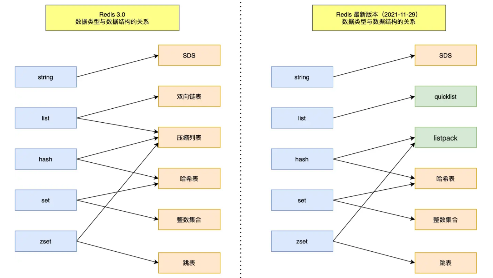
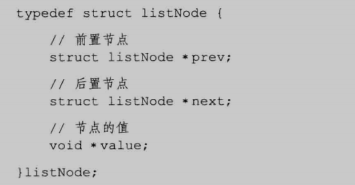

## Redis

### 介绍下 Redis

Redis 是一种开源的高性能键值对存储系统，基于内存的数据结构存储系统，可以用作数据库、缓存和消息代理。redis 可以用来进行数据库缓存，计数器，排行榜，分布式锁和消息队列等功能。

### 为什么快

- 基于内存实现 相比于在磁盘中去读取数据省去了耗时的磁盘 IO 操作
- 各种经过精心优化过的数据结构如简单字符串空间优化，预分配空间和惰性空间释放，跳表，hash 表的渐进式的 rehash，压缩列表等
- 单线程模式和 IO 多路复用，执行命令使用单线程，读写和协议解析使用多线程的方式使得 redis 的瓶颈是网络 IO 而不是 CPU,同时单线程很好的减少了上下文切换

### 底层数据结构

Redis 有动态字符串(sds)、链表(list)、字典(ht)、跳跃表(skiplist)、整数集合(intset)、压缩列表(ziplist) 等底层数据结构。

Redis 并没有使用这些数据结构来直接实现键值对数据库，而是基于这些数据结构创建了一个对象系统，来表示所有的 key-value。

### 跳跃表

实现有序集合键，和在集群节点中用作内部数据结构,跳表插入、删除、查找元素的时间复杂度跟红黑树都是一样量级的，时间复杂度都是 O(logn)

### 数据结构

Redis 的每个键值对都是由 key-value 对象组成的，其中 key 总是字符串对象，value 则由不同的对象构成.

- String：key-value 结构 value 值最大为 512M
  场景：
  1. 缓存对象的 json
  2. Redis 的单线程处理命令的方法，使得 String 结构适合处理计数情况，点赞，转发次数，库存数量
  3. 分布式锁 使用 setNx 命令 只有不存在才执行
  4. session 信息共享
- list （链表）使用双向无环链表或者压缩列表进行表示(在新版本中 Redis3.2 list 数据结构只由 quick list 实现)
  结构：
  场景：
  1. 消息队列
- hash 键值对集合 适合存储对象
  场景：
  1. 缓存对象
     一般对象用 String + Json 存储，对象中某些频繁变化的属性可以考虑抽出来用 Hash 类型存储。
  2. 购物车信息
- set 一个无序并唯一的键值集合，它的存储顺序不会按照插入的先后顺序进行存储。
  场景：
  1.  保证一个用户只能点赞一次
  2.  Set 类型支持交集运算，所以可以用来计算共同关注的好友、公众号等
- Zset 在 set 基础上增加排序属性
  场景：
  1. 排行榜
- HyperLogLog 统计一个集合中不重复的元素个数
  场景：
  1. 百万级网页 UV（浏览者） 计数 非精确统计 在 81%左右

### 分布式锁

实现方式 SetNX 指令当用户或许到锁式进行操作，为获取则等待或者使用 Redission 框架，用于对秒杀订单防止重复秒杀，和数据一致性问题

### 线程模型

**接收客户端请求->解析请求 ->进行数据读写等操作->发送数据给客户** 这一过程是由一个主线程完成的。同时 Resdis 启动时候会启动子线程用于处理 AOF 文件刷盘，关闭 redis 内存等服务

### Redis 的持久化策略

RDB:RDB 持久化策略：Redis 将内存中的数据**周期性**地 dump 到磁盘上，形成快照文件。当 Redis 重启时，可以通过**加载快照文件**来恢复数据。RDB 持久化是一种紧凑的存储方式，适用于**数据集较大但更新频率较低**的场景。

> RDB 持久化 命令：SAVE（阻塞式保存） 和 BGSAVE（开辟子进程进行保存不会阻塞主进程）

AOF:通过保存 Redis 服务器所执行的写命令来记录数据库状态的。
AOF 持久化策略：Redis 会将每个**写操作以追加**的形式记录到 aof_buf 的缓存区的末尾中并不断的将缓存区的内容写到 AOF 文件中。当 Redis 重启时，通过**重新执行这些写操作**来恢复数据。AOF 状态打开时候，服务所执行的写命令 以协议格式将写命令追加到服务器中的缓存区末尾中，AOF 持久化是一种追加式写入的方式，适用于**数据集较小但更新频率较高**的场景。

**AOF 重写 通过创建新的 AOF 文件合并一些臃肿的命令从而替换掉旧的 AOF 文件并减少体积**
AOF 文件随着时间会越来越大，为了避免臃肿，AOF 重写功能，提供了新的 AOF 文件替换旧的 AOF 文件，新 AOF 文件保存了相同的数据库状态并且没有多余的命令（旧 AOF 文件记录的所有命令，但到达当前数据库状态的结果可以使用命令进行简化，例如对 list 经过四次添加变为 A B C D 并弹出了 A B 最终为 C D 那么新的 AOF 文件直接对 list 加入 C D 达到同样的状态,这样讲命令从三个减少到了一个，相当于用一条命令直接记录了当先数据库的最终状态）
同时 Redis 在 AOF 重写过程中一般使用子进程进行重写操作，子进程对数据库副本进行记录，主进程继续执行服务器命令，为了避免新的写入操作和重写后的 AOF 文件不一致问题，Redis 开辟了 AOF 重写缓存区新的执行命令会同步发送到 AOF 缓存区和重写缓存区中，

> AOF 使用写后日志 即 先将数据写到内存并执行后再写到日志中。可以**避免记录错误的执行，不会阻塞当前执行**

**两者的联系**
如果服务开启了 AOF 持久化那么服务器优先使用 AOF 文件来还原数据库状态
且只有在 AOF 在关闭状态时才会使用 RDB 持久化还原数据库。

#### 内存满了，Redis 该怎么办 /Redis 有哪些内存溢出控制/内存淘汰策略

- noeviction：默认策略，不会删除任何数据，拒绝所有写入操作并返 回客户端错误信息，此 时 Redis 只响应读操作
- volatile-lru：根据 LRU 算法删除设置了超时属性（expire）的键，直 到腾出足够空间为止。如果没有可删除的键对象，回退到 noeviction 策略。
- allkeys-lru：根据 LRU 算法删除键，不管数据有没有设置超时属性， 直到腾出足够空间为止。
- allkeys-random：随机删除所有键，直到腾出足够空间为止。
- volatile-random：随机删除过期键，直到腾出足够空间为止。
- volatile-ttl：根据键值对象的 ttl 属性，删除最近将要过期数据。如果 没有，回退到 noeviction 策略
  删除过期数据，对 Redis 进行持久化并释放内存，使用集群进行分片拆分数据

#### aof 过大该怎么处理，如果磁盘也满了怎么办

我们可以手动触发 AOF 重写，扩容磁盘、调整持久化策略为 RDB,调整 AOF 文件写入策略

### AOF 的写回策略

当 AOF 文件越来越臃肿，包含有大量的无用信息，例如已经被删除键的信息，需要及时给 AOF 文件进行刷新。即重写机制

- 每秒写回：每秒种自动更新 AOF 文件 那间隔的 1 秒钟会宕机出现数据丢失
- 同步写回 每执行一次操作即写回 性能较低
- 系统控制写回 由系统进行控制写回时机 性能较好 宕机丢失数据较多

---

** 高可用 复制 哨兵 集群**

### Redis 的复制

- 被复制的服务器为主服务器一般负责写，对主服务器进行复制的为从服务器一般负责读。且数据的复制是 **单向** 的两种。，只能由主节点到从节点。Redis 主从复制支持 主从同步完整重同步和部分重同步。

Redis 的复制功能分为同步和传播两个步骤：

- 同步步骤目的在于将从服务器的状态更新至主服务器一致的状态：主服务器将 RDB 文件和缓存文件内容依次发送给从服务器用于同步。其中同步复制过程分为完整重同步和部分重同步。
  - 完整重同步：主服务器将 RDB 文件和缓存文件内容依次发送给从服务器用于同步
  - 部分重同步发生在从服务器连接中断后 ，主服务将中断过程执行的写命令发送给从服务器从而保持数据的一致。
- 命令传播则在于当主服务的数据发生修改时，此时主从服务器的状态不一致需要将不一致的命令传播到从服务器上，从服务器执行后保持一致的状态。

### 哨兵

哨兵系统分为两种节点：

- 哨兵节点： 哨兵系统由一个或多个哨兵节点组成，哨兵节点是特殊的 Redis 节点，不存储数据，对数据节点进行监控。
- 数据节点： 主节点和从节点都是数据节点；

哨兵系统通过对数据节点的监控、下线、和数据转移完成自动故障转移。

哨兵系统实现了自动化的故障转移功能，即当主服务器下线时会从从服务器中选中一个作为主服务器。
哨兵是在特殊状态下的 Redis 服务器，只不过执行的命令不同
通过哨兵监视多个主服务器和其对应的从服务器并在主服务器下线的状态下将从服务器升级为主服务器，并替代下线的从服务器处理命令 请求。

### 集群

包含一个或者多个集群节点的集群，节点之间通过握手建立连接

### redis 锁怎么实现

#### redis 数据结构

缓存一致性问题
先更新数据库在更新缓存
修改 token 关联的对象以及 id 关联的对象，先更新数据库后删除缓存，不能直接删除 token，删除之后就不能登录了，再将 token 以及对应的用户信息一起再写回缓存里面去

- 缓存穿透 对这些不存在的数据缓存一个空数据，对这类请求进行过滤
- 缓存击穿 使用互斥锁，只有拿到这把互斥锁的线程可以进数据库请求数据，其他线程等待，待该线程查到数据存入缓存后其他线程直接使用缓存中的数据
- 缓存雪崩 为了防止缓存在同一时间大面积过期导致的缓存雪崩，可以通过观察用户行为，合理设置缓存过期时间来实现；为了防止缓存服务器宕机出现的缓存雪崩，可以使用分布式缓存 及时更新用户缓存

- 消息队列 用户的请求，服务器接收后，首先写入消息队列，秒杀业务
  假如消息队列

#### 缓存问题

缓存一致性问题

先更新数据库在更新缓存
修改 token 关联的对象以及 id 关联的对象，先更新数据库后删除缓存，不能直接删除 token，删除之后就不能登录了，再将 token 以及对应的用户信息一起再写回缓存里面去

- 缓存击穿 较大并发访问的 key 失效，导致访问请求直接达到了数据库
  方法：
  使用互斥锁，只有拿到这把互斥锁的线程可以进数据库请求数据，其他线程等待，待该线程查到数据存入缓存后其他线程直接使用缓存中的数据
- 缓存穿透： 缓存穿透指的查询缓存和数据库中都不存在的数据，这样每次请求直接打到数据库，就好像缓存不存在一样。
  方法：
  缓存 null 值
  布隆过滤 布隆过滤器里会判断数据是否存在，如果判断数据不不能再，就不会访问存储
  增强 id 的复杂度，避免被猜测 id 规律
  做好数据的基础格式校验
  加强用户权限校验
  做好热点参数的限流

- 缓存雪崩 某⼀时刻发⽣⼤规模的缓存失效的情况 例如缓存服务宕机、大量 key 在同一时间过期，这样的后果就是⼤量的请求进来直接打到 DB 上，可能导致整个系统的崩溃，称为雪崩
  方法：
  给不同的 Key 的 TTL 添加随机值
  利用 Redis 集群提高服务的可用性
  给缓存业务添加降级限流策略
  给业务添加多级缓存

## 假如 Redis 里面有 1 亿个 key，其中有 10w 个 key 是以某个固定的已知的前缀开头的，如何将它们全部找出来？

使用 keys 指令可以扫出指定模式的 key 列表

## 缓存更新策略

- 写穿透 所有数据的更新首先发生在数据库（或数据源），然后再同步更新到 Redis 缓存
- 旁路更新 写操作先更新数据库再删除缓存 读操作先读缓存 缓存没有则再数据库
