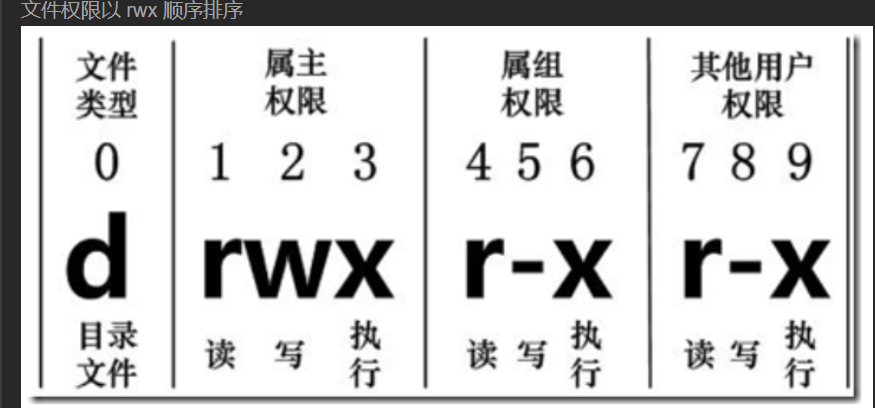
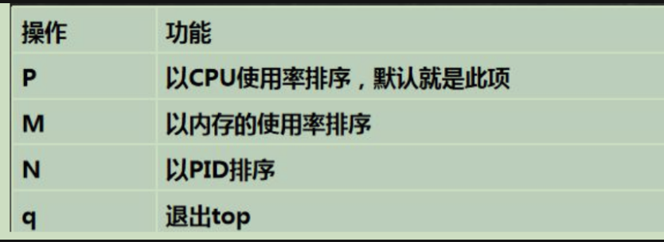

## 如何在 Linux 上部署项目

## linux 文件权限管理

### 组管理和权限管理

Linux 的用户都属于一个组，每个文件有所有者、所在组、其他组

#### 修改文件的所有者(chang own)

```shell
chown 用户名 文件名
chown enki bb.txt
```

#### 创建组

```shell
groupadd 组名
groupadd monster
```

#### 查看文件所在的组

```shell
ls -ahl
```

#### 查看文件的权限

```shell
ls -l 文件名 查看文件权限
ls -ld 文件名 查看文件名权限
```

#### 修改文件/目录所在的组

基本指令
`chgrp 组名 文件名`

#### 改变用户所在组

#### 权限的基本介绍

`drwxr-xr-x 17 enki enki 4.0K 11月 9 04:30`
第一列的 0-9 位数字
0 位: 确定文件类型

1. d :目录 相当于文件夹
2. `-` ：普通文件
3. c : 字符设备类文件 鼠标、键盘
4. b :块设备如硬盘
5. l : 链接

1-3 位确定所有者（该文件的所有者）拥有该文件的权限

- r=4:读
- w=2:写
- x=1（execute）:可执行
  > 可以用数字代表权限 rwx(=4+2+1=7) 没有权限为 -

第 4-6 位确定所属组（同用户组的）拥有该文件的权限
第 7-9 位确定其他用户拥有该文件的权限

> 文件权限以 rwx 顺序排序
> 

#### 修改权限

通过 chmod 指令，可以修改文件或者目录的权限。
使用+ - =改变
u 为所有者 g 所有组 o 其他用户 a 对 u g o 进行同步操作

```shell
chmod u=rwx,g=rwx,o=rwx aa.txt/或者目录
chmod o+w 文件/目录（将文件或者目录的其他用户加上写权限）
chmod a-x 文件/目录 (将文件的全部用户的权限取消执行权限)
```

或者通过数字改变

```shell
chmod 777 aa.txt
```

#### 修改文件所有者

```shell
chown newowner 文件/目录 (改变所有者)
chown root aa.txt
chown -R root aaa(将aaa目录下的全部文件的所有者改为root)
```

#### 修改文件/目录所在组-chgrp

```shell
chgrp newgroup 文件/目录
```

---

### 进程管理

#### 服务管理

```shell
service 服务名[start|stop|restart|reload|status]
> |表示可选
```

ubuntu 开启和关闭 network

```shell
service network-manager stop
```

#### 显示所有服务状态

```shell
service --status-all
```

#### 显示 cpu 内存 进程的状态

使用 top 命令
进入 top 界面后的交互

输入 k 选择终止进程的 pid 后在输入 9 表示强制终止
