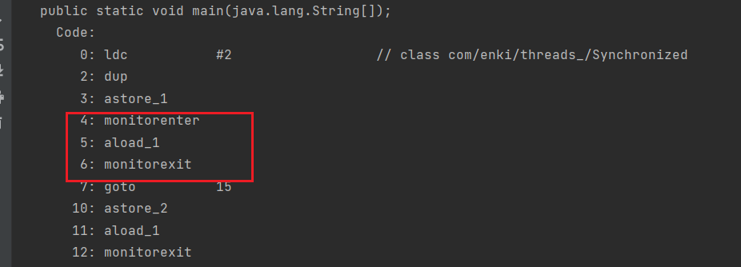
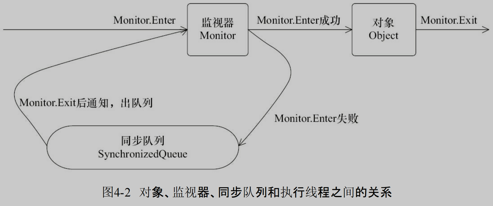

## 线程

### 创建线程

#### Thread

Thread 创建线程方式：创建线程类，匿名内部类方式

- **start() 方法底层其实是给 CPU 注册当前线程，并且触发 run() 方法执行**
- 线程的启动必须调用 start() 方法，如果线程直接调用 run() 方法，相当于变成了普通类的执行，此时主线程将只有执行该线程
- 建议线程先创建子线程，主线程的任务放在之后，否则主线程（main）永远是先执行完

Thread 构造器：

- `public Thread()`
- `public Thread(String name)`

```java
public class ThreadDemo {
    public static void main(String[] args) {
        Thread t = new MyThread();
        t.start();
       	for(int i = 0 ; i < 100 ; i++ ){
            System.out.println("main线程" + i)
        }
        // main线程输出放在上面 就变成有先后顺序了，因为是 main 线程驱动的子线程运行
    }
}
class MyThread extends Thread {
    @Override
    public void run() {
        for(int i = 0 ; i < 100 ; i++ ) {
            System.out.println("子线程输出："+i)
        }
    }
}
```

继承 Thread 类的优缺点：

- 优点：编码简单
- 缺点：线程类已经继承了 Thread 类无法继承其他类了，功能不能通过继承拓展（单继承的局限性）

---

#### Runnable

Runnable 创建线程方式：创建线程类，匿名内部类方式

Thread 的构造器：

- `public Thread(Runnable target)`
- `public Thread(Runnable target, String name)`

```java
public class ThreadDemo {
    public static void main(String[] args) {
        Runnable target = new MyRunnable();
        Thread t1 = new Thread(target,"1号线程");
		t1.start();
        Thread t2 = new Thread(target);//Thread-0
    }
}

public class MyRunnable implements Runnable{
    @Override
    public void run() {
        for(int i = 0 ; i < 10 ; i++ ){
            System.out.println(Thread.currentThread().getName() + "->" + i);
        }
    }
}
```

**Thread 类本身也是实现了 Runnable 接口**，Thread 类中持有 Runnable 的属性，执行线程 run 方法底层是调用 Runnable#run：

```java
public class Thread implements Runnable {
    private Runnable target;

    public void run() {
        if (target != null) {
          	// 底层调用的是 Runnable 的 run 方法
            target.run();
        }
    }
}
```

Runnable 方式的优缺点：

- 缺点：代码复杂一点。

- 优点：

  1. 线程任务类只是实现了 Runnable 接口，可以继续继承其他类，避免了单继承的局限性

  2. 同一个线程任务对象可以被包装成多个线程对象

  3. 适合多个多个线程去共享同一个资源

  4. 实现解耦操作，线程任务代码可以被多个线程共享，线程任务代码和线程独立

  5. 线程池可以放入实现 Runnable 或 Callable 线程任务对象

​

> Runable 将线程和线程任务分离 更容易配合线程池等 API，更灵活

---

#### Callable

实现 Callable 接口：

1. 定义一个线程任务类实现 Callable 接口，申明线程执行的结果类型
2. 重写线程任务类的 call 方法，这个方法可以直接返回执行的结果
3. 创建一个 Callable 的线程任务对象
4. 把 Callable 的线程任务对象**包装成一个未来任务对象**
5. 把未来任务对象包装成线程对象
6. 调用线程的 start() 方法启动线程

`public FutureTask(Callable<V> callable)`：未来任务对象，在线程执行完后得到线程的执行结果

- FutureTask 就是 Runnable 对象，因为 **Thread 类只能执行 Runnable 实例的任务对象**，所以把 Callable 包装成未来任务对象
- 线程池部分详解了 FutureTask 的源码

`public V get()`：同步等待 task 执行完毕的结果，如果在线程中获取另一个线程执行结果，会阻塞等待，用于线程同步

- get() 线程会阻塞等待任务执行完成
- run() 执行完后会把结果设置到 FutureTask 的一个成员变量，get() 线程可以获取到该变量的值

优缺点：

- 优点：同 Runnable，并且能得到线程执行的结果
- 缺点：编码复杂

```java
public class ThreadDemo {
    public static void main(String[] args) {
        Callable call = new MyCallable();
        FutureTask<String> task = new FutureTask<>(call);
        Thread t = new Thread(task);
        t.start();
        try {
            String s = task.get(); // 获取call方法返回的结果（正常/异常结果）
            System.out.println(s);
        }  catch (Exception e) {
            e.printStackTrace();
        }
    }

public class MyCallable implements Callable<String> {
    @Override//重写线程任务类方法
    public String call() throws Exception {
        return Thread.currentThread().getName() + "->" + "Hello World";
    }
}
//
        FutureTask<Integer> integerFutureTask = new FutureTask<>(() -> {
            System.out.println("callable");
            return 0;
        });
        new Thread(integerFutureTask,"线程3").start();
//        主线程阻塞 得到线程的结果
        Integer integer = integerFutureTask.get();
        System.out.println(integer);
        System.out.println(Thread.currentThread().getName());


```

---

## 线程之间的通信

多线程中的每个线程对共享内存中的变量和对象均有一份拷贝，所以程序在执行过程中，一个线程看到的变量并不一定是最新的

### volatile

> 可见性

关键字 volatile 可以用来修饰字段（成员变量），就是告知程序任何对该变量的访问均需要从共享内存中获取，而对它的改变必须同步刷新回共享内存，它能保证所有线程对变量访问的可见性。

### synchronized

> 可见性和排他性

关键字 synchronized 可以修饰方法或者以同步块的形式来进行使用，它主要确保多个线程在同一个时刻，只能有一个线程处于方法或者同步块中，它保证了线程对变量访问的可见性和排他性。

对于同步代码块的管理有监视器管理,而这个获取过程是排他的，也就是同一时刻只能有一个
线程获取到由 synchronized 所保护对象的监视器

任意一个对象都拥有自己的监视器，当这个对象由同步块或者这个对象的同步方法调用
时，执行方法的线程必须先获取到该对象的监视器才能进入同步块或者同步方法，而没有获
取到监视器（执行该方法）的线程将会被阻塞在同步块和同步方法的入口处，进入 BLOCKED
状态。


### 等待/通知机制

wait 表示当前执行的代码块进入等待状态，在调用 wait（）方法之前，线程必须获得该对象的对象级别锁，即只能在同步方法或同步块中调用 wait()方法。在执行 wait()方法后，当前线程立即释放锁。
方法 notify()也要在同步方法或同步代码块中调用，即在调用前，线程也必须获得该对象的对象级别锁。该方法用来通知那些处于 wait 状态的线程，对其发出通知 notify，和 wait 不同的是，在执行 notify 方法后，当前线程不会马上释放该对象锁，呈 wait 状态的线程也就不能马上获取该对象锁，要等待执行 notify()方法的线程将呈现执行完，或者退出 synchronized 代码块后，当前线程才会释放锁。而呈 wait 状态所在的线程才可以获取该对象锁。第一个抢到锁的 wait 线程运行完毕后，就会释放该对象锁，此时如果该对象没有再次使用 notify 语句，则其他呈 wait 状态等待的线程由于没有得到该对象的通知，还会继续阻塞在 wait 状态。直到这个对象再次发出一个 notify 或 notifyAll。

- wait 使当前线程停止运行，而 notify 使处于 wait 状态的线程继续运行。
- wait 和 notify 必须配合 synchronized 关键字进行使用
- wait 方法立即释放锁，notify 方法不立即释放锁

### 管道

### 讲一下 ThreadLocal 原理
