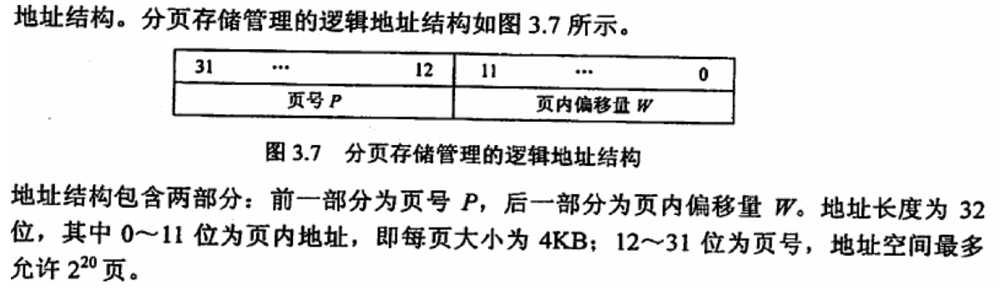

B = 8bit
1kB = 1204B
MB = 1024B

### 进程管理

线程– 是进程中的一个实体,是被系统调度和分配的基本单元,但必须依靠进程运行不能独立

#### 线程同步的方式

线程同步是多个共享资源的线程，通过同步机制协调执行顺序避免出现冲突的过程。
常见的同步方式分为：

1. 互斥锁同步 使用互斥锁保护共享资源
2. 信号量 使用信号量来控制对共享资源的并发访问数量
3. 条件变量 条件变量用于线程之间的等待和通知机制
4. 自旋锁 一种忙等锁机制，线程未获取锁不会被立即阻塞而是在一定次数内循环请求锁的获取

#### 进程状态转换

七种状态模型： 新建状态， 就绪 运行 阻塞 后备状态 结束 就绪挂起状态

> P V 操作 P 操作是阻塞作用
> V 操作是唤醒作用

#### 进程通信方式

1. 管道 单向通信用于父子进程

2. 命名管道 可以在无亲缘关系的进程间进行通信
3. 共享内存 进程可以直接读写共享内存中的数据，但内存不共享不能通信
4. 信号量 即 PV 操作
5. 消息队列
6. 套接字 计算机进程网络通行
   > 信号量及 P、V 操作 不能够传递大量信息
   > Unix 有 6 大通信的方法，分别是：Socket、管道、信号、信号量、消息队列、共享内存

#### 信号量题目

信号量的正负数表示某个资源的可用数量。正数表示还有可用的资源数量，而负数表示已经有其他进程占用了资源，需要等待。信号量的数值越小，表示资源越紧张。

允许 3 个进程表示 初始化可用资源为 3， 4 个进程需要有一个进程等待信号量为-1；范围-1 到 4

#### 处理机调度

- 高级调度 作业调度 将作业从外存调入到内存中
- 中级调度 内存调度 在内存和外存之间调度进程 控制内存中进程数量 从而平衡内存利用率和吞吐量
- 低级调度 进程调度 调度就绪队列中的进程并分配处理机

#### 进程调度算法

先到先服务调度算法 有利于长作业 不利于 IO 繁忙型
短作业优先的调度算法 长作业不利 平均等待时间和周转时间最少
优先级调度算法
高响应比算法 响应比 = （等待时间+要求服务时间）/要求服务时间
时间片轮转调度算法 将所有进程按照先来先服务的顺序排成就绪队列，每次调度将 cpu 分给对头进程，每个进程一次执行一个时间片的时间，时间片用完未完成的进程重写排到队尾并。
多级反馈队列调度算法 动态调整优先级和时间片

#### 临界区和临界资源

一个临界资源可以对应多个临界区

- 临界区（critical section）是指进程访问临界资源的那段代码。
- 临界资源（critical resource）是指在同一时刻只允许一个进程访问的资源

#### 死锁产生原因

系统资源竞争
进程推进顺序不对
互斥
请求保持
循环等待
不可剥夺

#### 解决死锁

互斥 允许多个进程同时占有资源 所有资源共享
请求保持 不能够保持 申请资源时需要释放自己的全部资源
循环等待 对资源进行编号，要求进程按照编号顺序申请资源
不可剥夺 允许系统抢占资源

### 内存管理

分页地址结构：

#### 缺页置换算法

### Linux 僵尸进程

- 孤儿进程：一个父进程退出，而它的一个或多个子进程还在运行，那么那些子进程将成为孤儿进程。孤儿进程将被 init 进程(进程号为 1)所收养，并由 init 进程对它们完成状态收集工作。
- 僵尸进程：一个进程使用 fork 创建子进程，如果子进程退出，而父进程并没有调用 wait 或 waitpid 获取子进程的状态信息，那么子进程的进程描述符仍然保存在系统中。这种进程称之为僵死进程。
  **处理：**
- 孤儿进程将由 init 接管，成为 init 的子进程，然后回收资源。
- 僵尸进程的危害主要是占用进程描述符。在出现大量僵尸进程的时候，系统会杀死产生僵尸进程的父进程（因为僵尸进程的产生主要是因为父进程出错，没有获取子进程的状态）。在杀死父进程后，僵尸进程就会全部变成孤儿进程，由 Init 接管，回收资源

---

### 内存管理

内部碎片 :已经分配给内存的区域未被完全使用
外部碎片:并未分配给进程但又不能使用的内存

内存分配管理的方式：连续内存管理、非连续内存管理

### 动态内存分区分配

最先(首次)适应算法：每次按照内存地址递增的顺序查找到合适的地址
最佳适应算法： 按照内存可分配地址递增的顺序分配，找到第一个递增的位置进行安排
最坏适应算法: 从当前容量中挑选最大的进行分配

#### 连续内存管理

单一连续

#### 非连续内存管理

段式管理

### 说一说虚拟地址空间有哪些部分

### 硬链接和软链接有什么区别

文件链接是一种特殊的文件类型，可以在文件系统的指向另一个文件。一般分为硬链接和软链接
硬链接：通过目录和文件的唯一索引节点号 inode 进行连接，硬链接和

### java 线程六状态？linux 进程几状态？

## 题目

