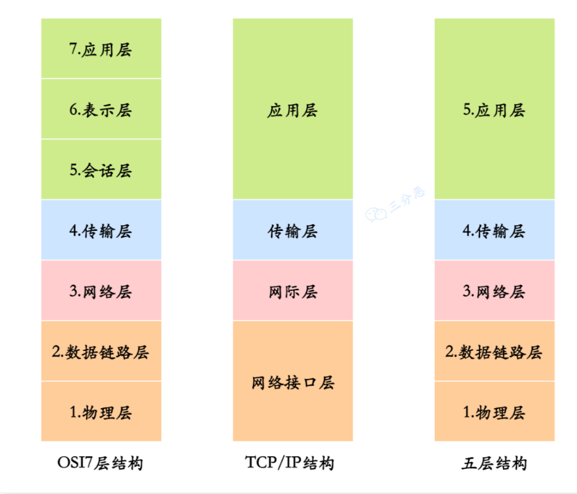
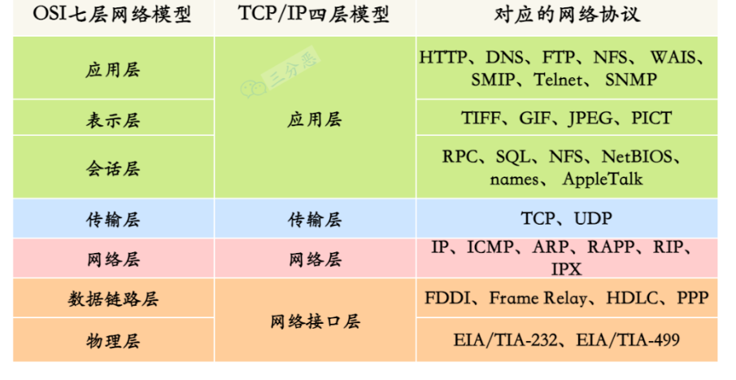
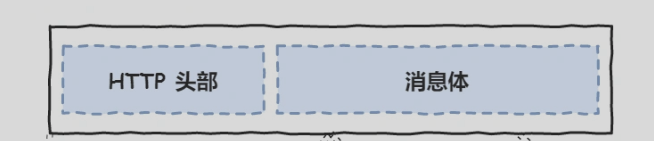
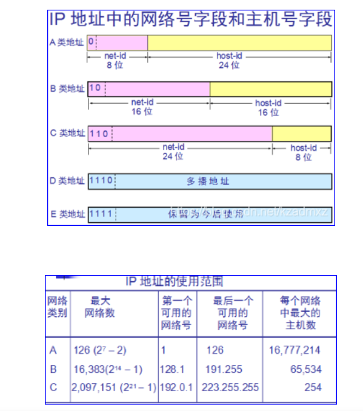

## 分层

一般有三种：OSI 七层模型、TCP/IP 四层模型、五层结构。
重点是五层协议

### 应用层

应用层专注于为用户提供服务，使用 HTTP、FTP、Telnet、DNS、SMTP 等协议，它定义了信息交换的格式，消息会交给下⼀层传输层来传输。我们把应⽤层交互的数据单元称为报⽂。

### 传输层

向两台终端设备进程之间的通信提供通⽤的数据传输服务，为应用层提供支持。传输层选择传输协议，并通知网络层进行传输

---

### HTTP 的缓存

### HTTP 的请求方式

---

## 题目

### TCP

**三次握手**
简述三次握手
第一次握手：客户端发送带有 SYN 同步标志位置 1 的报文段并将序列号保存为客户端的随机初始序列号发送给服务器。
第二次握手：服务器接收到客户端的数据后回复客户端 回复 SYN 和 ACK 标志置为 1 的报文段其中序列号为服务器随机初始化序列号，同时将确认应答号保存为客户端序列号+1；
第三次握手：客户端收到服务器数据后回复服务器，回复 ACK 标志置为 1 的报文段，其中的确认应答号字段保存为接收到的服务器序列号+1
确认序列号=原始序列号+TCP 段的长度

**四次挥手**
第一次挥手：客户端关闭向服务器的连接，向服务器发送 Fin 标志位置 1 的报文段
第二次挥手:服务器收到关闭连接请求后向客户端返回一个 ACK 报文段
客户端接收到后，表示客户端的连接关闭
第三次挥手，服务器向客户端发送 fin 标志位置为 1 的报文段
第四次挥手 客户端收到数据后，向服务器发送 ACK 报文段表示连接关闭

### IP 地址范围

A 类 00000001.00000001.00000000.00000000-01111110.111111111.11111111.11111110（网络字段号 第一位为 0 可使用范围为第二为到第八位 b 从 1 到 126 （全 0 和全 1 不使用））

网络范围：
A:1~126
B:128.1 ~ 191.255
C：192.0.1 ~ 223.255.255
全零全 1 地址保留不用
全 0 地址是指用于网络标识的 IP 地址，它用来代表一个网络中的所有主机
全 1 地址用来广播

### 如何让 UDP 可靠

1、添加 seq/ack 机制，确保数据发送到对端
2、添加发送和接收缓冲区，主要用于用户超时重传。
3、添加超时重传机制。

### tcp 慢启动是怎么实现的

### 如何解决 syn 泛洪攻击

---

## 题

### socket 过程

### HTTPS 协议中间人攻击是什么

### 常见的 HTTP 协议响应头有哪些

### 路由器对应 OSI 七层中的那一层

网络层 数据链路层和
物理层

### 判断是否是同一网段

要想判断两个 ip 地址是不是在同一个网段，只需将 ip 地址与子网掩码做与运算，如果得出的结果一样，则这两个 ip 地址是同一个子网当中

---
