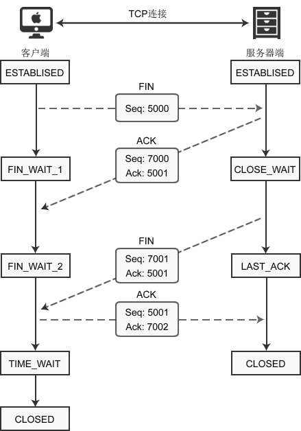
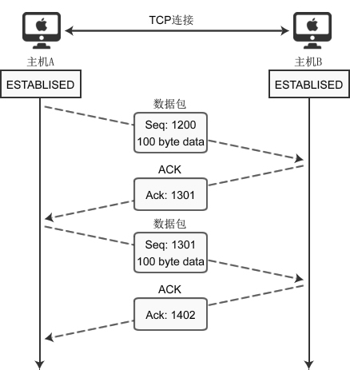

## 分层

一般有三种：OSI 七层模型、TCP/IP 四层模型、五层结构。
重点是五层协议

### 应用层

应用层专注于为用户提供服务，使用 HTTP、FTP、Telnet、DNS、SMTP 等协议，它定义了信息交换的格式，消息会交给下⼀层传输层来传输。我们把应⽤层交互的数据单元称为报⽂。

### 传输层

向两台终端设备进程之间的通信提供通⽤的数据传输服务，为应用层提供支持。传输层选择传输协议，并通知网络层进行传输

---

### 从浏览器地址栏输入 url 到显示主页的过程？

- DNS 协议解析 将域名解析成对应的 IP 地址。
  - DNS 解析：
    若本地服务器中有对应的 IP 地址缓存则直接返回，否则本地 DNS 服务器将向根域名服务器发送请求，找到顶级域名服务器在通过通过顶级域名服务器找到权限域名服务器得到最终的 Ip 地址
- TCP 连接：与服务器通过三次握手，建立 TCP 连接
- 向服务器发送 HTTP 请求
- 服务器处理请求，返回 HTTP 响应
- 浏览器解析并渲染页面
- 断开连接：TCP 四次挥手，连接结束

### Http 状态码

1XX：信息性状态码
2XX：成功状态码
3XX：重定向状态码
4XX：客户端错误状态码
5XX：服务端错误状态码

### HTTP 有哪些请求方式？

- Get 向服务器获取资源
- Post 向服务器提交资源
- Put 修改服务器的相关资源
- Delete 删除服务器的相关资源

> Get Post 区别
> GET 和 POST，两者是 HTTP 协议中发送请求的方法
> Get 将请求信息放在 url 中
> post 将请求信息放在请求体中
> 从数据库层面上说 Get 请求幂等且安全的不会改变服务器上的信息，但是 Post 请求用来改变服务器的信息

### 说下 HTTP/1.0，1.1，2.0 的区别

- HTTP/1.0 默认是短连接，可以强制开启，

- HTTP/1.1 默认长连接，可以被多个请求复用。
  使用分块传输模式，服务器每产生一块数据就发送一块。并使用管道协议，客户端可以在一次连接中发送多个请求，
- HTTP/2.0 采用多路复用。在一个连接里，客户端和浏览器都可以同时发送多个请求或回应，而且不用按照顺序一一对应。

### HTTP 的缓存

### HTTP3

重要的改变是使用新的 QUIC 协议 该协议基于 UDP 进行，提高用户在线浏览速度和用户体验

---

### 负载均衡

## 题目

### TCP

**三次握手**
简述三次握手
第一次握手：客户端发送带有 SYN 同步标志位置 1 的报文段并将序列号保存为客户端的随机初始序列号发送给服务器。
第二次握手：服务器接收到客户端的数据后回复客户端 回复 SYN 和 ACK 标志置为 1 的报文段其中序列号为服务器随机初始化序列号，同时将确认应答号保存为客户端序列号+1；
第三次握手：客户端收到服务器数据后回复服务器，回复 ACK 标志置为 1 的报文段，其中的确认应答号字段保存为接收到的服务器序列号+1
确认序列号=原始序列号+TCP 段的长度

**四次挥手**
第一次挥手：客户端关闭向服务器的连接，向服务器发送 Fin 标志位置 1 的报文段

第二次挥手:服务器收到关闭连接请求后向客户端返回一个 ACK 报文段
客户端接收到后，表示客户端的连接关闭
第三次挥手，服务器向客户端发送 fin 标志位置为 1 的报文段
第四次挥手 客户端收到数据后，向服务器发送 ACK 报文段表示连接关闭

> 客户端最后一次 ACK 包进入到 Time_wait 状态，不是直接进入 CLOSED 状态关闭连接
> 目的是确保不在有数据包出现在网络中
> 当客户端向服务器发送最后一个 ACK 报文时 ，可能出现连接堵塞，导致服务器接受不到报文需要服务器向客户端请求重传，而其中的 Time_wait 时长表示保存再客户端到服务器所存活的最长时间 2MSL

### 建立连接后数据传输的变化

客户端的序列号为 100 发送数据大小 200 服务端响应的序列号为 100+200+1

### SYN 泛洪 DDoS 攻击

- 半连接
  服务器向客户端发送 SYN+ACK 报文，并且等待客户端响应 ACK 报文之前的 TCP 连接为半连接，此时服务器处于等待客户端响应状态，如果没有接收到客户端的响应则会一直发送请求，
  <!-- 服务器在建立连接之前会同时创建两个队列，半连接队列保存 -->
  泛洪攻击：  
  在短时间内伪造大量的不存在的 IP 地址，向服务器发送大量的 SYN 请求，当服务器进行 SYN+ACK 回复后，并不会收到客户端的响应报文，致使服务器的半连接队列满不能够正常的响应客户端的请求。

> 应对方法：*通过防火墙、路由器等过滤网关防护。
> *通过加固 TCP/IP 协议栈防范，如增加最大半连接数，缩短超时时间。
> \*SYN cookies 技术。SYN Cookies 是对 TCP 服务器端的三次握手做一些修改，专门用来防范 SYN 洪泛攻击的一种手段。

### 四次挥手

第一次挥手：客户端发送一个 FIN（SEQ=x） 标志的数据包->服务端，用来关闭客户端到服务器的数据传送。然后客户端进入 FIN-WAIT-1 状态。
第二次挥手：服务器收到这个 FIN（SEQ=X） 标志的数据包，它发送一个 ACK （ACK=x+1）标志的数据包->客户端 。然后服务端进入 CLOSE-WAIT 状态，客户端进入 FIN-WAIT-2 状态。
第三次挥手：服务端发送一个 FIN (SEQ=y)标志的数据包->客户端，请求关闭连接，然后服务端进入 LAST-ACK 状态。
第四次挥手：客户端发送 ACK (ACK=y+1)标志的数据包->服务端，然后客户端进入 TIME-WAIT 状态，服务端在收到 ACK (ACK=y+1)标志的数据包后进入 CLOSE 状态。此时如果客户端等待 2MSL 后依然没有收到回复，就证明服务端已正常关闭，随后客户端也可以关闭连接了。

### IP 地址范围

A 类 00000001.00000001.00000000.00000000-01111110.111111111.11111111.11111110（网络字段号 第一位为 0 可使用范围为第二为到第八位 b 从 1 到 126 （全 0 和全 1 不使用））

网络范围：
A:1~126
B:128.1 ~ 191.255
C：192.0.1 ~ 223.255.255
全零全 1 地址保留不用
全 0 地址是指用于网络标识的 IP 地址，它用来代表一个网络中的所有主机
全 1 地址用来广播

### .tcp 如何保证消息的可靠性传输

TCP 协议主要通过以下七点来保证传输可靠性：连接管理，校验和，序列号，确认应答，超时重传，流量控制，拥塞控制。

- 通过三次握手和四次挥手 建立可靠连接
- 校验和 TCP 将保持它首部和数据的检验和
- 确认应答号码： tcp 没发送一个包都对其进行编号，接收方收到包后都会进行应答 ，如果没有收到则会重发，
- 流量控制 TCP 的连接的每一端都会 有一个固定大小的缓冲区，接收方只允许发送方发送缓冲区可容纳大小的数据，如果超过就告诉对方降低发送的速率，使用滑动窗口的方式控制数据发送速率
- 当网络发送拥堵时候，发送方会减少发送的速率，使用一个拥塞窗口来维护拥塞控制

### 如何让 UDP 可靠

1、添加 seq/ack 机制，确保数据发送到对端
2、添加发送和接收缓冲区，主要用于用户超时重传。
3、添加超时重传机制。

### tcp 慢启动是怎么实现的

### 如何解决 syn 泛洪攻击

---

## 题

### socket 过程

### HTTPS 协议中间人攻击是什么

### 常见的 HTTP 协议响应头有哪些

### 路由器对应 OSI 七层中的那一层

网络层 数据链路层和
物理层

### 判断是否是同一网段

要想判断两个 ip 地址是不是在同一个网段，只需将 ip 地址与子网掩码做与运算，如果得出的结果一样，则这两个 ip 地址是同一个子网当中

---
