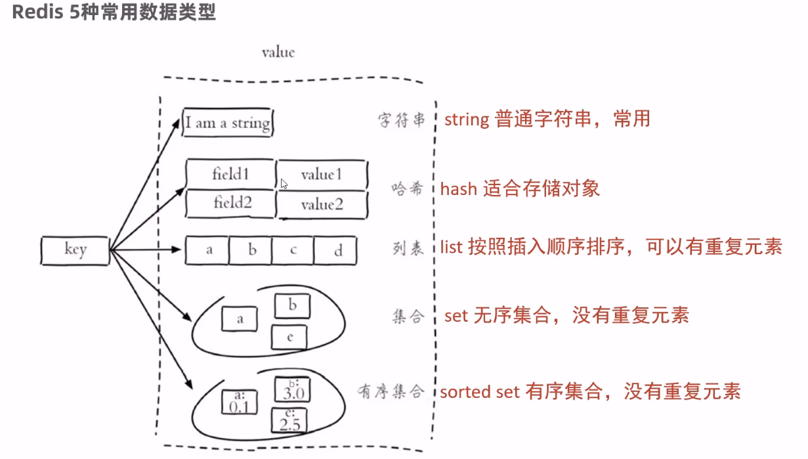
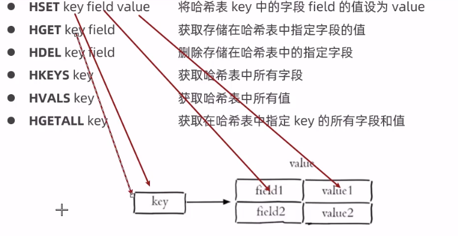
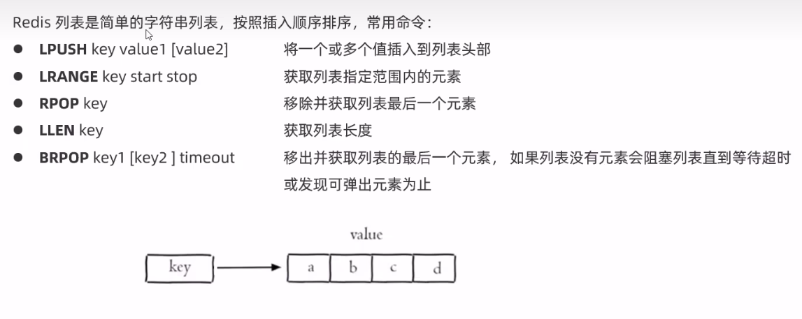

## 登录

先登录在进入系统。使用过滤器进行判断 通过 threadload 统一获取 session 中的信息，判断用户是否存在即是否登录拦截所有请求并做判断
拦截方式 过滤 拦截 aspect
session 中不需要记录用户所有信息 保存用户名和图像就行
利用 redis 满足 session 共享
利用 hash 结构保存用户信息相比 string 类型保存 json 格式更加合理
redis 中保存 token 作为 key 为登录凭证，在登录时返回给客户端，客户端将 token 保存在浏览器中在每次发送请求时携带 token 到服务器进行校验

## 配置类

## 登录拦截

## 公共字段自动填充

@TableField(fill = FieldFill.UPDATE)
并配置
由于客户端每次的 Http 请求服务端都会有新的线程

## 分页

MP 配置分页插件->service 配置分页设置

js 处理 long 型的数据处理时会产生精度丢失问题
方法 将 long 型数据转为 string 在服务端进行响应时利用消息装换器基于 jackson 进行转换

mybatisplus 的公共字段自动填充
@TableField(fill = FieldFill.INSERT_UPDATE)
并编写元数据对象处理器类

##### ThreadLocal

ThreadLocal 是线程的局部变量，利用 ThreadLocal 存储当前用户登录的 ID
方法使用： get 和 set 方法

### redis 使用

### hash 设置

列表

### 接口定义 YAPI

## redis 的缓存更新策略

增加超时时间 减缓缓存不一致问题
当用户对数据进行更新时，将缓存数据移除

## Swagger 使用 利用 Knife4j 包集成 Swagger

### 缓存穿透

请求的数据在数据库和缓存中都不存在，发送的请求会穿过缓存直接到达数据库 1.缓存空数据并设置 较短的 TTL

### 缓存雪崩

缓存中的 key 失效 redis 宕机

1. 防止同时失效 设置不同的失效时间

### 缓存击穿

redis 的 setnx

> 含义（setnx = SET if Not eXists）：

           将 key 的值设为 value ，当且仅当 key 不存在。
           若给定的 key 已经存在，则 SETNX 不做任何动作。
           SETNX 是『SET if Not eXists』(如果不存在，则 SET)的简写。
           返回值：
           设置成功，返回 1 。
           设置失败，返回 0 。
