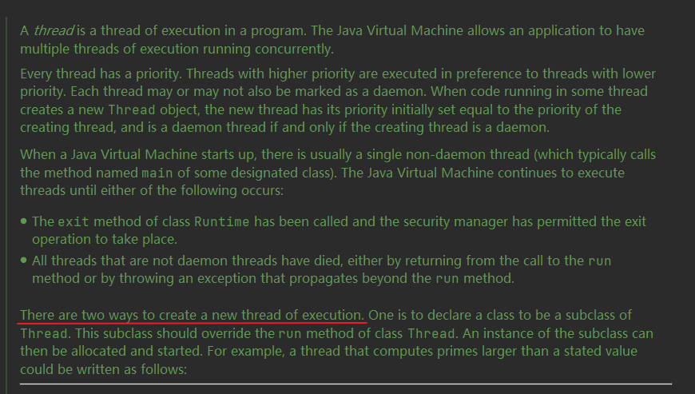
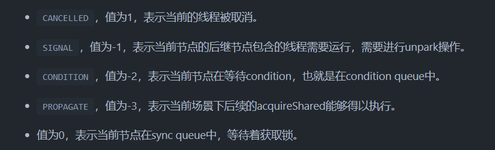

# 多线程

## 什么是多线程

首先什么线程：线程是操作系统能够运调度的最小行单位，，它可以在进程中单独执行，而随着处理器核心增多，可以同时处理多个线程，多线程的出现可以使得操作系统能够更有效的利用资源并提高系统的响应能力。

## 创建线程的方式

JDK 中说明的创建方式为两种：



- 继承 Thread 类 并重写 run 方法，在 run 方法中实现线程所需要执行的操作,之后调用 start()方法来启动线程。

```java
public class MyThread extends Thread{
    @Override
    public void run() {
        System.out.println("执行线程。。。。");
    }

    public static void main(String[] args) {
        MyThread myThread = new MyThread();
        myThread.start();
    }
}
```

- 实现 Runable 接口，同样重写 run 方法，在 run 方法中实现线程所需要执行的操作,之后调用 start()方法来启动线程。

```java
public class MyRunnable implements Runnable {
    @Override
 public void run () {
 System . out . println ( "执行线程。。。。" ) ;
 }

 public static void main ( String [] args) {
 MyRunnable task = new MyRunnable ();
//通过Thread对象启动线程
 new Thread ( task ) .start();
 }
}
```

- 实现 Callable 接口，重写 Call 方法可以返回一个结果值，并结合 Future 实现得到返回值，这样可以得到一个具有返回值的任务。而 FutureTask 实现了 RunnableFuture 间接实现了 Runnable 接口

```java
public class CallerTask implements Callable<String> {
    @Override
    public String call() throws Exception {
        return "running a thread";
    }
}

public class CallMain {
    public static void main(String[] args) {
        FutureTask<String> stringFutureTask = new FutureTask<>(new CallerTask());
        // 通过Thread对象启动线程
        new Thread(stringFutureTask).start();
        try {
            // 通过FutureTask获取call方法中的返回
            String s = stringFutureTask.get();
            System.out.println(s);
        } catch (InterruptedException e) {
            e.printStackTrace();
        } catch (ExecutionException e) {
            e.printStackTrace();
        }
    }
}

```

## 启动线程为什么用 start 不用 run

直接调用 run 方法，是运行在当前线程中属于顺序执行操作，而使用 start 方法
会启动新的线程运行 run 方法

> 不能对同一个线程 start 多次 会报错 会首先判断 threadStatus 的值是否为 0 ，如果值不是 0 的话，说明这个线程的 state 状态不是 new
> 

## synchronized 关键字

每个对象都可以作为锁，
加在方法上 锁是当前实例对象
加在静态同步方法中 锁是当前类的 Class 对象
加在同步方法块中， 锁是 Synchronized 括号中的对象

## 调度线程的方式

- 线程等待:

- 阻塞
  join 方法等待线程结束，在主线程中加入 join 方法主线程会阻塞一直到该线程运行结束

## volatile 和 synchronized 关键字

### Synchronized

#### 实现

1. synchronized 修饰代码块时，JVM 采⽤ monitorenter 、 monitorexit 两个指令来实现同步， monitorenter 指令指向同步代码块的开始位置， monitorexit 指令则指向同步代码块的结束位置。

## 线程池

### 池化

作用：线程池作用就是限制系统中执行线程的数量，让线程重复利用，提高资源利用率，提高系统响应速度
原因：减少了创建和销毁线程的次数，每个工作线程都可以被重复利用，可执行多个任务
线程池用于管理线程执行，可以显著减少处理器单元的空闲时间，如何创建线程时间和销毁线程时间和大于线程执行时间可以考虑使用线程池，线程池通过缩短和调整线程创建和销毁时间来提高服务器效率

### 线程池管理流程

创建线程池中会设置线程从核心线程数，最大线程数，线程存活时间(当线程空闲时间到时会失活)，等待队列；
先用核心线程数满足当前的任务数量，当任务逐渐增多大于核心线程数是任务会进入等待队列中排队等待核心线程完成当前任务，当任务继续增多超出等待队列时会启动新线程用于消耗等待队列中任务，且线程总数小于等于最大线程数，当任务持续增加超出最大线程数满足范围，执行饱和策略。

> 注意 启动核心线程外的线程需要等待队列满后

### 等待队列

- ArrayBlockingQueue
- LinkedBlockingQueue
- SynchronousQueue

### AQS 的 CLH 队列

```java
// 内部类
public class ConditionObject implements Condition, java.io.Serializable {
    // 版本号
    private static final long serialVersionUID = 1173984872572414699L;
    /** First node of condition queue. */
    // condition队列的头节点
    private transient Node firstWaiter;
    /** Last node of condition queue. */
    // condition队列的尾结点
    private transient Node lastWaiter;

    /**
        * Creates a new {@code ConditionObject} instance.
        */
    // 构造方法
    public ConditionObject() { }

    // Internal methods

    /**
        * Adds a new waiter to wait queue.
        * @return its new wait node
        */
    // 添加新的waiter到wait队列
    private Node addConditionWaiter() {
        // 保存尾结点
        Node t = lastWaiter;
        // If lastWaiter is cancelled, clean out.
        if (t != null && t.waitStatus != Node.CONDITION) { // 尾结点不为空，并且尾结点的状态不为CONDITION
            // 清除状态为CONDITION的结点
            unlinkCancelledWaiters();
            // 将最后一个结点重新赋值给t
            t = lastWaiter;
        }
        // 新建一个结点
        Node node = new Node(Thread.currentThread(), Node.CONDITION);
        if (t == null) // 尾结点为空
            // 设置condition队列的头节点
            firstWaiter = node;
        else // 尾结点不为空
            // 设置为节点的nextWaiter域为node结点
            t.nextWaiter = node;
        // 更新condition队列的尾结点
        lastWaiter = node;
        return node;
    }
```

将每个线程的引用封装为 node，node 有共享和独占模式 对应非公平锁和公平锁 node 状态有

每个得不到锁的线程都会通过不断的自旋或阻塞，知道获得锁

### CAS（compare and swap）

处理器指令操作保证原子性
包含三个参数：共享内存 A,预期值 B，共享变量的新值 C;
当 A 中的值为 B 时 才能够将 B 替换为 C
常见问题：

- ABA 问题 添加版本号
