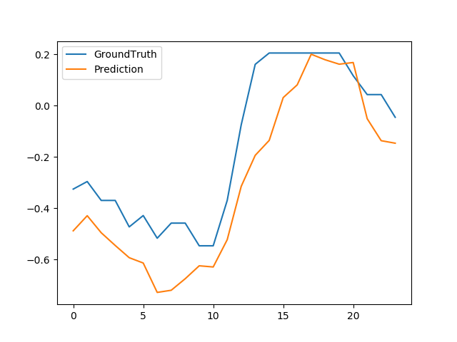

## LR 算法 Logistic Regression

## FM-GRU

数据处理：
label 数据缺失的用 0 值补全 没有带时间数据
数据:dataset2.csv

```python
第一次：
Epoch-9: MAE=0.6256896288444599;
MSE=0.7716576975459853;
RMSE=0.8365627862513065;
NRMSE=0.1759436770201489
time consumption: 144.52682209014893
第二次：
Epoch-9: MAE=0.5640662337342898;
MSE=0.5737103850891193;
RMSE=0.7280830492575964;
NRMSE=0.15476489654331746
time consumption: 129.98186469078064
```

数据：HMWSmall.csv

```python
Epoch-9: MAE=0.7204340462749069;
MSE=0.9228052129918659;
RMSE=0.9296268079731915;
NRMSE=0.20078527823625594
time consumption: 389.93425846099854
```

数据：海门湾 label=4.csv

```python
Epoch-9:
MAE=0.6509949515718932;
MSE=0.7955262385285958;
RMSE=0.8547483034181304;
NRMSE=0.1715240579187544
time consumption: 1724.2369396686554
第二次实验：
Epoch-9: MAE=0.7214407597751064;MSE=0.9617295162666828;RMSE=0.939981120031908;NRMSE=0.19553191428042757
time consumption: 1791.8562726974487
```

## LSTM 对比实验

数据：dataset2.csv

```python
mae:0.18 mse:0.04 rmse:0.21 nrmse: 0.03
```

## XGB 实验：

数据：海门湾 2000x5.csv

```python
MAE: 0.622
MSE: 0.878
RMSE: 0.937
NRMSE: 0.147
```


数据：HMWSmall.csv

```python
MAE: 0.519
MSE: 0.476
RMSE: 0.690
NRMSE: 0.160
time consumption: 570.6767070293427
```


# informer

论文的实验使用了 1/4L+L 组合的 informer stack 模型。

'M:多变量预测多元（multivariate predict multivariate）'，
'S:单变量预测单变量（univariate predict univariate）'，
'MS:多变量预测单变量（multivariate predict univariate）'。

不对数据进行处理：
数据：全年数据

> 模型过拟合 泛华能力弱

数据：HMW_ALL

```python
Namespace(activation='gelu', attn='prob', batch_size=32, c_out=1, checkpoints='./checkpoints/', cols=None, d_ff=2048, d_layers=1, d_model=512, data='HMW_small', data_path='HMW_small.csv', dec_in=5, des='test', detail_freq='h', devices='0,1,2,3', distil=True, do_predict=False, dropout=0.05, e_layers=2, embed='timeF', enc_in=5, factor=5, features='MS', freq='h', gpu=0, inverse=False, itr=5, label_len=48, learning_rate=0.0001, loss='mse', lradj='type1', mix=True, model='informer', n_heads=8, num_workers=0, output_attention=False, padding=0, patience=5, pred_len=24, root_path='./data/', s_layers=[3, 2, 1], seq_len=96, target='oxy', train_epochs=6, use_amp=False, use_gpu=True, use_multi_gpu=False)
Use GPU: cuda:0
```

效果：mse:0.7565932273864746, mae:0.6806058287620544


数据 powerdata

```python
teps: 2814 | Train Loss: 0.0348153 Vali Loss: 0.0367153 Test Loss: 0.0566367
EarlyStopping counter: 5 out of 5
Early stopping
test 25757
test shape: (804, 32, 48, 1) (804, 32, 48, 1)
test shape: (25728, 48, 1) (25728, 48, 1)
mse:0.056838978081941605, mae:0.15307551622390747

```

效果：


数据：WTH

```python
第一次实验：
Namespace(activation='gelu', attn='prob', batch_size=32, c_out=1, checkpoints='./checkpoints/', cols=None, d_ff=2048, d_layers=1, d_model=512, data='WTH', data_path='WTH.csv', dec_in=1, des='Exp', detail_freq='h', devices='0,1,2,3', distil=True, do_predict=False, dropout=0.05, e_layers=2, embed='timeF', enc_in=1, factor=5, features='S', freq='h', gpu=0, inverse=False, itr=3, label_len=48, learning_rate=0.0001, loss='mse', lradj='type1', mix=True, model='informer', n_heads=8, num_workers=0, output_attention=False, padding=0, patience=3, pred_len=24, root_path='./data/', s_layers=[3, 2, 1], seq_len=96, target='WetBulbCelsius', train_epochs=6, use_amp=False, use_gpu=True, use_multi_gpu=False)

mse:0.09717869758605957, mae:0.21864117681980133
第二次实验：
Namespace(activation='gelu', attn='prob', batch_size=32, c_out=12, checkpoints='./checkpoints/', cols=None, d_ff=2048, d_layers=1, d_model=512, data='WTH', data_path='WTH.csv', dec_in=12, des='Exp', detail_freq='h', devices='0,1,2,3', distil=True, do_predict=False, dropout=0.05, e_layers=2, embed='timeF', enc_in=12, factor=5, features='M', freq='h', gpu=0, inverse=False, itr=3, label_len=48, learning_rate=0.0001, loss='mse', lradj='type1', mix=True, model='informer', n_heads=8, num_workers=0, output_attention=False, padding=0, patience=3, pred_len=24, root_path='./data/', s_layers=[3, 2, 1], seq_len=96, target='WetBulbCelsius', train_epochs=6, use_amp=False, use_gpu=True, use_multi_gpu=False)
Use GPU: cuda:0
Epoch: 4, Steps: 763 | Train Loss: 0.2213985 Vali Loss: 0.4212814 Test Loss: 0.3256248
EarlyStopping counter: 3 out of 3
Early stopping
test 6989
test shape: (218, 32, 24, 12) (218, 32, 24, 12)
test shape: (6976, 24, 12) (6976, 24, 12)
mse:0.3156082034111023, mae:0.3719654083251953

```

第二次实验效果：



```pythonb
Namespace(activation='gelu', attn='prob', batch_size=32, c_out=1, checkpoints='./checkpoints/', cols=None, d_ff=2048, d_layers=1, d_model=512, data='HMWFULL', data_path='HMWFULL.csv', dec_in=1, des='Exp', detail_freq='h', devices='0,1,2,3', distil=False, do_predict=False, dropout=0.05, e_layers=2, embed='timeF', enc_in=1, factor=5, features='S', freq='h', gpu=0, inverse=False, itr=50, label_len=48, learning_rate=0.0001, loss='mse', lradj='type1', mix=True, model='informerstack', n_heads=8, num_workers=0, output_attention=False, padding=0, patience=5, pred_len=24, root_path='./data/', s_layers=[3, 2, 1], seq_len=96, target='oxy', train_epochs=30, use_amp=False, use_gpu=True, use_multi_gpu=False)
Use GPU: cuda:0


mse:0.5204310417175293, mae:0.551766574382782
```


## 实验问题

<!-- 数据稀疏 有大量的空值 导致模型收敛效果不好 -->

先用 FM 对原始数据进行处理 后再输入模型中训练 改进 informer 模型 1.优化器

2 随机搜索 优化参数调整

数据过拟合

### 是否是数据量不够导致过拟合

数据：WTH

```python
Args in experiment:
Namespace(activation='gelu', attn='prob', batch_size=32, c_out=12, checkpoints='./checkpoints/', cols=None, d_ff=2048, d_layers=1, d_model=512, data='WTH', data_path='WTH.csv', dec_in=12, des='Exp', detail_freq='h', devices='0,1,2,3', distil=True, do_predict=False, dropout=0.05, e_layers=2, embed='timeF', enc_in=12, factor=5, features='M', freq='h', gpu=0, inverse=False, itr=3, label_len=48, learning_rate=0.0001, loss='mse', lradj='type1', mix=True, model='informer', n_heads=8, num_workers=0, output_attention=False, padding=0, patience=3, pred_len=24, root_path='./data/', s_layers=[3, 2, 1], seq_len=96, target='WetBulbCelsius', train_epochs=6, use_amp=False, use_gpu=True, use_multi_gpu=False)
Use GPU: cuda:0
train 24425
val 3485
test 6989
Epoch: 1 cost time: 63.796271085739136
Epoch: 1, Steps: 763 | Train Loss: 0.3811573 Vali Loss: 0.4086232 Test Loss: 0.3270284
Validation loss decreased (inf --> 0.408623).  Saving model ...
Updating learning rate to 0.0001
Epoch: 2 cost time: 56.0014066696167
Epoch: 2, Steps: 763 | Train Loss: 0.2971005 Vali Loss: 0.4012066 Test Loss: 0.3181123
Validation loss decreased (0.408623 --> 0.401207).  Saving model ...
Updating learning rate to 5e-05
Epoch: 3 cost time: 56.45022463798523
Epoch: 3, Steps: 763 | Train Loss: 0.2531563 Vali Loss: 0.4294812 Test Loss: 0.3225703
EarlyStopping counter: 1 out of 3
Updating learning rate to 2.5e-05
Epoch: 4 cost time: 56.34293866157532
Epoch: 4, Steps: 763 | Train Loss: 0.2272390 Vali Loss: 0.4422789 Test Loss: 0.3289614
EarlyStopping counter: 2 out of 3
Updating learning rate to 1.25e-05
Epoch: 5 cost time: 56.31914448738098
Epoch: 5, Steps: 763 | Train Loss: 0.2132428 Vali Loss: 0.4562938 Test Loss: 0.3320536
EarlyStopping counter: 3 out of 3
Early stopping
test 6989
test shape: (218, 32, 24, 12) (218, 32, 24, 12)
test shape: (6976, 24, 12) (6976, 24, 12)
mse:0.31823205947875977, mae:0.3682463765144348
Use GPU: cuda:0
train 24425
val 3485
test 6989
Epoch: 1 cost time: 56.746463775634766
Epoch: 1, Steps: 763 | Train Loss: 0.3788457 Vali Loss: 0.3907439 Test Loss: 0.3091684
Validation loss decreased (inf --> 0.390744).  Saving model ...
Updating learning rate to 0.0001
Epoch: 2 cost time: 56.375022411346436
Epoch: 2, Steps: 763 | Train Loss: 0.2963837 Vali Loss: 0.4053312 Test Loss: 0.3231265
EarlyStopping counter: 1 out of 3
Updating learning rate to 5e-05
Epoch: 3 cost time: 56.67919874191284
Epoch: 3, Steps: 763 | Train Loss: 0.2505333 Vali Loss: 0.4084474 Test Loss: 0.3248915
EarlyStopping counter: 2 out of 3
Updating learning rate to 2.5e-05
Epoch: 4 cost time: 56.6005961894989
Epoch: 4, Steps: 763 | Train Loss: 0.2243188 Vali Loss: 0.4288246 Test Loss: 0.3335948
EarlyStopping counter: 3 out of 3
Early stopping
test 6989
test shape: (218, 32, 24, 12) (218, 32, 24, 12)
test shape: (6976, 24, 12) (6976, 24, 12)
mse:0.3092172145843506, mae:0.3625324070453644
Use GPU: cuda:0
train 24425
val 3485
test 6989
Epoch: 1 cost time: 56.78239607810974
Epoch: 1, Steps: 763 | Train Loss: 0.3787740 Vali Loss: 0.3965647 Test Loss: 0.3124289
Validation loss decreased (inf --> 0.396565).  Saving model ...
Updating learning rate to 0.0001
Epoch: 2 cost time: 56.635188579559326
Epoch: 2, Steps: 763 | Train Loss: 0.2948636 Vali Loss: 0.4022826 Test Loss: 0.3077486
EarlyStopping counter: 1 out of 3
Updating learning rate to 5e-05
Epoch: 3 cost time: 58.146103382110596
Epoch: 3, Steps: 763 | Train Loss: 0.2491131 Vali Loss: 0.4316607 Test Loss: 0.3205608
EarlyStopping counter: 2 out of 3
Updating learning rate to 2.5e-05
Epoch: 4 cost time: 58.03831100463867
Epoch: 4, Steps: 763 | Train Loss: 0.2221787 Vali Loss: 0.4414862 Test Loss: 0.3280292
EarlyStopping counter: 3 out of 3
Early stopping
test 6989
test shape: (218, 32, 24, 12) (218, 32, 24, 12)
test shape: (6976, 24, 12) (6976, 24, 12)
mse:0.3123178482055664, mae:0.36595234274864197
```

效果：


将 WTH 数据减少到 13099

```python
Args in experiment:
Namespace(activation='gelu', attn='prob', batch_size=32, c_out=12, checkpoints='./checkpoints/', cols=None, d_ff=2048, d_layers=1, d_model=512, data='WTH_small', data_path='WTH_small.csv', dec_in=12, des='Exp', detail_freq='h', devices='0,1,2,3', distil=True, do_predict=False, dropout=0.05, e_layers=2, embed='timeF', enc_in=12, factor=5, features='M', freq='h', gpu=0, inverse=False, itr=3, label_len=48, learning_rate=0.0001, loss='mse', lradj='type1', mix=True, model='informer', n_heads=8, num_workers=0, output_attention=False, padding=0, patience=3, pred_len=24, root_path='./data/', s_layers=[3, 2, 1], seq_len=96, target='WetBulbCelsius', train_epochs=6, use_amp=False, use_gpu=True, use_multi_gpu=False)
Use GPU: cuda:0
train 9049
val 1288
test 2596
	iters: 100, epoch: 1 | loss: 0.3929413
	speed: 0.1156s/iter; left time: 184.1941s
	iters: 200, epoch: 1 | loss: 0.3709807
	speed: 0.0759s/iter; left time: 113.3635s
Epoch: 1 cost time: 25.358320951461792
Epoch: 1, Steps: 282 | Train Loss: 0.4345655 Vali Loss: 0.5087171 Test Loss: 0.4339369
Validation loss decreased (inf --> 0.508717).  Saving model ...
Updating learning rate to 0.0001
	iters: 100, epoch: 2 | loss: 0.2958772
	speed: 0.1762s/iter; left time: 231.0189s
	iters: 200, epoch: 2 | loss: 0.3318094
	speed: 0.0744s/iter; left time: 90.0887s
Epoch: 2 cost time: 20.981266498565674
Epoch: 2, Steps: 282 | Train Loss: 0.3085716 Vali Loss: 0.5106961 Test Loss: 0.4459712
EarlyStopping counter: 1 out of 3
Updating learning rate to 5e-05
	iters: 100, epoch: 3 | loss: 0.2508945
	speed: 0.1716s/iter; left time: 176.5808s
	iters: 200, epoch: 3 | loss: 0.2346871
	speed: 0.0748s/iter; left time: 69.4849s
Epoch: 3 cost time: 21.04939556121826
Epoch: 3, Steps: 282 | Train Loss: 0.2538351 Vali Loss: 0.5617536 Test Loss: 0.4440238
EarlyStopping counter: 2 out of 3
Updating learning rate to 2.5e-05
	iters: 100, epoch: 4 | loss: 0.2400217
	speed: 0.1718s/iter; left time: 128.3560s
	iters: 200, epoch: 4 | loss: 0.1911491
	speed: 0.0746s/iter; left time: 48.2374s
Epoch: 4 cost time: 21.02139139175415
Epoch: 4, Steps: 282 | Train Loss: 0.2284331 Vali Loss: 0.5406013 Test Loss: 0.4592241
EarlyStopping counter: 3 out of 3
Early stopping
test 2596
test shape: (81, 32, 24, 12) (81, 32, 24, 12)
test shape: (2592, 24, 12) (2592, 24, 12)
mse:0.4339095950126648, mae:0.44402486085891724
Use GPU: cuda:0
train 9049
val 1288
test 2596
	iters: 100, epoch: 1 | loss: 0.4348719
	speed: 0.0749s/iter; left time: 119.2977s
	iters: 200, epoch: 1 | loss: 0.4007643
	speed: 0.0746s/iter; left time: 111.4375s
Epoch: 1 cost time: 21.12400794029236
Epoch: 1, Steps: 282 | Train Loss: 0.4405728 Vali Loss: 0.5352291 Test Loss: 0.4438668
Validation loss decreased (inf --> 0.535229).  Saving model ...
Updating learning rate to 0.0001
	iters: 100, epoch: 2 | loss: 0.3224227
	speed: 0.1759s/iter; left time: 230.5588s
	iters: 200, epoch: 2 | loss: 0.2572384
	speed: 0.0756s/iter; left time: 91.5637s
Epoch: 2 cost time: 21.34011459350586
Epoch: 2, Steps: 282 | Train Loss: 0.3162456 Vali Loss: 0.5325221 Test Loss: 0.4487060
Validation loss decreased (0.535229 --> 0.532522).  Saving model ...
Updating learning rate to 5e-05
	iters: 100, epoch: 3 | loss: 0.2374957
	speed: 0.1759s/iter; left time: 181.0154s
	iters: 200, epoch: 3 | loss: 0.2355222
	speed: 0.0758s/iter; left time: 70.4288s
Epoch: 3 cost time: 21.344139575958252
Epoch: 3, Steps: 282 | Train Loss: 0.2626097 Vali Loss: 0.5565879 Test Loss: 0.4496032
EarlyStopping counter: 1 out of 3
Updating learning rate to 2.5e-05
	iters: 100, epoch: 4 | loss: 0.2350486
	speed: 0.1742s/iter; left time: 130.1581s
	iters: 200, epoch: 4 | loss: 0.2261773
	speed: 0.0756s/iter; left time: 48.9275s
Epoch: 4 cost time: 21.31989288330078
Epoch: 4, Steps: 282 | Train Loss: 0.2369285 Vali Loss: 0.5546714 Test Loss: 0.4589340
EarlyStopping counter: 2 out of 3
Updating learning rate to 1.25e-05
	iters: 100, epoch: 5 | loss: 0.2155548
	speed: 0.1745s/iter; left time: 81.1575s
	iters: 200, epoch: 5 | loss: 0.2049205
	speed: 0.0759s/iter; left time: 27.6925s
Epoch: 5 cost time: 21.35876154899597
Epoch: 5, Steps: 282 | Train Loss: 0.2249534 Vali Loss: 0.5526537 Test Loss: 0.4628886
EarlyStopping counter: 3 out of 3
Early stopping
test 2596
test shape: (81, 32, 24, 12) (81, 32, 24, 12)
test shape: (2592, 24, 12) (2592, 24, 12)
mse:0.4481780529022217, mae:0.46156835556030273
Use GPU: cuda:0
train 9049
val 1288
test 2596
	iters: 100, epoch: 1 | loss: 0.3555815
	speed: 0.0762s/iter; left time: 121.4317s
	iters: 200, epoch: 1 | loss: 0.3954389
	speed: 0.0758s/iter; left time: 113.1718s
Epoch: 1 cost time: 21.422552585601807
Epoch: 1, Steps: 282 | Train Loss: 0.4345994 Vali Loss: 0.4956020 Test Loss: 0.4256884
Validation loss decreased (inf --> 0.495602).  Saving model ...
Updating learning rate to 0.0001
	iters: 100, epoch: 2 | loss: 0.3080822
	speed: 0.1769s/iter; left time: 231.9102s
	iters: 200, epoch: 2 | loss: 0.3988460
	speed: 0.0758s/iter; left time: 91.7762s
Epoch: 2 cost time: 21.35769748687744
Epoch: 2, Steps: 282 | Train Loss: 0.3083995 Vali Loss: 0.5282077 Test Loss: 0.4418433
EarlyStopping counter: 1 out of 3
Updating learning rate to 5e-05
	iters: 100, epoch: 3 | loss: 0.2559841
	speed: 0.1748s/iter; left time: 179.8352s
	iters: 200, epoch: 3 | loss: 0.2613652
	speed: 0.0757s/iter; left time: 70.2881s
Epoch: 3 cost time: 21.38126850128174
Epoch: 3, Steps: 282 | Train Loss: 0.2551193 Vali Loss: 0.5191556 Test Loss: 0.4380889
EarlyStopping counter: 2 out of 3
Updating learning rate to 2.5e-05
	iters: 100, epoch: 4 | loss: 0.1936909
	speed: 0.1749s/iter; left time: 130.6762s
	iters: 200, epoch: 4 | loss: 0.2377086
	speed: 0.0758s/iter; left time: 49.0485s
Epoch: 4 cost time: 21.35731053352356
Epoch: 4, Steps: 282 | Train Loss: 0.2307397 Vali Loss: 0.5280428 Test Loss: 0.4381759
EarlyStopping counter: 3 out of 3
Early stopping
test 2596
test shape: (81, 32, 24, 12) (81, 32, 24, 12)
test shape: (2592, 24, 12) (2592, 24, 12)
mse:0.42530733346939087, mae:0.43608078360557556

```

效果：


HMW 增加数据量到 17000

```python
Epoch: 6, Steps: 377 | Train Loss: 0.2115505 Vali Loss: 0.9331595 Test Loss: 0.8476166
EarlyStopping counter: 4 out of 5
Updating learning rate to 3.125e-06
test 3466
test shape: (108, 32, 24, 1) (108, 32, 24, 1)
test shape: (3456, 24, 1) (3456, 24, 1)
mse:0.7616454362869263, mae:0.6817399263381958
```


## 实验数据处理

超参数优化 正则化不能简单的加惩罚项
使用 VAE 变分自编码器 增强数据
修改多头注意力头数为 4 减半
效果 模型过拟合程度减小
数据非连续 两小时一次 有 305 个缺失值
使用 AE 进行预训练得到

采用线性插值和小波技术分别对缺失数据进行填充和去噪
去除噪声并平滑时间序列数据 ：
SG 或者卡尔曼滤波器
降噪

## 对比实验记录

label 数据：tem
xgboost
数据：原始数据填 0 测试 Tem.csv

数据以及参数：Namespace(activation='gelu', attn='prob', batch_size=32, c_out=1, checkpoints='./checkpoints/', cols=None, d_ff=2048, d_layers=1, d_model=512, data='HMW 未平滑测测试 tur', data_path='HMW 未平滑测测试 tur.csv', dec_in=1, des='原始数据测试 tem', detail_freq='h', devices='0,1,2,3', distil=False, do_predict=False, dropout=0.05, e_layers=2, embed='timeF', enc_in=1, factor=5, features='S', freq='h', gpu=0, inverse=False, itr=1, label_len=96, learning_rate=0.0001, loss='mse', lradj='type1', mix=True, model='informerstack', n_heads=8, num_workers=0, output_attention=False, padding=0, patience=6, pred_len=48, root_path='./data/', s_layers=[3, 2, 1], seq_len=144, target='tur', train_epochs=50, use_amp=False, use_gpu=True, use_multi_gpu=False)
Use GPU: cuda:0
mse:2.061469793319702, mae:0.6467424035072327

Namespace(activation='gelu', attn='prob', batch_size=32, c_out=1, checkpoints='./checkpoints/', cols=None, d_ff=2048, d_layers=1, d_model=512, data='HMW 为平滑测试 tem', data_path='HMW 为平滑测试 tem.csv', dec_in=1, des='HMW 为平滑测试 tem 实验第一次', detail_freq='h', devices='0,1,2,3', distil=False, do_predict=False, dropout=0.05, e_layers=2, embed='timeF', enc_in=1, factor=5, features='S', freq='h', gpu=0, inverse=False, itr=1, label_len=48, learning_rate=0.0001, loss='mse', lradj='type1', mix=True, model='informerstack', n_heads=8, num_workers=0, output_attention=False, padding=0, patience=6, pred_len=24, root_path='./data/', s_layers=[3, 2, 1], seq_len=96, target='tem', train_epochs=100, use_amp=False, use_gpu=True, use_multi_gpu=False)
Use GPU: cuda:0
mse:0.053930822759866714, mae:0.16455648839473724

Namespace(activation='gelu', attn='prob', batch_size=32, c_out=1, checkpoints='./checkpoints/', cols=None, d_ff=2048, d_layers=1, d_model=512, data='HMWFULL 全平滑', data_path='HMWFULL 全平滑.csv', dec_in=1, des='全平滑数据测试 tem 第 2 次', detail_freq='h', devices='0,1,2,3', distil=False, do_predict=False, dropout=0.05, e_layers=2, embed='timeF', enc_in=1, factor=5, features='S', freq='h', gpu=0, inverse=False, itr=1, label_len=48, learning_rate=0.0001, loss='mse', lradj='type1', mix=True, model='informerstack', n_heads=8, num_workers=0, output_attention=False, padding=0, patience=6, pred_len=24, root_path='./data/', s_layers=[3, 2, 1], seq_len=96, target='tem', train_epochs=50, use_amp=False, use_gpu=True, use_multi_gpu=False)
Use GPU: cuda:0
mse:0.050531916320323944, mae:0.17868748307228088

Namespace(activation='gelu', attn='prob', batch_size=32, c_out=1, checkpoints='./checkpoints/', cols=None, d_ff=2048, d_layers=1, d_model=512, data='HMWFULL 全平滑', data_path='HMWFULL 全平滑.csv', dec_in=5, des='全平滑数据测试 tem 第 1 次 MS', detail_freq='h', devices='0,1,2,3', distil=False, do_predict=False, dropout=0.05, e_layers=2, embed='timeF', enc_in=5, factor=5, features='MS', freq='h', gpu=0, inverse=False, itr=1, label_len=48, learning_rate=0.0001, loss='mse', lradj='type1', mix=True, model='informerstack', n_heads=8, num_workers=0, output_attention=False, padding=0, patience=6, pred_len=24, root_path='./data/', s_layers=[3, 2, 1], seq_len=96, target='tem', train_epochs=50, use_amp=False, use_gpu=True, use_multi_gpu=False)
Use GPU: cuda:
mse:0.18952175974845886, mae:0.326072335243225

Namespace(activation='gelu', attn='prob', batch_size=32, c_out=1, checkpoints='./checkpoints/', cols=None, d_ff=2048, d_layers=1, d_model=512, data='HMWFULL 全平滑测试 PH', data_path='HMWFULL 全平滑测试 PH.csv', dec_in=1, des='HMWFULL 全平滑测试 PH02', detail_freq='h', devices='0,1,2,3', distil=False, do_predict=False, dropout=0.05, e_layers=2, embed='timeF', enc_in=1, factor=5, features='S', freq='h', gpu=0, inverse=False, itr=1, label_len=48, learning_rate=0.0001, loss='mse', lradj='type1', mix=True, model='informerstack', n_heads=8, num_workers=0, output_attention=False, padding=0, patience=6, pred_len=24, root_path='./data/', s_layers=[3, 2, 1], seq_len=96, target='PH', train_epochs=100, use_amp=False, use_gpu=True, use_multi_gpu=False)
Use GPU: cuda:0
mse:1.0920016765594482, mae:0.692217230796814

## 数据平滑前后对比


GRU 测试 训练数据平滑测试原始 tem
Epoch-9: MAE=0.3710864945481391;MSE=0.5061650873447188;RMSE=0.5061737629201142;NRMSE=0.021544123023164764
time consumption: 1728.8260278701782

原始数据填 0 测试 Tem
xgboost 训练数据平滑测试原始 tem
Epoch-9: MAE=0.5162394441907551;MSE=0.8672649646366181;RMSE=0.6923129876052981;NRMSE=0.029339418060000448
time consumption: 1712.5348207950592

MAE: 0.140
MSE: 0.034
RMSE: 0.185
NRMSE: 0.006
time consumption: 8153.2218708992


informer
Namespace(activation='gelu', attn='prob', batch_size=32, c_out=1, checkpoints='./checkpoints/', cols=None, d_ff=2048, d_layers=1, d_model=512, data='原始数据平滑训练和验证非平滑测试', data_path='原始数据平滑训练和验证非平滑测试.csv', dec_in=5, des='原始数据平滑训练和验证非平滑测试 Tem02_infomer', detail_freq='h', devices='0,1,2,3', distil=False, do_predict=False, dropout=0.05, e_layers=2, embed='timeF', enc_in=5, factor=5, features='MS', freq='h', gpu=0, inverse=False, itr=5, label_len=48, learning_rate=0.0001, loss='mse', lradj='type1', mix=True, model='informer', n_heads=8, num_workers=0, output_attention=False, padding=0, patience=6, pred_len=24, root_path='./data/', s_layers=[3, 2, 1], seq_len=96, target='tem', train_epochs=20, use_amp=False, use_gpu=True, use_multi_gpu=False)
Use GPU: cuda:0
mse:0.3933122158050537, mae:0.33675721287727356

## 灰色关联分析

做水质评价

inoformerstack 比 informer 效果好

informer mse:0.7242347598075867, mae:0.6504984498023987
stack mse:0.5931978821754456, mae:0.5942239165306091

lstm 对比实验

## 卡尔曼

## 相关论文

Adaptive self-attention LSTM for RUL prediction of lithium-ion batteries

> To achieve an accurate remaining useful life (RUL) prediction for lithium-ion batteries (LIBs), this study proposes an adaptive self-attention long short-term memory (SA-LSTM) prediction model. The innovations of the designed prediction model include the following. (1) It features an optimized local tangent space alignment algorithm, which allows the extraction of an indirect health indicator (HI) that can precisely describe battery degeneration from charge data. The extracted HI exhibits a high correlation with the standard capacity, thus facilitating RUL estimation. (2) By introducing a masked multi-head self-attention module into the time-series prediction model based on LSTM, critical information in the sequences is captured and the prediction performance is improved. (3) An online self-tuning mechanism for the weights and biases of neural networks is designed to correct cumulative estimation errors in long-term predictions and reduce the effects of local fluctuations and regeneration. The proposed prediction model enables the HI values in future cycles to be iteratively estimated using the one-step-ahead method, and the RUL can be forecast once the predicted signal falls. Experimental results indicate the effectiveness and superiority of the proposed prediction method.

## 实验对比

原始数据：
gur attention 海门湾 label=4.csv 测试 oxy
Epoch-19: MAE=0.5056305906590507;MSE=0.49453759521491714;RMSE=0.6673399734037854;NRMSE=0.13308724587662887
gur self attention 海门湾 label=4.csv 测试 oxy
Epoch-18: MAE=0.47861688153758747;MSE=0.4258741292114809;RMSE=0.6298131934168167;NRMSE=0.12948916728283139
lstm attention 海门湾 label=4.csv 测试 oxy
MAE=0.3664150093522322;MSE=0.25913278078462904;RMSE=0.48949103461491533;NRMSE=0.09892116048231667
lstm self attention 海门湾 label=4.csv 测试 oxy
Epoch-19: MAE=0.39482879702046675;MSE=0.3108506501228544;RMSE=0.5325323370045679;NRMSE=0.10643937736614949
time consumption: 3715.6570472717285
lstm self attention fm 海门湾 label=4.csv 测试 oxy
Epoch-19: MAE=0.35727761726919793;MSE=0.24399237469901608;RMSE=0.4776049191548831;NRMSE=0.09572045595054353
GRU self attention fm dataset2
MAE=0.5333394085864184;MSE=0.5864764062582569;RMSE=0.7340354433448523;NRMSE=0.1512885612852088
GRU attention fm dataset2
Epoch-19: MAE=0.47163130941422265;MSE=0.47747090259777747;RMSE=0.6491814356144684;NRMSE=0.13813591654090107
LSTM attention fm dataset2
MAE=0.41815303584969804;MSE=0.3683506297518309;RMSE=0.5774055411097265;NRMSE=0.12160736982288178

## 实验改进

使用更先进的平滑滤波 RTS EKF
估计过去的状态叫平滑，估计当前的状态叫滤波，估计未来的状态叫预测

## 论文大纲

数据处理
self.features：协变量
self.label label
encode_step 24
forcast_step 12
len 计算 len(self.features) - self.forcast_step - self.encode_step - 1
hisx 协变量
hisz 训练的 label
futx 预测的协变量
z 预测 babel

forward ：
futureZ 预测步

## 实验图片

Comparison between Machine-Learning-Based Turbidity Models Developed for Different Lake Zones in a Large Shallow Lake


## 评价指标

Efficient Water Quality Prediction Using Supervised Machine Learning

Enhancement of water quality index prediction using support vector machine with sensitivity analysis
水质处理 缺失值
