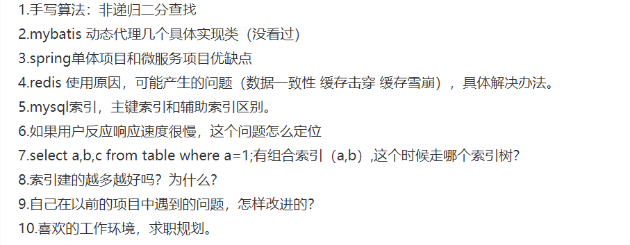
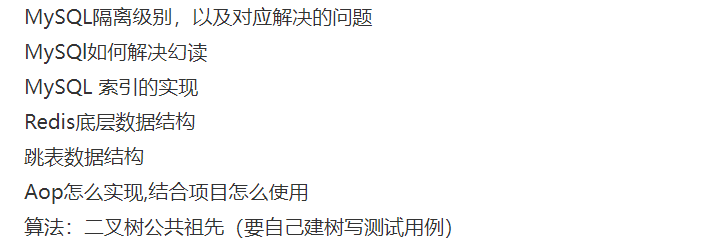
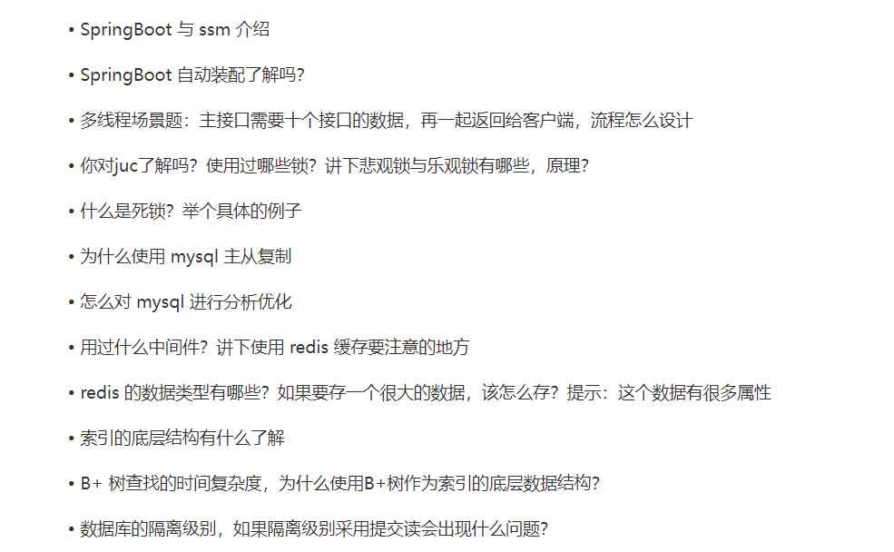
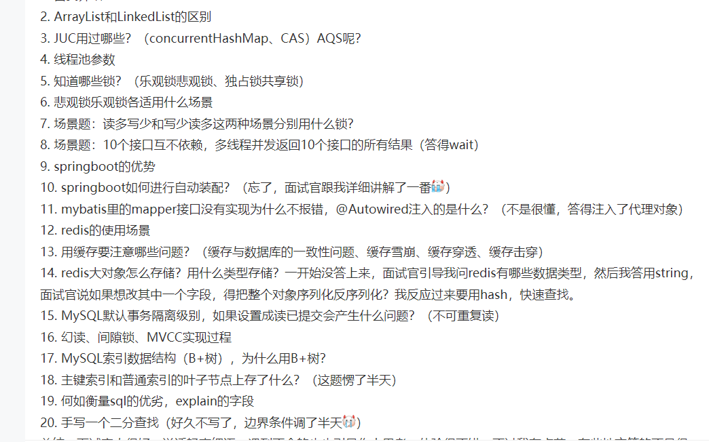
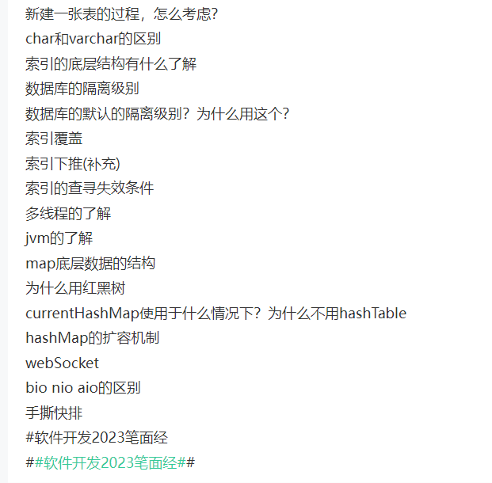
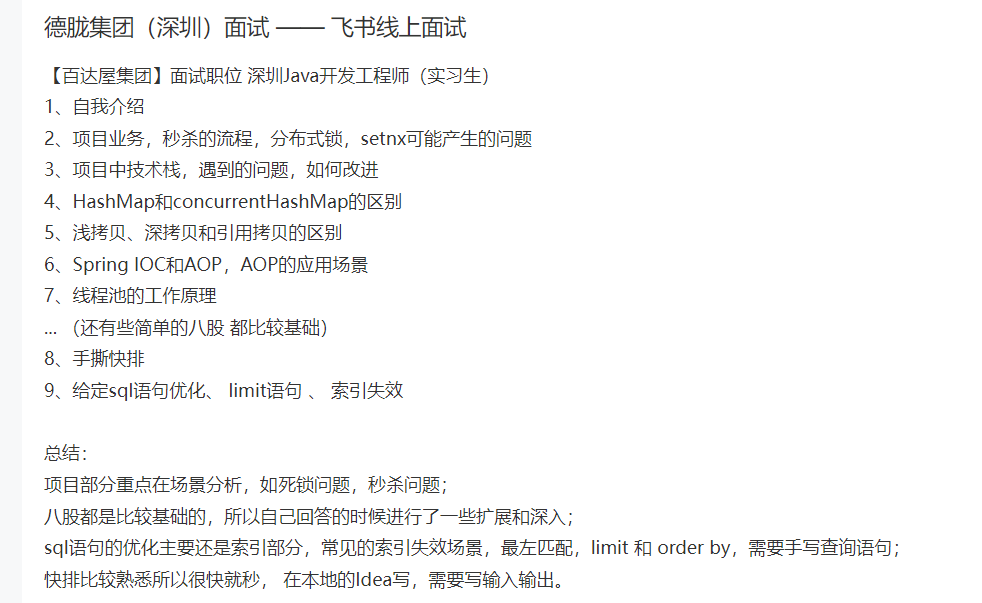
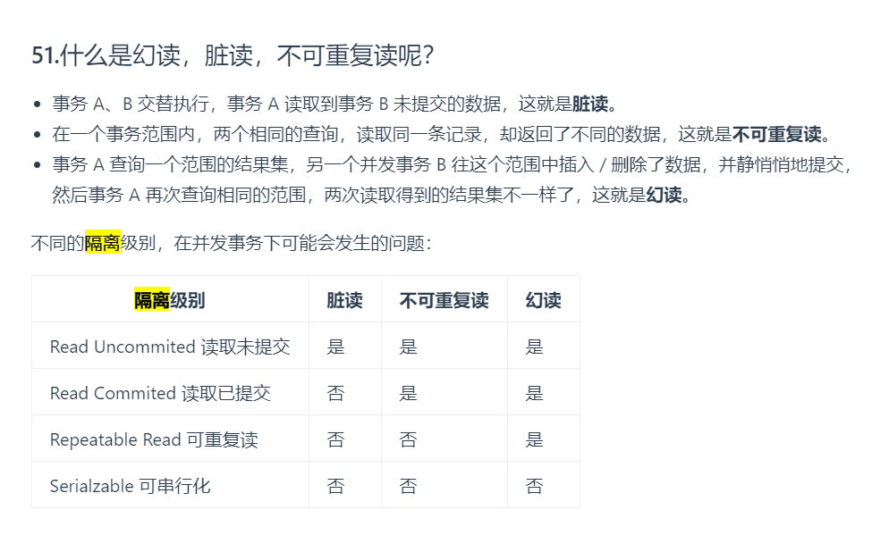
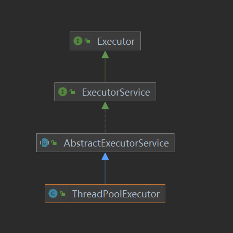
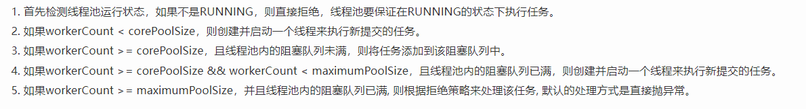

hashMap 和 redis
https://www.nowcoder.com/discuss/456462764354134016?sourceSSR=search

### 怎么对 mysql 进行分析优化

对较大的数据表考虑分页，不去查询不必要的列 不用 select \*
mysql 索引优化：合理的使用索引
建立覆盖索引，或者使用索引查询，避免索引失效的情况，例如使用了模糊查询 不遵循最左匹配 使用了 or 查询,对索引列应用了函数计算，联合查询时尽量小表驱动大表

### currentHashMap 使用于什么情况下？为什么不用 nash Table

ConcurrentHashMap 是 Java 集合框架中的一种线程安全的哈希表实现。它允许多个线程同时进行读操作，而不需要加锁或阻塞其他线程。它的实现基于分段锁（Segment），每个 Segment 相当于一个小的 HashTable，具有自己的锁。因此，多个线程可以同时对不同的 Segment 进行操作。。提高了并发效率，但是 hashtable 使用了 syn 重量级锁保证线程安全，一次只有一个线程可以访问同步方法，其他线程均要被阻塞，效率低下，且竞争激烈效率越低。

### 主键索引和辅助索引叶子节点存储的信息

InnoDB 中的主键索引又称为聚簇索引，叶子节点存的是整行数据，直接通过这个聚集索引的键值找到某行，从叶子节点获取所需的数据
辅助索引叶子存储了被索引列的值以及一个指向对应数据行的引用

## 如果用户反应响应速度很慢，这个问题怎么定位

排查网络问题，机器的内存使用 cpu 使用，磁盘使用
排查数据库查询过程
必要字段加索引
ALTER TABLE `table_name` ADD INDEX index_name ( `column1`, `column2`, `column3` )
确定是否索引失效了
如果有回表查询，尽量优化为覆盖索引

### 等待多个线程同时返回结果

使用 CountDownLatch 多线程倒计时计数器，强制等待其他线程都执行完毕，主线程调用 await() 方法

## mysql 索引，主键索引和辅助索引区别。

主键索引的叶子结点存放的是字段的信息，辅助索引存放的是索引键的信息
他们区别在于，聚集索引的叶子节点存放的是实际数据，所有完整的用户记录都存放在聚集索引的叶子节点，而二级索引的叶子节点存放的是主键值，而不是实际数据。

## mysql 的隔离级别

读未提交 脏读 不可重复读 幻读
读已提交 不可重复读 幻读
可重复读 幻读
序列化

#### 如何解决幻读

设置事务的隔离级别为可重复读防止幻读，同时利用 MVCC 生成多个事务版本，每个事务读取相应的数据版本，保障事务之间的隔离，

#### MVCC 实现原理

MVCC 多版本并发控制 用于解决多个事务同时访问同一数据的并发问题。
MVCC 采用了乐观锁的思想，即假设事务不会相互干扰，直到提交时才对数据进行检查和更新。
实际处理中，即将每个数据创建多个版本（即数据快照），每个事务都会得到一个对应的版本。同时，在每个版本中都会记录该版本创建的时间戳和事务 ID，以及该版本所包含的数据内容。
在读取事务时，MVCC 会根据当前事务的时间戳和事务 ID，选择一个合适的版本来返回给用户。如果当前事务的时间戳早于某个版本的创建时间戳，那么这个版本就对当前事务不可见；反之，如果当前事务的时间戳晚于某个版本的创建时间戳，但早于该版本被提交的时间戳，那么这个版本就对当前事务可见。
这样写者修改未提交之前 不会对其他读者产生影响

#### 为什么需要 B+树

时间复杂度为 O lg n 多路平衡查找树,相比于普通二叉树不存在退化为单只树的情况（相当于全表扫描），相比于树没找一次都要查找的一次磁盘，二叉树高度更高查找磁盘数量更多，B+树的叶子节点通过双向链表连接可以进行范围查找，全表扫描更方便，IO 次数更稳定

#### mysql 数据库的读写分离

搭建一主一从或一主多从集群服务器，主机器只负责读写，从机器负责读操作，
主机器通过复制将数据同步到从机器上

## 覆盖索引


创建复合索引，(b,c,d)后查询 abcd 不需要进行回表操作，非聚簇索引直接可以找到所有信息，非聚簇索引的叶子节点上会存放键的值，也就是我们的(b,c,d) 这三个字段，还会存放主键 a 字段用于回表操作。

#### 索引下推

是 mysql5.6 之后的优化
索引下推（Index Pushdown）是一种数据库查询优化技术，目的是减少不必要的数据访问和提高查询效率。它在执行 SQL 查询时，尝试将部分过滤条件下推到存储引擎层级，使得数据访问更加高效。

一般情况下，索引下推可以在存储引擎层级上对查询进行优化。它的原理是利用索引的特性，将查询中的部分条件直接应用于索引来减少需要读取的数据块数量。通过将更多的过滤条件下推到存储引擎层级，减少了传输给数据库的数据量和执行查询的时间。

索引下推主要用于以下情况：

对于复杂的查询语句，可以将过滤条件下推到存储引擎层级，减少不必要的数据加载和传输。
对于涉及到多个索引的查询，可以通过下推技术优化查询性能，降低 IO 开销。
对于带有排序和分组操作的查询，可以将部分条件下推至存储引擎进行处理，减少数据的后续处理。
需要注意的是，索引下推的可行性和效果取决于具体的数据库管理系统和存储引擎，不同的数据库实现可能有不同的策略和实现方式。因此，在应用索引下推时，需要结合具体的数据库和查询场景进行评估和测试。

### spring 的自动装配

spring 通过容器将依赖注入到对应的 bean 中去，利用注解@Autowired 通过 bytype 根据类型进行自动匹配、byname 名称自动匹配、使用构造函数自动装配 constructor、使用注解自动装配

### 跳表的数据结构

跳表是利用有序链表和随机化的数据结构实现的，由多层有序链表组成，每一个有序链表都是下一层链表的子集，同时每个链表的节点包含了一个值和指向多个节点的指针，查找是从最上层的链表开始找到最近的大于目标节点的节点的前一个节点并进去该节点下一层对应的节点的链表继续寻找直到找到目标值。

### AOP 的实现和应用

面向切面编程 通过将业务中的相同代码抽取出来作为一个独立的模块并在需要的时候织入到具体代码中去
实现：

- 动态代理 使用 JDK 的动态代理实现（使用反射），需要实现被代理类的所有接口，使用 CGlib 则不需要（使用继承）。所以如果代理对象有接口，就用 JDK 动态代理，否则就是 Cglib 动态代理。
  如果代理对象没有接口，那么就直接是 Cglib 动态代理。

## java 基础

## mybatis

动态代理具体实现类：
MyBatis 动态代理的具体实现类有两个，分别是 MapperProxy 和 MapperProxyFactory。

MapperProxy：
MapperProxy 是 MyBatis 底层实现动态代理的类，它实现了 InvocationHandler 接口，用于处理代理方法的调用。

MapperProxyFactory：
MapperProxyFactory 是 Mapper 接口的工厂类，用于生成 MapperProxy 代理类的实例。

这两个类的作用是通过 Java 的动态代理机制，在运行时生成 Mapper 接口的实现类，将 SQL 语句和数据库操作映射到 Mapper 接口的方法上，使开发者可以通过调用 Mapper 接口的方法来进行数据库的操作。

需要注意的是，具体的 Mapper 接口需要继承自 BaseMapper 接口（或者对应的父接口），并在映射配置文件中配置 Mapper 接口对应的 namespace 和 SQL 语句。

## mysql

### 主从复制

首先，在主服务器上启用二进制日志（binary log），这是记录主服务器上对数据库进行的增删改操作的日志文件。

当主服务器的数据发生变化时，这些变化会被写入二进制日志文件。同时，主服务器会将这些变化以事件的形式发送给从服务器。

从服务器连接到主服务器，并请求获取主服务器的二进制日志文件。从服务器将根据读取的二进制日志文件内容来执行相应的操作，使得从服务器上的数据与主服务器保持同步。

当从服务器执行完一个事件后，它会向主服务器发送一个确认消息，主服务器收到确认消息后，会将该事件从二进制日志文件中删除。

#### 日志

- mysql 日志

  - 二进制日志 bin log 用于记录数据库中的所有数据更改操作。它是以二进制形式记录的，包括插入、更新和删除等操作。binlog 的主要目的是用于数据恢复、数据库复制和故障恢复等。
    InnoDB 引擎的日志
  - 重做日志（redo log）：重做日志至关重要，因为它们记录了对于 InnoDB 存储引擎的事务日志。redo log 是在事务提交之前写入磁盘的，以确保在发生数据库故障时数据的完整性
  - 回滚日志（undo log） 对数据库数据进行回滚操作,如果事务执行失败或调用了 rollback，导致事务需要回滚，就可以利用 undo log 中的信息将数据回滚到修改之前的样子

- binlog 和 redo log 有什么区别
  - binlog 会记录所有和数据库相关的日志，不限于 InnoDB 引擎，而 redo log 只记录 InnoDB 的日志
  - binlog 是在数据发生更改后才写入磁盘的，而 redo log 是在事务提交之前就写入磁盘的
  - bin log 记录了数据库的所有事务操作，而 redo log 记录的是事务的物理操作

#### mysql 如何解决幻读

- 使用

幻读是同一个事务多次查询得出不同的结果，使用 MVCC 多版本控制协议
或者使用可重复读隔离级别进行

#### mysql 的隔离级别



#### mysql 主从复制的目的

MySQL 主从复制的主要目的在于提高数据库的性能和可用性

- 主服务器进行写，从服务器进行读，可以同时处理更多的读和写请求，提高整个环境的读写性能
- 提高可用性：主服务器奔溃时，可以利用从服务器继续服务提高了系统的可用性
- 提高数据的安全性，将数据分散在不同服务器上，即使主服务器出现故障，数据也不会丢失
- 分摊负载，读写分离

### mybatis.里的 mapperi 接口没有实现为什么不报错

因为 MyBatis 使用了动态代理技术。在使用 Mapper 接口时，MyBatis 会在运行时动态生成一个接口的代理对象，代理对象会根据接口中定义的方法名和参数类型，通过配置文件或注解，将方法映射到对应的 SQL 语句执行。  
mapper 接口是没有实现类的，取而代之的是一个 xml 文件。也就是说我们调用 mapper 接口，其实是使用了 mapper.xml 中定义 sql 完成数据操作。当调用 Mapper 接口的方法时，MyBatis 会自动根据方法名和参数类型生成对应的 SQL 并执行。

### 死锁

多个线程因资源争夺过程而产生的相互等待的现象，条件，不可剥夺，循环等待，互斥，请求保持

### 悲观锁乐观锁各适用什么场景

悲观锁适用于以下场景：

当读操作远远大于写操作时，可以使用悲观锁保护共享数据的完整性。悲观锁假设会有其他线程修改数据，因此在读取数据之前会先获取锁，确保独占访问。
在并发量非常高的情况下，使用悲观锁可以降低竞争的可能性，减少锁冲突带来的性能损耗。
乐观锁适用于以下场景：

当写操作较少而读操作较多的情况下，使用乐观锁可以提高并发性能。乐观锁假设其他线程不会并发修改数据，在进行写操作之前不获取锁，只在提交修改时检查是否有冲突。
对于读操作非常频繁且只有少部分更新操作的场景，使用乐观锁可以避免不必要的加锁和解锁开销，提高系统吞吐量。

### 乐观锁和悲观锁实际应用

使用乐观锁解决超卖问题
每次线程操作数据会查询当前数据的版本号，对版本号+1，并提交回数据，并检验当前的版本号是否比之前的版本号大 1，是则没有线程对当前数据进行修改，操作成功。

## 线程池

- 线程池
  池化管理线程的工具，关键在于将任务和线程进行解耦
- 为什么需要线程池
  线程池可以统一的对线程进行分配，调优和监控：
  - 降低资源消耗(线程无限制地创建，然后使用完毕后销毁)
  - 提高响应速度(无须创建线程)
  - 提高线程的可管理性
- 解决什么问题
  在并发环境下对资源进行管理和分配

- 实现
  Java 中的线程池核心实现类是 ThreadPoolExecutor

> 池化策略 资源控制 管理和复用资源

作用：线程池作用就是限制系统中执行线程的数量，提高响应速度，降低资源消耗，重复利用
原因：减少了创建和销毁线程的次数，每个工作线程都可以被重复利用，可执行多个任务
线程池用于管理线程执行，可以显著减少处理器单元的空闲时间，如何创建线程时间和销毁线程时间和大于线程执行时间可以考虑使用线程池，线程池通过缩短和调整线程创建和销毁时间来提高服务器效率

线程池
ThreadPoolExecutor 的 UML 继承图

线程池构造方法

```java
new ThreadPoolExecutor(int corePoolSize,
                       int maximumPoolSize,
                       long keepAliveTime,
                       TimeUnit unit,
                       BlockingQueue<Runnable> workQueue,
                       ThreadFactory threadFactory,
                       RejectedExecutionHandler handler)
```

参数：

- corePoolSize：核心线程数，线程池中始终存活的线程数
- maximumPoolSize: 线程池中允许存在的最大线程数
- keepAliveTime:非核心线程存活时间
- TimeUnit：时间格式
- BlockingQueue: 阻塞队列，线程安全
- ThreadFactory：线程工厂，主要用来创建线程，默及正常优先级、非守护线程
- handler 拒绝策略


线程安排过程：
线程数量超过核心线程数，进入等待队列中，等待队列满后会创建新的工作线程直到达到最大线程数。

## redis 基础

- 缓存问题
  - 数据不一致问题 根据 ID 查询手机信息时
    （主动更新 即设置缓存的过期时间 TTL）
    数据库中的数据发生了变化，但是缓存中的数据没有及时更新，使得 redis 和数据库中的数据不一致，通过主动更新，更新数据库之后再去更新缓存，可以在数据库中的数据第一次发生修改时，直接将缓存的数据删除，等到下一次的查询操作过来时在插入数据，避免了每次的更新数据库都要更新缓存的操作。
    - 同时应该先操作数据库在操作缓存，假设是先操作缓存，那么当一个线程进行修改数据时，他将缓存的数据删除，线程 2 查询缓存不存在会去将数据库中的数据放到缓存中，此时线程 1 又在对数据库进行修改，这样会使得缓存和数据库不一致。
- 缓存击穿 较大并发访问的 key 失效，导致访问请求直接达到了数据库。当线程 1 去访问 redis 发现不存在，会去请求数据库，此时其他多个线程也会来访问 redis 查询相同的数据，发现不存在会全去请求数据库，发送了缓存击穿，此时需要让线程拿到互斥锁，查询相同数据只有一个线程查询数据库并更新 redis 就行了，其他线程没有拿到锁便等待。
  方法：
  使用互斥锁，只有拿到这把互斥锁的线程可以进数据库请求数据，其他线程等待，待该线程查到数据存入缓存后其他线程直接使用缓存中的数据
- 缓存穿透： 缓存穿透指的查询缓存和数据库中都不存在的数据，这样每次请求直接打到数据库，就好像缓存不存在一样。
  方法：
  缓存 null 值
  布隆过滤
  增强 id 的复杂度，避免被猜测 id 规律
  做好数据的基础格式校验
  加强用户权限校验 用户名格式用户的密码加密
  做好热点参数的限流

- 缓存雪崩 某⼀时刻发⽣⼤规模的缓存失效的情况 例如缓存服务宕机、大量 key 在同一时间过期，这样的后果就是⼤量的请求进来直接打到 DB 上，可能导致整个系统的崩溃，称为雪崩
  方法：
  给不同的 Key 的 TTL 添加随机值
  利用 Redis 集群提高服务的可用性
  给缓存业务添加降级限流策略
  给业务添加多级缓存

- redis 的跳表
  跳表使用有序集合键作为数据结构，跳表由多层链表组成，每一层都是一个升序链表，每个节点包含一个值和指向其他节点的多个指针，上面的每一层都是下面的一层的子集，最底层是升序的有序链表

### 项目中的死锁

setnx 互斥锁解决缓存击穿问题，当多个线程在并发操作下会产生死锁，线程 A 获取锁 X，线程 B 获取锁 Y，然后线程 A 尝试获取锁 Y，线程 B 尝试获取锁 X，它们就会相互等待，形成死锁。

setnx 的锁占用和锁释放不是原子操作，多线程下会造成死锁

> 可以设置 setnx 的过期时间 防止死锁
> 或者当热点数据永不过期，只在

利用 setnx 作为分布式锁

> 存在误删问题 在存锁时候需要放入自己的线程 id，根据自己的线程 id 进行删除
> 同时删除操作不是原子性 需要利用 lua 脚本

### 并发

读多写少 使用读写锁
·

## LeetCode 基础

两数相加
