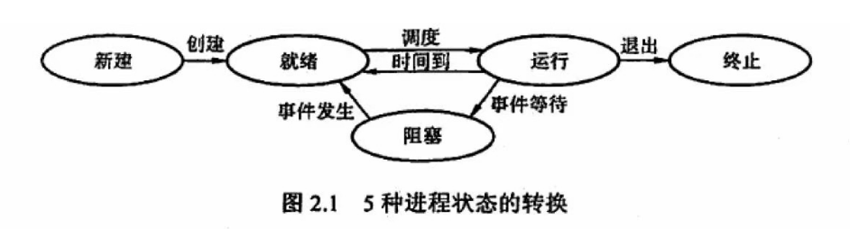

# 操作系统面试

## 什么是操作系统

操作系统本质是运行在计算机上的软件程序，⽤于管理计算机硬件和软件资源。
操作系统（Operating System，简称 OS）是管理计算机硬件与软件资源的程序，是计算机的基⽯

1. 主要功能
   资源分配，回收
2. 为应⽤程序提供服务

## 系统调用

由进程访问资源的特点，将进程分为两种状态：
用户态：该状态的进程可以直接读取用户程序的数据
内核态：可以访问系统的任何资源（<u>可以访问用户态不能访问的内容如 设备管理、文件管理、内存管理等</u>）
用户态的进程需要使用内核空间的部分功能时需要有操作系统进行系统调用来完成。在进行系统调用是会产生中断，从用户态陷入内核态进行工作完成后再次中断回到用户态。

## 进程状态

创建
就绪 仅缺少处理机
运行
阻塞 不仅少处理机同时也少其他资源如设备 文件 或者等待队列中的其他事件完成
结束
状态转换：
就绪态-》运行态
运行态-》就绪态
运行态-》阻塞态 主动
阻塞-》就绪 被动

## 并发和并行

并发是在某一个时间段内，有多个任务进行，单核处理器一次只能执行一个任务，需要在合适的时间进进程的切换，因此需要知道进程的状态并进行上下文的切换上（下⽂切换 (Context Switch) 是⼀种将 CPU 资源从⼀个进程分配给另⼀个进程的机制）。
并行是在某一个时刻，同时进行多个任务。多核处理器一次可以执行多个任务。

## 进程和线程

进程是进程实体的运行过程，是系统进行资源调度和分配的一个独立单元
⼀个进程中可以有多个线程，多个线程共享进程的堆和元空间
线程是进程当中的⼀条执⾏流程

## CPU 调度方式

先来先服务
短作业优先
时间片轮转
优先级调度
剩余最短时间优先

## 信号量机制

信号量表示等待队列
信号量是一个整数，当大于等于 0 时，代表可供并发使用的资源实体数；当小于 0 时，其绝对值表示正在等待使用临界区的进程数
PV 操作 实现同步互斥
P 操作（wait 操作） 分配一个资源 S = S-1
V 操作（signal 操作） 消耗一个资源 S=S+1

> 假设系统有 n(n≥5）个并发进程共享资源 R，且资源 R 的可用数为 2。若采用 PV 操作，则相应的信号量 S 的取值范围应为 等待队列长度最大为所有资源都试图占用资源 n-2 最小为所有线程都不用资源为 2

## linux
