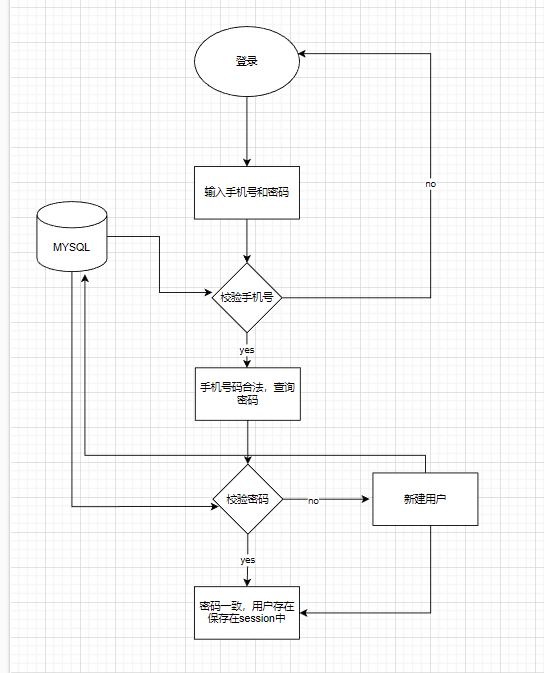

## 登录

### 基于 Session 实现登录流程

session 保存用户的 token，同时根据 token 将用户信息保存在 redis 中

### 登录拦截器

### 隔离

业务隔离：将秒杀业务独立出来，尽量不与其他业务关联，以减少对其他业务的依赖性。譬如秒杀业务只保留用户 id，商品 id，数量等重要属性，通过中间件发送给业务系统，完成后续的处理。

系统隔离：将秒杀业务单独部署，以减少对其他业务服务器的压力。

数据隔离：由于秒杀对 DB 的压力很大，将 DB 单独部署，不与其他业务 DB 放一起，避免对 DB 的压力。

#### 秒杀订单

当用户抢购时，就会生成订单并保存到 seckill_order 这张表中，而订单表如果使用数据库自增 ID 就存在一些问题：

id 的规律性太明显
受单表数据量的限制
场景分析：如果我们的 id 具有太明显的规则，用户或者说商业对手很容易猜测出来我们的一些敏感信息，比如商城在一天时间内，卖出了多少单，这明显不合适。

场景分析二：随着我们商城规模越来越大，mysql 的单表的容量不宜超过 500W，数据量过大之后，我们要进行拆库拆表，但拆分表了之后，他们从逻辑上讲他们是同一张表，所以他们的 id 是不能一样的， 于是乎我们需要保证 id 的唯一性。

#### 秒杀安全优化

当我们秒杀开始时，不会直接调秒杀接口，而是获取真正秒杀接口的地址，根据每个用户秒杀的不同商品是不一样的。这样可以避免有些人提前通过脚本准备好固定地址进行秒杀

**原理**
拦截器拦截一个请求，看看这个请求所访问的接口方法上是否存在我们的注解@AccessLimit，如果存在，则取出注解里的相关信息（例如在多少时间内允许访问接口多少次，超过限制会提示出怎么样的内容），再从这个 request 请求中取出 ip 地址，访问的路径等组合为 key 作为一个用户的唯一标识。在 redis 中查找是否有这个 key，没有则之后以唯一标识:访问次数 map 的形式存放到 redis 中，并设置过期时间;如果存在，则取出这个 key 对应的 value 值比较是否超出我们的预定值，超出则给出提示信息，并 return false 拦截该请求（该请求结束），如果并没有超出限制，则给这个 key+1 后 return true 对该 request 进行放行

提升：
请求时用户填验证码获取秒杀路径，减少服务器压力
https://blog.csdn.net/qq_43950000/article/details/124749644?spm=1001.2101.3001.6650.5&utm_medium=distribute.pc_relevant.none-task-blog-2%7Edefault%7EBlogCommendFromBaidu%7ERate-5-124749644-blog-108004865.235%5Ev27%5Epc_relevant_default&depth_1-utm_source=distribute.pc_relevant.none-task-blog-2%7Edefault%7EBlogCommendFromBaidu%7ERate-5-124749644-blog-108004865.235%5Ev27%5Epc_relevant_default&utm_relevant_index=6

#### 库存的补充

不补充 redis 的库存，就会无法保证数据库和 redis 的最终一致性。这里说的是最终一致性，而不是说强一致性。很简单的道理，redis 的数量会是负数，而数据库的最多就是 0
即使不考虑最终一致性，那如果有订单重复、或者消费失效时，这些地方对 redis 库存进行了释放了（操作还是 incr，不过"释放"好理解）。但此处不做回补处理，那显然 stock 还是负数，这样就造成：数据库还有库存，但 redis 已经没有库存了，而这显然是不合理的。

#### 大量的使用缓存，对于缓存服务器也有很大的压力，如何减少 redis 的访问

在 redis 预减库存的时候，内存中维护一个 localOverMap 作为内存标记，当没有库存的时候，将其设置为 true；每次秒杀业务访问 redis 之前，先查一下 map 标记，如果为 true 说明没有库存，就直接返回秒杀失败，无需再去请求 redis 服务器

#### 消息队列完成异步下单

#### 如何防止缓存问题

##### 缓存穿透

指查询一个一定不存在的数据，由于缓存不命中，每次请求都会去查询数据库
方法：将查询到空的数据缓存在 redis 中为 null

##### 缓存雪崩

指缓存中的大量数据在同一时间失效，导致所有的请求都落到了数据库上。这种情况通常是由于缓存服务器宕机、网络故障、批量更新缓存等原因引起的
方法：解决方案：为了防止缓存在同一时间大面积过期导致的缓存雪崩，可以通过观察用户行为，合理设置缓存过期时间来实现；为了防止缓存服务器宕机出现的缓存雪崩，可以使用分布式缓存，分布式缓存中每一个节点只缓存部分的数据，当某个节点宕机时可以保证其它节点的缓存仍然可用；也可以进行缓存预热，避免在系统刚启动不久由于还未将大量数据进行缓存而导致缓存雪崩
例如：首先针对不同的缓存设置不同的过期时间，比如 session 缓存，在 userKey 这个前缀中，设置是 30 分钟过期，并且每次用户响应的时候更新缓存时间，这样每次取 session，都会延长 30 分钟，相对来说，就减少了缓存过期的几率

##### 缓存一致性

**缓存一致性要求数据更新的同时缓存数据也能够实时更新**
由于我们的**缓存的数据源来自于数据库**,而数据库的**数据是会发生变化的**,因此,如果当数据库中**数据发生变化,而缓存却没有同步**,此时就会有**一致性问题存在**,其后果是:

用户使用缓存中的过时数据,就会产生类似多线程数据安全问题,从而影响业务,产品口碑等;怎么解决呢？有如下几种方案：

- Cache Aside Pattern 人工编码方式：缓存调用者在更新完数据库后再去更新缓存，也称之为双写方案

- Read/Write Through Pattern : 由系统本身完成，数据库与缓存的问题交由系统本身去处理

- Write Behind Caching Pattern ：调用者只操作缓存，其他线程去异步处理数据库，实现最终一致

具体使用第一种方法：我们可以把缓存删除，等待再次查询时，将缓存中的数据加载出来 ，更新数据库时候让缓存失效，查询时在更新缓存。
并且先操作数据库在删除缓存，防止多线程下 用户查询后再写入的过程中被其他线程修改缓存内容。

##### 怎么保证一个用户不能重复下单

用户的秒杀单建立唯一索引不是随机索引，由用户 ID+商品 ID 组成，下单时判断索引是否重复。
或者进行分布式锁

#### 保证不超卖

超卖场景：不同用户在读请求的时候，发现商品库存足够，然后同时发起请求，进行秒杀操作减库存，导致库存减为负数

###### 乐观锁

#### 流量削峰应该怎么做
