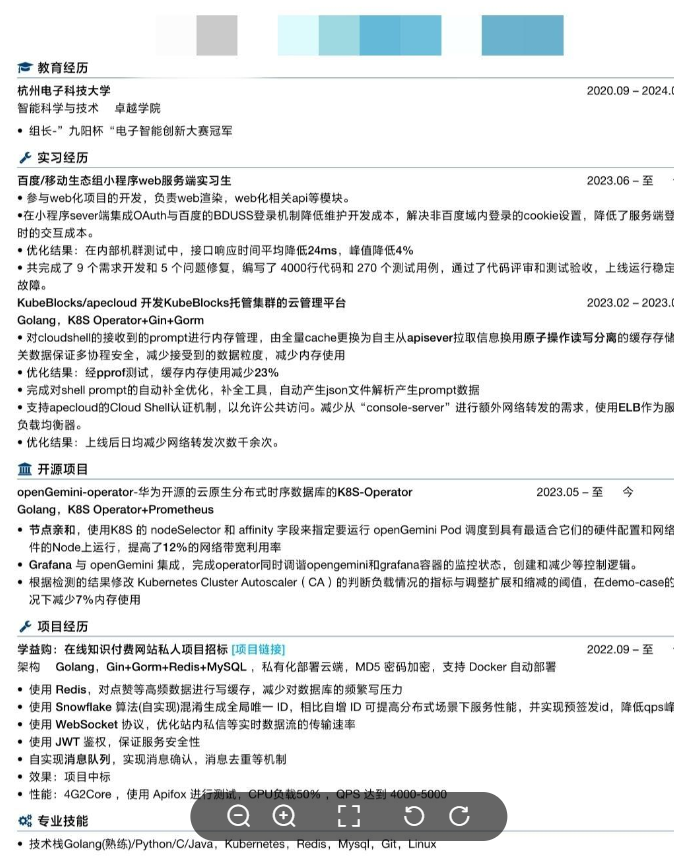
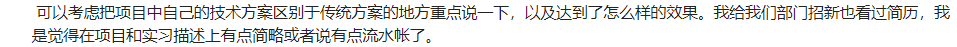
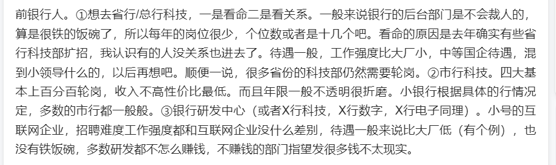
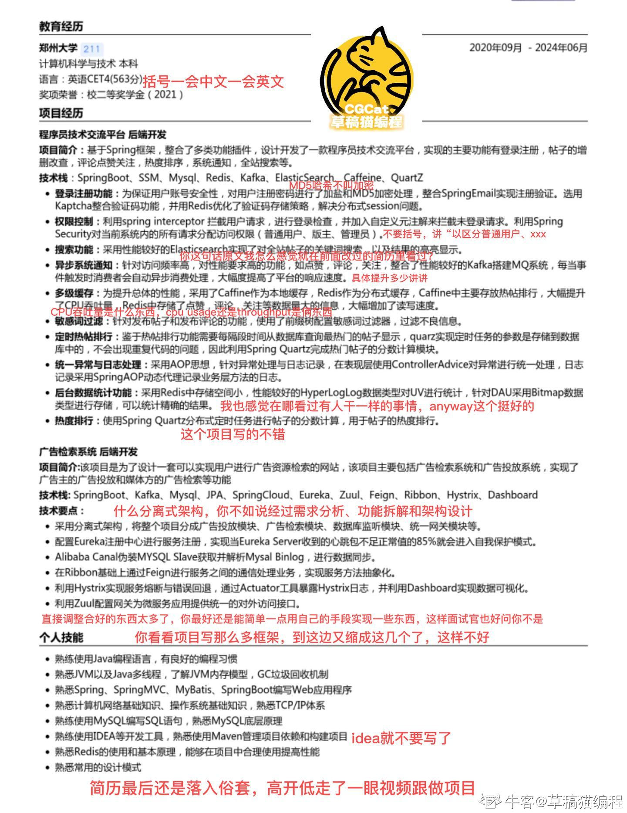
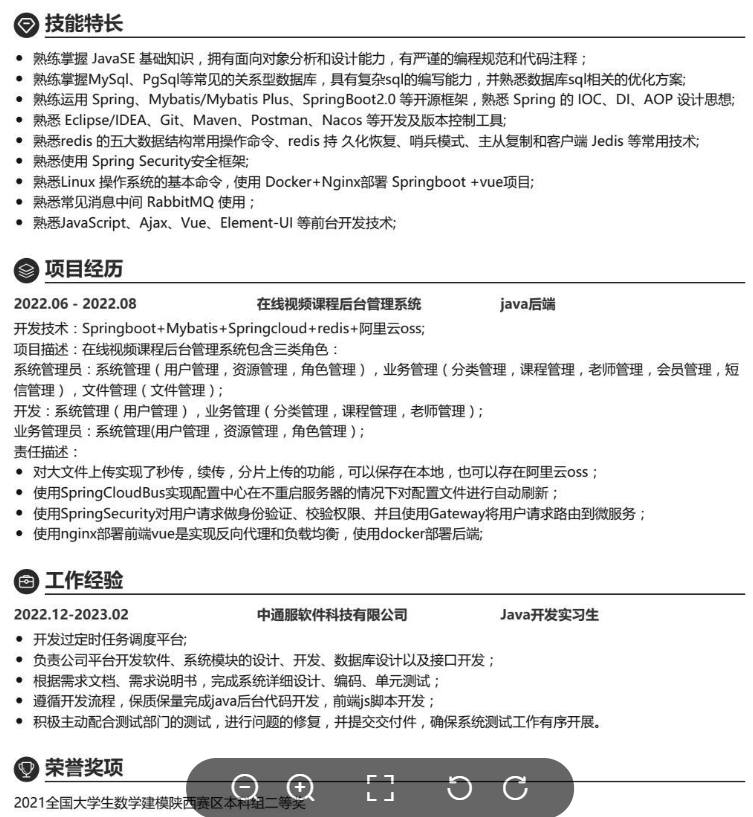
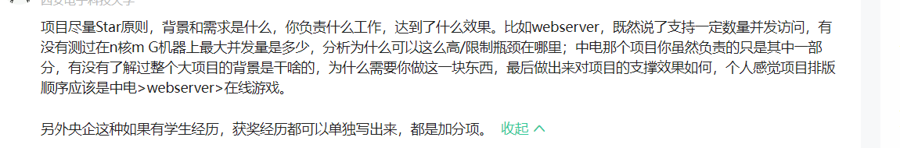
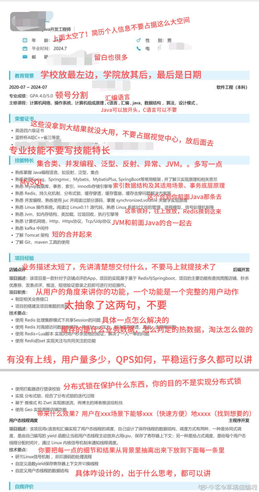
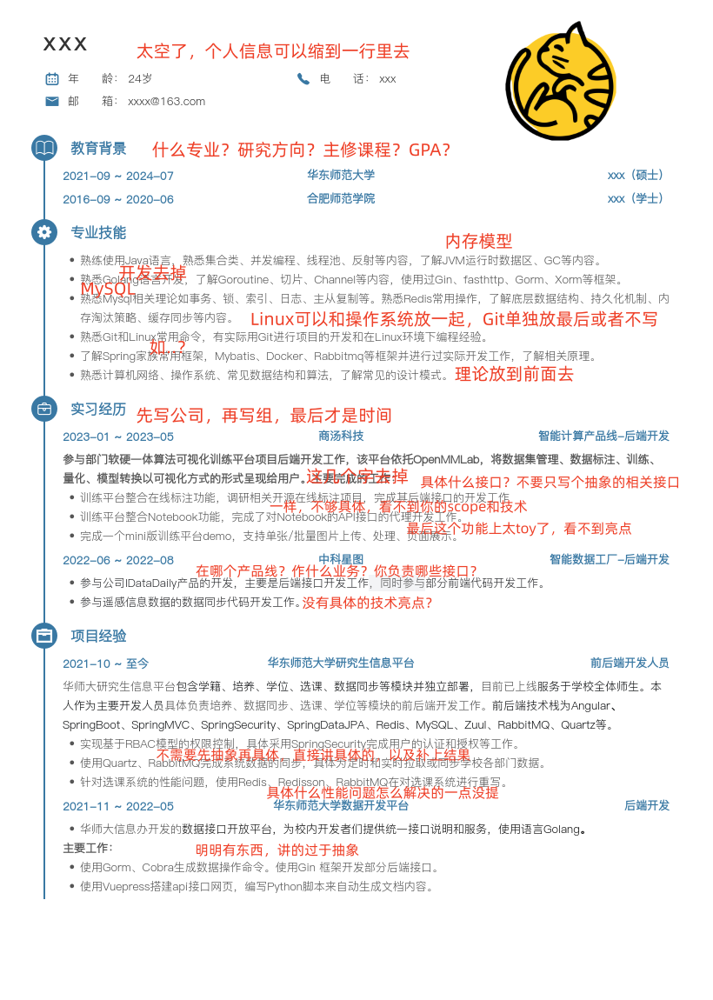
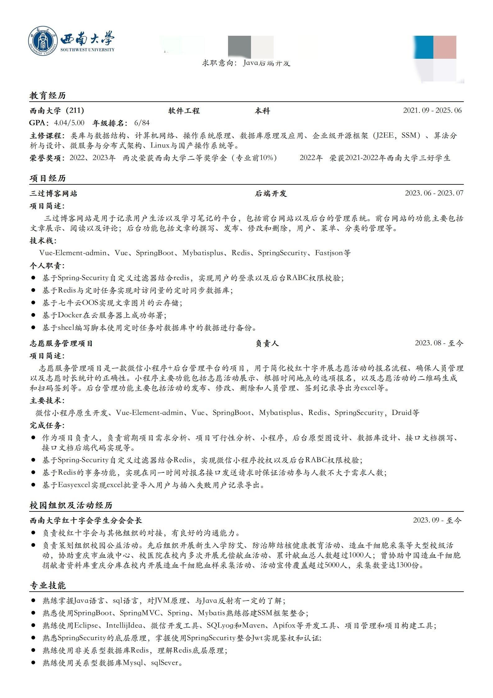

网友简历

.png>)

简历编写
https://www.nowcoder.com/discuss/512734250102218752?sourceSSR=dynamic
简历写作中的 STAR 原则，即 Situation（情景）、Task（任务）、Action（行动）和 Result（结果）四个英文单词的首字母组合

## 简历优化

.项目的话篇幅尽量少一些，像具体项目背景面试的时候很多都会问，把项目技术栈和亮点难点写出来就行

