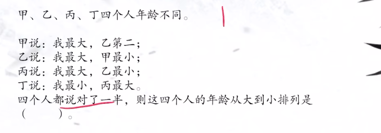
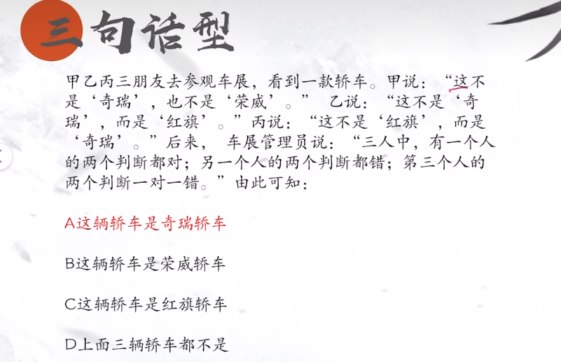
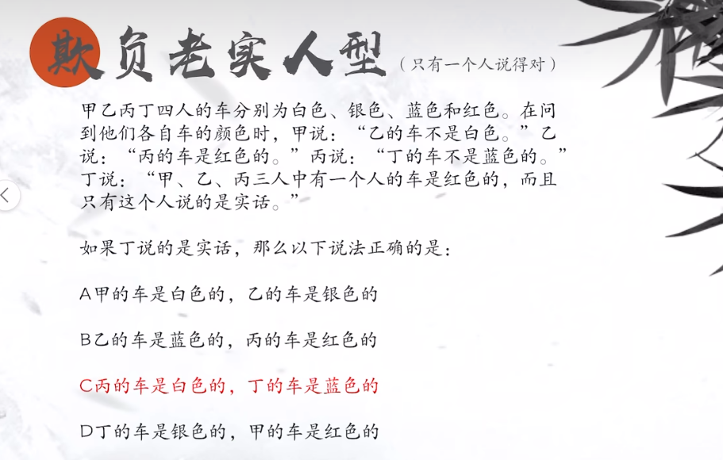
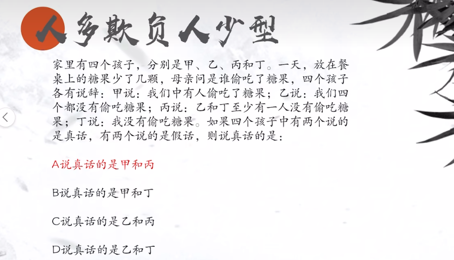
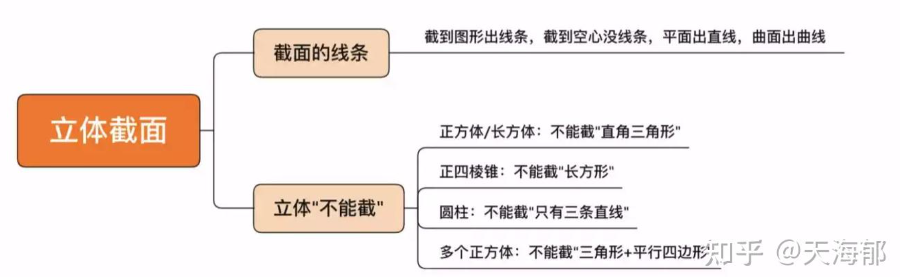

## 盐水法求混合增长率

已知 2R 求另一个 R 注意 r1<R<r2

农村人数:城镇人数 3:4

中位数： 排在中间位置的两个三个数的平均

## 推理判断

- 只说对一半： 默认假设第一个人的前一半错，后一半对进行推导
  

- 选择三个人都有交际的内容为真
  

- 只选择后面总结性的话假设为真
  

- 找到说话中提到人数为 2 的人的话是真，提到有人或者一个人为真
  

## 立体解刨图

## 数量关系

- 闰年：能被 100 整除，不能被 400 整除或者能被 4 整除
