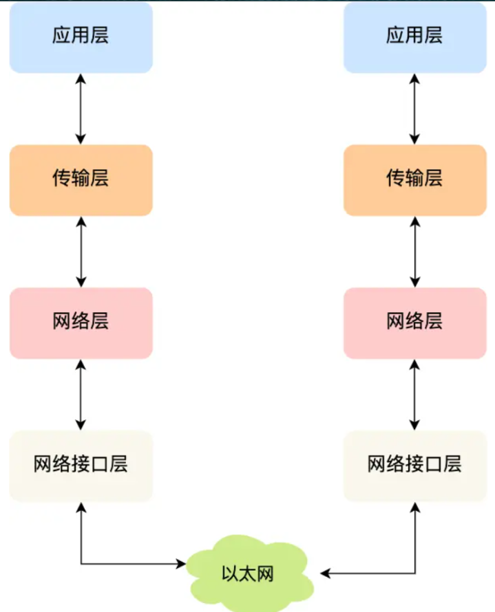
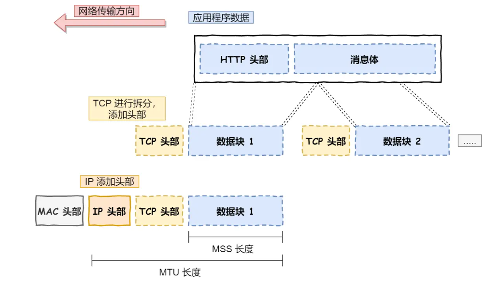
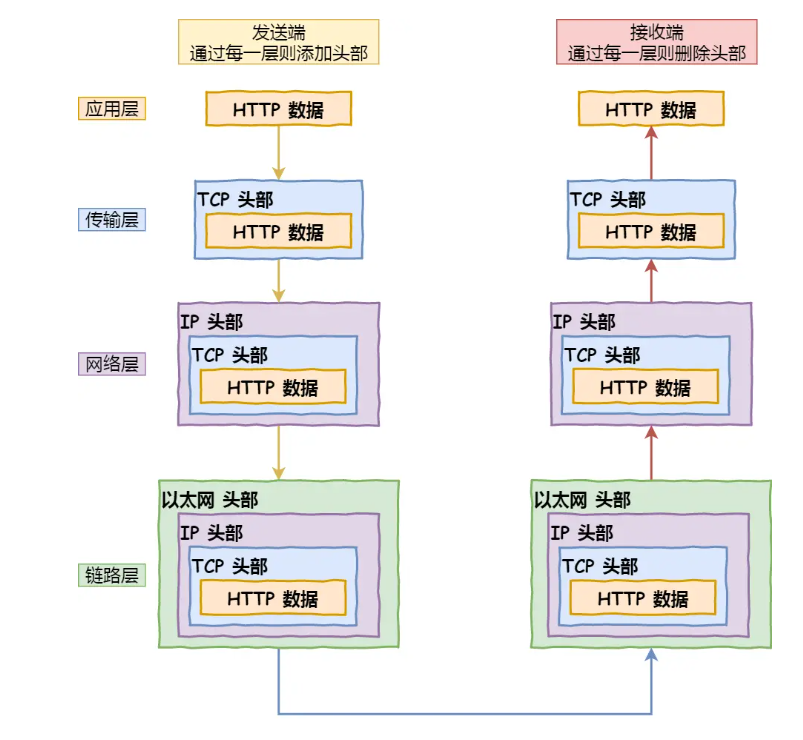

## 网络分层

### TCP/IP 协议分层

#### 应用层

专注于用户提供应用服务 比如 HTTP、FTP、Telnet、DNS、SMTP 等.
应用层不关心数据传输的具体实现，类似寄送快递的对于快递寄送的快递服务。

#### 传输层

传输层在应用层下面，应用层的数据会选择相应的协议进行传输，类似寄送快递的快递寄送过程，传输层的协议分为 TCP 和 UDP。
传输层确定传输协议和目的端口号

- TCP 传输层可靠控制协议 当传输层中的数据超过了 MSS(TCP 最大报文段) 在传输层协议会进行数据包分块（分为 TCP 段）
- UDP 非可靠传输 只负责数据发送

#### 网络层

实现数据的传输
IP 协议的寻址找到发往目标地址的方向（类似于导航），路由指向下一个目的地址所选择的路径（相当于通过导航去选择路径），

> 各个层面所使用的数据分块
> 网络接口层的传输单位是帧（frame），IP 层的传输单位是包（packet），TCP 层的传输单位是段（segment），HTTP 的传输单位则是消息或报文（message）。但这些名词并没有什么本质的区分，可以统称为数据包。

#### 键入网址后浏览器发生了什么

1. 浏览器解析 url 路径，浏览器确定了 Web 服务器和文件名，接下来就是根据这些信息来生成 HTTP 请求消息了。
2. 解析 DNS：解析 url 后生成 http 请求，需要找对对应机器的 IP 地址，而 web 服务器和 Ip 对应关系需要通过 DNS 进行查询。
   > www.baidu.com 域名通过.划分 往右域名越高级 查找顺序为： . -> .com ->baidu.com

当本地 dns 服务器有 www.baidu.com 的地址则直接返回，否则通过根域名到顶级域名到权威域名的顺序（. -> .com ->baidu.com）依次向下级域名指定查询方向直到权威域名找到对应的地址并返回给本地 DNS 服务器

3. 找到 ip 地址后，需要选择合适的协议进行传输。浏览器调用 web 的 socket 委托协议栈选择合适的传输协议（TCP/UDP）

   > TCP 传输前需要进行三次握手建立连接
   > 当 http 的数据太大超过了（MSS，还需要对数据进行划分
   >
   > > MTU：一个网络包的最大长度，以太网中一般为 1500 字节。
   > > MSS：除去 IP 和 TCP 头部之后，一个网络包所能容纳的 TCP 数据的最大长度。
   > > 最终将 HTTP 数据拆分并封住为 TCP 数据包
   > > 

4. 在 TCP 基础上添加源地址（客户端地址）的 IP 和目标地址（DNS 的解析地址）信息，得到网络包的报文（即为 TCP 添加 IP 头部）

5.MAC 两点传输：继续添加 MAC（称为网络接口硬件地址） 头部，包含了接收方和发送方的 MAC 地址信息，用与两点传输，MAC 地址在数据链路层上起着重要作用，用于在局域网或广域网上定位设备以进行通信。

> 接收方的 MAC 地址通过 ARP 协议，在找到目标地址的以太网中通过广播的方式搜索目标的 MAC 地址

6. 将内存中的网络包数据通过，进过网卡转为电信号的方式通过网线进行传输。
7. 数据通过交换机（实现局域网内的信息共享），交换机根据内部的 MAC 表找到 MAC 地址，确定最终的目的地址 7.交换机发出
8. 交换机出来的数据通过路由器转发到不同的网络中去，路由器的各个端口都具有 MAC 地址和 IP 地址，最终到达目的设备上的服务器中。
9. 服务器得到数据，从外到里去掉各个头部信息，获得原始请求数据。
   

> 查看 tcp 结构 Wireshark 抓包工具
