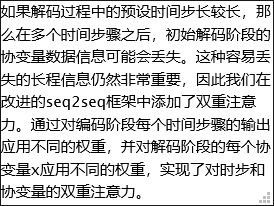
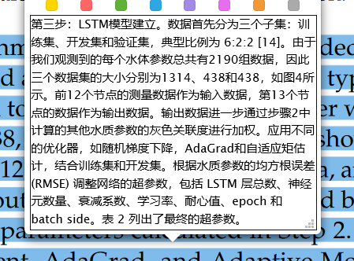

## 论文第一版问题

- 相关研究 说明机器学习热门的地方在引出 话题
- 数据描述部分放在实验部分展示 实验部分的数据处理把处理的结果表示一下就行
- 方法部分要详细 有特色 加公式 标题要与众不同 模型的图要画的新一点 和别的东西相结合 将模型分模块介绍 总体模型 进行划分
- 模型评估 放在实验部分

## 实验参数

每一轮取出 min-batchSize 大小数据
hisx:历史协变量 长度为 encode_step 24
hisz：历史协变量对应的 label
futx:拼接在历史变量之后的预测协变量 长度为 forcast_step 12
z:

attention：

参数调整

滤波器的 AB 图用两张图片展示
