### 安恒信息

#### mybatisplus 是怎么实现的把对象到数据库的过程

#### redis 分布式锁

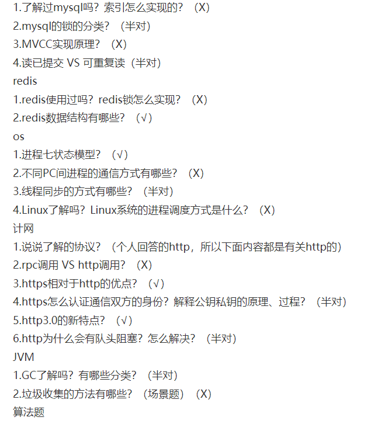
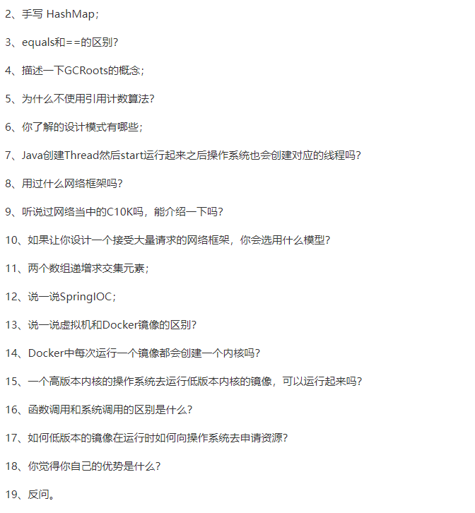
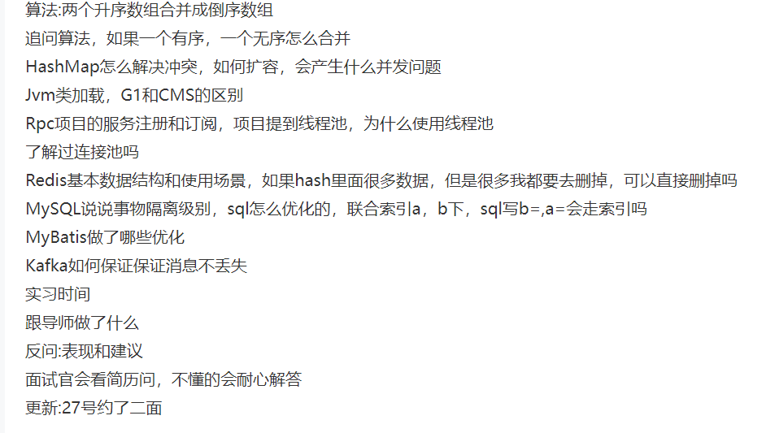
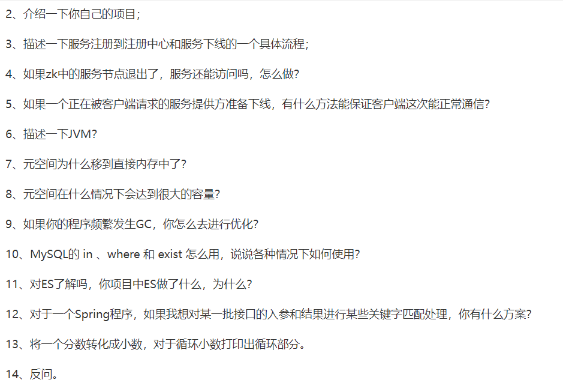

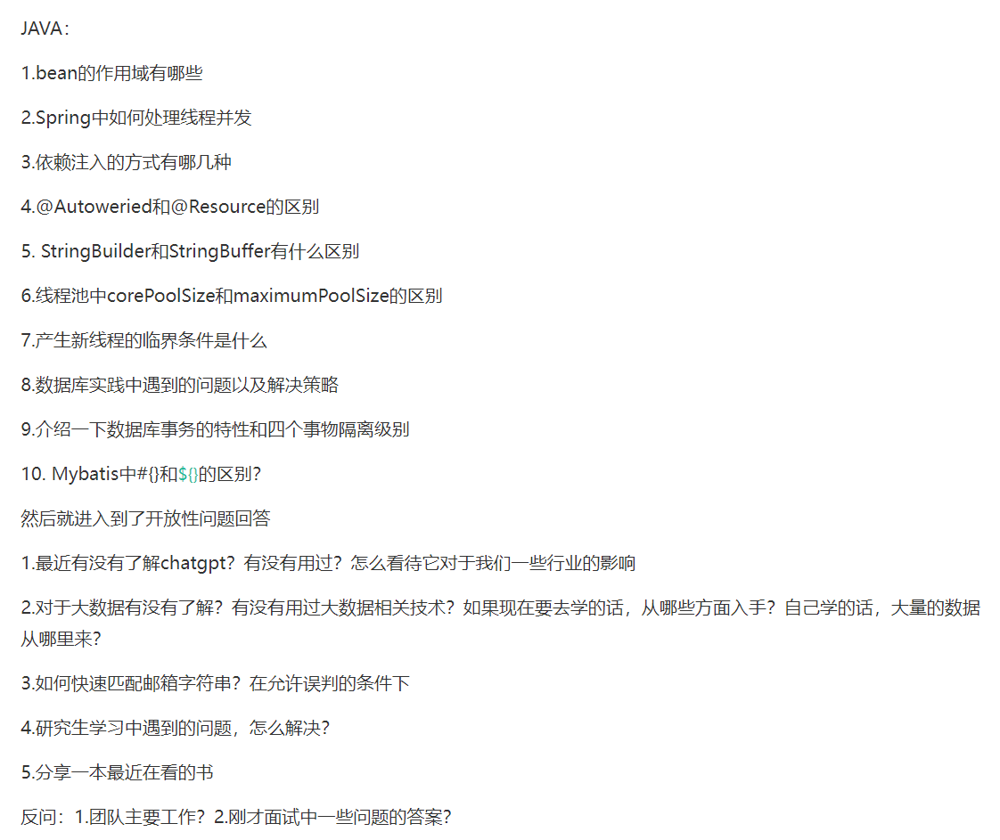
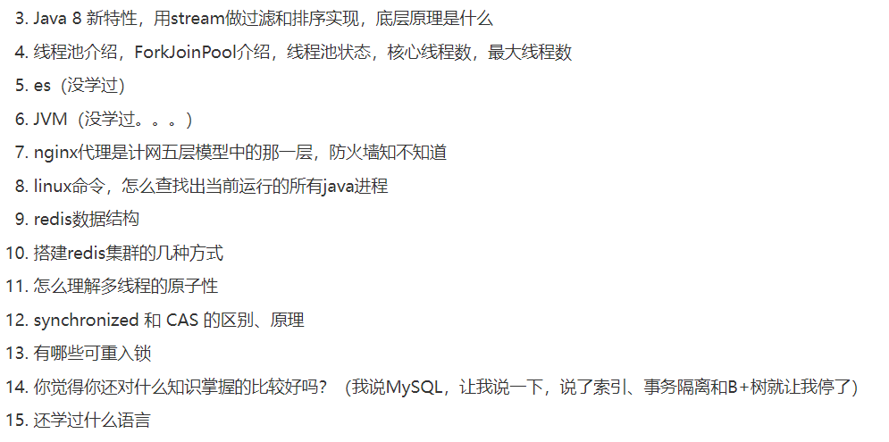
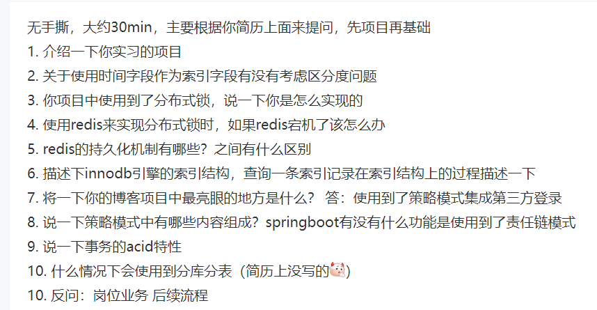
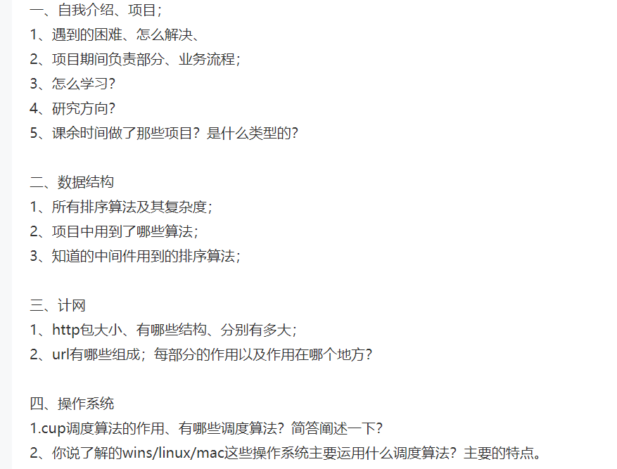
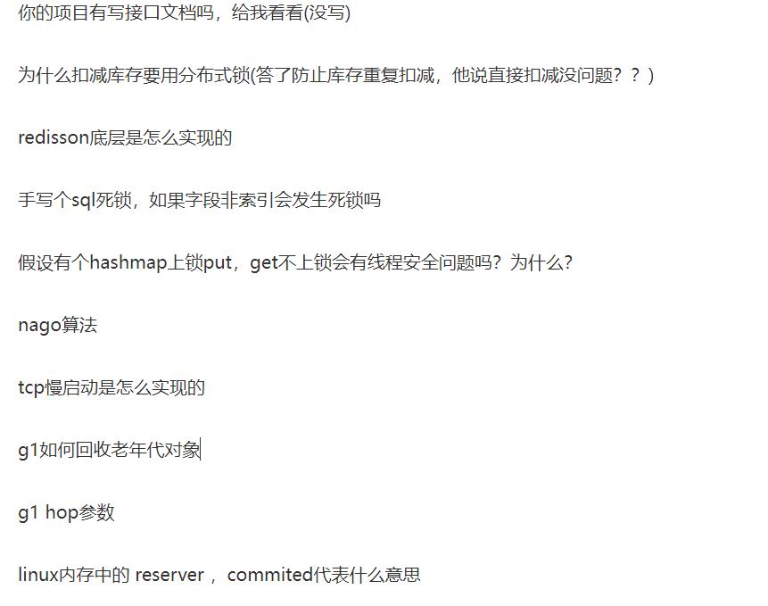
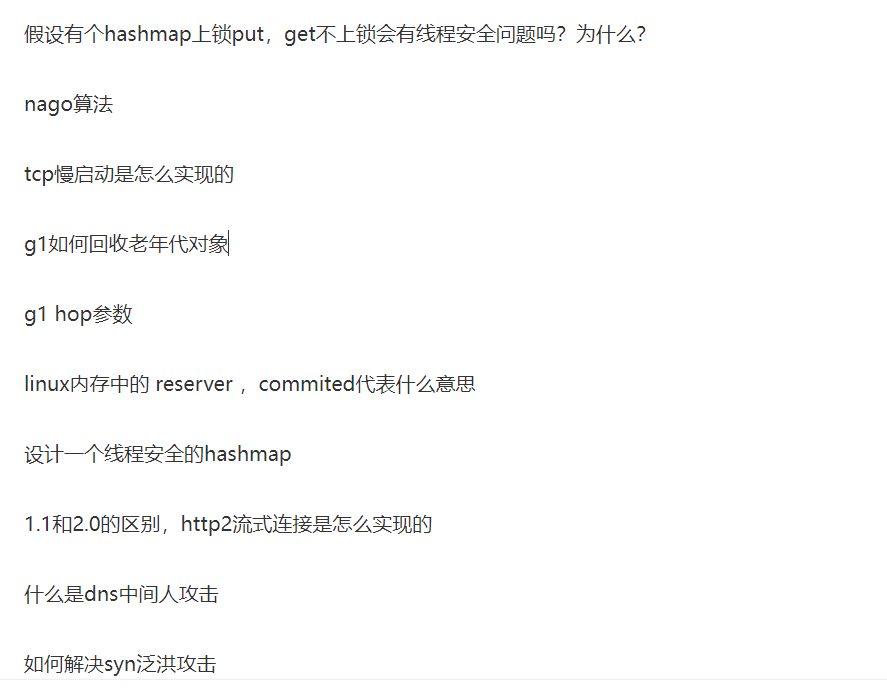
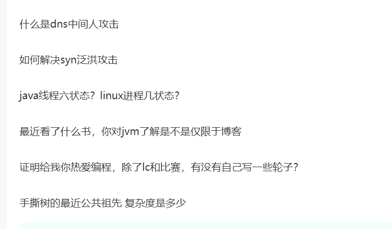
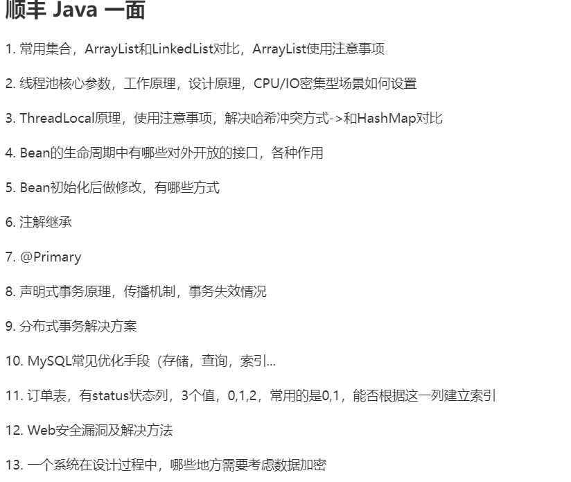

## 快手

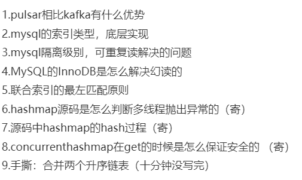
如何解决幻读
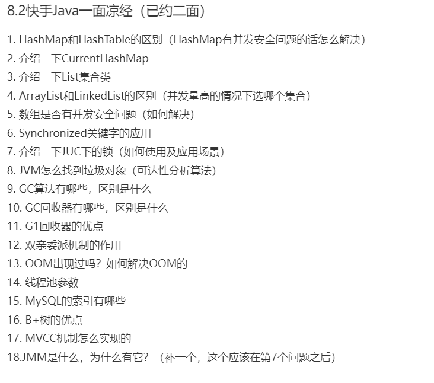
Lc-125
`- 自我介绍

- 说一下 Java 的基本数据类型有几种
- String 是不是基本类型？
- int？char？汉字是几个字节？
- HashMap 的数据结构讲一下
- 讲一下 JDK8 的 JVM 内存划分？
- 知不知道直接内存和 ColdCache（？是这个吗？还是 CodeCache）
- 讲一下存活判定算法
- 讲一下垃圾清理算法
- CMS 用的什么算法？是在什么区域采用的？
- CMS 和 G1 各自的差别优缺点讲一下
- 对于 JVM 来讲我们应该监控它哪些方面？
  - 答 fullGC 的频率，监控老年代的情况
- JVM 有没有自己调试过？有没有针对 JVM 做一些自己的小测试？
- AQS 有用过吗，能否讲讲原理
  - 讲到 ReentrantLock，同步器
  - 再讲到监视器机制，公平非公平，阻塞队列，我说这只需要唤醒后继节点，所以是单向的（后来提示这是一个双向的队列）
- 讲讲线程池的工作流程，详细到核心线程和救急线程怎么产生消失的
- 救急线程会被抹去，核心线程是以何种状态待命的？是自旋在同步队列上吗？（实际是 Runnable）
- 讲讲 ThreadLocal 工作原理
  - 适用于什么场景呢？
  - 有什么局限？为什么会内存泄露？除了内存泄露呢？
  - 开源的 FastThreadLocal 了解过吗？
- 聚簇索引和非聚簇索引讲一下
- 索引的数据结构是什么？
- 锁机制说一下，从兼容性和粒度上来说
  - （兼容性就是读读并发吗？
  - 粒度就是表级锁和行级锁（gap，record，nextKey)
- 分析一下这个 SQL，在以下几种情况下会加何种锁？
  - SQL：select \* from table where id = 5 for update
    - id 是主键索引
    - id 是普通索引
    - id 没有索引
    - id=5 不存在（取决于 5 附近有没有其他字段，比如 4 和 6）
- Redis 中 Zset 的结构是怎么样的，ZADD 命令时间复杂度是多少？
- Redis 的集群架构是怎么样的？
- TCP 协议里有个这个滑动窗口，这个流量控制的机制你了解吗？慢启动了解吗？（G）
- TCP 和 UDP 有什么区别
- 算法：合并 K 个有序链表，只做出暴力，应该用归并和小顶堆

作者：孤独的社畜在 debug
链接：https://www.nowcoder.com/?anchorPoint=comment
来源：牛客网`

1、HashMap 为什么不是线程安全的？为什么不是？
追:什么情况下会导致并发修改异常？
假如有成千上百万条数据，内存空间无限大，怎么快速的往 HashMap 中插入数据？
2、自己实现一个 java.lang.String 行不行？
追：那重写 ClassLoader 呢？
3、select a from table where b = ? and (c = ? or d =?)怎么建立索引？
4、你执行 sql 它会立马告诉你 sql 资源被占用或者死锁，它这种是怎么探测的？
5、zookeeper 满足 CAP 中的哪两个？答：CP 问：它能保证一致性吗？
过半选举中主机宕机了，数据会丢吗？
6、Redis 的 CAP 模型满足哪两个？为什么？

作者：GO_FRO
链接：https://www.nowcoder.com/?
来源：牛客网

- 建立联合索引有什么需要注意的
- 索引实现原理
- Redis 分布式锁怎么实现，实际中项目怎么用的
- 分布式唯一全局 ID，雪花算法具体怎么实现的
- 单例模式在哪里有使用
- 项目部署在哪里

https://github.com/yuanguangxin/LeetCode/blob/master/Rocket.md

得物
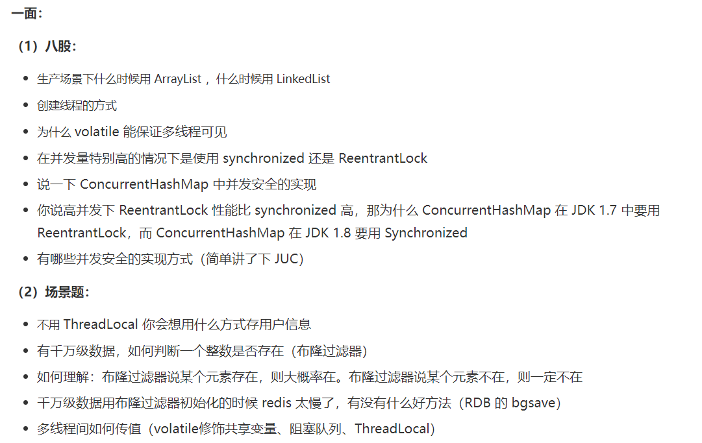
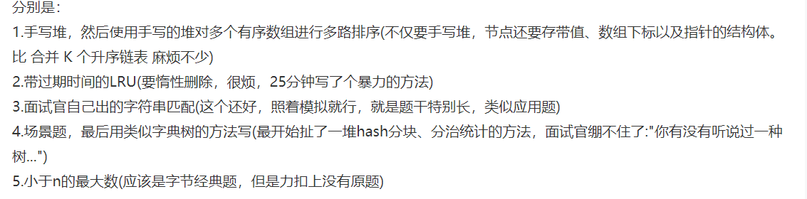
